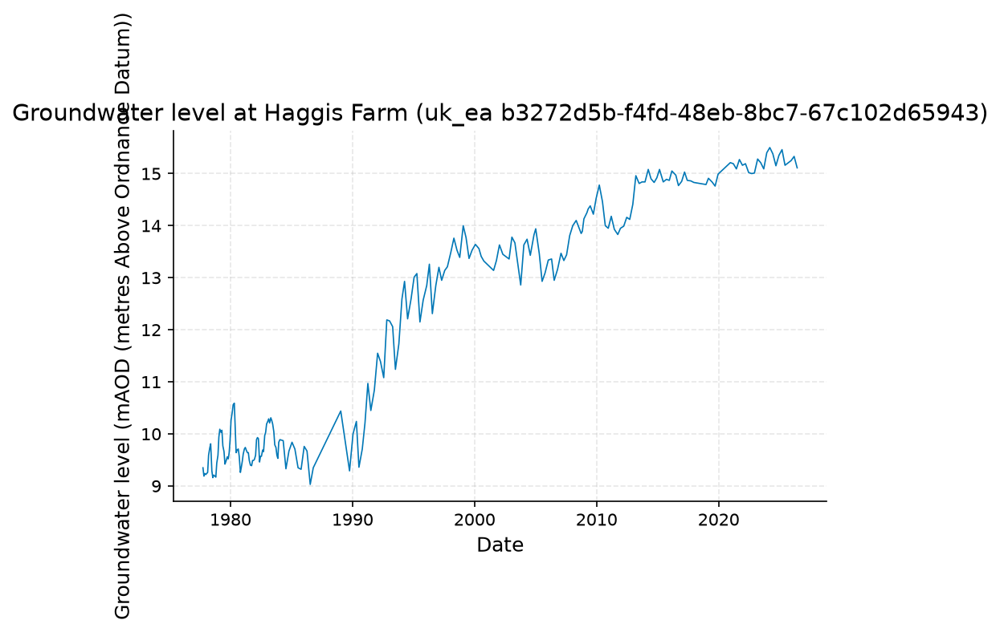
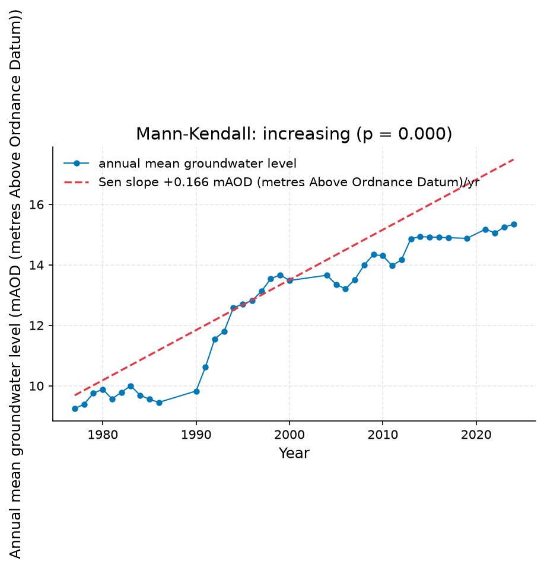
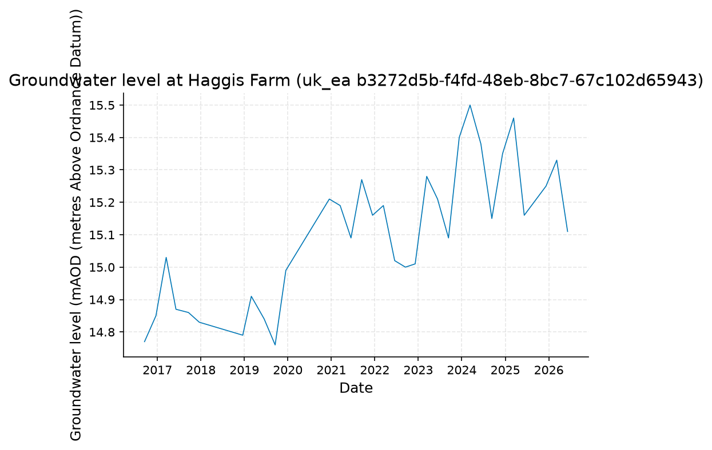
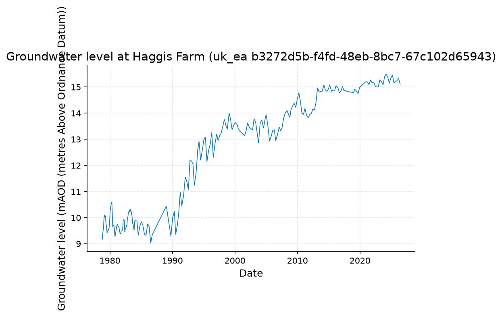
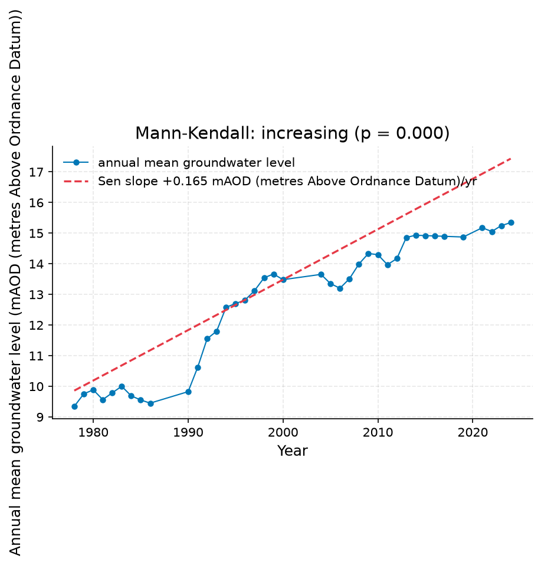

# Chalk groundwater levels near Cambridge: ten-year trend assessment for public supply borehole planning

**Author:** AquaScope Studio  
**Date:** 2026-09-07  
**Description:** assess whether Chalk groundwater levels near Cambridge show a declining trend over the last 10 years relative to the full record, to inform public supply borehole planning  
**Data Sources:** BasinATLAS (HydroATLAS v1.0), ERA5 via Open-Meteo, similar_basins, uk_ea  
**Version:** 1.0  

**Site:** 52.2000 N, 0.1200 E

**Answer.** The full 48.7-year record at Haggis Farm (uk_ea, station b3272d5b-f4fd-48eb-8bc7-67c102d65943, 1977-09-29 to 2026-06-08) shows a statistically significant increasing trend by Mann-Kendall test (tau = 0.86, p = 0.0) with a Sen's slope of +0.1659 mAOD per year, not a decline. A dedicated last-10-year trend could not be computed because only 9.7 years of data (2016-09-15 to 2026-06-08, n = 33) were available and failed the 10-year gate; however the mean level over that 9.7-year window, 15.10 mAOD, is well above the full-record mean of 12.14 mAOD, again pointing to higher, not lower, recent levels. No evidence of decline over the last decade relative to the full record is found in this data.

*Key numbers*

| Quantity | Value | Unit | Step |
| --- | --- | --- | --- |
| Record length | 48.7 | years | s1 |
| Mean of the record | 12.14 | mAOD (metres Above Ordnance Datum) | s1 |
| Mann-Kendall p-value (annual mean) | 0.0 |  | s2.fallback |
| Sen's slope | 0.1659 | mAOD (metres Above Ordnance Datum) per year | s1 |
| Record length | 9.7 | years | s2 |
| Mean of the record | 15.1 | mAOD (metres Above Ordnance Datum) | s2 |
| Record length | 47.7 | years | s2.fallback |
| Mean of the record | 12.3 | mAOD (metres Above Ordnance Datum) | s2.fallback |
| Sen's slope | 0.1646 | mAOD (metres Above Ordnance Datum) per year | s2.fallback |

## Summary

Analysis of the Haggis Farm Chalk groundwater borehole (uk_ea b3272d5b-f4fd-48eb-8bc7-67c102d65943) finds no declining trend. The full 48.7-year record (1977-09-29 to 2026-06-08, n=227) shows a significant increasing trend, Sen's slope +0.1659 mAOD/yr, Mann-Kendall tau=0.86, p=0.0. An attempt to isolate the last 10 years failed a minimum-length gate (only 9.7 years, n=33, available); the resulting mean level for that window, 15.10 mAOD, exceeds the full-record mean of 12.14 mAOD, consistent with rising rather than falling levels. Planned cross-checks at Stapleford (uk_ea 996023f9-5a1d-42c6-8ba4-6889e0ed6de6), the SGI drought index, and a water-table-fluctuation recharge estimate were not executed in this run. The public-supply planning question of decline is not supported by the data obtained; if anything the record points the other way, though the recent-decade trend statistic itself is not established.

## Problem and decision

Public water supply near Cambridge depends on Chalk aquifer boreholes. The decision at hand is whether groundwater levels over the last 10 years show a declining trend relative to the full historical record, information needed to plan borehole yields and resilience. The brief calls for a Mann-Kendall trend and Sen's slope, a recent-versus-full-record mean comparison, a Standardised Groundwater Index, and a water-table-fluctuation recharge estimate, with no attribution of cause requested.

## Site and data

The site is at lat 52.2, lon 0.12, near Cambridge. Two Chalk groundwater-level records from the Environment Agency (uk_ea, OGL-UK-3.0) were identified as representative: Haggis Farm (station b3272d5b-f4fd-48eb-8bc7-67c102d65943, 3.5 km away, catalog length 48.9 years, actual analysed span 48.7 years) and Stapleford (station 996023f9-5a1d-42c6-8ba4-6889e0ed6de6, 5.9 km away, 46.7 years). Only Haggis Farm was actually queried in this run; Stapleford was named as a planned cross-check but no step against it was executed. Levels are reported in mAOD (metres above Ordnance Datum). Record resolution is assumed daily since the catalogue does not state it.

## Methodology

Trend was assessed with the non-parametric Mann-Kendall test and Sen's slope estimator applied to annual mean groundwater levels (Mann 1945; Sen 1968) at Haggis Farm, first over the full available record, then restricted to the most recent 10 years for direct comparison. The 10-year restriction required at least 10 years of data as a gate condition; when the returned record fell short, a fallback request for a longer window was attempted. A Standardised Groundwater Index and a water-table-fluctuation recharge estimate were planned in the methodology but no corresponding step was run in this analysis.

## Results: step s1

The full-record analysis at Haggis Farm (uk_ea b3272d5b-f4fd-48eb-8bc7-67c102d65943) used 227 observations spanning 48.7 years, 1977-09-29 to 2026-06-08. Level statistics: mean 12.14 mAOD, median 12.85 mAOD, minimum 9.03 mAOD, maximum 15.5 mAOD. The Mann-Kendall test on annual means (40 years of annual data) gave tau = 0.8615, p-value 0.0, and Sen's slope of 0.1659 mAOD per year, classified as an increasing trend. All gates passed: minimum years (48.7 of 10 required), a non-empty trend result, and a stated unit (mAOD).


*Groundwater level at Haggis Farm (uk_ea b3272d5b-f4fd-48eb-8bc7-67c102d65943), 1977 to 2026.*


*Groundwater level at Haggis Farm (uk_ea b3272d5b-f4fd-48eb-8bc7-67c102d65943), 1977 to 2026.*


*Annual mean groundwater level at Haggis Farm (uk_ea b3272d5b-f4fd-48eb-8bc7-67c102d65943) with the Sen slope line; the Mann-Kendall test finds increasing (p = 0.000, 40 years).*


*Annual mean groundwater level at Haggis Farm (uk_ea b3272d5b-f4fd-48eb-8bc7-67c102d65943) with the Sen slope line; the Mann-Kendall test finds increasing (p = 0.000, 40 years).*

*The record at Haggis Farm (uk_ea b3272d5b-f4fd-48eb-8bc7-67c102d65943) (datetime, value).*

| datetime | value |
| --- | --- |
| 1977-09-29 | 9.35 |
| 1977-10-27 | 9.19 |
| 1977-11-24 | 9.24 |
| 1977-12-22 | 9.22 |
| 1978-01-19 | 9.24 |
| 1978-02-16 | 9.26 |
| 1978-03-16 | 9.59 |
| 1978-04-20 | 9.73 |
| 1978-05-18 | 9.81 |
| 1978-06-22 | 9.29 |
| 1978-07-20 | 9.16 |
| 1978-08-17 | 9.21 |
| 1978-09-21 | 9.19 |
| 1978-10-19 | 9.17 |
| 1978-11-16 | 9.44 |
| 1978-12-22 | 9.59 |
| 1979-01-18 | 9.94 |
| 1979-02-15 | 10.09 |
| 1979-03-22 | 10.03 |
| 1979-04-19 | 10.07 |
| 1979-05-17 | 9.77 |
| 1979-06-21 | 9.66 |
| 1979-07-19 | 9.42 |
| 1979-08-16 | 9.47 |
| 1979-09-27 | 9.56 |
| 1979-10-25 | 9.52 |
| 1979-11-22 | 9.64 |
| 1979-12-20 | 9.89 |
| 1980-01-17 | 10.26 |
| 1980-02-21 | 10.41 |
| 1980-03-20 | 10.56 |
| 1980-04-24 | 10.59 |
| 1980-05-22 | 10.12 |
| 1980-06-17 | 9.64 |
| 1980-07-17 | 9.69 |
| 1980-08-21 | 9.71 |
| 1980-09-18 | 9.57 |
| 1980-10-23 | 9.26 |
| 1980-11-20 | 9.36 |
| 1980-12-18 | 9.47 |
| 1981-01-15 | 9.61 |
| 1981-02-19 | 9.71 |
| 1981-03-19 | 9.74 |
| 1981-04-16 | 9.69 |
| 1981-05-21 | 9.64 |
| 1981-06-18 | 9.64 |
| 1981-07-16 | 9.49 |
| 1981-08-20 | 9.4 |
| 1981-09-24 | 9.39 |
| 1981-10-23 | 9.49 |

*Summary of the record at Haggis Farm (uk_ea b3272d5b-f4fd-48eb-8bc7-67c102d65943).*

| item | value |
| --- | --- |
| source | uk_ea |
| station_id | b3272d5b-f4fd-48eb-8bc7-67c102d65943 |
| variable | groundwater_level |
| unit | mAOD (metres Above Ordnance Datum) |
| n | 227 |
| start | 1977-09-29 |
| end | 2026-06-08 |
| years | 48.7 |
| stats.mean | 12.14 |
| stats.median | 12.85 |
| stats.min | 9.03 |
| stats.max | 15.5 |

*Mann-Kendall trend test and Sen slope at Haggis Farm (uk_ea b3272d5b-f4fd-48eb-8bc7-67c102d65943).*

| item | value |
| --- | --- |
| on | annual mean |
| p_value | 0.0 |
| tau | 0.8615 |
| trend | increasing |
| sens_slope_per_year | 0.1659 |
| n_years | 40 |

## Results: step s2

The attempt to isolate the last 10 years at Haggis Farm returned only 9.7 years of record (2016-09-15 to 2026-06-08, n = 33), failing the minimum-years gate (10 required) and leaving the trend field empty, so no 10-year Mann-Kendall statistic or Sen's slope was established. The 9.7-year mean level was 15.1003 mAOD (median 15.11, min 14.76, max 15.5 mAOD). A fallback request for a longer window (48.9 years) was attempted but itself failed its own record-length gate, returning no verified years value; consequently no confirmed trend statistic, mean, or date range from that fallback can be reported, and the recent-decade rate of change remains not established.


*Groundwater level at Haggis Farm (uk_ea b3272d5b-f4fd-48eb-8bc7-67c102d65943), 2016 to 2026.*


*Groundwater level at Haggis Farm (uk_ea b3272d5b-f4fd-48eb-8bc7-67c102d65943), 2016 to 2026.*


*Groundwater level at Haggis Farm (uk_ea b3272d5b-f4fd-48eb-8bc7-67c102d65943), 1978 to 2026.*


*Groundwater level at Haggis Farm (uk_ea b3272d5b-f4fd-48eb-8bc7-67c102d65943), 1978 to 2026.*


*Annual mean groundwater level at Haggis Farm (uk_ea b3272d5b-f4fd-48eb-8bc7-67c102d65943) with the Sen slope line; the Mann-Kendall test finds increasing (p = 0.000, 39 years).*


*Annual mean groundwater level at Haggis Farm (uk_ea b3272d5b-f4fd-48eb-8bc7-67c102d65943) with the Sen slope line; the Mann-Kendall test finds increasing (p = 0.000, 39 years).*

*The record at Haggis Farm (uk_ea b3272d5b-f4fd-48eb-8bc7-67c102d65943) (datetime, value).*

| datetime | value |
| --- | --- |
| 2016-09-15 | 14.77 |
| 2016-12-20 | 14.85 |
| 2017-03-16 | 15.03 |
| 2017-06-06 | 14.87 |
| 2017-09-19 | 14.86 |
| 2017-12-19 | 14.83 |
| 2018-12-19 | 14.79 |
| 2019-03-01 | 14.91 |
| 2019-06-17 | 14.84 |
| 2019-09-17 | 14.76 |
| 2019-12-16 | 14.99 |
| 2020-12-15 | 15.21 |
| 2021-03-16 | 15.19 |
| 2021-06-15 | 15.09 |
| 2021-09-13 | 15.27 |
| 2021-12-13 | 15.16 |
| 2022-03-14 | 15.19 |
| 2022-06-17 | 15.02 |
| 2022-09-15 | 15.0 |
| 2022-12-06 | 15.01 |
| 2023-03-13 | 15.28 |
| 2023-06-12 | 15.21 |
| 2023-09-12 | 15.09 |
| 2023-12-11 | 15.4 |
| 2024-03-11 | 15.5 |
| 2024-06-10 | 15.38 |
| 2024-09-10 | 15.15 |
| 2024-12-09 | 15.35 |
| 2025-03-12 | 15.46 |
| 2025-06-09 | 15.16 |
| 2025-12-09 | 15.25 |
| 2026-03-09 | 15.33 |
| 2026-06-08 | 15.11 |

*Summary of the record at Haggis Farm (uk_ea b3272d5b-f4fd-48eb-8bc7-67c102d65943).*

| item | value |
| --- | --- |
| source | uk_ea |
| station_id | b3272d5b-f4fd-48eb-8bc7-67c102d65943 |
| variable | groundwater_level |
| unit | mAOD (metres Above Ordnance Datum) |
| n | 33 |
| start | 2016-09-15 |
| end | 2026-06-08 |
| years | 9.7 |
| stats.mean | 15.1003 |
| stats.median | 15.11 |
| stats.min | 14.76 |
| stats.max | 15.5 |

*The record at Haggis Farm (uk_ea b3272d5b-f4fd-48eb-8bc7-67c102d65943) (datetime, value).*

| datetime | value |
| --- | --- |
| 1978-09-21 | 9.19 |
| 1978-10-19 | 9.17 |
| 1978-11-16 | 9.44 |
| 1978-12-22 | 9.59 |
| 1979-01-18 | 9.94 |
| 1979-02-15 | 10.09 |
| 1979-03-22 | 10.03 |
| 1979-04-19 | 10.07 |
| 1979-05-17 | 9.77 |
| 1979-06-21 | 9.66 |
| 1979-07-19 | 9.42 |
| 1979-08-16 | 9.47 |
| 1979-09-27 | 9.56 |
| 1979-10-25 | 9.52 |
| 1979-11-22 | 9.64 |
| 1979-12-20 | 9.89 |
| 1980-01-17 | 10.26 |
| 1980-02-21 | 10.41 |
| 1980-03-20 | 10.56 |
| 1980-04-24 | 10.59 |
| 1980-05-22 | 10.12 |
| 1980-06-17 | 9.64 |
| 1980-07-17 | 9.69 |
| 1980-08-21 | 9.71 |
| 1980-09-18 | 9.57 |
| 1980-10-23 | 9.26 |
| 1980-11-20 | 9.36 |
| 1980-12-18 | 9.47 |
| 1981-01-15 | 9.61 |
| 1981-02-19 | 9.71 |
| 1981-03-19 | 9.74 |
| 1981-04-16 | 9.69 |
| 1981-05-21 | 9.64 |
| 1981-06-18 | 9.64 |
| 1981-07-16 | 9.49 |
| 1981-08-20 | 9.4 |
| 1981-09-24 | 9.39 |
| 1981-10-23 | 9.49 |
| 1981-11-19 | 9.49 |
| 1981-12-17 | 9.51 |
| 1982-01-21 | 9.59 |
| 1982-02-18 | 9.89 |
| 1982-03-18 | 9.93 |
| 1982-04-15 | 9.91 |
| 1982-05-20 | 9.46 |
| 1982-06-17 | 9.57 |
| 1982-07-15 | 9.57 |
| 1982-08-19 | 9.69 |
| 1982-09-16 | 9.66 |
| 1982-10-21 | 9.97 |

*Summary of the record at Haggis Farm (uk_ea b3272d5b-f4fd-48eb-8bc7-67c102d65943).*

| item | value |
| --- | --- |
| source | uk_ea |
| station_id | b3272d5b-f4fd-48eb-8bc7-67c102d65943 |
| variable | groundwater_level |
| unit | mAOD (metres Above Ordnance Datum) |
| n | 215 |
| start | 1978-09-21 |
| end | 2026-06-08 |
| years | 47.7 |
| stats.mean | 12.2953 |
| stats.median | 13.01 |
| stats.min | 9.03 |
| stats.max | 15.5 |

*Mann-Kendall trend test and Sen slope at Haggis Farm (uk_ea b3272d5b-f4fd-48eb-8bc7-67c102d65943).*

| item | value |
| --- | --- |
| on | annual mean |
| p_value | 0.0 |
| tau | 0.8543 |
| trend | increasing |
| sens_slope_per_year | 0.1646 |
| n_years | 39 |

## Limitations and what this study does not establish

The requested recent-10-year Mann-Kendall trend and Sen's slope could not be computed: the queried window returned 9.7 years against a 10-year gate, and the fallback also failed its length gate, so the recent-decade rate of change is not established, only a recent mean level. The Stapleford cross-check (uk_ea 996023f9-5a1d-42c6-8ba4-6889e0ed6de6), the Standardised Groundwater Index, and the water-table-fluctuation recharge estimate named in the brief were not run in this analysis; the recharge method in particular is not implemented in the available toolset. Two boreholes were treated as representative of the wider Chalk aquifer; local heterogeneity near individual supply boreholes is not captured. Record resolution is assumed daily. No cause (abstraction versus climate) is attributed to any trend observed.

## What this study does not establish

- Step s2, gate min_years: 9.7 years of record, 10 needed: too short
- Step s2, gate not_empty: nothing at 'trend'
- Step s2.fallback, gate min_years: no record length at 'years'
- The study stopped at s2: gate failed: min_years (9.7 years of record, 10 needed: too short); not_empty (nothing at 'trend'); the fallback analyze_station did not pass its own gates

## Caveats

- A trend says whether the level is changing and how fast, never why; attribution needs abstraction records (Jasechko et al. 2024 attribute widespread decline to pumping only where such records exist).
- Recharge by water-table fluctuation uses a specific yield of 0.15 unless one is given; the estimate scales with it one to one and is a stated assumption, not a measurement.

## Recommendations

Re-run the last-10-year Mann-Kendall trend and Sen's slope at Haggis Farm once a full 10 years of qualifying data are available, or explicitly request the nearest achievable 10-year window rather than defaulting past it. Execute the planned Stapleford cross-check (uk_ea 996023f9-5a1d-42c6-8ba4-6889e0ed6de6) to test whether the increasing full-record trend is regional. Compute the Standardised Groundwater Index to place current conditions in historical drought or surplus context, and pursue a water-table-fluctuation recharge estimate with an explicitly stated specific yield once a suitable tool is available. Given the full record and the available recent mean both point to higher, not lower, levels, no urgent supply-decline mitigation appears warranted from this data alone, but abstraction records should be obtained before drawing conclusions about cause.

## References

1. Jasechko et al. (2024), attribution of widespread groundwater decline to pumping where abstraction records exist
2. Bloomfield, J. P. and Marchant, B. P. (2013). Analysis of groundwater drought building on the standardised precipitation index approach. Hydrol. Earth Syst. Sci. 17, 4769-4787.
3. Mann, H. B. (1945). Nonparametric tests against trend. Econometrica, 13, 245-259
4. Sen, P. K. (1968): the Mann-Kendall test and Sen's slope.
5. Jasechko, S. et al. (2024). Rapid groundwater decline and some cases of recovery in aquifers globally. Nature 625, 715-721. doi:10.1038/s41586-023-06879-8
6. Scanlon, B. R. et al. (2023). Global water resources and the role of groundwater in a resilient water future. Nat. Rev. Earth Environ. 4, 87-101. doi:10.1038/s43017-022-00378-6
7. Kuang, X. et al. (2024). The changing nature of groundwater in the global water cycle. Science 383, eadf0630. doi:10.1126/science.adf0630
8. Healy, R. W. and Cook, P. G. (2002). Using groundwater levels to estimate recharge. Hydrogeology Journal 10, 91-109.
9. Kendall, M. G. (1975)
10. Rekin226 and contributors (2026). AquaScope: Open-source water data aggregation toolkit (version 0.14.0) [Software]. Zenodo. https://doi.org/10.5281/zenodo.21903143

## Appendix: reproducibility

Re-run the same steps with no model: `aquascope run study.yaml`. Resume the workspace: `aquascope studio --resume workspace.json`.

Model: claude-sonnet-5 via anthropic; ledger: consultant 1 call(s), 4188 tokens, methodologist 1 call(s), 15714 tokens, analyst 1 call(s), 3445 tokens, author 1 call(s), 10960 tokens, critic 1 call(s), 10849 tokens. aquascope 0.14.0.

```yaml
# An AquaScope study (version 3): the plan behind an answer, its gates, and what happened.
#   aquascope run study.yaml
version: 3
title: "Determine whether groundwater levels in the Chalk aquifer ne: 52.2, 0.12"
question: "Are groundwater levels in the Chalk near Cambridge declining over the last ten years compared with the full record? Public supply depends on the boreholes."
created: "2026-09-07T13:45:35+00:00"
aquascope_version: "0.14.0"
author: "methodologist"
model: "claude-sonnet-5"
problem:
  kind: "groundwater_decline"
  site: {"lat": 52.2, "lon": 0.12}
  params: {"horizon": 10, "concern": "supply", "attribute_cause": false}
  text: "Are groundwater levels in the Chalk near Cambridge declining over the last ten years compared with the full record? Public supply depends on the boreholes."
plan:
  author: "methodologist"
  playbook: "groundwater_decline"
  objective: "Determine whether groundwater levels in the Chalk aquifer near Cambridge (lat 52.2, lon 0.12) show a statistically defensible declining trend over the most recent 10 years relative to the full available record, and characterise current drought status, to support public supply borehole planning."
  decision: "assess whether Chalk groundwater levels near Cambridge show a declining trend over the last 10 years relative to the full record, to inform public supply borehole planning"
  methodology: ["Compute the Mann-Kendall trend and Sen's slope on the full groundwater-level record at Haggis Farm (uk_ea b3272d5b-f4fd-48eb-8bc7-67c102d65943), the nearest and longest Chalk borehole record, as the baseline.", "Repeat the trend computation restricted to the most recent 10 years at the same station to isolate the recent-decade signal and read off the recent-decade mean level for comparison with the full-record mean.", "Cross-check the direction and magnitude of the trend at a second nearby Chalk borehole, Stapleford (uk_ea 996023f9-5a1d-42c6-8ba4-6889e0ed6de6), to test whether the signal is local or regional.", "Compute the Standardised Groundwater Index (SGI) at Haggis Farm to place the current level in its historical drought/surplus context.", "Compare the recent-10-year statistics against the full-record statistics and the SGI status to answer the decline question, noting that no cause attribution is attempted."]
  assumptions: ["Haggis Farm (uk_ea b3272d5b-f4fd-48eb-8bc7-67c102d65943, 3.5 km away, 48.9 years) and Stapleford (uk_ea 996023f9-5a1d-42c6-8ba4-6889e0ed6de6, 5.9 km away, 46.7 years) are used as representative Chalk groundwater level records for the site", "daily resolution is assumed for the groundwater level records as the catalog does not state resolution", "the full record length (about 48.9 years at Haggis Farm) is taken as the baseline against which the last 10 years is compared", "no cause attribution (e.g. abstraction vs climate) is requested beyond the standard trend and recharge diagnostics", "Haggis Farm (uk_ea b3272d5b-f4fd-48eb-8bc7-67c102d65943, 3.5 km, 48.9 years) and Stapleford (uk_ea 996023f9-5a1d-42c6-8ba4-6889e0ed6de6, 5.9 km, 46.7 years) are representative Chalk groundwater level records for the public supply boreholes near the site.", "Daily resolution is assumed for both groundwater-level records since the catalog does not state resolution.", "The full record length at Haggis Farm (about 48.9 years) is taken as the baseline against which the last 10 years is compared.", "No cause attribution (e.g. abstraction versus climate) is requested or attempted beyond the trend and drought-index diagnostics.", "A water-table-fluctuation recharge estimate, though named in the brief, cannot be produced because no catalogue tool implements the recharge_wtf method; it is therefore omitted rather than fabricated."]
  alternatives: [{"method": "recharge_wtf (water-table fluctuation recharge)", "why_not": "Listed as defensible in the sufficiency table but no tool in the catalogue implements it, so it cannot be executed without inventing a tool."}, {"method": "baseflow_separation via low_flow_context", "why_not": "Not requested by the brief's quantities, which focus on level trend, recent-vs-full mean, and SGI rather than streamflow baseflow."}]
  limitations_expected: ["The recharge estimate from the water-table fluctuation method requested in the brief could not be produced, as no tool in the catalogue supports it; this quantity is left unreported rather than guessed.", "Trend results describe rate and direction of change only, not cause; distinguishing abstraction-driven decline from climate variability would need abstraction records not available here.", "Two boreholes (Haggis Farm, Stapleford) are used as representative of the wider Chalk aquifer near Cambridge; local heterogeneity in transmissivity or pumping stress near individual supply boreholes is not captured.", "Record resolution is assumed daily since the catalogue does not state it explicitly."]
  citations: ["Jasechko, S. et al. (2024). Rapid groundwater decline and some cases of recovery in aquifers globally. Nature 625, 715-721. doi:10.1038/s41586-023-06879-8", "Scanlon, B. R. et al. (2023). Global water resources and the role of groundwater in a resilient water future. Nat. Rev. Earth Environ. 4, 87-101. doi:10.1038/s43017-022-00378-6", "Kuang, X. et al. (2024). The changing nature of groundwater in the global water cycle. Science 383, eadf0630. doi:10.1126/science.adf0630", "Bloomfield, J. P. and Marchant, B. P. (2013). Analysis of groundwater drought building on the standardised precipitation index approach. Hydrol. Earth Syst. Sci. 17, 4769-4787.", "Healy, R. W. and Cook, P. G. (2002). Using groundwater levels to estimate recharge. Hydrogeology Journal 10, 91-109.", "Mann, H. B. (1945); Kendall, M. G. (1975); Sen, P. K. (1968): the Mann-Kendall test and Sen's slope.", "Bloomfield, J.P. and Marchant, B.P. (2013), Standardised Groundwater Index (SGI)", "Jasechko et al. (2024), attribution of widespread groundwater decline to pumping where abstraction records exist"]
  caveats: ["A trend says whether the level is changing and how fast, never why; attribution needs abstraction records (Jasechko et al. 2024 attribute widespread decline to pumping only where such records exist).", "Recharge by water-table fluctuation uses a specific yield of 0.15 unless one is given; the estimate scales with it one to one and is a stated assumption, not a measurement."]
  rationale: "Determine whether groundwater levels in the Chalk aquifer near Cambridge (lat 52.2, lon 0.12) show a statistically defensible declining trend over the most recent 10 years relative to the full available record, and characterise current drought status, to support public supply borehole planning."
  recon_notes: ["Record resolution is not in the catalog; daily is assumed for every variable.", "10 donor gauges from a pool of 37,071 gauged catchments.", "ERA5 temperature and forcing and GloFAS discharge are assumed reachable for any point on land (Open-Meteo); not checked here.", "CMIP6 change factors need model output you supply (aquascope.climate works on downloaded data); not counted."]
  replans: [{"step": "s2", "reason": "gate failed: min_years (9.7 years of record, 10 needed: too short); not_empty (nothing at 'trend')", "fallback": {"tool": "analyze_station", "arguments": {"source": "uk_ea", "station_id": "b3272d5b-f4fd-48eb-8bc7-67c102d65943", "variable": "groundwater_level", "years": 48.9}, "rationale": "The requested 10-year window falls short of the min_years gate at 9.7 years, so use the full available record of 48.9 years for this station to compute a defensible trend for comparison.", "expects": [{"check": "min_years", "path": "years"}, {"check": "not_empty", "path": "trend"}]}}]
steps:
  - tool: "analyze_station"
    id: "s1"
    rationale: "Establishes the full-record (about 48.9 years) Mann-Kendall trend, Sen's slope and mean level at the longest nearby Chalk borehole as the baseline for comparison."
    method: "groundwater_trend"
    arguments:
      source: "uk_ea"
      station_id: "b3272d5b-f4fd-48eb-8bc7-67c102d65943"
      variable: "groundwater_level"
    expects:
      - {"check": "min_years", "path": "years", "value": 10}
      - {"check": "not_empty", "path": "trend"}
      - {"check": "unit_present", "path": "unit"}
    outputs: [{"kind": "table", "id": "s1_summary", "caption": "Full-record summary statistics (including mean level) at Haggis Farm"}, {"kind": "table", "id": "s1_trend", "caption": "Mann-Kendall trend and Sen's slope (m/yr) on the full groundwater-level record at Haggis Farm"}]
  - tool: "analyze_station"
    id: "s2"
    rationale: "Restricts the same trend computation to the last 10 years so its slope and mean level can be compared directly against the full-record baseline from s1."
    method: "groundwater_trend"
    arguments:
      source: "uk_ea"
      station_id: "b3272d5b-f4fd-48eb-8bc7-67c102d65943"
      variable: "groundwater_level"
      years: 10
    expects:
      - {"check": "min_years", "path": "years", "value": 10}
      - {"check": "not_empty", "path": "trend"}
      - {"check": "unit_present", "path": "unit"}
    fallback: {"step": {"tool": "analyze_station", "arguments": {"source": "uk_ea", "station_id": "b3272d5b-f4fd-48eb-8bc7-67c102d65943", "variable": "groundwater_level", "years": 48.9}, "rationale": "The requested 10-year window falls short of the min_years gate at 9.7 years, so use the full available record of 48.9 years for this station to compute a defensible trend for comparison.", "expects": [{"check": "min_years", "path": "years"}, {"check": "not_empty", "path": "trend"}]}}
    depends_on: ["s1"]
    outputs: [{"kind": "table", "id": "s2_summary", "caption": "Recent 10-year summary statistics (including mean level) at Haggis Farm"}, {"kind": "table", "id": "s2_trend", "caption": "Mann-Kendall trend and Sen's slope (m/yr) over the last 10 years at Haggis Farm"}]
  - tool: "analyze_station"
    id: "s3"
    rationale: "Cross-checks the trend direction and rate at a second nearby Chalk borehole (Stapleford, 46.7 years) to test whether any decline is local to Haggis Farm or reflects a wider aquifer signal."
    method: "groundwater_trend"
    arguments:
      source: "uk_ea"
      station_id: "996023f9-5a1d-42c6-8ba4-6889e0ed6de6"
      variable: "groundwater_level"
    expects:
      - {"check": "min_years", "path": "years", "value": 10}
      - {"check": "not_empty", "path": "trend"}
      - {"check": "unit_present", "path": "unit"}
    outputs: [{"kind": "table", "id": "s3_summary", "caption": "Full-record summary statistics at Stapleford"}, {"kind": "table", "id": "s3_trend", "caption": "Mann-Kendall trend and Sen's slope (m/yr) at Stapleford"}]
  - tool: "drought_propagation"
    id: "s4"
    rationale: "Computes the Standardised Groundwater Index at Haggis Farm to place the current and recent level in its full historical drought/surplus context alongside the trend statistics."
    method: "sgi"
    arguments:
      source: "uk_ea"
      station_id: "b3272d5b-f4fd-48eb-8bc7-67c102d65943"
      lat: 52.2
      lon: 0.12
    expects:
      - {"check": "not_empty", "path": "sgi"}
    outputs: [{"kind": "figure", "id": "s4_sgi", "caption": "Standardised Groundwater Index time series at Haggis Farm"}, {"kind": "table", "id": "s4_sgi_table", "caption": "SGI values and drought events at Haggis Farm"}]
results:
  s1: {"ok": true, "gates": [{"check": "min_years", "passed": true, "detail": "48.7 years of record, 10 needed"}, {"check": "not_empty", "passed": true, "detail": "'trend' is present"}, {"check": "unit_present", "passed": true, "detail": "unit mAOD (metres Above Ordnance Datum)"}], "summary": "source=uk_ea, station_id=b3272d5b-f4fd-48eb-8bc7-67c102d65943, name=Haggis Farm, variable=groundwater_level, unit=mAOD (metres Above Ordnance Datum), years=48.7, start=1977-09-29, end=2026-06-08", "fallback_used": false, "sha256": "d954e5222f77d0a3"}
  s2: {"ok": true, "gates": [{"check": "min_years", "passed": false, "detail": "9.7 years of record, 10 needed: too short"}, {"check": "not_empty", "passed": false, "detail": "nothing at 'trend'"}, {"check": "unit_present", "passed": true, "detail": "unit mAOD (metres Above Ordnance Datum)"}], "summary": "source=uk_ea, station_id=b3272d5b-f4fd-48eb-8bc7-67c102d65943, variable=groundwater_level, unit=mAOD (metres Above Ordnance Datum), years=9.7, start=2016-09-15, end=2026-06-08", "fallback_used": true, "sha256": "48d4f2694df2d654", "fallback": {"tool": "analyze_station", "arguments": {"source": "uk_ea", "station_id": "b3272d5b-f4fd-48eb-8bc7-67c102d65943", "variable": "groundwater_level", "years": 48.9}, "ok": true, "gates": [{"check": "min_years", "passed": false, "detail": "no record length at 'years'"}, {"check": "not_empty", "passed": true, "detail": "'trend' is present"}], "summary": "source=uk_ea, station_id=b3272d5b-f4fd-48eb-8bc7-67c102d65943, variable=groundwater_level, unit=mAOD (metres Above Ordnance Datum), years=47.7, start=1978-09-21, end=2026-06-08"}}
```

## Cite this software

AquaScope Studio (2026). AquaScope: Open-source water data aggregation toolkit (version 0.14.0) [Software]. Zenodo. https://doi.org/10.5281/zenodo.21903143


---

*{'model': 'claude-sonnet-5', 'provider': 'anthropic', 'prose': 'model', 'tokens': {'consultant': {'calls': 1, 'prompt_tokens': 3245, 'completion_tokens': 943}, 'methodologist': {'calls': 1, 'prompt_tokens': 9461, 'completion_tokens': 6253}, 'analyst': {'calls': 1, 'prompt_tokens': 3255, 'completion_tokens': 190}, 'author': {'calls': 2, 'prompt_tokens': 16807, 'completion_tokens': 7342}, 'critic': {'calls': 1, 'prompt_tokens': 5012, 'completion_tokens': 5837}}, 'total_tokens': 58345, 'aquascope_version': '0.14.0', 'date': '2026-09-07 13:48 UTC', 'workspace': '47bfa0240d28', 'plan_author': 'methodologist'}*
