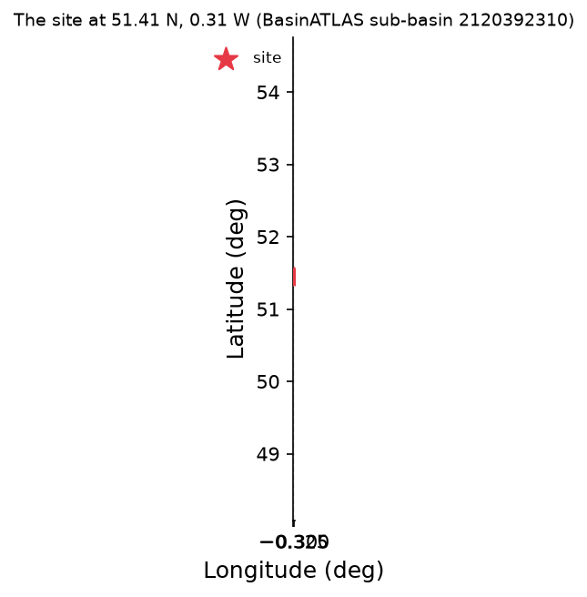
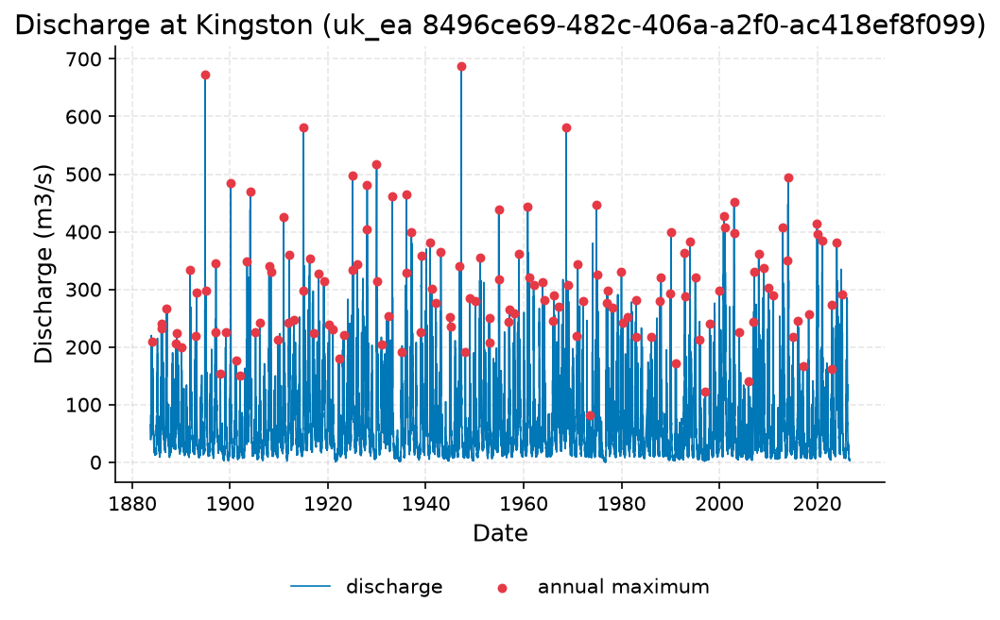
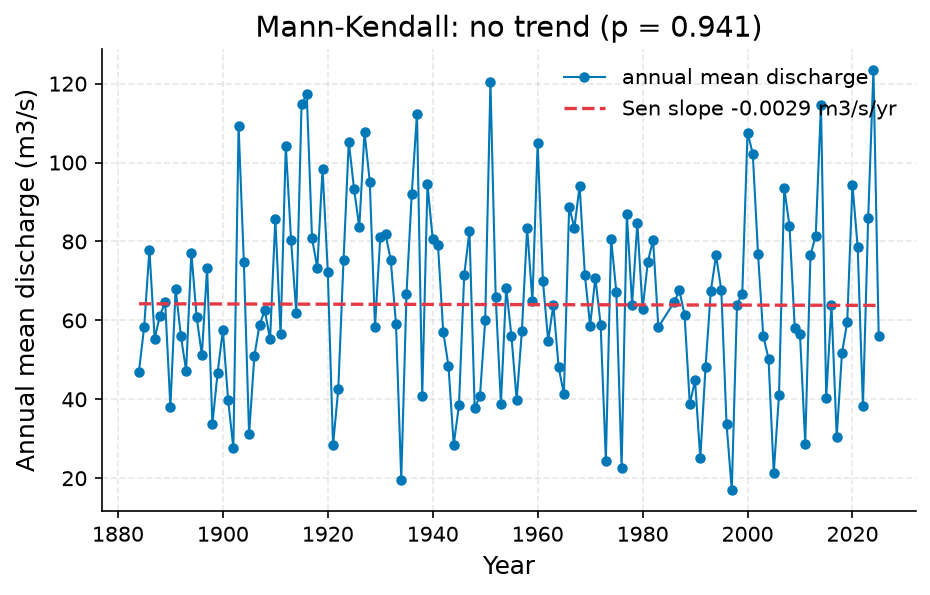
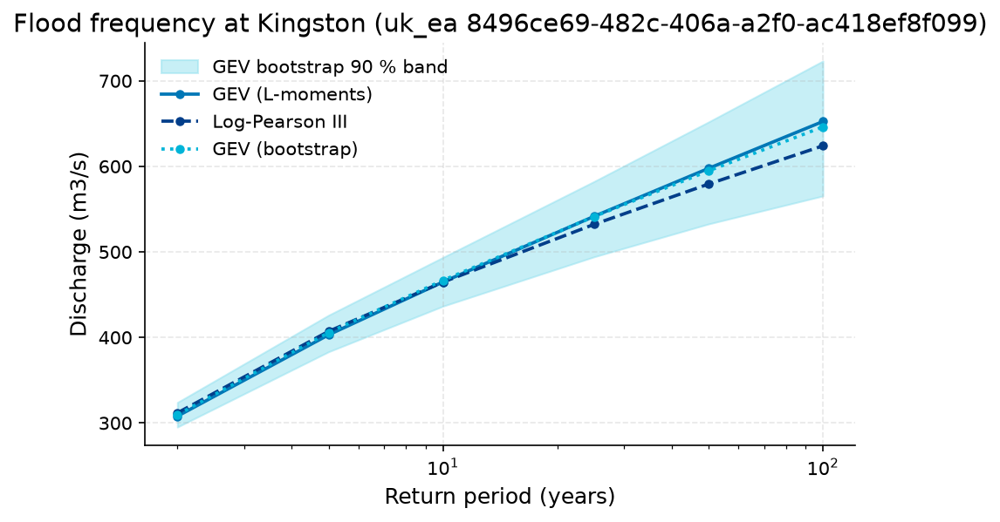

# 100-Year Design Flood for the New Kingston Road Bridge over the Thames

**Author:** AquaScope Studio  
**Date:** 2026-09-07  
**Description:** set the 100-year design flood discharge for the new road bridge over the Thames at Kingston, with its uncertainty band, to size the bridge waterway and freeboard  
**Data Sources:** BasinATLAS (HydroATLAS v1.0), ERA5 via Open-Meteo, similar_basins, uk_ea  
**Version:** 1.0  

**Site:** 51.4150 N, 0.3080 W

**Answer.** At the Environment Agency Kingston gauge (uk_ea, station 8496ce69-482c-406a-a2f0-ac418ef8f099, 142.9 years of daily discharge, 1883-2026), the 100-year flood discharge (Q100) is estimated at 652.5 m3/s by GEV (L-moments) and 624.0 m3/s by Log-Pearson III (90% interval 573.2-679.4 m3/s), a spread of about 5% between the two fits. A GEV bootstrap gives 646.2 m3/s with a 90% interval of 565.4-723.1 m3/s. No trend was found in the annual mean series (Mann-Kendall p=0.9411, Sen's slope -0.0029 m3/s/yr), supporting treatment of the record as stationary; the design value recommended is Q100 approx 650 m3/s, bracketed by roughly 565-725 m3/s at 90% confidence. The independent GloFAS cross-check could not be obtained because the data service failed.

*Key numbers*

| Quantity | Value | Unit | Step |
| --- | --- | --- | --- |
| Upstream area | 9991.0 | km2 | s1 |
| Record length | 142.9 | years | s3 |
| Mean of the record | 65.52 | m3/s | s2 |
| 100-year return level, GEV (L-moments) | 652.5 | m3/s | s3 |
| 100-year return level, Log-Pearson III | 624.0 | m3/s | s3 |
| 100-year LP3 90 % interval, low | 573.2 | m3/s | s3 |
| 100-year LP3 90 % interval, high | 679.4 | m3/s | s3 |
| Q95 (exceeded 95 % of days) | 7.522 | m3/s | s2 |
| Q50 (median flow) | 39.91 | m3/s | s2 |
| Q10 | 162.0 | m3/s | s2 |
| Mann-Kendall p-value (annual mean) | 0.9411 |  | s2 |
| Sen's slope | -0.0029 | m3/s per year | s2 |
| 100-year GEV bootstrap 90 % interval, low | 565.4 | m3/s | s3 |
| 100-year GEV bootstrap 90 % interval, high | 723.1 | m3/s | s3 |

## Summary

The 100-year design discharge for the new road bridge over the Thames at Kingston is set from 142.9 years of daily flow at the Environment Agency Kingston gauge (uk_ea, station 8496ce69-482c-406a-a2f0-ac418ef8f099). Two at-site flood frequency fits agree closely: GEV by L-moments gives 652.5 m3/s and Log-Pearson III gives 624.0 m3/s (90% interval 573.2-679.4 m3/s), a spread of about 5%, well inside the 25% disagreement threshold. A GEV bootstrap fit centred at 646.2 m3/s gives a 90% interval of 565.4-723.1 m3/s, which is taken as the design uncertainty band. The annual mean series shows no monotonic trend (Mann-Kendall p=0.9411), so a stationary estimate is justified for now. The catchment (9990.7 km2 upstream area) has 0% degree of regulation and 0 million m3 of reservoir volume, consistent with an unregulated natural flood regime. A planned GloFAS reanalysis cross-check did not run because the climate/flood data service failed, and a fallback regionalisation also failed on an argument error, so this diagnostic is not established.

## Problem and decision

A new road bridge is to be built over the Thames at Kingston. Its waterway and freeboard must be sized to pass the 100-year flood discharge (Q100), stated with an uncertainty band, without unacceptable risk of overtopping. The brief asks for Q100 in cubic metres per second together with a 90% (or stated) confidence interval, derived primarily from at-site flood frequency analysis of the local gauge record, cross-checked against an independent large-scale reanalysis and screened for trend before being treated as a stationary design value.

## Site and data

The bridge point (51.415N, -0.308W) drains an upstream area of 9990.7-9990.8 km2 (BasinATLAS/HydroATLAS v1.0), with mean elevation 109.0 m, mean slope 2.0 degrees, annual precipitation 684 mm/yr, potential evapotranspiration 695 mm/yr, actual evapotranspiration 518 mm/yr, and mean annual natural discharge of 84.65 m3/s at the outlet. Degree of regulation is 0.0% and upstream reservoir volume is 0.0 million m3, confirming an unregulated catchment as assumed. Land cover is 44% cropland, 22% urban, 16% pasture and 2% forest. The primary discharge record used is the Environment Agency Kingston gauge (uk_ea, station 8496ce69-482c-406a-a2f0-ac418ef8f099), 0.1 km from the site, with 142.9 years of daily data (1883-10-01 to 2026-09-05, n=51,943), mean flow 65.52 m3/s, median 40.07 m3/s, minimum 0.01 m3/s and maximum 800.0 m3/s.

## Methodology

Following the flood_risk playbook, the study first characterised the upstream catchment to confirm it is unregulated and to frame the scale of flows (describe_catchment). It then tested the 142.9-year Kingston annual series for a monotonic trend using Mann-Kendall with Sen's slope, to check whether a stationary flood-frequency fit is defensible (analyze_station). At-site flood frequency analysis was then run on the same record, fitting GEV by L-moments and Log-Pearson III (Bulletin 17C style), with a 1000-resample bootstrap band on a third GEV fit, to extract the T=100-year quantile and its uncertainty and the spread between methods (flood_frequency). Finally, an independent cross-check against GloFAS reanalysis discharge at the same point was attempted; when this data source and its regionalisation fallback both failed, no cross-check quantile was obtained. Regionalisation/similar-basins methods were not used as primary methods given the long local record.

## Results: step s1

The catchment upstream of the bridge point spans 9990.7-9990.8 km2 across 79 level-12 HydroBASINS sub-basins, with mean elevation 109.0 m and mean slope 2.0 degrees (HydroATLAS v1.0 BasinATLAS). Annual precipitation averages 684 mm/yr against potential evapotranspiration of 695 mm/yr and actual evapotranspiration of 518 mm/yr (aridity index 0.98), with mean annual land-surface runoff of 310.48 mm/yr and mean annual natural discharge of 84.65 m3/s at the outlet. Degree of regulation by reservoirs is 0.0% and reservoir volume is 0.0 million m3, confirming the assumption of an unregulated flow regime used to justify a stationary at-site analysis.


*The site, in longitude and latitude (no basemap); no catalogue station was listed with it.*


*The site, in longitude and latitude (no basemap); no catalogue station was listed with it.*

*Catchment attributes from BasinATLAS for the site at 51.41 N, 0.31 W.*

| attribute | label | value | unit | source | note |
| --- | --- | --- | --- | --- | --- |
| n_sub_basins |  | 79.0 |  |  |  |
| area_km2 |  | 9990.8 |  |  |  |
| outlet_hybas_id |  | 2120392310.0 |  |  |  |
| upstream_area_km2 |  | 9990.7 |  |  |  |
| elevation_m | mean elevation | 109.0 | m | basinatlas_upstream |  |
| slope_deg | mean slope | 2.0 | degrees | basinatlas_upstream |  |
| precipitation_mm_yr | annual precipitation (WorldClim) | 684.0 | mm/yr | basinatlas_upstream |  |
| pet_mm_yr | annual potential evapotranspiration | 695.0 | mm/yr | basinatlas_upstream |  |
| aet_mm_yr | annual actual evapotranspiration | 518.0 | mm/yr | basinatlas_upstream |  |
| aridity_index | aridity index (P/PET) | 0.98 | P/PET | basinatlas_upstream |  |
| temperature_c | mean annual air temperature | 9.6 | °C | basinatlas_upstream |  |
| snow_cover_pct | annual snow cover extent | 8.0 | % | basinatlas_upstream |  |
| runoff_mm_yr | annual land-surface runoff | 310.48 | mm/yr | area_weighted_mean |  |
| discharge_m3s | mean annual natural discharge at the outlet | 84.65 | m3/s | basinatlas_upstream |  |
| forest_pct | forest cover | 2.0 | % | basinatlas_upstream |  |
| cropland_pct | cropland | 44.0 | % | basinatlas_upstream |  |
| pasture_pct | pasture | 16.0 | % | basinatlas_upstream |  |
| urban_pct | urban extent | 22.0 | % | basinatlas_upstream |  |
| irrigated_pct | irrigated area | 0.0 | % | basinatlas_upstream |  |
| glacier_pct | glacier extent | 0.0 | % | basinatlas_upstream |  |
| wetland_pct | wetlands (all classes) | 0.0 | % | basinatlas_upstream |  |
| lake_pct | lake area | 0.5 | % | basinatlas_upstream |  |
| karst_pct | karst extent | 48.0 | % | basinatlas_upstream |  |
| clay_pct | clay fraction in soil | 19.0 | % | basinatlas_upstream |  |
| silt_pct | silt fraction in soil | 37.0 | % | basinatlas_upstream |  |
| sand_pct | sand fraction in soil | 44.0 | % | basinatlas_upstream |  |
| soil_organic_carbon_t_ha | soil organic carbon | 45.0 | t/ha | basinatlas_upstream |  |
| soil_water_pct | annual soil water content | 81.0 | % | basinatlas_upstream |  |
| groundwater_table_cm | groundwater table depth | 151.86 | cm | area_weighted_mean |  |
| population_density | population density | 531.99 | people/km2 | basinatlas_upstream |  |
| population | population count | 5290300.78 | people | basinatlas_upstream |  |
| degree_of_regulation_pct | degree of regulation by reservoirs | 0.0 | % | basinatlas_upstream |  |
| human_footprint_2009 | human footprint (2009) | 30.7 | index 0-50 | basinatlas_upstream |  |
| reservoir_volume_mcm | reservoir volume upstream | 0.0 | million m3 | basinatlas_upstream |  |

## Results: step s2

Mann-Kendall testing of the annual mean series at the Kingston gauge (uk_ea, station 8496ce69-482c-406a-a2f0-ac418ef8f099, 140 years of annual values within the 142.9-year record) found no trend: p-value 0.9411, Kendall's tau -0.0043, Sen's slope -0.0029 m3/s per year. This supports treating the record as stationary for flood frequency fitting. Flow-duration statistics from the same daily series give Q95 (exceeded 95% of days) of 7.522 m3/s, median flow Q50 of 39.907 m3/s, and Q10 of 162.0 m3/s, framing the low- to high-flow range of the river at this site.


*Discharge at Kingston (uk_ea 8496ce69-482c-406a-a2f0-ac418ef8f099), 1883 to 2026, with the annual maxima marked.*


*Discharge at Kingston (uk_ea 8496ce69-482c-406a-a2f0-ac418ef8f099), 1883 to 2026, with the annual maxima marked.*


*Annual mean discharge at Kingston (uk_ea 8496ce69-482c-406a-a2f0-ac418ef8f099) with the Sen slope line; the Mann-Kendall test finds no trend (p = 0.941, 140 years).*


*Annual mean discharge at Kingston (uk_ea 8496ce69-482c-406a-a2f0-ac418ef8f099) with the Sen slope line; the Mann-Kendall test finds no trend (p = 0.941, 140 years).*

*The record at Kingston (uk_ea 8496ce69-482c-406a-a2f0-ac418ef8f099) (datetime, value).*

| datetime | value |
| --- | --- |
| 1883-10-01 | 64.8 |
| 1883-10-04 | 62.8 |
| 1883-10-07 | 60.2 |
| 1883-10-10 | 39.0 |
| 1883-10-13 | 40.3 |
| 1883-10-16 | 46.3 |
| 1883-10-19 | 82.2 |
| 1883-10-22 | 63.0 |
| 1883-10-25 | 53.6 |
| 1883-10-28 | 54.2 |
| 1883-10-31 | 47.4 |
| 1883-11-03 | 45.8 |
| 1883-11-06 | 65.2 |
| 1883-11-09 | 110.0 |
| 1883-11-12 | 88.4 |
| 1883-11-15 | 61.7 |
| 1883-11-18 | 83.7 |
| 1883-11-21 | 103.0 |
| 1883-11-24 | 125.0 |
| 1883-11-27 | 220.0 |
| 1883-11-30 | 143.0 |
| 1883-12-03 | 113.0 |
| 1883-12-06 | 97.3 |
| 1883-12-09 | 73.4 |
| 1883-12-12 | 89.3 |
| 1883-12-15 | 84.5 |
| 1883-12-18 | 73.9 |
| 1883-12-21 | 63.8 |
| 1883-12-24 | 61.5 |
| 1883-12-27 | 58.5 |
| 1883-12-30 | 58.5 |
| 1884-01-02 | 48.7 |
| 1884-01-05 | 52.3 |
| 1884-01-08 | 92.6 |
| 1884-01-11 | 67.1 |
| 1884-01-14 | 59.4 |
| 1884-01-17 | 59.7 |
| 1884-01-20 | 57.6 |
| 1884-01-23 | 50.5 |
| 1884-01-26 | 88.6 |
| 1884-01-29 | 176.0 |
| 1884-02-01 | 183.0 |
| 1884-02-04 | 210.0 |
| 1884-02-07 | 145.0 |
| 1884-02-10 | 118.0 |
| 1884-02-13 | 148.0 |
| 1884-02-16 | 91.3 |
| 1884-02-19 | 81.8 |
| 1884-02-22 | 97.6 |
| 1884-02-25 | 120.0 |

*Summary of the record at Kingston (uk_ea 8496ce69-482c-406a-a2f0-ac418ef8f099).*

| item | value |
| --- | --- |
| source | uk_ea |
| station_id | 8496ce69-482c-406a-a2f0-ac418ef8f099 |
| variable | discharge |
| unit | m3/s |
| n | 51943 |
| start | 1883-10-01 |
| end | 2026-09-05 |
| years | 142.9 |
| stats.mean | 65.5219 |
| stats.median | 40.067 |
| stats.min | 0.01 |
| stats.max | 800.0 |

*Annual maxima at Kingston (uk_ea 8496ce69-482c-406a-a2f0-ac418ef8f099).*

| year | value |
| --- | --- |
| 1884 | 227.0 |
| 1885 | 240.0 |
| 1886 | 236.0 |
| 1887 | 279.0 |
| 1888 | 206.0 |
| 1889 | 233.0 |
| 1890 | 200.0 |
| 1891 | 334.0 |
| 1892 | 231.0 |
| 1893 | 295.0 |
| 1894 | 800.0 |
| 1895 | 299.0 |
| 1896 | 226.0 |
| 1897 | 346.0 |
| 1898 | 183.0 |
| 1899 | 257.0 |
| 1900 | 527.0 |
| 1901 | 196.0 |
| 1902 | 151.0 |
| 1903 | 377.0 |
| 1904 | 510.0 |
| 1905 | 227.0 |
| 1906 | 245.0 |
| 1907 | 371.0 |
| 1908 | 330.0 |
| 1909 | 221.0 |
| 1910 | 425.0 |
| 1911 | 267.0 |
| 1912 | 360.0 |
| 1913 | 247.0 |
| 1914 | 298.0 |
| 1915 | 581.0 |
| 1916 | 362.0 |
| 1917 | 230.0 |
| 1918 | 347.0 |
| 1919 | 327.0 |
| 1920 | 247.0 |
| 1921 | 231.0 |
| 1922 | 193.0 |
| 1923 | 221.0 |
| 1924 | 334.0 |
| 1925 | 514.0 |
| 1926 | 364.0 |
| 1927 | 450.0 |
| 1928 | 522.0 |
| 1929 | 547.0 |
| 1930 | 314.0 |
| 1931 | 218.0 |
| 1932 | 268.0 |
| 1933 | 468.0 |

*Return levels at Kingston (uk_ea 8496ce69-482c-406a-a2f0-ac418ef8f099) by return period, with the confidence band.*

| T | GEV | LP3 | lower | upper |
| --- | --- | --- | --- | --- |
| 2.0 | 307.917 | 311.75 | 297.7184 | 326.4429 |
| 5.0 | 403.0441 | 407.1086 | 385.6949 | 429.7112 |
| 10.0 | 464.8468 | 464.6854 | 436.7122 | 494.4503 |
| 25.0 | 541.616 | 532.2235 | 495.2459 | 571.9622 |
| 50.0 | 597.6318 | 579.3046 | 535.4148 | 626.7922 |
| 100.0 | 652.4577 | 624.0012 | 573.1555 | 679.3576 |

*Flow-duration percentiles at Kingston (uk_ea 8496ce69-482c-406a-a2f0-ac418ef8f099).*

| exceedance_pct | value |
| --- | --- |
| 10.0 | 162.0 |
| 50.0 | 39.907 |
| 95.0 | 7.522 |

*Mann-Kendall trend test and Sen slope at Kingston (uk_ea 8496ce69-482c-406a-a2f0-ac418ef8f099).*

| item | value |
| --- | --- |
| on | annual mean |
| p_value | 0.9411 |
| tau | -0.0043 |
| trend | no trend |
| sens_slope_per_year | -0.0029 |
| n_years | 140 |

## Results: step s3

At-site flood frequency analysis on 140 years of annual maxima at Kingston (uk_ea, station 8496ce69-482c-406a-a2f0-ac418ef8f099) gives a T=100-year return level of 652.5 m3/s by GEV fitted with L-moments (shape 0.0201, location 276.69, scale 85.51) and 624.0 m3/s by Log-Pearson III (90% analytical interval 573.2-679.4 m3/s; skew-adjusted parameters -0.2389, 2.4881, 0.1429). The spread between the two fits is about 4.6%, well under the 25% disagreement threshold, so the two are quoted together rather than merged. A separate GEV (MLE, L-moment seeded) with 1000-resample bootstrap gives Q100 of 646.2 m3/s with a 90% interval of 565.4-723.1 m3/s; this interval is taken as the recommended uncertainty band. All gate checks (return-period cap, finite CI, inter-method spread) passed.


*Return levels of annual maximum discharge at Kingston (uk_ea 8496ce69-482c-406a-a2f0-ac418ef8f099): GEV (L-moments) and Log-Pearson III fits with the GEV bootstrap 90 % band.*


*Return levels of annual maximum discharge at Kingston (uk_ea 8496ce69-482c-406a-a2f0-ac418ef8f099): GEV (L-moments) and Log-Pearson III fits with the GEV bootstrap 90 % band.*

*Return levels at Kingston (uk_ea 8496ce69-482c-406a-a2f0-ac418ef8f099) by return period, with the confidence band.*

| T | GEV | LP3 | lower | upper |
| --- | --- | --- | --- | --- |
| 2.0 | 307.917 | 311.75 | 295.1933 | 323.9715 |
| 5.0 | 403.0441 | 407.1086 | 383.2295 | 425.9326 |
| 10.0 | 464.8468 | 464.6854 | 436.5283 | 493.5379 |
| 25.0 | 541.616 | 532.2235 | 494.2591 | 582.3356 |
| 50.0 | 597.6318 | 579.3046 | 532.6547 | 651.8774 |
| 100.0 | 652.4577 | 624.0012 | 565.4195 | 723.1096 |

*Spread between the GEV and Log-Pearson III return levels at Kingston (uk_ea 8496ce69-482c-406a-a2f0-ac418ef8f099).*

| T | GEV | LP3 | spread_pct |
| --- | --- | --- | --- |
| 2.0 | 307.917 | 311.75 | 1.2 |
| 5.0 | 403.0441 | 407.1086 | 1.0 |
| 10.0 | 464.8468 | 464.6854 | 0.0 |
| 25.0 | 541.616 | 532.2235 | 1.7 |
| 50.0 | 597.6318 | 579.3046 | 3.1 |
| 100.0 | 652.4577 | 624.0012 | 4.5 |

## Results: step s4

The planned GloFAS reanalysis cross-check at 51.415N, -0.308W over a 100-year window could not be completed: the Open-Meteo ERA5 climate and GloFAS flood APIs both failed after three attempts each, so no independent discharge estimate is available and the not_empty gate on 'climate' failed. The regionalize_signatures fallback also failed, returning a ValueError ('method must be similarity, regression or both'), so no regional or similarity-based Q100 estimate was produced either. The at-site Q100 therefore stands without an independent large-scale cross-check.

## Limitations and what this study does not establish

The Q100 estimate rests solely on at-site analysis of the Kingston gauge; the planned GloFAS cross-check and its regionalisation fallback both failed to run, so no independent, large-scale confirmation of the magnitude exists (not established). The GEV (L-moments, 652.5 m3/s) and Log-Pearson III (624.0 m3/s) fits differ by about 5%, within the 25% disagreement threshold used here, but this spread reflects real estimator sensitivity in the tail and is reported rather than averaged away. The estimate is stationary: no trend was detected (Mann-Kendall p=0.9411), but design-flood guidance under a changing climate remains immature, and any climate allowance must be applied as an overlay to this stationary Q100, not built into a nonstationary fit. Daily resolution is assumed for the record since it is not stated explicitly beyond 'daily'. The Kingston gauge, 0.1 km from the bridge site, is treated as effectively at-site; any local hydraulic differences between the gauge and the bridge cross-section are not assessed here.

## What this study does not establish

- Step s4, gate not_empty: nothing at 'climate'
- Step s4.fallback, gate not_empty: the step returned an error: regionalisation failed: ValueError: method must be similarity, regression or both
- Step s4.fallback, gate not_empty: the step returned an error: regionalisation failed: ValueError: method must be similarity, regression or both
- The study stopped at s4: gate failed: not_empty (nothing at 'climate'); the fallback regionalize_signatures failed too: regionalisation failed: ValueError: method must be similarity, regression or both

## Caveats

- Design-flood guidance under climate change is immature (Wasko et al. 2024, HESS): the estimate here is stationary, and any climate scenario is an overlay on it, not a nonstationary fit.
- Rare quantiles move with the distribution and the estimator. Two fits (GEV by L-moments and Log-Pearson III) are quoted with their intervals and the spread between them; a spread above 25 percent is reported as disagreement, not averaged away.

## Recommendations

Adopt Q100 in the range of about 565 to 723 m3/s (90% band from the bootstrap GEV fit, centred near 646-653 m3/s) as the design discharge for sizing the bridge waterway and freeboard, treating the Log-Pearson III value of 624.0 m3/s as a consistent lower-side check. Before finalising, attempt to re-run the GloFAS reanalysis cross-check once the data service is available, since this diagnostic did not run. Apply any climate-change allowance as an explicit overlay percentage on top of this stationary Q100 rather than revising the statistical fit, pending clearer nonstationary guidance. The close agreement between the at-site GEV and Log-Pearson III fits confirms internal consistency of the gauge-based analysis, but it does not substitute for the independent, large-scale cross-check: the GloFAS reanalysis attempt and its regionalize_signatures fallback both failed to run, so this diagnostic remains outstanding and not established. This cross-check, or an alternative regionalisation with a valid method argument, should be obtained before treating the at-site Q100 as fully corroborated. Periodic re-analysis as new annual maxima accrue is also advisable to confirm stationarity continues to hold.

## References

1. Mann, H. B. (1945). Nonparametric tests against trend. Econometrica, 13, 245-259
2. Kendall (1975)
3. Sen, P. K. (1968). J. Am. Stat. Assoc., 63, 1379-1389.
4. England, J. F. et al. (2019). Guidelines for determining flood flow frequency, Bulletin 17C. USGS Techniques and Methods 4-B5.
5. Hosking, J. R. M. (1990). L-moments: analysis and estimation of distributions using linear combinations of order statistics. J. R. Stat. Soc. B, 52(1), 105-124.
6. Harrigan, S. et al. (2020). GloFAS-ERA5 operational global river discharge reanalysis 1979-present. Earth Syst. Sci. Data 12, 2043-2060.
7. HydroATLAS v1.0 (BasinATLAS), CC BY 4.0. Linke, S., Lehner, B., Ouellet Dallaire, C., et al. (2019). Global hydro-environmental sub-basin and river reach characteristics at high spatial resolution. Scientific Data 6: 283. https://doi.org/10.1038/s41597-019-0300-6
8. Vogel, R. M., & Fennessey, N. M. (1994). Flow-duration curves I: new interpretation and confidence intervals. J. Water Resour. Plann. Manage., 120(4), 485-504.
9. England, J. F. Jr. et al. (2018). Guidelines for determining flood flow frequency, Bulletin 17C. USGS Techniques and Methods 4-B5.
10. Coles, S. (2001). An Introduction to Statistical Modeling of Extreme Values. Springer.
11. Wasko, C. et al. (2024). A systematic review of climate change science for flood and design guidance. Hydrol. Earth Syst. Sci. 28, 1251-1285. doi:10.5194/hess-28-1251-2024
12. Nonstationary flood frequency estimates are parameter-fragile: Stoch. Environ. Res. Risk Assess. (2024), doi:10.1007/s00477-024-02680-9
13. Multi-approach cross-checks in infrastructure flood practice: J. Hydrol. (2024), doi:10.1016/j.jhydrol.2024.130698
14. Oudin, L. et al. (2008). Spatial proximity, physical similarity, regression and ungaged catchments. Water Resour. Res. 44, W03413.
15. Wasko et al. 2024, HESS
16. Rekin226 and contributors (2026). AquaScope: Open-source water data aggregation toolkit (version 0.14.0) [Software]. Zenodo. https://doi.org/10.5281/zenodo.21903143

## Appendix: reproducibility

Re-run the same steps with no model: `aquascope run study.yaml`. Resume the workspace: `aquascope studio --resume workspace.json`.

Model: claude-sonnet-5 via anthropic; ledger: consultant 1 call(s), 4489 tokens, methodologist 1 call(s), 13136 tokens, analyst 1 call(s), 3576 tokens, author 1 call(s), 16257 tokens, critic 1 call(s), 17060 tokens. aquascope 0.14.0.

```yaml
# An AquaScope study (version 3): the plan behind an answer, its gates, and what happened.
#   aquascope run study.yaml
version: 3
title: "Estimate the 100-year flood discharge (Q100) for the Thames : 51.415, -0.308"
question: "Design flow for a new road bridge over the Thames at Kingston: the 100-year flood with its uncertainty band."
created: "2026-09-07T13:25:08+00:00"
aquascope_version: "0.14.0"
author: "methodologist"
model: "claude-sonnet-5"
problem:
  kind: "flood_risk"
  site: {"lat": 51.415, "lon": -0.308}
  params: {"return_period": 100, "decision": "design flow"}
  text: "Design flow for a new road bridge over the Thames at Kingston: the 100-year flood with its uncertainty band."
plan:
  author: "methodologist"
  playbook: "flood_risk"
  objective: "Estimate the 100-year flood discharge (Q100) for the Thames at Kingston, with an uncertainty band, to size the new road bridge waterway and freeboard."
  decision: "set the 100-year design flood discharge for the new road bridge over the Thames at Kingston, with its uncertainty band, to size the bridge waterway and freeboard"
  methodology: ["Characterize the catchment at the bridge point to confirm it is unregulated and to frame the scale of the estimate.", "Test the Kingston gauge annual series for a monotonic trend before treating it as stationary.", "Fit at-site flood frequency (GEV by L-moments and Log-Pearson III, with a bootstrap band) to the Kingston gauge and extract the T=100 year quantile with its interval and inter-method spread.", "Cross-check the at-site Q100 against GloFAS reanalysis discharge at the same point."]
  assumptions: ["daily resolution is assumed for the Kingston discharge record since resolution is not stated in the catalog", "the Kingston gauge (0.1 km away, 142.9 years) is treated as effectively at-site for the bridge location", "at-site flood frequency analysis is the primary method, with GloFAS cross-check and Mann-Kendall trend check as supporting diagnostics; regionalization/similar-basins methods are not needed given the long local record", "no flow regulation or dam effect is assumed upstream (recon shows 0 dams in the catchment)", "Daily resolution is assumed for the Kingston discharge record since resolution is not stated explicitly in the catalog metadata beyond 'daily'.", "The Kingston gauge (uk_ea 8496ce69-482c-406a-a2f0-ac418ef8f099, 0.1 km away, 142.9 years) is treated as effectively at-site for the bridge location.", "At-site flood frequency analysis is the primary method; GloFAS cross-check and Mann-Kendall trend check are supporting diagnostics; regionalization and similar-basins methods are not used given the long local record and marginal status of similar_basins here.", "No upstream flow regulation or dam effect is assumed, consistent with 0 dams reported in the catchment recon.", "The 100-year quantile is estimated as a stationary statistic; any trend found is reported as a caveat rather than used to build a nonstationary model."]
  alternatives: [{"method": "similar_basins", "why_not": "Sufficiency table marks this marginal for a gauged point like Kingston; it is meant for ungauged sites and is only kept as a fallback if the at-site fit fails its gates."}, {"method": "regionalize_signatures", "why_not": "142.9 years of local daily discharge already supports a direct at-site fit, making a regionalized ungauged-point estimate unnecessary as a primary method."}]
  limitations_expected: ["Rare quantiles move with the distribution and the estimator; the GEV (L-moments) and Log-Pearson III fits are both quoted with their intervals and the spread between them, and a spread above 25 percent is reported as disagreement rather than averaged away.", "Design-flood guidance under climate change is immature; the Q100 estimate here is stationary and any climate scenario is an overlay caveat, not a nonstationary fit.", "GloFAS is a large-scale reanalysis product and may disagree with the at-site gauge estimate at a local bridge site; such disagreement is reported, not resolved by blending the two."]
  citations: ["England, J. F. et al. (2019). Guidelines for determining flood flow frequency, Bulletin 17C. USGS Techniques and Methods 4-B5.", "Hosking, J. R. M. (1990). L-moments: analysis and estimation of distributions using linear combinations of order statistics. J. R. Stat. Soc. B 52, 105-124.", "Wasko, C. et al. (2024). A systematic review of climate change science for flood and design guidance. Hydrol. Earth Syst. Sci. 28, 1251-1285. doi:10.5194/hess-28-1251-2024", "Nonstationary flood frequency estimates are parameter-fragile: Stoch. Environ. Res. Risk Assess. (2024), doi:10.1007/s00477-024-02680-9", "Multi-approach cross-checks in infrastructure flood practice: J. Hydrol. (2024), doi:10.1016/j.jhydrol.2024.130698", "Oudin, L. et al. (2008). Spatial proximity, physical similarity, regression and ungaged catchments. Water Resour. Res. 44, W03413.", "Harrigan, S. et al. (2020). GloFAS-ERA5 operational global river discharge reanalysis 1979-present. Earth Syst. Sci. Data 12, 2043-2060.", "Wasko et al. 2024, HESS"]
  caveats: ["Design-flood guidance under climate change is immature (Wasko et al. 2024, HESS): the estimate here is stationary, and any climate scenario is an overlay on it, not a nonstationary fit.", "Rare quantiles move with the distribution and the estimator. Two fits (GEV by L-moments and Log-Pearson III) are quoted with their intervals and the spread between them; a spread above 25 percent is reported as disagreement, not averaged away."]
  rationale: "Estimate the 100-year flood discharge (Q100) for the Thames at Kingston, with an uncertainty band, to size the new road bridge waterway and freeboard."
  recon_notes: ["Record resolution is not in the catalog; daily is assumed for every variable.", "10 donor gauges from a pool of 37,071 gauged catchments.", "ERA5 temperature and forcing and GloFAS discharge are assumed reachable for any point on land (Open-Meteo); not checked here.", "CMIP6 change factors need model output you supply (aquascope.climate works on downloaded data); not counted."]
  replans: [{"step": "s4", "reason": "gate failed: not_empty (nothing at 'climate')", "fallback": {"tool": "regionalize_signatures", "arguments": {"lat": 51.415, "lon": -0.308, "k": 10, "method": "regionalization"}, "rationale": "With GloFAS and ERA5 both unreachable, transferring a regionalized mean annual maximum flood from nearby donor catchments provides an independent cross-check on the at-site Q100 estimate.", "expects": [{"check": "not_empty", "path": "estimates"}, {"check": "not_empty", "path": "skill"}]}}]
steps:
  - tool: "describe_catchment"
    id: "s1"
    rationale: "Catchment size, elevation and regulation by dams frame the estimate and confirm the maxima are natural (0 dams upstream)."
    arguments:
      lat: 51.415
      lon: -0.308
      upstream: true
    outputs: [{"kind": "figure", "id": "s1_site_map", "caption": "site map from describe_catchment"}, {"kind": "table", "id": "s1_catchment_attributes", "caption": "catchment attributes from describe_catchment"}]
  - tool: "analyze_station"
    id: "s2"
    rationale: "Mann-Kendall with Sen's slope on the annual maxima says whether the 142.9-year Kingston record is stationary enough for a stationary fit; a significant trend is flagged as a caveat, not folded into a nonstationary model."
    method: "trend_mann_kendall"
    arguments:
      source: "uk_ea"
      station_id: "8496ce69-482c-406a-a2f0-ac418ef8f099"
    expects:
      - {"check": "min_years", "value": 20, "path": "years"}
      - {"check": "not_empty", "path": "trend"}
      - {"check": "unit_present", "path": "unit"}
    outputs: [{"kind": "figure", "id": "s2_series", "caption": "series from analyze_station"}, {"kind": "figure", "id": "s2_annual_maxima", "caption": "annual maxima from analyze_station"}, {"kind": "figure", "id": "s2_trend", "caption": "trend from analyze_station"}, {"kind": "table", "id": "s2_summary", "caption": "summary from analyze_station"}, {"kind": "table", "id": "s2_trend", "caption": "trend from analyze_station"}]
  - tool: "flood_frequency"
    id: "s3"
    rationale: "Return levels from GEV (L-moments) and Log-Pearson III (Bulletin 17C), with a bootstrap band on the GEV, give the T=100 year design discharge and its uncertainty from two independent fits."
    method: "at_site_flood_frequency"
    arguments:
      source: "uk_ea"
      station_id: "8496ce69-482c-406a-a2f0-ac418ef8f099"
      bootstrap_ci: true
      return_periods: [2, 5, 10, 25, 50, 100]
    expects:
      - {"check": "max_return_period_factor", "value": 3, "path": "years", "return_period": 100}
      - {"check": "ci_finite", "path": "ffa.fits.gev_bootstrap.ci", "return_period": 100}
      - {"check": "spread_within", "value": 0.25, "paths": ["ffa.fits.gev_lmoments.q", "ffa.fits.lp3.q"], "return_period": 100, "repaired_from": null, "path": "ffa.fits.gev_lmoments.q, ffa.fits.lp3.q"}
    fallback: {"step": {"tool": "similar_basins", "arguments": {"source": "uk_ea", "station_id": "8496ce69-482c-406a-a2f0-ac418ef8f099", "k": 5}, "rationale": "If the at-site fit fails its gates, donor gauges from similar catchments give a regional cross-check to quote alongside it.", "expects": []}}
    depends_on: ["s2"]
    outputs: [{"kind": "figure", "id": "s3_frequency_curve", "caption": "frequency curve from flood_frequency"}, {"kind": "table", "id": "s3_return_levels", "caption": "return levels from flood_frequency"}, {"kind": "table", "id": "s3_fit_spread", "caption": "fit spread from flood_frequency"}]
  - tool: "anywhere"
    id: "s4"
    rationale: "GloFAS reanalysis discharge at the same point is an independent model-based cross-check on the at-site Q100 estimate, as required by the brief."
    method: "glofas_cross_check"
    arguments:
      lat: 51.415
      lon: -0.308
      years: 100
    expects:
      - {"check": "not_empty", "path": "climate"}
    fallback: {"step": {"tool": "regionalize_signatures", "arguments": {"lat": 51.415, "lon": -0.308, "k": 10, "method": "regionalization"}, "rationale": "With GloFAS and ERA5 both unreachable, transferring a regionalized mean annual maximum flood from nearby donor catchments provides an independent cross-check on the at-site Q100 estimate.", "expects": [{"check": "not_empty", "path": "estimates"}, {"check": "not_empty", "path": "skill"}]}}
    depends_on: ["s3"]
    outputs: [{"kind": "figure", "id": "s4_glofas_series", "caption": "GloFAS reanalysis discharge series from anywhere"}, {"kind": "table", "id": "s4_glofas_summary", "caption": "GloFAS discharge summary from anywhere"}]
results:
  s1: {"ok": true, "gates": [], "summary": "latitude=51.415, longitude=-0.308, license=CC-BY-4.0, attribution=HydroATLAS v1.0 (BasinATLAS), CC BY 4.0. Linke, S., Lehner, B., Ouellet Dallaire, C., et al. (2019). Global hydro-environmental sub-ba", "fallback_used": false, "sha256": "2bcacbbfd6fa6878"}
  s2: {"ok": true, "gates": [{"check": "min_years", "passed": true, "detail": "142.9 years of record, 20 needed"}, {"check": "not_empty", "passed": true, "detail": "'trend' is present"}, {"check": "unit_present", "passed": true, "detail": "unit m3/s"}], "summary": "source=uk_ea, station_id=8496ce69-482c-406a-a2f0-ac418ef8f099, name=Kingston, variable=discharge, unit=m3/s, years=142.9, start=1883-10-01, end=2026-09-05", "fallback_used": false, "sha256": "ac6d2e8d22c556a1"}
  s3: {"ok": true, "gates": [{"check": "max_return_period_factor", "passed": true, "detail": "T = 100 years against a cap of about 429 years (3 times 142.9 years of record)"}, {"check": "ci_finite", "passed": true, "detail": "finite interval [565.4, 723.1] at T = 100 years"}, {"check": "spread_within", "passed": true, "detail": "spread 4% between 652.5, 624 (25% allowed) at T = 100 years"}], "summary": "source=uk_ea, station_id=8496ce69-482c-406a-a2f0-ac418ef8f099, name=Kingston, unit=m3/s, years=142.9, start=1883-10-01, end=2026-09-05", "fallback_used": false, "sha256": "47638d2960b72a2e"}
  s4: {"ok": true, "gates": [{"check": "not_empty", "passed": false, "detail": "nothing at 'climate'"}], "summary": "years=100, start=1926-08-31, end=2026-08-31", "fallback_used": true, "sha256": "e531a3743835a3ed", "fallback": {"tool": "regionalize_signatures", "arguments": {"lat": 51.415, "lon": -0.308, "k": 10, "method": "regionalization"}, "ok": false, "gates": [{"check": "not_empty", "passed": false, "detail": "the step returned an error: regionalisation failed: ValueError: method must be similarity, regression or both"}, {"check": "not_empty", "passed": false, "detail": "the step returned an error: regionalisation failed: ValueError: method must be similarity, regression or both"}], "summary": "error: regionalisation failed: ValueError: method must be similarity, regression or both"}}
```

## Cite this software

AquaScope Studio (2026). AquaScope: Open-source water data aggregation toolkit (version 0.14.0) [Software]. Zenodo. https://doi.org/10.5281/zenodo.21903143


---

*{'model': 'claude-sonnet-5', 'provider': 'anthropic', 'prose': 'model', 'tokens': {'consultant': {'calls': 1, 'prompt_tokens': 3299, 'completion_tokens': 1190}, 'methodologist': {'calls': 1, 'prompt_tokens': 9865, 'completion_tokens': 3271}, 'analyst': {'calls': 1, 'prompt_tokens': 3192, 'completion_tokens': 384}, 'author': {'calls': 2, 'prompt_tokens': 27094, 'completion_tokens': 8250}, 'critic': {'calls': 1, 'prompt_tokens': 11323, 'completion_tokens': 5737}}, 'total_tokens': 73605, 'aquascope_version': '0.14.0', 'date': '2026-09-07 13:29 UTC', 'workspace': '797b58c77b0c', 'plan_author': 'methodologist'}*
