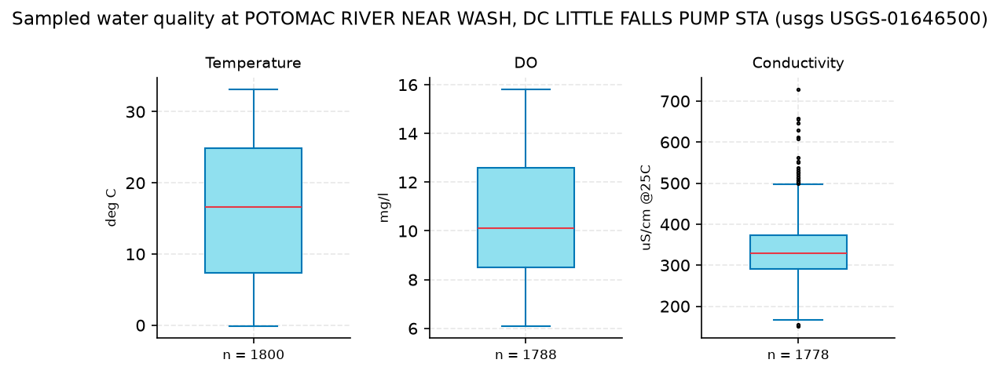
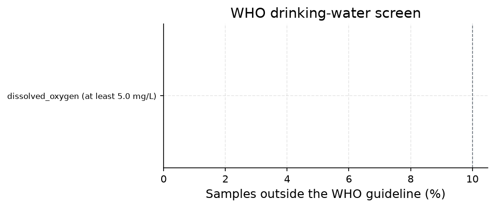
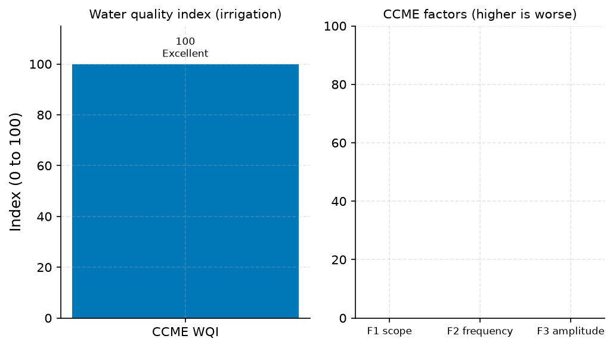

# Potomac River at Little Falls (USGS-01646500): Five-Year Drinking-Water Screening

**Author:** AquaScope Studio  
**Date:** 2026-09-07  
**Description:** screen whether Potomac water quality at Little Falls meets drinking-water guidelines and quantify the index for a risk screening  
**Data Sources:** BasinATLAS (HydroATLAS v1.0), ERA5 via Open-Meteo, similar_basins, usgs  
**Version:** 1.0  

**Site:** 38.9500 N, 77.1300 W

**Answer.** Over 2021-09-07 to 2026-09-06, USGS-01646500 (Potomac River near Wash DC, Little Falls Pump Sta) yielded 5,366 water-quality samples across three parameters. Of these, only dissolved oxygen carries a WHO (2022) drinking-water guideline, and none of 1,788 DO samples fell below the 5.0 mg/L threshold (0 warnings, 0 alerts). The CCME Water Quality Index (drinking-guideline set) scored 100.0 of 100, category Excellent, but this rests on a single sampled parameter against the CCME-recommended minimum of four. An irrigation cross-check using FAO 29 thresholds on conductivity alone (n=1,778) also scored 100.0 of 100, Excellent.

*Key numbers*

| Quantity | Value | Unit | Step |
| --- | --- | --- | --- |
| Samples | 5366.0 |  | s1 |
| WHO guideline alerts | 0.0 |  | s2 |
| CCME WQI | 100.0 | of 100 | s4 |

## Summary

USGS-01646500, the Potomac River near Wash DC at the Little Falls Pump Station, is the water-quality record used for this screen (proximity to the site was not quantified in the data pulled). Over the requested five years (2021-09-07 to 2026-09-06) it produced 5,366 samples across three continuously monitored parameters: conductivity, dissolved oxygen and temperature. Screening against WHO (2022) drinking-water guidelines found no exceedances: the sole recognised parameter with a guideline, dissolved oxygen, never fell below 5.0 mg/L in 1,788 samples (0 percent exceedance, 0 warnings, 0 alerts). The CCME Water Quality Index computed on this single parameter scored 100.0 of 100 (Excellent), and an irrigation cross-check computed on conductivity alone (1,778 samples) also scored 100.0 of 100 (Excellent). Neither score reflects nutrients, metals, bacteria or pH, none of which were present in this record, so the Excellent rating describes only what was sampled, not a full drinking-water clearance.

## Problem and decision

The client asked for a screen of the last five years of Potomac River water-quality samples at Little Falls against drinking-water guidelines: which parameters exceed thresholds, and what aggregate water quality index results, with an irrigation index as a secondary cross-check. The intended use is drinking water, and the client requested exceedance flags and an index rather than a pass/fail health verdict.

## Site and data

The site sits at latitude 38.95, longitude -77.13. The water-quality record used is USGS-01646500, 'POTOMAC RIVER NEAR WASH, DC LITTLE FALLS PUMP STA', spanning 96.5 years of record overall per the water_quality_samples result; the last five years (2021-09-07 to 2026-09-06) were pulled for this screen. No distance or proximity figure to the site was returned by the tools used, and no station-inventory result was supplied to compare against alternate stations, so only USGS-01646500 is reported here.

## Methodology

Five years of daily-mean water-quality samples were pulled from USGS-01646500 (parameter codes 00010, 00095, 00300, 00400). Each recognised parameter was screened against the WHO (2022) drinking-water guideline (4th edition with addenda) to flag any exceedance (warning) or over-10-percent exceedance (alert). The CCME Water Quality Index 1.0 was computed over the sampled parameters with a drinking guideline set, with the NSF WQI computed in parallel where enough of its nine parameters were present. The same sample set was then run through the CCME index using FAO 29 irrigation thresholds as a secondary cross-check, standing in for a dedicated IWQI method, which is not implemented here.

## Results: step s1

USGS-01646500 returned 5,366 samples over 2021-09-07 to 2026-09-06 across three parameters. Conductivity: n=1,778, unit uS/cm @25C, min 152.0, median 330.0, max 728.0. Dissolved oxygen (DO): n=1,788, unit mg/l, min 6.1, median 10.1, max 15.8. Temperature: n=1,800, unit deg C, min -0.1, median 16.6, max 33.1. Nutrients, metals and bacteria, which typically come from discrete Water Quality Portal sampling rather than the USGS daily-mean record, are not present in this dataset.


*Distribution of the sampled values per parameter at POTOMAC RIVER NEAR WASH, DC LITTLE FALLS PUMP STA (usgs USGS-01646500) (5366 samples, 2021 to 2026): box is the interquartile range, the line the median, points beyond 1.5 IQR shown singly.*


*Distribution of the sampled values per parameter at POTOMAC RIVER NEAR WASH, DC LITTLE FALLS PUMP STA (usgs USGS-01646500) (5366 samples, 2021 to 2026): box is the interquartile range, the line the median, points beyond 1.5 IQR shown singly.*

*Water-quality samples at POTOMAC RIVER NEAR WASH, DC LITTLE FALLS PUMP STA (usgs USGS-01646500).*

| datetime | parameter | value | unit |
| --- | --- | --- | --- |
| 2021-09-07T00:00:00 | Conductivity | 262.0 | uS/cm @25C |
| 2021-09-08T00:00:00 | Conductivity | 277.0 | uS/cm @25C |
| 2021-09-09T00:00:00 | Conductivity | 291.0 | uS/cm @25C |
| 2021-09-10T00:00:00 | Conductivity | 290.0 | uS/cm @25C |
| 2021-09-11T00:00:00 | Conductivity | 280.0 | uS/cm @25C |
| 2021-09-12T00:00:00 | Conductivity | 299.0 | uS/cm @25C |
| 2021-09-13T00:00:00 | Conductivity | 303.0 | uS/cm @25C |
| 2021-09-14T00:00:00 | Conductivity | 303.0 | uS/cm @25C |
| 2021-09-15T00:00:00 | Conductivity | 319.0 | uS/cm @25C |
| 2021-09-16T00:00:00 | Conductivity | 336.0 | uS/cm @25C |
| 2021-09-17T00:00:00 | Conductivity | 326.0 | uS/cm @25C |
| 2021-09-18T00:00:00 | Conductivity | 337.0 | uS/cm @25C |
| 2021-09-19T00:00:00 | Conductivity | 306.0 | uS/cm @25C |
| 2021-09-20T00:00:00 | Conductivity | 319.0 | uS/cm @25C |
| 2021-09-21T00:00:00 | Conductivity | 325.0 | uS/cm @25C |
| 2021-09-22T00:00:00 | Conductivity | 342.0 | uS/cm @25C |
| 2021-09-23T00:00:00 | Conductivity | 274.0 | uS/cm @25C |
| 2021-09-24T00:00:00 | Conductivity | 235.0 | uS/cm @25C |
| 2021-09-25T00:00:00 | Conductivity | 267.0 | uS/cm @25C |
| 2021-09-26T00:00:00 | Conductivity | 251.0 | uS/cm @25C |
| 2021-09-27T00:00:00 | Conductivity | 280.0 | uS/cm @25C |
| 2021-09-28T00:00:00 | Conductivity | 269.0 | uS/cm @25C |
| 2021-09-29T00:00:00 | Conductivity | 265.0 | uS/cm @25C |
| 2021-09-30T00:00:00 | Conductivity | 267.0 | uS/cm @25C |
| 2021-10-01T00:00:00 | Conductivity | 273.0 | uS/cm @25C |
| 2021-10-02T00:00:00 | Conductivity | 282.0 | uS/cm @25C |
| 2021-10-03T00:00:00 | Conductivity | 292.0 | uS/cm @25C |
| 2021-10-04T00:00:00 | Conductivity | 303.0 | uS/cm @25C |
| 2021-10-05T00:00:00 | Conductivity | 316.0 | uS/cm @25C |
| 2021-10-06T00:00:00 | Conductivity | 324.0 | uS/cm @25C |
| 2021-10-07T00:00:00 | Conductivity | 329.0 | uS/cm @25C |
| 2021-10-08T00:00:00 | Conductivity | 330.0 | uS/cm @25C |
| 2021-10-09T00:00:00 | Conductivity | 333.0 | uS/cm @25C |
| 2021-10-10T00:00:00 | Conductivity | 340.0 | uS/cm @25C |
| 2021-10-11T00:00:00 | Conductivity | 354.0 | uS/cm @25C |
| 2021-10-12T00:00:00 | Conductivity | 356.0 | uS/cm @25C |
| 2021-10-13T00:00:00 | Conductivity | 363.0 | uS/cm @25C |
| 2021-10-14T00:00:00 | Conductivity | 368.0 | uS/cm @25C |
| 2021-10-15T00:00:00 | Conductivity | 371.0 | uS/cm @25C |
| 2021-10-16T00:00:00 | Conductivity | 374.0 | uS/cm @25C |
| 2021-10-17T00:00:00 | Conductivity | 384.0 | uS/cm @25C |
| 2021-10-18T00:00:00 | Conductivity | 372.0 | uS/cm @25C |
| 2021-10-19T00:00:00 | Conductivity | 359.0 | uS/cm @25C |
| 2021-10-20T00:00:00 | Conductivity | 360.0 | uS/cm @25C |
| 2021-10-21T00:00:00 | Conductivity | 358.0 | uS/cm @25C |
| 2021-10-22T00:00:00 | Conductivity | 359.0 | uS/cm @25C |
| 2021-10-23T00:00:00 | Conductivity | 362.0 | uS/cm @25C |
| 2021-10-24T00:00:00 | Conductivity | 364.0 | uS/cm @25C |
| 2021-10-25T00:00:00 | Conductivity | 363.0 | uS/cm @25C |
| 2021-10-26T00:00:00 | Conductivity | 240.0 | uS/cm @25C |

*Samples per parameter at POTOMAC RIVER NEAR WASH, DC LITTLE FALLS PUMP STA (usgs USGS-01646500).*

| parameter | n | unit | start | end | min | median | max |
| --- | --- | --- | --- | --- | --- | --- | --- |
| Conductivity | 1778 | uS/cm @25C | 2021-09-07 | 2026-09-06 | 152.0 | 330.0 | 728.0 |
| DO | 1788 | mg/l | 2021-09-07 | 2026-09-06 | 6.1 | 10.1 | 15.8 |
| Temperature | 1800 | deg C | 2021-09-07 | 2026-09-06 | -0.1 | 16.6 | 33.1 |

## Results: step s2

Against the WHO (2022) drinking-water guideline, only dissolved oxygen among the three sampled parameters had a recognised threshold (at least 5.0 mg/L). Of 1,788 DO samples, 0 exceeded the guideline (0.0 percent), status OK. No warnings and no alerts were raised across the screen (n_alerts=0, n_warnings=0). Conductivity and temperature have no WHO drinking-water guideline in this screen and were not flagged.


*Share of samples outside the WHO drinking-water guideline per parameter; red is an alert (over 10 %), orange a warning (any exceedance), green within the guideline.*


*Share of samples outside the WHO drinking-water guideline per parameter; red is an alert (over 10 %), orange a warning (any exceedance), green within the guideline.*

*WHO drinking-water guideline screen per parameter.*

| parameter | rule | n | n_exceed | pct | status |
| --- | --- | --- | --- | --- | --- |
| dissolved_oxygen | at least 5.0 mg/L | 1788 | 0 | 0.0 | OK |

## Results: step s3

The CCME Water Quality Index (drinking guideline set) scored 100.0 of 100, category Excellent, with F1=0.0, F2=0.0, F3=0.0, computed over 1 variable (dissolved oxygen) and 1,788 tests, 0 failed variables, 0 failed tests. A note flags that only 1 parameter with a guideline was sampled against CCME's recommended minimum of 4. The NSF WQI could not be scored (score null): only 1 of its 9 parameters, dissolved-oxygen saturation (q=96.4, value 103.7063 percent, weight 0.17), was available, short of the 5 needed; 8 parameters (fecal coliform, pH, BOD, temperature change, phosphate, nitrate, turbidity, total solids) were missing.


*CCME WQI of 100 (Excellent) over 1788 samples against the drinking guidelines; the CCME factors are the scope, frequency and amplitude of the exceedances.*


*CCME WQI of 100 (Excellent) over 1788 samples against the drinking guidelines; the CCME factors are the scope, frequency and amplitude of the exceedances.*

*Water quality index and its components.*

| item | value |
| --- | --- |
| use | drinking |
| variant | auto |
| guideline_set | drinking |
| ccme.index | ccme_wqi |
| ccme.guideline_set | drinking |
| ccme.score | 100.0 |
| ccme.category | Excellent |
| ccme.f1 | 0.0 |
| ccme.f2 | 0.0 |
| ccme.f3 | 0.0 |
| ccme.nse | 0.0 |
| ccme.n_variables | 1 |
| ccme.n_tests | 1788 |
| ccme.n_failed_variables | 0 |
| ccme.n_failed_tests | 0 |
| ccme.meets_minimum_design | False |
| ccme.period.start | 2021-09-07 |
| ccme.period.end | 2026-09-06 |
| ccme.period.years | 5.0 |
| ccme.sample_counts.dissolved_oxygen | 1788 |
| ccme.input.n_in | 5366 |
| ccme.input.n_used | 5366 |
| ccme.notes | Only 1 parameter(s) with a guideline were sampled; CCME recommends at least 4.; The index covers the sampled parameters that have a guideline in this set and nothing else. |
| ccme.citation | CCME (2001). Canadian water quality guidelines for the protection of aquatic life: CCME Water Quality Index 1.0, User's Manual. Canadian Council of Ministers of the Environment, Winnipeg. |
| nsf.index | nsf_wqi |
| nsf.complete | False |
| nsf.n_parameters | 1 |
| nsf.missing | fecal_coliform; ph; bod; temperature_change; phosphate; nitrate; turbidity; total_solids |
| nsf.weights_renormalised | True |
| nsf.period.start | 2021-09-07 |
| nsf.period.end | 2026-09-06 |
| nsf.period.years | 5.0 |
| nsf.sample_counts.conductivity | 1778 |
| nsf.sample_counts.dissolved_oxygen | 1788 |
| nsf.sample_counts.temperature | 1800 |
| nsf.input.n_in | 5366 |
| nsf.input.n_used | 5366 |
| nsf.notes | Temperature change needs a reference temperature; the parameter is left out.; Only 1 of the nine NSF parameters are present (fewer than 5); no score is reported.; The NSF sub-index curves used here are digitised approximations of the published curves. |
| nsf.citation | Brown, R. M., McClelland, N. I., Deininger, R. A. and Tozer, R. G. (1970). A water quality index: do we dare? Water and Sewage Works 117, 339-343. Sub-index curves are digitised approximations of the published rating curves. |
| index | ccme_wqi |
| score | 100.0 |
| category | Excellent |
| period.start | 2021-09-07 |
| period.end | 2026-09-06 |
| period.years | 5.0 |
| sample_counts.dissolved_oxygen | 1788 |
| n_samples | 1788 |
| unit | index, 0 to 100 |
| ccme.index | ccme_wqi |
| ccme.guideline_set | drinking |

## Results: step s4

As a secondary cross-check using FAO 29 irrigation thresholds, the CCME index scored 100.0 of 100, category Excellent, based on conductivity alone (guideline: at most 3000 uS/cm; n=1,778, min 152.0, median 330.0, max 728.0 uS/cm), with F1=0.0, F2=0.0, F3=0.0, 0 failed tests. As with the drinking-use index, only 1 parameter with a guideline was sampled, below CCME's recommended minimum of 4. Note this is the CCME index run against irrigation thresholds, not a dedicated irrigation water quality index (IWQI) method, since none is implemented; the result is informative only, as the stated intake use is drinking.


*CCME WQI of 100 (Excellent) over 1778 samples against the irrigation guidelines; the CCME factors are the scope, frequency and amplitude of the exceedances.*


*CCME WQI of 100 (Excellent) over 1778 samples against the irrigation guidelines; the CCME factors are the scope, frequency and amplitude of the exceedances.*

*Water quality index and its components.*

| item | value |
| --- | --- |
| use | irrigation |
| variant | auto |
| guideline_set | irrigation |
| ccme.index | ccme_wqi |
| ccme.guideline_set | irrigation |
| ccme.score | 100.0 |
| ccme.category | Excellent |
| ccme.f1 | 0.0 |
| ccme.f2 | 0.0 |
| ccme.f3 | 0.0 |
| ccme.nse | 0.0 |
| ccme.n_variables | 1 |
| ccme.n_tests | 1778 |
| ccme.n_failed_variables | 0 |
| ccme.n_failed_tests | 0 |
| ccme.meets_minimum_design | False |
| ccme.period.start | 2021-09-07 |
| ccme.period.end | 2026-09-06 |
| ccme.period.years | 5.0 |
| ccme.sample_counts.conductivity | 1778 |
| ccme.input.n_in | 5366 |
| ccme.input.n_used | 5366 |
| ccme.notes | Only 1 parameter(s) with a guideline were sampled; CCME recommends at least 4.; The index covers the sampled parameters that have a guideline in this set and nothing else. |
| ccme.citation | CCME (2001). Canadian water quality guidelines for the protection of aquatic life: CCME Water Quality Index 1.0, User's Manual. Canadian Council of Ministers of the Environment, Winnipeg. |
| nsf.index | nsf_wqi |
| nsf.complete | False |
| nsf.n_parameters | 1 |
| nsf.missing | fecal_coliform; ph; bod; temperature_change; phosphate; nitrate; turbidity; total_solids |
| nsf.weights_renormalised | True |
| nsf.period.start | 2021-09-07 |
| nsf.period.end | 2026-09-06 |
| nsf.period.years | 5.0 |
| nsf.sample_counts.conductivity | 1778 |
| nsf.sample_counts.dissolved_oxygen | 1788 |
| nsf.sample_counts.temperature | 1800 |
| nsf.input.n_in | 5366 |
| nsf.input.n_used | 5366 |
| nsf.notes | Temperature change needs a reference temperature; the parameter is left out.; Only 1 of the nine NSF parameters are present (fewer than 5); no score is reported.; The NSF sub-index curves used here are digitised approximations of the published curves. |
| nsf.citation | Brown, R. M., McClelland, N. I., Deininger, R. A. and Tozer, R. G. (1970). A water quality index: do we dare? Water and Sewage Works 117, 339-343. Sub-index curves are digitised approximations of the published rating curves. |
| index | ccme_wqi |
| score | 100.0 |
| category | Excellent |
| period.start | 2021-09-07 |
| period.end | 2026-09-06 |
| period.years | 5.0 |
| sample_counts.conductivity | 1778 |
| n_samples | 1778 |
| unit | index, 0 to 100 |
| ccme.index | ccme_wqi |
| ccme.guideline_set | irrigation |

## Limitations and what this study does not establish

Both index scores rest on a single sampled parameter with a guideline (dissolved oxygen for drinking, conductivity for irrigation), well short of CCME's recommended minimum of 4; an Excellent score describes only the parameters sampled, not a verdict that the water is safe for use, and unsampled parameters (pH, nutrients, metals, bacteria) are unknown, not cleared. The NSF WQI could not be computed for lack of parameters. NSF sub-index curves used are digitised approximations of Brown et al. (1970), with weights renormalised for missing parameters. WHO (2022) guidelines cover only recognised parameters; the FAO 29 irrigation cross-check uses a different guideline basis and is secondary given the drinking-water intake use. USGS daily values are continuous-monitor daily means for temperature, conductivity, DO and pH; nutrients, metals and bacteria, not present here, would need discrete Water Quality Portal sampling.

## What this study does not establish

- step s4: method 'iwqi' is not one wqi applies; 'water_quality_index' stands in
- These numbers are not in any tool result: -10.0, -100.0.

## Caveats

- The index covers the parameters that were sampled and nothing else; a parameter that was not sampled is not cleared, it is unknown, and a Good or Excellent score is a statement about the sampled parameters, not a verdict that the water is safe for the use.
- The NSF sub-index curves used here are digitised approximations of the published rating curves (Brown et al. 1970), and the weights are renormalised when some of the nine parameters are missing.
- Guideline values are the WHO (2022) drinking-water guidelines (4th edition with addenda), as the WHO screen carries them.
- USGS daily water-quality values are a continuous monitor's daily means for temperature, specific conductance, dissolved oxygen and pH; nutrients, metals and bacteria come from discrete sampling (the Water Quality Portal) and are not in a USGS daily record.

## Recommendations

To produce a CCME/NSF index that meets the recommended minimum of four guideline parameters and to properly screen for nutrients, metals, bacteria and pH, pull discrete Water Quality Portal samples for USGS-01646500 or a co-located station covering those analytes over the same five-year window. Until then, treat the reported 100.0-of-100 Excellent scores as covering dissolved oxygen and conductivity only, not a full drinking-water clearance. If an irrigation-use decision is actually needed, implement a dedicated IWQI method rather than relying on the CCME index run against FAO 29 thresholds.

## References

1. CCME (2001). Canadian water quality guidelines for the protection of aquatic life: CCME Water Quality Index 1.0, User's Manual. Canadian Council of Ministers of the Environment, Winnipeg.
2. Brown, R. M., McClelland, N. I., Deininger, R. A. and Tozer, R. G. (1970). A water quality index: do we dare? Water and Sewage Works 117, 339-343.
3. WHO (2022) Guidelines for Drinking-water Quality, 4th edition with addenda
4. Ayers, R. S. and Westcot, D. W. (1985). Water quality for agriculture. FAO Irrigation and Drainage Paper 29, Rev. 1. FAO, Rome.
5. World Health Organization (2022). Guidelines for drinking-water quality, 4th edition, incorporating the first and second addenda. WHO, Geneva.
6. Richards, L. A. (ed.) (1954). Diagnosis and improvement of saline and alkali soils. USDA Handbook 60
7. Wilcox, L. V. (1955). Classification and use of irrigation waters. USDA Circular 969.
8. WQI with PCA as the descriptive pair in current applications: Sustainability 16 (2024), doi:10.3390/su16135644; Water 16 (2024), doi:10.3390/w16111570.
9. Irrigation suitability indices (SAR, RSC, sodium percentage) in current applications: Water 16 (2024), doi:10.3390/w16020264.
10. CCME Water Quality Index 1.0
11. Rekin226 and contributors (2026). AquaScope: Open-source water data aggregation toolkit (version 0.14.0) [Software]. Zenodo. https://doi.org/10.5281/zenodo.21903143

## Appendix: reproducibility

Re-run the same steps with no model: `aquascope run study.yaml`. Resume the workspace: `aquascope studio --resume workspace.json`.

Model: claude-sonnet-5 via anthropic; ledger: consultant 1 call(s), 4049 tokens, methodologist 1 call(s), 15970 tokens, author 1 call(s), 12576 tokens, critic 1 call(s), 11720 tokens. aquascope 0.14.0.

```yaml
# An AquaScope study (version 3): the plan behind an answer, its gates, and what happened.
#   aquascope run study.yaml
version: 3
title: "Screen the most recent 5 years of water-quality samples from: 38.95, -77.13"
question: "Screen the last five years of water-quality samples of the Potomac at Little Falls against the drinking-water guidelines: which parameters exceed, and what is the index?"
created: "2026-09-07T14:19:48+00:00"
aquascope_version: "0.14.0"
author: "methodologist"
model: "claude-sonnet-5"
problem:
  kind: "water_quality"
  site: {"lat": 38.95, "lon": -77.13}
  params: {"use": "drinking", "years": 5, "health_verdict": false}
  text: "Screen the last five years of water-quality samples of the Potomac at Little Falls against the drinking-water guidelines: which parameters exceed, and what is the index?"
plan:
  author: "methodologist"
  playbook: "water_quality"
  objective: "Screen the most recent 5 years of water-quality samples from the Potomac River at Little Falls (USGS-01646500) against drinking-water guidelines, identify which parameters exceed thresholds, and quantify an aggregate water quality index, with an irrigation-index cross-check."
  decision: "screen whether Potomac water quality at Little Falls meets drinking-water guidelines and quantify the index for a risk screening"
  methodology: ["Pull the last five years of sampled water-quality parameters at USGS-01646500 (Potomac River near Wash DC, Little Falls Pump Sta), the only water-quality record in the inventory at 0.2 km from the site.", "Screen each recognised parameter's samples against the WHO (2022) drinking-water guideline to flag warnings (any exceedance) and alerts (over 10 percent of samples exceeding).", "Compute the CCME WQI 1.0 (with NSF WQI added where enough of its nine parameters are present) over the same sampled parameters and guidelines to get a 0-100 score and category.", "Compute the irrigation water quality index (IWQI) on the same sample set as a secondary cross-check, since the brief asks for it if relevant, while the primary intake use remains drinking.", "Report the exceedance list and both indices together, noting that the score covers only the parameters actually sampled."]
  assumptions: ["USGS-01646500 (Little Falls Pump Sta) is the intended 'Potomac at Little Falls' station given its 0.2 km distance and water_quality variable", "sample resolution is daily as noted in the catalog, though not independently verified", "health_verdict left at default false since the client asked for exceedance screening and an index, not a pass/fail health call", "USGS-01646500 (Little Falls Pump Sta) is the intended 'Potomac at Little Falls' water-quality station given its 0.2 km distance and being the only water_quality dataset at this location.", "Sample resolution is daily as noted in the catalog, though the actual sampling frequency within the water-quality record is not independently confirmed.", "health_verdict is left false per the brief's request for exceedance screening and an index rather than a pass/fail health call.", "The IWQI cross-check is informative only, since the stated intake use is drinking, not irrigation."]
  alternatives: [{"method": "NSF WQI alone (without CCME)", "why_not": "not all nine NSF parameters may be present in the sampled record, so it is only added when coverage allows, per the sufficiency table."}, {"method": "single-parameter threshold screening only", "why_not": "answers exceedance but not the aggregate index the brief explicitly asks for."}]
  limitations_expected: ["The index covers only the parameters that were sampled; an unsampled parameter is not cleared, it is unknown.", "A Good or Excellent WQI score is a statement about the sampled parameters, not a verdict that the water is safe for the stated use.", "NSF sub-index curves are digitised approximations of the published rating curves (Brown et al. 1970), and weights are renormalised when parameters are missing.", "Guideline values are the WHO (2022) drinking-water guidelines (4th edition with addenda) for the drinking screen; the IWQI cross-check uses a different guideline basis and is secondary.", "USGS daily water-quality values are continuous-monitor daily means for temperature, specific conductance, dissolved oxygen and pH; nutrients, metals and bacteria come from discrete sampling and may be sparser."]
  citations: ["CCME (2001). Canadian water quality guidelines for the protection of aquatic life: CCME Water Quality Index 1.0, User's Manual. Canadian Council of Ministers of the Environment, Winnipeg.", "Brown, R. M., McClelland, N. I., Deininger, R. A. and Tozer, R. G. (1970). A water quality index: do we dare? Water and Sewage Works 117, 339-343.", "World Health Organization (2022). Guidelines for drinking-water quality, 4th edition, incorporating the first and second addenda. WHO, Geneva.", "Ayers, R. S. and Westcot, D. W. (1985). Water quality for agriculture. FAO Irrigation and Drainage Paper 29, Rev. 1. FAO, Rome.", "Richards, L. A. (ed.) (1954). Diagnosis and improvement of saline and alkali soils. USDA Handbook 60; Wilcox, L. V. (1955). Classification and use of irrigation waters. USDA Circular 969.", "WQI with PCA as the descriptive pair in current applications: Sustainability 16 (2024), doi:10.3390/su16135644; Water 16 (2024), doi:10.3390/w16111570.", "Irrigation suitability indices (SAR, RSC, sodium percentage) in current applications: Water 16 (2024), doi:10.3390/w16020264.", "WHO (2022) Guidelines for Drinking-water Quality, 4th edition with addenda", "CCME Water Quality Index 1.0", "Brown et al. 1970 (NSF WQI rating curves)"]
  caveats: ["The index covers the parameters that were sampled and nothing else; a parameter that was not sampled is not cleared, it is unknown, and a Good or Excellent score is a statement about the sampled parameters, not a verdict that the water is safe for the use.", "The NSF sub-index curves used here are digitised approximations of the published rating curves (Brown et al. 1970), and the weights are renormalised when some of the nine parameters are missing.", "Guideline values are the WHO (2022) drinking-water guidelines (4th edition with addenda), as the WHO screen carries them.", "USGS daily water-quality values are a continuous monitor's daily means for temperature, specific conductance, dissolved oxygen and pH; nutrients, metals and bacteria come from discrete sampling (the Water Quality Portal) and are not in a USGS daily record."]
  rationale: "Screen the most recent 5 years of water-quality samples from the Potomac River at Little Falls (USGS-01646500) against drinking-water guidelines, identify which parameters exceed thresholds, and quantify an aggregate water quality index, with an irrigation-index cross-check."
  notes: ["step s4: method 'iwqi' is not one wqi applies; 'water_quality_index' stands in"]
  recon_notes: ["Record resolution is not in the catalog; daily is assumed for every variable.", "10 donor gauges from a pool of 37,071 gauged catchments.", "ERA5 temperature and forcing and GloFAS discharge are assumed reachable for any point on land (Open-Meteo); not checked here.", "CMIP6 change factors need model output you supply (aquascope.climate works on downloaded data); not counted."]
steps:
  - tool: "water_quality_samples"
    id: "s1"
    rationale: "Fetch the last 5 years of sampled parameters at the only water-quality station in the inventory near the site."
    arguments:
      source: "usgs"
      station_id: "USGS-01646500"
      years: 5
      use: "drinking"
    expects:
      - {"check": "not_empty", "path": "samples"}
      - {"check": "unit_present", "path": "unit"}
    outputs: [{"kind": "figure", "id": "s1_samples_by_parameter", "caption": "samples by parameter from water_quality_samples"}, {"kind": "table", "id": "s1_samples", "caption": "samples from water_quality_samples"}, {"kind": "table", "id": "s1_sample_counts", "caption": "sample counts from water_quality_samples"}]
  - tool: "who_screen"
    id: "s2"
    rationale: "Flag which sampled parameters exceed the WHO (2022) drinking-water guideline and how often."
    arguments:
      from_step: "s1"
    depends_on: ["s1"]
    outputs: [{"kind": "figure", "id": "s2_who_exceedances", "caption": "who exceedances from who_screen"}, {"kind": "table", "id": "s2_who_screen", "caption": "who screen from who_screen"}]
  - tool: "wqi"
    id: "s3"
    rationale: "Aggregate the sampled parameters into a single CCME/NSF-based water quality index and category against the drinking-water guidelines."
    method: "water_quality_index"
    arguments:
      from_step: "s1"
      use: "drinking"
    expects:
      - {"check": "not_empty", "path": "ccme.score"}
      - {"check": "min_samples", "path": "ccme.sample_counts", "value": 4}
    depends_on: ["s1"]
    outputs: [{"kind": "figure", "id": "s3_wqi_bars", "caption": "wqi bars from wqi"}, {"kind": "table", "id": "s3_wqi", "caption": "wqi from wqi"}]
  - tool: "wqi"
    id: "s4"
    rationale: "Provide the irrigation water quality index as a secondary cross-check on the same sample set, as the brief requests if relevant."
    method: "water_quality_index"
    arguments:
      from_step: "s1"
      use: "irrigation"
    expects:
      - {"check": "not_empty", "path": "ccme.score", "repaired_from": "iwqi.score"}
      - {"check": "min_samples", "path": "ccme.sample_counts", "value": 4, "repaired_from": "iwqi.sample_counts"}
    depends_on: ["s1"]
    outputs: [{"kind": "figure", "id": "s4_iwqi_bars", "caption": "iwqi bars from wqi (irrigation cross-check)"}, {"kind": "table", "id": "s4_iwqi", "caption": "iwqi from wqi (irrigation cross-check)"}]
results:
  s1: {"ok": true, "gates": [{"check": "not_empty", "passed": true, "detail": "'samples' is present"}, {"check": "unit_present", "passed": true, "detail": "unit uS/cm @25C"}], "summary": "source=usgs, station_id=USGS-01646500, unit=uS/cm @25C, years=5.0, start=2021-09-07, end=2026-09-06", "fallback_used": false, "sha256": "4d21925e86c2e4d6"}
  s2: {"ok": true, "gates": [], "summary": "n_alerts=0, n_warnings=0", "fallback_used": false, "sha256": "4d9e192249f9fd1b"}
  s3: {"ok": true, "gates": [{"check": "not_empty", "passed": true, "detail": "'ccme.score' is present"}, {"check": "min_samples", "passed": true, "detail": "1 parameter(s) with at least 4 samples each"}], "summary": "unit=index, 0 to 100", "fallback_used": false, "sha256": "fbbcf6e0ee74800b"}
  s4: {"ok": true, "gates": [{"check": "not_empty", "passed": true, "detail": "'ccme.score' is present"}, {"check": "min_samples", "passed": true, "detail": "1 parameter(s) with at least 4 samples each"}], "summary": "unit=index, 0 to 100", "fallback_used": false, "sha256": "b55bacb694944fac"}
```

## Cite this software

AquaScope Studio (2026). AquaScope: Open-source water data aggregation toolkit (version 0.14.0) [Software]. Zenodo. https://doi.org/10.5281/zenodo.21903143


---

*{'model': 'claude-sonnet-5', 'provider': 'anthropic', 'prose': 'model', 'tokens': {'consultant': {'calls': 1, 'prompt_tokens': 3210, 'completion_tokens': 839}, 'methodologist': {'calls': 1, 'prompt_tokens': 8344, 'completion_tokens': 7626}, 'author': {'calls': 2, 'prompt_tokens': 19811, 'completion_tokens': 8898}, 'critic': {'calls': 1, 'prompt_tokens': 7974, 'completion_tokens': 3746}}, 'total_tokens': 60448, 'aquascope_version': '0.14.0', 'date': '2026-09-07 14:21 UTC', 'workspace': '009bbcd25169', 'plan_author': 'methodologist'}*
