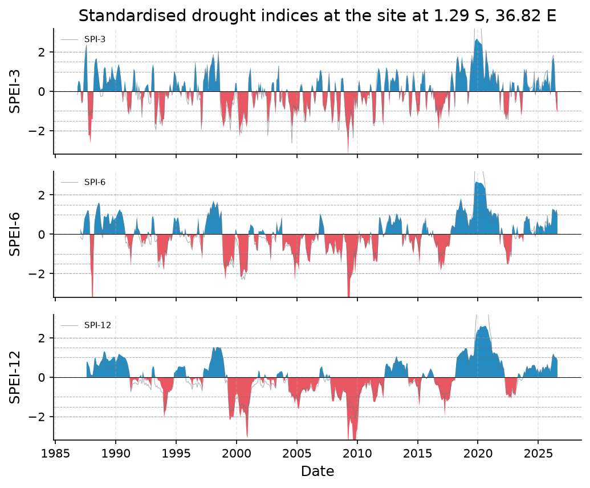
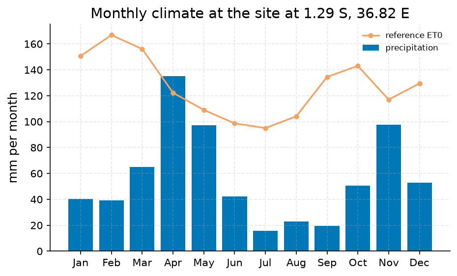
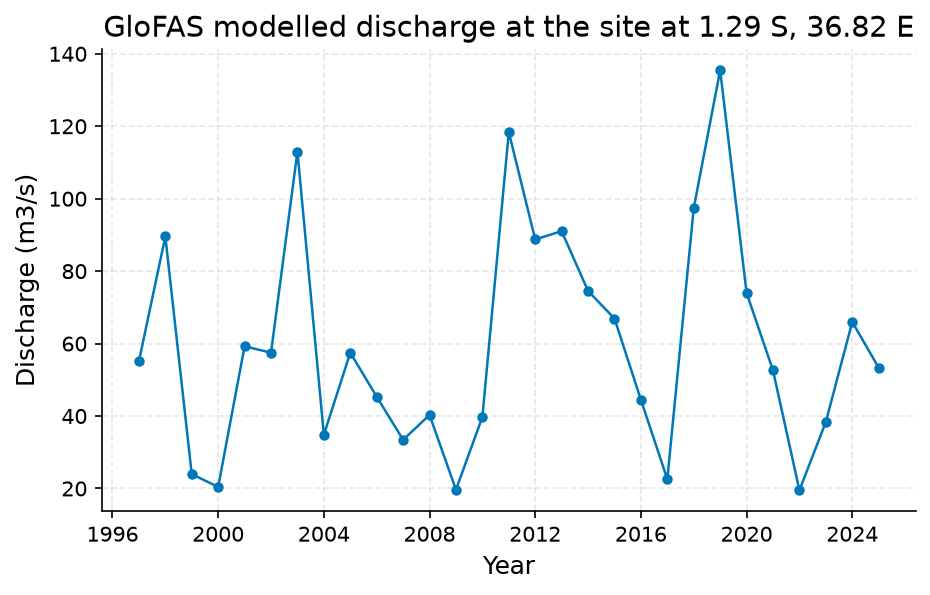
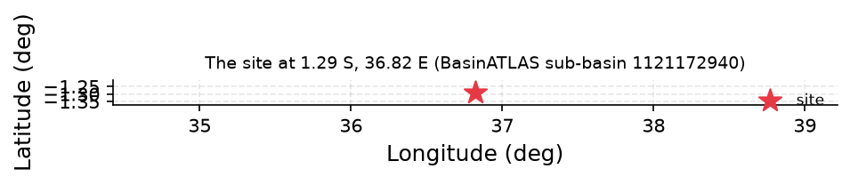

# Nairobi Seasonal Drought Status: Short-Timescale SPEI Signals Moderate Dryness, Longer Windows Normal

**Author:** AquaScope Studio  
**Date:** 2026-09-07  
**Description:** whether the current season around Nairobi qualifies as a meteorological drought for smallholder agriculture, to inform local drought advisories and planting/irrigation decisions  
**Data Sources:** BasinATLAS (HydroATLAS v1.0), ERA5 via Open-Meteo, similar_basins  
**Version:** 1.0  

**Site:** 1.2900 S, 36.8200 E

**Answer.** For the ERA5 reanalysis cell at -1.29, 36.82 (Open-Meteo/ERA5, 1986-09-01 to 2026-08-01, 40-year record, month ending 2026-08-01), SPEI-3 is -1.08 (moderately dry) while SPI-3 is -0.39 (normal); SPEI-6, SPEI-12, SPI-6 and SPI-12 are all normal (0.94, 0.86, 0.97, 0.80 respectively). The only drought signal is a short-timescale, evaporative-demand-driven one: SPEI is 0.69 standard-deviation units drier than SPI this month against a 10-year mean gap of only -0.10. No rain gauge is within a usable distance of the site, per the sufficiency check, so this call rests on the ~9 km ERA5 grid cell, not a station record.

*Key numbers*

| Quantity | Value | Unit | Step |
| --- | --- | --- | --- |
| SPI at 3 months, 2026-08-01 | -0.3898 |  | s1 |
| SPEI at 3 months, 2026-08-01 | -1.076 |  | s1 |
| ERA5 temperature trend | 0.2431 | C per decade | s1 |
| ERA5 precipitation | 672.7 | mm per year | s2 |
| ERA5 reference evapotranspiration | 1524.0 | mm per year | s2 |
| Aridity index | 0.4415 |  | s2 |
| GloFAS mean discharge (cell) | 4.133 | m3/s | s2 |
| Upstream area | 101.8 | km2 | s3 |

## Summary

The current season around Nairobi shows a mild, single-index drought signal, not a broad meteorological drought. SPEI-3 for the ERA5 grid cell at -1.29, 36.82 (record 1986-09-01 to 2026-08-01) reads -1.08, classed moderately dry, while SPI-3 for the same cell and month reads -0.39, classed normal. At 6 and 12 months both indices are normal (SPEI-6 0.94, SPI-6 0.97, SPEI-12 0.86, SPI-12 0.80). The 3-month divergence (-0.69) exceeds the 10-year mean divergence (-0.10); this reflects the structural difference between SPEI, which nets precipitation against potential evapotranspiration, and SPI, which uses precipitation alone, rather than a rainfall deficit by itself. ERA5 also shows a longer-term warming trend at the cell of 0.24 C per decade (p=8.9e-05, 39 years, annual mean temperature 18.80 C), noted here as separate context rather than as an explanation for this month's divergence. GloFAS modelled discharge for the same point (1997-01-02 to 2026-08-31) shows no trend (p=0.49). Cropland is a minor land use (3 percent) in the 101.8 km2 upstream catchment, which is unregulated (0 percent degree of regulation, 0 dams). Overall, this is a short-timescale, PET-driven dry signal, not a season-long drought, and it is drawn entirely from reanalysis, not a gauge.

## Problem and decision

The decision is whether the current season around Nairobi qualifies as a meteorological drought for smallholder agriculture, to inform local drought advisories and planting or irrigation timing. The brief specifies SPEI at 3, 6 and 12 month accumulations plus a severity class (near-normal, moderate, severe, extreme) as the required quantities, with agricultural drought as the stated concern and flash drought excluded. No rain gauge exists in the catalog within a usable distance of the site, which forces the entire assessment onto a reanalysis-based fallback rather than a station record.

## Site and data

No rain gauge station is in the catalog within a usable distance of -1.29, 36.82, per the sufficiency check, so all indices are computed on the ERA5 reanalysis cell (about 9 km resolution) via Open-Meteo, covering 1986-08-31 to 2026-08-31 (40 years, 14,611 days). BasinATLAS (HydroATLAS v1.0) describes the local catchment: 101.8 km2 upstream area, mean elevation 1694 m, mean slope 1.5 degrees, mean annual precipitation 858.0 mm/yr and PET 1577.0 mm/yr (aridity index 0.55), AET 726.0 mm/yr, mean annual runoff 94.0 mm/yr and natural discharge 0.19 m3/s at the outlet. Land cover is 83 percent urban, 11 percent forest, 3 percent cropland, 1 percent pasture and 3 percent irrigated, with 0 percent degree of regulation and 0 reservoir volume (no dams). Population upstream is 875,744 at a density of 8590 people/km2.

## Methodology

Because no rain gauge is within a defensible distance, the sufficiency table marked at-site SPI/SPEI not_defensible and directed use of the reanalysis fallback: SPI and SPEI were computed from ERA5 precipitation and temperature at the site for 3, 6 and 12 month accumulation periods over a 40-year record (1986-09-01 to 2026-08-01, 480 months), using Thornthwaite (1948) potential evapotranspiration from ERA5 temperature as the water-balance input for SPEI. GloFAS modelled discharge for the same point (1997-01-02 to 2026-08-31, 10,834 daily values) was pulled as an independent cross-check on the reanalysis-based drought signal, since no discharge gauge exists either. The BasinATLAS catchment description (upstream area 101.8 km2) supplied hydrologic and land-use context for the smallholder area. All three steps passed their gates: minimum 30-year record (40 years achieved), non-empty index and climate outputs, and the catchment area gate (101.8 km2 against a 102 km2 ceiling, a narrow pass).

## Results: step s1

From the ERA5 cell at -1.29, 36.82 (1986-09-01 to 2026-08-01, 40 years, Thornthwaite PET), for 2026-08-01: SPI-3 is -0.39 (normal, worst on record -2.64 at 2004-08-01, 27 threshold events of 478 months), SPEI-3 is -1.08 (moderately dry, worst -3.23 at 2009-04-01, 35 events). At 6 months, SPI-6 is 0.97 and SPEI-6 is 0.94, both normal (worst SPI-6 -2.31 at 2000-09-01, worst SPEI-6 -4.75 at 1988-02-01). At 12 months, SPI-12 is 0.80 and SPEI-12 is 0.86, both normal (worst SPI-12 -2.18 at 2000-12-01, worst SPEI-12 -4.75 at 2009-11-01). The 3-month SPEI-minus-SPI divergence is -0.69 this month versus a 10-year mean of -0.10, with SPEI drier than SPI in 50.8 percent of the 478-month record and a 0.95 correlation between the two series. ERA5 annual mean temperature at the cell is 18.80 C with an increasing trend of 0.24 C per decade (p=8.9e-05, n=39 years). Overall status flagged: moderately_dry, in_drought true, driven by the 3-month SPEI alone.


*SPEI (bars) with SPI (grey line) at the site at 1.29 S, 36.82 E for the 3, 6, 12 month accumulations, 1986 to 2026: blue above zero is wetter than normal, red below is drier; the dashed lines mark the moderate (1), severe (1.5) and extreme (2) classes.*


*SPEI (bars) with SPI (grey line) at the site at 1.29 S, 36.82 E for the 3, 6, 12 month accumulations, 1986 to 2026: blue above zero is wetter than normal, red below is drier; the dashed lines mark the moderate (1), severe (1.5) and extreme (2) classes.*

*Monthly SPI and SPEI at the site at 1.29 S, 36.82 E per timescale.*

| date | spi_3 | spei_3 | spi_6 | spei_6 | spi_12 | spei_12 |
| --- | --- | --- | --- | --- | --- | --- |
| 1986-11-01 | -0.1745430339326366 | 0.2291282131869043 |  |  |  |  |
| 1986-12-01 | 0.1749351092321903 | 0.5322168724975342 |  |  |  |  |
| 1987-01-01 | 0.2022985471385597 | 0.5118665036416361 |  |  |  |  |
| 1987-02-01 | 0.0658039351915917 | 0.2693078182390887 | -0.1274270366276798 | 0.287670184933643 |  |  |
| 1987-03-01 | -0.588095901443504 | -0.4960632410537192 | -0.2230554560557095 | 0.1125077305564992 |  |  |
| 1987-04-01 | -0.5499790230871328 | -0.5942984916704854 | -0.2698250417932877 | -0.0614512536232623 |  |  |
| 1987-05-01 | 0.2277358347188325 | 0.1608913019411129 | 0.1076472945789982 | 0.2870392857324638 |  |  |
| 1987-06-01 | 1.3298681990756325 | 1.4017436270213568 | 0.7212017602383789 | 0.8080204042128082 |  |  |
| 1987-07-01 | 2.1497831617896783 | 1.9831001502850831 | 0.8744125037655168 | 0.935132939186552 |  |  |
| 1987-08-01 | 2.3488367620212363 | 2.379425280182184 | 1.0435215671736844 | 1.0633666627124558 | 0.5066085497141108 | 0.7935414988223456 |
| 1987-09-01 | 0.0061100621351062 | -0.1396166561699418 | 1.208834440256315 | 1.2238395656382413 | 0.5112792312170881 | 0.7747255755175437 |
| 1987-10-01 | -1.229085560493843 | -2.255229115761173 | 1.1808663509597386 | 1.186706534484448 | 0.3982560228842316 | 0.6241382340702936 |
| 1987-11-01 | -1.0712224749900103 | -2.2084811052507316 | 0.562788799190868 | 0.6733562002326401 | 0.3215314200863597 | 0.4943954963581187 |
| 1987-12-01 | -1.217129550194283 | -2.647375683671543 | -0.9720984056165096 | -1.7342196419190277 | 0.086161983426357 | 0.1620998934975229 |
| 1988-01-01 | -0.9291298832480412 | -1.3979766513797502 | -1.134480267850653 | -2.1552147463166897 | 0.0482975573060216 | 0.1115739604503772 |
| 1988-02-01 | -1.0925551902486443 | -1.4269756563697606 | -1.3044245789750202 | -4.753424308822899 | 0.0432805256029769 | 0.1134590515072702 |
| 1988-03-01 | 0.2818037449713517 | 0.3342193851972284 | -0.5576256530331469 | -0.8571354761224769 | 0.3209779016675665 | 0.4431182456373438 |
| 1988-04-01 | 1.3429772071036472 | 1.3672581880110657 | 0.5244935826812637 | 0.6790631053933678 | 0.8326628689499589 | 0.9747694830904968 |
| 1988-05-01 | 1.61394883143209 | 1.6345510486780546 | 0.8858636208675603 | 0.9901047038871612 | 0.7979027622600295 | 0.9695521698434398 |
| 1988-06-01 | 1.541715514061039 | 1.6831071039897192 | 1.2172808557190753 | 1.25865202132165 | 0.4646448167848011 | 0.6490831584581243 |
| 1988-07-01 | 1.0573150587939055 | 1.14172814370442 | 1.4321576651353465 | 1.4546787393161422 | 0.4565781787792038 | 0.6284662888000409 |
| 1988-08-01 | 0.6589170887602008 | 0.7549949095925619 | 1.5739985541983872 | 1.6115653988216212 | 0.4161906110424098 | 0.5671813815314701 |
| 1988-09-01 | 0.1751721144079177 | 0.2705696816514168 | 1.441700316309776 | 1.5317155997078964 | 0.4922420977830593 | 0.6826858358637257 |
| 1988-10-01 | -0.2670628342168412 | 0.066885727102108 | 0.558955152515188 | 0.7773750718876347 | 0.5961849364278303 | 0.7914924164762435 |
| 1988-11-01 | -0.2403640290833423 | 0.1375594801842106 | 0.031959815519754 | 0.3609641631242896 | 0.6365557973860522 | 0.8579987625560747 |
| 1988-12-01 | -0.2384126944687712 | 0.1270701007994228 | -0.1791551347721325 | 0.2053747206576219 | 0.7610546714023887 | 0.9814422368993128 |
| 1989-01-01 | 0.8252509242894666 | 1.1163314654616827 | 0.4728121462572484 | 0.8766944786892423 | 1.1335536854250412 | 1.2881119865917614 |
| 1989-02-01 | 0.9741629729388104 | 1.2442167908842328 | 0.4521729859209099 | 0.9394593415395498 | 1.1366784578422875 | 1.3188418647980114 |
| 1989-03-01 | 0.9076196206877988 | 1.1573966081999876 | 0.3453711992217126 | 0.8657261816950801 | 0.9215509258447664 | 1.189534845635374 |
| 1989-04-01 | -0.0105551924788715 | 0.3746528542221311 | 0.4262736112012502 | 0.8915694126604728 | 0.4889382245927832 | 0.9246248556144698 |
| 1989-05-01 | 0.3455636338808846 | 0.4963267987166659 | 0.7071195746880802 | 1.0763476078395977 | 0.4660026344224048 | 0.9335734087605232 |
| 1989-06-01 | 0.3973814452379319 | 0.4779793064552985 | 0.7114168595464601 | 1.0107648260629247 | 0.3682650990123377 | 0.8303517389922642 |
| 1989-07-01 | 0.5937507516683909 | 0.7824130760301127 | 0.2288918060640747 | 0.53267939016984 | 0.3673608522129813 | 0.8325510254034261 |
| 1989-08-01 | 0.2586120291157249 | 0.5436195020952044 | 0.3270065753550463 | 0.5408546847905663 | 0.4036808148066463 | 0.8687819271848702 |
| 1989-09-01 | 0.8865322665371084 | 1.282940148972723 | 0.5341785263694983 | 0.740310556556991 | 0.4658292985454667 | 0.9216975836575128 |
| 1989-10-01 | 0.6167198068797589 | 1.0505705743809923 | 0.639619633782169 | 0.969430664156738 | 0.5648744940713756 | 1.0078078651645863 |
| 1989-11-01 | 0.2927450865132429 | 0.7286795647781072 | 0.2570467296698868 | 0.7060024865390955 | 0.5965492059706199 | 1.0405326248099036 |
| 1989-12-01 | 0.2082980778089725 | 0.5958499233595347 | 0.3737634757117298 | 0.815402478975282 | 0.6378389693885297 | 1.0274175926793738 |
| 1990-01-01 | 0.190804098357493 | 0.5703214721160659 | 0.3568950956516542 | 0.8189591900853118 | 0.3103182808409488 | 0.7802916194687212 |
| 1990-02-01 | 0.7066950316374563 | 0.9694614979588276 | 0.5258376147717496 | 0.9676104185893066 | 0.4590708715878505 | 0.8855762337986267 |
| 1990-03-01 | 0.9749126698924324 | 1.2067063577259665 | 0.6252422535032133 | 1.0705040666048458 | 0.6192940391373413 | 1.0157968962293418 |
| 1990-04-01 | 1.2404773426912477 | 1.387518848482779 | 0.8798052748907128 | 1.1902809660652165 | 0.8275628799935265 | 1.190337157809946 |
| 1990-05-01 | 1.0261175178178994 | 1.1619734212971815 | 1.0351100242010511 | 1.2687555094445078 | 0.7792439977920512 | 1.1614550807026125 |
| 1990-06-01 | 0.6645193387341237 | 0.6879239508114788 | 0.9310706766016318 | 1.1496256028775125 | 0.7525613304888823 | 1.1159330541712935 |
| 1990-07-01 | 0.0826228251564663 | 0.1639842724294413 | 0.9442071174864174 | 1.1266036172851326 | 0.7233459030182983 | 1.0884244309735078 |
| 1990-08-01 | -0.5428264223963638 | -0.4249765384630375 | 0.7574562868605953 | 0.9196826398236032 | 0.6852404437651622 | 1.046510000935846 |
| 1990-09-01 | -0.2718944190391422 | -0.0654155046631079 | 0.5210226094457888 | 0.6074954982879422 | 0.6397856325891017 | 1.0114615966941456 |
| 1990-10-01 | 0.1459334084261538 | 0.567905415399562 | 0.0502613433782107 | 0.3094545071719225 | 0.6455254608905193 | 1.0008124510201986 |
| 1990-11-01 | -0.2115791198530059 | 0.1205899753050887 | -0.4494019313705552 | -0.1885150533923744 | 0.5760547699992933 | 0.946614706062817 |
| 1990-12-01 | -0.3602112529265179 | -0.103725360484379 | -0.394539771329027 | -0.078098559365158 | 0.4588729649415096 | 0.820693523244006 |

*Drought classes, worst months and event counts per timescale at the site at 1.29 S, 36.82 E.*

| timescale | index | current | class | date | worst | worst_date | events | n |
| --- | --- | --- | --- | --- | --- | --- | --- | --- |
| 3 | SPI | -0.3898392785153557 | normal | 2026-08-01 | -2.636991430511343 | 2004-08-01 | 27 | 478 |
| 3 | SPEI | -1.0764497430599125 | moderately_dry | 2026-08-01 | -3.2349584421817497 | 2009-04-01 | 35 | 478 |
| 6 | SPI | 0.9747220061471752 | normal | 2026-08-01 | -2.310442598149305 | 2000-09-01 | 20 | 475 |
| 6 | SPEI | 0.9417106641978336 | normal | 2026-08-01 | -4.753424308822899 | 1988-02-01 | 19 | 475 |
| 12 | SPI | 0.7999723331979756 | normal | 2026-08-01 | -2.1781604962554364 | 2000-12-01 | 8 | 469 |
| 12 | SPEI | 0.8576308420041397 | normal | 2026-08-01 | -4.753424308822899 | 2009-11-01 | 14 | 469 |

*Divergence between SPEI and SPI per timescale at the site at 1.29 S, 36.82 E.*

| timescale | current | mean_last_10y | months_spei_drier_pct | correlation | n |
| --- | --- | --- | --- | --- | --- |
| 3 | -0.6866104645445568 | -0.1043604170655796 | 50.83333333333333 | 0.9531745144562256 | 478 |
| 6 | -0.0330113419493415 | -0.1072508682975855 | 43.333333333333336 | 0.9239141776958156 | 475 |
| 12 | 0.0576585088061641 | -0.1414371532844947 | 39.166666666666664 | 0.9198703434355968 | 469 |

## Results: step s2

ERA5 climate at the cell (1986-08-31 to 2026-08-31, 40 years) gives mean annual precipitation of 672.7 mm/yr and ET0 of 1523.7 mm/yr, an aridity index of 0.44 (semi-arid class), mean temperature 18.79 C. GloFAS modelled discharge for the same point (1997-01-02 to 2026-08-31, 10,834 days, 29.7 years) has a mean of 4.13 m3/s, median 0.64 m3/s, minimum 0.0 and maximum 135.46 m3/s; the flow-duration curve gives q95 of 0.02 m3/s, q50 of 0.64 m3/s and q10 of 11.82 m3/s. The Mann-Kendall trend on annual discharge shows no trend (tau=0.09, p=0.49, Sen's slope 0.041 m3/s per year, n=29 years). This modelled discharge series corroborates but does not independently validate the reanalysis-based drought signal, since GloFAS is itself a model, not an observed record.


*Mean monthly precipitation (bars) and FAO-56 reference evapotranspiration (line) for the ERA5 cell at the site at 1.29 S, 36.82 E, 40 years ending 2026-08-31.*


*Mean monthly precipitation (bars) and FAO-56 reference evapotranspiration (line) for the ERA5 cell at the site at 1.29 S, 36.82 E, 40 years ending 2026-08-31.*


*Annual maxima of the modelled discharge from GloFAS v4 (Open-Meteo) for the grid cell at the site at 1.29 S, 36.82 E, 1997 to 2026: a model output, indicative only, not a gauge reading.*


*Annual maxima of the modelled discharge from GloFAS v4 (Open-Meteo) for the grid cell at the site at 1.29 S, 36.82 E, 1997 to 2026: a model output, indicative only, not a gauge reading.*

*Mean monthly precipitation and reference evapotranspiration for the ERA5 cell at the site at 1.29 S, 36.82 E.*

| month | precipitation_mm | et0_mm |
| --- | --- | --- |
| 1 | 40.1857 | 150.719 |
| 2 | 39.1518 | 166.8268 |
| 3 | 64.8593 | 156.1081 |
| 4 | 135.1942 | 122.2947 |
| 5 | 97.1453 | 109.0648 |
| 6 | 42.1898 | 98.6616 |
| 7 | 15.5563 | 95.068 |
| 8 | 23.0397 | 104.094 |
| 9 | 19.403 | 134.5177 |
| 10 | 50.4911 | 143.0597 |
| 11 | 97.5044 | 117.001 |
| 12 | 52.7938 | 129.5026 |

*GloFAS modelled discharge for the grid cell at the site at 1.29 S, 36.82 E (indicative).*

| item | value |
| --- | --- |
| variable | discharge |
| unit | m3/s |
| n | 10834 |
| start | 1997-01-02 |
| end | 2026-08-31 |
| years | 29.7 |
| stats.mean | 4.1325 |
| stats.median | 0.64 |
| stats.min | 0.0 |
| stats.max | 135.46 |
| trend.on | annual mean |
| trend.p_value | 0.4877 |
| trend.tau | 0.0936 |
| trend.trend | no trend |
| trend.sens_slope_per_year | 0.041 |
| trend.n_years | 29 |
| source | GloFAS v4 (modelled) via Open-Meteo |
| modelled | True |
| return_level_T2_gev | 54.3364 |
| return_level_T5_gev | 83.2644 |
| return_level_T10_gev | 102.4553 |
| return_level_T25_gev | 126.7466 |
| return_level_T50_gev | 144.7987 |
| return_level_T100_gev | 162.744 |
| q10 | 11.82 |
| q50 | 0.64 |
| q95 | 0.02 |

## Results: step s3

BasinATLAS (HydroATLAS v1.0) describes the 101.8 km2 upstream catchment at -1.29, 36.82: mean elevation 1694.0 m, mean slope 1.5 degrees, mean annual precipitation 858.0 mm/yr, PET 1577.0 mm/yr, AET 726.0 mm/yr, aridity index 0.55, mean temperature 18.6 C, mean annual runoff 94.0 mm/yr and mean natural discharge 0.19 m3/s at the outlet. Land use is 83 percent urban, 11 percent forest, 3 percent cropland, 1 percent pasture and 3 percent irrigated; no glaciers, wetlands, lakes or karst are present. Degree of regulation is 0 percent and upstream reservoir volume is 0 million m3, confirming no dams. Population upstream is 875,744.02 people at a density of 8589.96 people/km2; groundwater table depth is 129.0 cm and soil water content 47 percent, with soil texture 41 percent clay, 27 percent silt, 32 percent sand.


*The site, in longitude and latitude (no basemap); no catalogue station was listed with it.*


*The site, in longitude and latitude (no basemap); no catalogue station was listed with it.*

*Catchment attributes from BasinATLAS for the site at 1.29 S, 36.82 E.*

| attribute | label | value | unit | source | note |
| --- | --- | --- | --- | --- | --- |
| n_sub_basins |  | 1.0 |  |  |  |
| area_km2 |  | 101.8 |  |  |  |
| outlet_hybas_id |  | 1121172940.0 |  |  |  |
| upstream_area_km2 |  | 101.8 |  |  |  |
| elevation_m | mean elevation | 1694.0 | m | basinatlas_upstream |  |
| slope_deg | mean slope | 1.5 | degrees | basinatlas_upstream |  |
| precipitation_mm_yr | annual precipitation (WorldClim) | 858.0 | mm/yr | basinatlas_upstream |  |
| pet_mm_yr | annual potential evapotranspiration | 1577.0 | mm/yr | basinatlas_upstream |  |
| aet_mm_yr | annual actual evapotranspiration | 726.0 | mm/yr | basinatlas_upstream |  |
| aridity_index | aridity index (P/PET) | 0.55 | P/PET | basinatlas_upstream |  |
| temperature_c | mean annual air temperature | 18.6 | °C | basinatlas_upstream |  |
| snow_cover_pct | annual snow cover extent | 0.0 | % | basinatlas_upstream |  |
| runoff_mm_yr | annual land-surface runoff | 94.0 | mm/yr | sub_basin |  |
| discharge_m3s | mean annual natural discharge at the outlet | 0.19 | m3/s | basinatlas_upstream |  |
| forest_pct | forest cover | 11.0 | % | basinatlas_upstream |  |
| cropland_pct | cropland | 3.0 | % | basinatlas_upstream |  |
| pasture_pct | pasture | 1.0 | % | basinatlas_upstream |  |
| urban_pct | urban extent | 83.0 | % | basinatlas_upstream |  |
| irrigated_pct | irrigated area | 3.0 | % | basinatlas_upstream |  |
| glacier_pct | glacier extent | 0.0 | % | basinatlas_upstream |  |
| wetland_pct | wetlands (all classes) | 0.0 | % | basinatlas_upstream |  |
| lake_pct | lake area | 0.0 | % | basinatlas_upstream |  |
| karst_pct | karst extent | 0.0 | % | basinatlas_upstream |  |
| clay_pct | clay fraction in soil | 41.0 | % | basinatlas_upstream |  |
| silt_pct | silt fraction in soil | 27.0 | % | basinatlas_upstream |  |
| sand_pct | sand fraction in soil | 32.0 | % | basinatlas_upstream |  |
| soil_organic_carbon_t_ha | soil organic carbon | 20.0 | t/ha | basinatlas_upstream |  |
| soil_water_pct | annual soil water content | 47.0 | % | basinatlas_upstream |  |
| groundwater_table_cm | groundwater table depth | 129.0 | cm | sub_basin |  |
| population_density | population density | 8589.96 | people/km2 | basinatlas_upstream |  |
| population | population count | 875744.02 | people | basinatlas_upstream |  |
| degree_of_regulation_pct | degree of regulation by reservoirs | 0.0 | % | basinatlas_upstream |  |
| human_footprint_2009 | human footprint (2009) | 36.3 | index 0-50 | basinatlas_upstream |  |
| reservoir_volume_mcm | reservoir volume upstream | 0.0 | million m3 | basinatlas_upstream |  |

## Limitations and what this study does not establish

The indices are monthly and cannot resolve a flash drought or this week's conditions; only month-and-longer deficits are visible. SPI and SPEI quantify how unusual a moisture deficit is against the 40-year record; neither says anything about cause, and no cause is stated here for the observed dry or normal readings. SPEI's water balance uses Thornthwaite (1948) PET from ERA5 temperature, a temperature-only approximation; FAO-56 Penman-Monteith, which needs humidity, wind and radiation, would be the better PET where those inputs exist. No rain gauge lies within a usable distance of Nairobi, so every index describes the ERA5 grid cell (about 9 km), a reanalysis climate, not a gauge-verified station record; a 20-year gauge record is what would turn this into a station answer. GloFAS discharge is a modelled series, not observed, so it corroborates but does not independently validate the reanalysis-based drought signal. The catchment-area gate passed only narrowly (101.8 km2 against a 102 km2 ceiling).

## Caveats

- Monthly resolution: the indices see droughts a month and longer; what happened this week is not in them, and a flash drought is out of their reach.
- SPI and SPEI say how unusual a deficit is against this record; they say nothing about its cause, and the SPI-to-SGI lag is a statistical association read off the two series, not a model of the aquifer.
- SPEI needs a PET series: here PET is Thornthwaite (1948) from ERA5 temperature, a temperature-only approximation and the formulation SPEI was introduced with; FAO-56 Penman-Monteith is the better PET where humidity, wind and radiation exist.
- No rain gauge within reach: the indices describe the ERA5 cell (about 9 km), a reanalysis climate, not a gauge; a gauge record with twenty years is what turns this into a station answer.

## Recommendations

Treat the current season as showing a mild, evaporative-demand-driven dryness at the 3-month timescale (SPEI-3 -1.08, moderately dry) rather than a season-long meteorological drought, since SPI-3 and all 6- and 12-month indices read normal. Advisories should flag the short-timescale signal for crops sensitive to recent moisture stress but stop short of a full drought declaration given the longer accumulation periods. Because no rain gauge exists near Nairobi, installing or sourcing a local station with at least 20 years of record would let SPI and SPEI be computed on an actual gauge rather than the ERA5 cell. Where feasible, recompute SPEI with FAO-56 Penman-Monteith ET0 (needing humidity, wind and radiation data) instead of Thornthwaite PET, since the temperature-only approximation is more sensitive to the ERA5 warming trend (0.24 C per decade). Continue monitoring SPEI-3 monthly, since it is the only index currently near the moderate threshold, and treat the GloFAS discharge cross-check as indicative context only, not a validation.

## References

1. Vicente-Serrano et al. (2010)
2. Hersbach, H. et al. (2020). The ERA5 global reanalysis. Q. J. R. Meteorol. Soc., 146, 1999-2049
3. Harrigan, S. et al. (2020). GloFAS-ERA5 operational global river discharge reanalysis 1979-present. Earth Syst. Sci. Data, 12, 2043-2060.
4. McKee, T. B., Doesken, N. J., & Kleist, J. (1993). The relationship of drought frequency and duration to time scales. Proc. 8th Conf. on Applied Climatology, 179-184.
5. WMO (2012). Standardized Precipitation Index User Guide (Svoboda, Hayes, Wood). WMO-No. 1090.
6. Vicente-Serrano, S. M., Begueria, S., & Lopez-Moreno, J. I. (2010). A multiscalar drought index sensitive to global warming: the Standardized Precipitation Evapotranspiration Index. J. Climate 23, 1696-1718. doi:10.1175/2009JCLI2909.1; Begueria, S. et al. (2014). SPEI revisited: parameter fitting, evapotranspiration models, tools, datasets and drought monitoring. Int. J. Climatol. 34, 3001-3023. doi:10.1002/joc.3887
7. Thornthwaite, C. W. (1948). An approach toward a rational classification of climate. Geographical Review 38, 55-94.
8. Open-Meteo.com (CC BY 4.0).
9. Allen, R. G., Pereira, L. S., Raes, D., & Smith, M. (1998). Crop evapotranspiration. FAO Irrigation and Drainage Paper 56.
10. Hosking, J. R. M. (1990). L-moments: analysis and estimation of distributions using linear combinations of order statistics. J. R. Stat. Soc. B, 52(1), 105-124.
11. England, J. F. Jr. et al. (2018). Guidelines for determining flood flow frequency, Bulletin 17C. USGS Techniques and Methods 4-B5.
12. HydroATLAS v1.0 (BasinATLAS), CC BY 4.0. Linke, S., Lehner, B., Ouellet Dallaire, C., et al. (2019). Global hydro-environmental sub-basin and river reach characteristics at high spatial resolution. Scientific Data 6: 283. https://doi.org/10.1038/s41597-019-0300-6
13. Begueria, S., Vicente-Serrano, S. M., Reig, F., & Latorre, B. (2014). Standardized precipitation evapotranspiration index (SPEI) revisited. Int. J. Climatol. 34, 3001-3023. doi:10.1002/joc.3887
14. Bloomfield, J. P., & Marchant, B. P. (2013). Analysis of groundwater drought building on the standardised precipitation index approach. Hydrol. Earth Syst. Sci. 17, 4769-4787.
15. SPI against SPEI at 219 stations across Turkiye: Earth Science Informatics (2024), doi:10.1007/s12145-024-01401-8
16. SPI-SPEI correlation under warming in Umbria: Environ. Sci. Pollut. Res. (2024), doi:10.1007/s11356-024-35740-2
17. ERA5 reanalysis (Hersbach et al. 2020)
18. FAO-56 Penman-Monteith (Allen et al. 1998)
19. BasinATLAS (HydroATLAS v1.0)
20. Rekin226 and contributors (2026). AquaScope: Open-source water data aggregation toolkit (version 0.14.0) [Software]. Zenodo. https://doi.org/10.5281/zenodo.21903143

## Appendix: reproducibility

Re-run the same steps with no model: `aquascope run study.yaml`. Resume the workspace: `aquascope studio --resume workspace.json`.

Model: claude-sonnet-5 via anthropic; ledger: consultant 1 call(s), 4315 tokens, methodologist 1 call(s), 8506 tokens, author 1 call(s), 18349 tokens, critic 1 call(s), 23895 tokens. aquascope 0.14.0.

```yaml
# An AquaScope study (version 3): the plan behind an answer, its gates, and what happened.
#   aquascope run study.yaml
version: 3
title: "Determine whether the current season around Nairobi (-1.29, : -1.29, 36.82"
question: "Is Nairobi in a meteorological drought this season, for the smallholder farms around the city? No rain gauge is in the catalog here."
created: "2026-09-07T13:57:51+00:00"
aquascope_version: "0.14.0"
author: "methodologist"
model: "claude-sonnet-5"
problem:
  kind: "drought"
  site: {"lat": -1.29, "lon": 36.82}
  params: {"timescales": [3, 6, 12], "drought_concern": "agriculture", "flash_drought": false}
  text: "Is Nairobi in a meteorological drought this season, for the smallholder farms around the city? No rain gauge is in the catalog here."
plan:
  author: "methodologist"
  playbook: "drought_status"
  objective: "Determine whether the current season around Nairobi (-1.29, 36.82) qualifies as a meteorological drought for smallholder agriculture, using SPEI at 3, 6 and 12 month accumulation periods and a severity classification, given that no rain gauge station exists within a usable distance of the site."
  decision: "whether the current season around Nairobi qualifies as a meteorological drought for smallholder agriculture, to inform local drought advisories and planting/irrigation decisions"
  methodology: ["Because the nearest catalog gauge is 755 km away and at-site SPI/SPEI is not defensible, fall back to the reanalysis path and compute SPI and SPEI for the ERA5 grid cell at Nairobi's coordinates.", "Request SPEI at the three timescales the brief needs (3, 6 and 12 months) with FAO-56-consistent ET0 built from ERA5 forcing, over a record long enough to classify severity reliably.", "Cross-check the reanalysis-derived drought signal against GloFAS modelled discharge for the same point, since no local gauge exists to validate the climate-only picture.", "Pull the BasinATLAS catchment description for the point to give the smallholder area's hydrologic context (drainage area, no dams) alongside the drought classification.", "Report the current SPEI value and class at each timescale, the worst recent month, the drought events history, and the SPEI-vs-SPI divergence as the basis for the drought/no-drought call."]
  assumptions: ["ERA5 reanalysis precipitation and temperature for this point are reachable via Open-Meteo and stand in for a local gauge record", "FAO-56 reference evapotranspiration is computed from ERA5 temperature/forcing for the SPEI water balance", "flash_drought left at its default (false) since the concern stated is seasonal agricultural drought, not sub-monthly onset", "ERA5 reanalysis precipitation and temperature for this point are reachable via Open-Meteo and stand in for a local gauge record.", "FAO-56 reference evapotranspiration is computed from ERA5 temperature/forcing for the SPEI water balance.", "flash_drought is left at its default (false) since the stated concern is seasonal agricultural drought, not sub-monthly onset.", "The ERA5 grid cell (about 9 km resolution) is taken to represent the smallholder farming area around Nairobi in the absence of a local gauge."]
  alternatives: [{"method": "spi", "why_not": "Sufficiency table marks at-site SPI not_defensible: no precipitation record exists at this site."}, {"method": "spei", "why_not": "Sufficiency table marks at-site SPEI not_defensible: no precipitation record exists at this site."}, {"method": "low_flow_frequency", "why_not": "No discharge record at this site; sufficiency table marks it not_defensible."}, {"method": "sgi", "why_not": "No groundwater level record at this site; sufficiency table marks it not_defensible."}]
  limitations_expected: ["Monthly resolution: the indices see droughts a month and longer; this week's conditions and any flash drought are outside their reach.", "SPI and SPEI say how unusual a deficit is against this record; they say nothing about cause.", "SPEI depends on the PET formulation used from ERA5 temperature; FAO-56 Penman-Monteith is the better PET where humidity, wind and radiation data exist, but a temperature-only approximation may be what is actually computed.", "No rain gauge within reach means the indices describe the ERA5 cell (about 9 km), a reanalysis climate, not a gauge-verified station record.", "The GloFAS cross-check is itself a model, not an observed discharge record, so it corroborates but does not independently validate the reanalysis-based drought signal."]
  citations: ["McKee, T. B., Doesken, N. J., & Kleist, J. (1993). The relationship of drought frequency and duration to time scales. Proc. 8th Conf. on Applied Climatology, 179-184.", "Vicente-Serrano, S. M., Begueria, S., & Lopez-Moreno, J. I. (2010). A multiscalar drought index sensitive to global warming: the Standardized Precipitation Evapotranspiration Index. J. Climate 23, 1696-1718. doi:10.1175/2009JCLI2909.1", "Begueria, S., Vicente-Serrano, S. M., Reig, F., & Latorre, B. (2014). Standardized precipitation evapotranspiration index (SPEI) revisited. Int. J. Climatol. 34, 3001-3023. doi:10.1002/joc.3887", "Thornthwaite, C. W. (1948). An approach toward a rational classification of climate. Geographical Review 38, 55-94.", "Bloomfield, J. P., & Marchant, B. P. (2013). Analysis of groundwater drought building on the standardised precipitation index approach. Hydrol. Earth Syst. Sci. 17, 4769-4787.", "WMO (2012). Standardized Precipitation Index User Guide (Svoboda, Hayes, Wood). WMO-No. 1090.", "SPI against SPEI at 219 stations across Turkiye: Earth Science Informatics (2024), doi:10.1007/s12145-024-01401-8", "SPI-SPEI correlation under warming in Umbria: Environ. Sci. Pollut. Res. (2024), doi:10.1007/s11356-024-35740-2", "Hersbach, H. et al. (2020). The ERA5 global reanalysis. Q. J. R. Meteorol. Soc. 146, 1999-2049.", "ERA5 reanalysis (Hersbach et al. 2020)", "FAO-56 Penman-Monteith (Allen et al. 1998)", "Thornthwaite (1948)", "BasinATLAS (HydroATLAS v1.0)"]
  caveats: ["Monthly resolution: the indices see droughts a month and longer; what happened this week is not in them, and a flash drought is out of their reach.", "SPI and SPEI say how unusual a deficit is against this record; they say nothing about its cause, and the SPI-to-SGI lag is a statistical association read off the two series, not a model of the aquifer.", "SPEI needs a PET series: here PET is Thornthwaite (1948) from ERA5 temperature, a temperature-only approximation and the formulation SPEI was introduced with; FAO-56 Penman-Monteith is the better PET where humidity, wind and radiation exist.", "No rain gauge within reach: the indices describe the ERA5 cell (about 9 km), a reanalysis climate, not a gauge; a gauge record with twenty years is what turns this into a station answer."]
  rationale: "Determine whether the current season around Nairobi (-1.29, 36.82) qualifies as a meteorological drought for smallholder agriculture, using SPEI at 3, 6 and 12 month accumulation periods and a severity classification, given that no rain gauge station exists within a usable distance of the site."
  recon_notes: ["No catalog gauge within 50 km; the nearest is Le Tech [Source Sainte C\u00e9cile - Ravin Sainte C\u00e9cile - Affluent du Tech] au Tech - Tech Sainte c\u00e9cile (hubeau_hydrometrie/Y021401101) at 755 km.", "10 donor gauges from a pool of 37,071 gauged catchments.", "ERA5 temperature and forcing and GloFAS discharge are assumed reachable for any point on land (Open-Meteo); not checked here.", "CMIP6 change factors need model output you supply (aquascope.climate works on downloaded data); not counted.", "No gauge with a usable record within 50 km: at-site methods are not defensible; what remains is the regionalisation path (similar_basins, regionalize_signatures) and the GloFAS cross-check."]
steps:
  - tool: "drought_indices"
    id: "s1"
    rationale: "No usable rain gauge exists within reach, so SPI/SPEI must be computed from ERA5 reanalysis precipitation and temperature at the site, per the sufficiency table marking spei_reanalysis defensible and spei/spi at-site not_defensible."
    method: "spei_reanalysis"
    arguments:
      lat: -1.29
      lon: 36.82
      timescales: [3, 6, 12]
      years: 40
    expects:
      - {"check": "min_years", "path": "years", "value": 30}
      - {"check": "not_empty", "path": "indices"}
      - {"check": "not_empty", "path": "current.spei"}
      - {"check": "not_empty", "path": "current.spi"}
    outputs: [{"kind": "figure", "id": "s1_drought_strip", "caption": "SPEI/SPI drought strip at 3, 6, 12 months from ERA5 reanalysis for the Nairobi cell"}, {"kind": "table", "id": "s1_indices_monthly", "caption": "Monthly SPI and SPEI values and classes at 3, 6, 12 months"}, {"kind": "table", "id": "s1_drought_events", "caption": "Identified drought events and their severity over the record"}, {"kind": "table", "id": "s1_index_divergence", "caption": "SPEI-minus-SPI divergence, reflecting the temperature-driven ET0 signal"}]
  - tool: "anywhere"
    id: "s2"
    rationale: "GloFAS modelled discharge for the point offers an independent cross-check on the reanalysis-based drought signal since there is no discharge gauge to validate against directly."
    method: "glofas_cross_check"
    arguments:
      lat: -1.29
      lon: 36.82
      years: 40
    expects:
      - {"check": "not_empty", "path": "climate"}
      - {"check": "not_empty", "path": "climate", "repaired_from": "glofas"}
    depends_on: ["s1"]
    outputs: [{"kind": "table", "id": "s2_glofas_context", "caption": "GloFAS modelled discharge context for the Nairobi point, checked against the SPEI/SPI classification"}]
  - tool: "describe_catchment"
    id: "s3"
    rationale: "The catchment description (area, dams) gives the physical setting for the smallholder farms around Nairobi that the drought classification is meant to serve."
    arguments:
      lat: -1.29
      lon: 36.82
      upstream: true
    expects:
      - {"check": "not_empty", "path": "sub_basin"}
      - {"check": "max_area_km2", "path": "sub_basin.up_area", "value": 101.8}
    outputs: [{"kind": "table", "id": "s3_catchment_summary", "caption": "BasinATLAS catchment attributes for the Nairobi point (area 101.8 km2, no dams)"}]
results:
  s1: {"ok": true, "gates": [{"check": "min_years", "passed": true, "detail": "40 years of record, 30 needed"}, {"check": "not_empty", "passed": true, "detail": "'indices' is present"}, {"check": "not_empty", "passed": true, "detail": "'current.spei' is present"}, {"check": "not_empty", "passed": true, "detail": "'current.spi' is present"}], "summary": "years=40.0, start=1986-09-01, end=2026-08-01", "fallback_used": false, "sha256": "1b3882ddebc54180"}
  s2: {"ok": true, "gates": [{"check": "not_empty", "passed": true, "detail": "'climate' is present"}, {"check": "not_empty", "passed": true, "detail": "'climate' is present"}], "summary": "years=40, start=1986-08-31, end=2026-08-31", "fallback_used": false, "sha256": "56a54e77777b2d3a"}
  s3: {"ok": true, "gates": [{"check": "not_empty", "passed": true, "detail": "'sub_basin' is present"}, {"check": "max_area_km2", "passed": true, "detail": "catchment of 102 km2 against a ceiling of 102 km2"}], "summary": "latitude=-1.29, longitude=36.82, license=CC-BY-4.0, attribution=HydroATLAS v1.0 (BasinATLAS), CC BY 4.0. Linke, S., Lehner, B., Ouellet Dallaire, C., et al. (2019). Global hydro-environmental sub-basi", "fallback_used": false, "sha256": "9299bbf97b72d743"}
```

## Cite this software

AquaScope Studio (2026). AquaScope: Open-source water data aggregation toolkit (version 0.14.0) [Software]. Zenodo. https://doi.org/10.5281/zenodo.21903143


---

*{'model': 'claude-sonnet-5', 'provider': 'anthropic', 'prose': 'model', 'tokens': {'consultant': {'calls': 1, 'prompt_tokens': 3096, 'completion_tokens': 1219}, 'methodologist': {'calls': 1, 'prompt_tokens': 5424, 'completion_tokens': 3082}, 'author': {'calls': 2, 'prompt_tokens': 26012, 'completion_tokens': 12536}, 'critic': {'calls': 1, 'prompt_tokens': 12048, 'completion_tokens': 11847}}, 'total_tokens': 75264, 'aquascope_version': '0.14.0', 'date': '2026-09-07 14:02 UTC', 'workspace': '293432079590', 'plan_author': 'methodologist'}*
