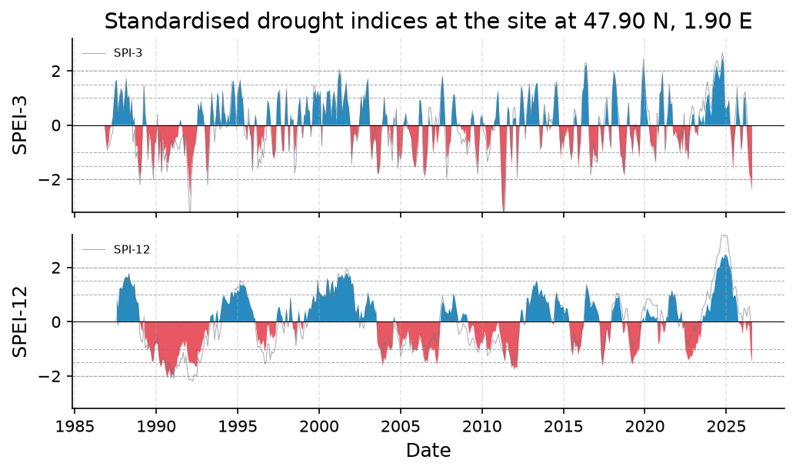
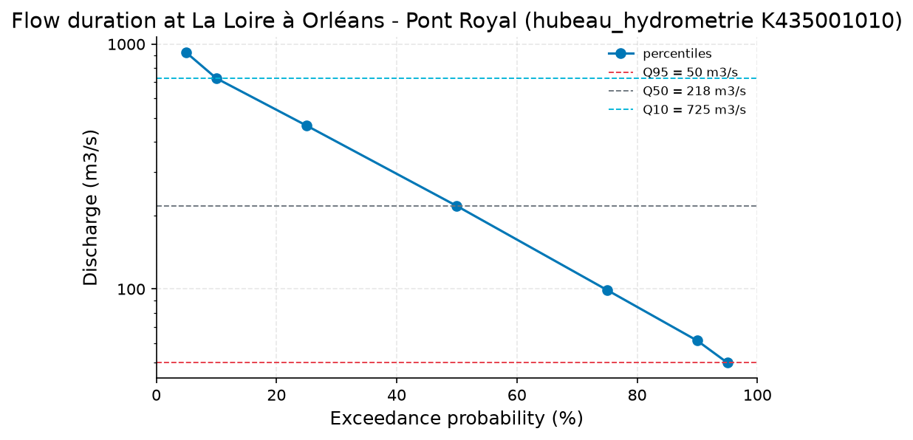
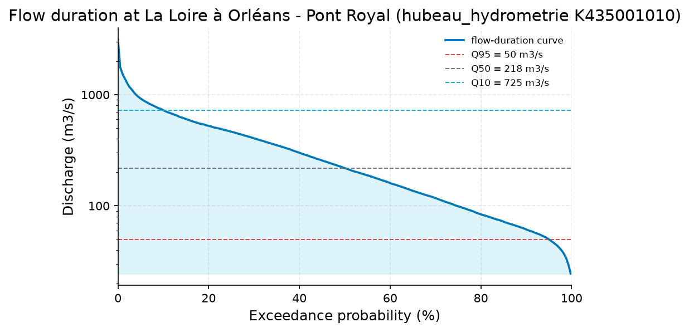

# Hydrological Drought Status of the Loire at Orleans (Hub'Eau K435001010)

**Author:** AquaScope Studio  
**Date:** 2026-09-07  
**Description:** determine whether the Loire at Orleans is currently in hydrological drought and how closely its low-flow behavior tracks the rainfall deficit, to support a water-supply management response  
**Data Sources:** BasinATLAS (HydroATLAS v1.0), ERA5 via Open-Meteo, hubeau_hydrometrie, similar_basins  
**Version:** 1.0  

**Site:** 47.9000 N, 1.9000 E

**Answer.** The Loire at Orleans (Hub'Eau K435001010, La Loire a Orleans - Pont Royal, 62.0 years of daily discharge) is currently in low-flow drought: the last 30 days averaged 27.6 m3/s and the last 90 days 31.9 m3/s, both below the record's Q95 of 50.0 m3/s and close to the 7Q10 low-flow benchmark of 29.5 m3/s (Weibull plotting position, Smakhtin 2001). This tracks an extremely dry meteorological signal at the ERA5 grid cell nearest 47.9N, 1.9E: SPEI-3 of -2.46 (extremely dry class) and SPEI-12 of -1.53 (severely dry class) as of 2026-08-01. A numeric recurrence interval for the current low flow could not be produced: the low-flow frequency step failed its return-period gate and its low_flow_context fallback failed its own minimum-record-length check, so only the existing 7Q10 value stands.

*Key numbers*

| Quantity | Value | Unit | Step |
| --- | --- | --- | --- |
| SPI at 3 months, 2026-08-01 | -1.928 |  | s1 |
| SPEI at 3 months, 2026-08-01 | -2.458 |  | s1 |
| ERA5 temperature trend | 0.3454 | C per decade | s1 |
| Q95 | 50.0 | m3/s | s4.fallback |
| Q50 | 218.2 | m3/s | s4.fallback |
| 7Q10 | 29.53 | m3/s | s4.fallback |
| Baseflow index | 0.7923 |  | s4.fallback |
| Record length | 62.0 | years | s4 |
| Mean of the record | 328.6 | m3/s | s4 |
| 100-year return level, GEV (L-moments) | 3470.0 | m3/s | s4 |
| 100-year return level, Log-Pearson III | 3523.0 | m3/s | s4 |
| 100-year LP3 90 % interval, low | 3052.0 | m3/s | s4 |
| 100-year LP3 90 % interval, high | 4068.0 | m3/s | s4 |
| Q95 (exceeded 95 % of days) | 50.0 | m3/s | s4 |
| Q50 (median flow) | 218.2 | m3/s | s4 |
| Q10 | 725.0 | m3/s | s4 |
| Mann-Kendall p-value (annual mean) | 0.0007 |  | s4 |
| Sen's slope | -2.701 | m3/s per year | s4 |

## Summary

The gauge record at K435001010 (La Loire a Orleans - Pont Royal, 62.0 years) shows the river running well below its historical low-flow reference: last-30-day mean discharge 27.6 m3/s and last-90-day mean 31.9 m3/s, both under the Q95 of 50.0 m3/s and near the 7Q10 of 29.5 m3/s. The baseflow index is 0.79, indicating a groundwater-buffered system. The ERA5-derived SPEI at the nearest grid cell is -2.46 at 3 months (extremely dry) and -1.53 at 12 months (severely dry) on 2026-08-01, while SPI-12 reads -0.33 (normal), showing the deficit is chiefly an evaporative-demand signal rather than a pure rainfall shortfall. The annual-mean discharge series shows a statistically significant decline (Mann-Kendall p=0.0007, Sen's slope -2.70 m3/s/year over 58 years). No cause is established for either trend; the low-flow frequency (recurrence interval) step did not complete, so the severity of the event cannot be expressed as a return period beyond the 7Q10 statistic.

## Problem and decision

The client asks whether the Loire at Orleans is presently in hydrological drought and how closely its low-flow behaviour follows the rainfall deficit, to support a water-supply management decision. This requires classifying current meteorological drought severity at 3- and 12-month accumulations, placing recent discharge within its historical low-flow distribution (Q95/Q50/Q10, baseflow index), expressing the current low flow as a recurrence interval, and describing qualitatively how the streamflow drought tracks the precipitation deficit, given that no on-site rain gauge or groundwater record exists to support a quantitative lag analysis.

## Site and data

The primary hydrometric record is Hub'Eau station K435001010, La Loire a Orleans - Pont Royal, 0.4 km from the site, with 62.0 years of daily-resolution (assumed) discharge from 1964-09-07 to 2026-09-06 (21,840 days). No on-site precipitation gauge exists; meteorological indices are computed from the ERA5 reanalysis grid cell (about 9 km resolution) nearest 47.9N, 1.9E, covering 1986-08-31 to 2026-08-31 (14,611 days, elevation 110.0 m). Other nearby hydrometric stations (K435001020, K439000101, K437311001, K441409001, K473000101) exist in the catalogue but were not queried by any step in this study.

## Methodology

SPEI and SPI at 3- and 12-month accumulation were computed from ERA5 precipitation and Thornthwaite (1948) potential evapotranspiration for the grid cell nearest the site (drought_indices, 40 years, 1986-2026). Low-flow context (Q95/Q50/Q10, baseflow index via the Lyne-Hollick filter, 7Q10) was computed at K435001010 over 62.0 years (low_flow_context). The full flow duration curve and a Mann-Kendall trend test on annual means were computed at the same gauge (analyze_station). A further analyze_station call was intended to yield a low-flow frequency return period, but its return-period gate could not be evaluated and its low_flow_context fallback lacked the record-length field needed to pass its own gate, so it did not complete. SGI-based lag analysis was not attempted, as no groundwater record exists at the site; the comparison of SPEI timing against the low-flow episode is therefore qualitative only.

## Results: step s1

ERA5-derived indices for the grid cell near 47.9N, 1.9E (drought_indices, 1986-2026, 40 years) show, as of 2026-08-01: SPI-3 = -1.928 (severely dry) and SPEI-3 = -2.458 (extremely dry); SPI-12 = -0.335 (normal) and SPEI-12 = -1.526 (severely dry). The SPEI-SPI divergence at 3 months is -0.530 (mean over the last 10 years -0.210), with SPEI drier than SPI in 74.2% of months; at 12 months the divergence is -1.192 (10-year mean -0.370), drier in 87.5% of months, both series otherwise correlated above 0.93. Overall status is classed 'extremely_dry' and 'in_drought' is true. Annual mean ERA5 temperature for the cell is 11.89 degrees C with a significant warming trend of 0.345 degrees C per decade (p=0.00077, 39 years), consistent with growing evaporative demand widening the SPEI-SPI gap; no causal claim is made.


*SPEI (bars) with SPI (grey line) at the site at 47.90 N, 1.90 E for the 3, 12 month accumulations, 1986 to 2026: blue above zero is wetter than normal, red below is drier; the dashed lines mark the moderate (1), severe (1.5) and extreme (2) classes.*


*SPEI (bars) with SPI (grey line) at the site at 47.90 N, 1.90 E for the 3, 12 month accumulations, 1986 to 2026: blue above zero is wetter than normal, red below is drier; the dashed lines mark the moderate (1), severe (1.5) and extreme (2) classes.*

*Monthly SPI and SPEI at the site at 47.90 N, 1.90 E per timescale.*

| date | spi_3 | spei_3 | spi_12 | spei_12 |
| --- | --- | --- | --- | --- |
| 1986-11-01 | -0.0267316835951091 | 0.1321634841320768 |  |  |
| 1986-12-01 | -0.3710771935294534 | -0.5568326103238118 |  |  |
| 1987-01-01 | -0.926888564191818 | -0.8653956927398042 |  |  |
| 1987-02-01 | -0.8040040197343553 | -0.6482821205605706 |  |  |
| 1987-03-01 | -0.7087925408389752 | -0.1505408794299235 |  |  |
| 1987-04-01 | -0.3732587453578881 | -0.0123980874920312 |  |  |
| 1987-05-01 | -0.2921715994866773 | 0.2827455499726391 |  |  |
| 1987-06-01 | 0.5259283219006221 | 1.0106594655241854 |  |  |
| 1987-07-01 | 1.3327821760505452 | 1.5950272385509656 |  |  |
| 1987-08-01 | 1.4342796062475467 | 1.6781726771043153 | 0.1293048026247019 | 0.8907501701671278 |
| 1987-09-01 | 0.3732577424916009 | 0.44244037686172 | -0.1375839300077677 | 0.5238078668347234 |
| 1987-10-01 | 1.057510799888823 | 1.046903004568784 | 0.6000659380720123 | 1.2047825353914137 |
| 1987-11-01 | 1.337837159584348 | 1.232258908325372 | 0.708059214532938 | 1.2697507244958026 |
| 1987-12-01 | 1.1957270259796091 | 1.3264880996032211 | 0.55620362551345 | 1.20692403894305 |
| 1988-01-01 | 0.5371219194368707 | 0.4838583875273344 | 1.1087737375373168 | 1.4887534530629485 |
| 1988-02-01 | 1.0505063276663835 | 1.1704002071784383 | 1.3706433915887533 | 1.630426448352567 |
| 1988-03-01 | 1.7156469460364356 | 1.719540691467504 | 1.5340943223655257 | 1.6566057289370435 |
| 1988-04-01 | 0.8438925588331174 | 0.9687494787231706 | 1.4233491748406903 | 1.615751792581086 |
| 1988-05-01 | 1.0462047042362783 | 1.135037643651934 | 1.772455106168419 | 1.7870258936832646 |
| 1988-06-01 | 0.2344964758286998 | 0.337901684803235 | 1.4036010809452042 | 1.522690697046206 |
| 1988-07-01 | 0.7801405356252279 | 1.0493016906012795 | 1.1603083126048874 | 1.369156146262461 |
| 1988-08-01 | -0.6540517560357572 | 0.1277293692217294 | 1.1082441568587087 | 1.281132227390197 |
| 1988-09-01 | -0.1573649203124107 | 0.3073188931281019 | 1.223041577578618 | 1.4357768888802904 |
| 1988-10-01 | -1.2051710697188005 | -0.8078647009113492 | 0.4609357822799504 | 0.8808175576529158 |
| 1988-11-01 | -0.9788998503902784 | -0.7476470491813931 | 0.3011779222937782 | 0.7171202161434683 |
| 1988-12-01 | -1.527988968423621 | -1.4977740536828927 | 0.321266803931488 | 0.6854391111725238 |
| 1989-01-01 | -2.195088079314246 | -1.9402646764687423 | -0.4905831405478422 | -0.0030905522523707 |
| 1989-02-01 | -1.3040983160612138 | -1.665121876095641 | -0.7199661741216465 | -0.2642763703652429 |
| 1989-03-01 | -0.2015653899017308 | -0.4585033526799353 | -0.7458688999534682 | -0.3796131999182339 |
| 1989-04-01 | 1.460404141046685 | 1.4725887451579354 | -0.1418602890277162 | 0.2785230544362764 |
| 1989-05-01 | 0.4492282550322505 | 0.3293156225466735 | -0.9781483335533632 | -0.6678504138616265 |
| 1989-06-01 | -0.0672167700406051 | -0.0892112266283561 | -0.8571152674068353 | -0.6055392912087175 |
| 1989-07-01 | -1.2710789486913074 | -1.1441194931740966 | -1.043849173812094 | -0.9808514019107945 |
| 1989-08-01 | -0.4432085465056094 | -0.306214882333814 | -0.9056198104767732 | -0.873703629679407 |
| 1989-09-01 | -0.4877578646905735 | -0.5547060315742675 | -1.012065319247115 | -1.112716522406251 |
| 1989-10-01 | -1.3984836567835437 | -1.2587880754323493 | -1.264877647056602 | -1.4648879660640746 |
| 1989-11-01 | -2.0144964200600506 | -1.722222206848061 | -1.3754042822145294 | -1.4731501754990994 |
| 1989-12-01 | -0.613430928781298 | -0.7042164130980686 | -0.8017192815039726 | -0.89398892277101 |
| 1990-01-01 | -0.4832689172396366 | -0.6035027135221427 | -0.673057343686874 | -0.8015376342760633 |
| 1990-02-01 | 0.3874287544661144 | 0.050150142860292 | -0.6019067890583334 | -0.8289024748086516 |
| 1990-03-01 | -1.1305941302102491 | -1.5578279933053107 | -1.1013324586707935 | -1.3043169082342814 |
| 1990-04-01 | -0.282345852374161 | -0.5378819821582943 | -1.4582274064127942 | -1.6141340201443617 |
| 1990-05-01 | -1.7221032701681027 | -1.857495703552292 | -1.4358540037393777 | -1.6336616787824574 |
| 1990-06-01 | -0.6352952858546553 | -0.4915285144083595 | -1.3208894496489123 | -1.3885035233572889 |
| 1990-07-01 | -1.3174751824450197 | -0.9789895979561158 | -1.4192198438329255 | -1.4534156900283255 |
| 1990-08-01 | -1.009612371114353 | -0.7703466928332927 | -1.6984422817590656 | -1.7882002006418904 |
| 1990-09-01 | -1.7202848047810877 | -1.372215952075162 | -1.821506916560164 | -2.0857593677819017 |
| 1990-10-01 | -1.207834709391784 | -1.3980740814345354 | -1.546900043663873 | -1.8986864459788164 |
| 1990-11-01 | -1.0545374661652045 | -1.0808247514088043 | -1.5304528530938186 | -1.761452419049899 |
| 1990-12-01 | -0.5689660661472568 | -0.6470567849583905 | -2.078764809884128 | -2.0731520441446993 |

*Drought classes, worst months and event counts per timescale at the site at 47.90 N, 1.90 E.*

| timescale | index | current | class | date | worst | worst_date | events | n |
| --- | --- | --- | --- | --- | --- | --- | --- | --- |
| 3 | SPI | -1.927686126263764 | severely_dry | 2026-08-01 | -3.667768809876612 | 1992-02-01 | 39 | 478 |
| 3 | SPEI | -2.457828743815045 | extremely_dry | 2026-08-01 | -3.420693304410115 | 2011-05-01 | 42 | 478 |
| 12 | SPI | -0.3345875793478816 | normal | 2026-08-01 | -2.199432570528178 | 1992-04-01 | 16 | 469 |
| 12 | SPEI | -1.5264712276622787 | severely_dry | 2026-08-01 | -2.0857593677819017 | 1990-09-01 | 24 | 469 |

*Divergence between SPEI and SPI per timescale at the site at 47.90 N, 1.90 E.*

| timescale | current | mean_last_10y | months_spei_drier_pct | correlation | n |
| --- | --- | --- | --- | --- | --- |
| 3 | -0.5301426175512809 | -0.2097633727453818 | 74.16666666666667 | 0.9549305141988652 | 478 |
| 12 | -1.191883648314397 | -0.3701520707306372 | 87.5 | 0.9340744152293172 | 469 |

## Results: step s2

At K435001010 (La Loire a Orleans - Pont Royal, 62.0 years, low_flow_context), the flow duration curve gives Q95 = 50.0 m3/s, Q90 = 61.5 m3/s, Q75 = 99.0 m3/s, Q50 = 218.22 m3/s, Q25 = 464.8 m3/s, Q10 = 725.0 m3/s, and Q05 = 923.3 m3/s, against a record mean of 328.55 m3/s (min 17.7, max 3126.14 m3/s). The baseflow index (Lyne-Hollick filter) is 0.792. The 10-year 7-day low flow (7Q10) is 29.53 m3/s. The last 30 days averaged 27.65 m3/s, at the 99.52th exceedance percentile (i.e., historically exceeded only about 0.5% of the time); the last 90 days averaged 31.89 m3/s, at the 99.01th exceedance percentile, both placing current conditions in the extreme low tail of the historical distribution.


*Flow-duration curve of discharge at La Loire à Orléans - Pont Royal (hubeau_hydrometrie K435001010) from the 7 percentiles the tool reported, with Q95, Q50 and Q10 marked (log scale).*


*Flow-duration curve of discharge at La Loire à Orléans - Pont Royal (hubeau_hydrometrie K435001010) from the 7 percentiles the tool reported, with Q95, Q50 and Q10 marked (log scale).*

*Low-flow statistics at La Loire à Orléans - Pont Royal (hubeau_hydrometrie K435001010).*

| item | value |
| --- | --- |
| source | hubeau_hydrometrie |
| station_id | K435001010 |
| variable | discharge |
| unit | m3/s |
| start | 1964-09-07 |
| end | 2026-09-06 |
| years | 62.0 |
| fetch_note | Hub'Eau elaborated daily mean discharge (obs_elab QmnJ); last 62 years requested (from 1964-09-07). |
| stats.mean | 328.54996327838825 |
| stats.min | 17.7 |
| stats.max | 3126.138 |
| n_days | 21840 |
| bfi | 0.7922833235792167 |
| low_flow.7q10 | 29.53327142857152 |
| low_flow.text | minimum 7-day mean flow with a 10-year return period (Weibull) |
| recent.end | 2026-09-06 |
| recent.last_30d_mean | 27.646399999999996 |
| recent.last_30d_exceedance_pct | 99.52380952380952 |
| recent.last_90d_mean | 31.89483333333333 |
| recent.last_90d_exceedance_pct | 99.01098901098902 |
| station_name | La Loire à Orléans - Pont Royal |
| name | La Loire à Orléans - Pont Royal |
| fdc.q05 | 923.347 |
| fdc.q10 | 725.0 |
| fdc.q25 | 464.796 |
| fdc.q50 | 218.22 |
| fdc.q75 | 99.0 |
| fdc.q90 | 61.5 |
| fdc.q95 | 50.0 |
| stats.mean | 328.54996327838825 |
| stats.min | 17.7 |
| stats.max | 3126.138 |
| low_flow.7q10 | 29.53327142857152 |
| low_flow.text | minimum 7-day mean flow with a 10-year return period (Weibull) |
| recent.end | 2026-09-06 |
| recent.last_30d_mean | 27.646399999999996 |
| recent.last_30d_exceedance_pct | 99.52380952380952 |
| recent.last_90d_mean | 31.89483333333333 |
| recent.last_90d_exceedance_pct | 99.01098901098902 |

## Results: step s3

The full-record flow duration curve at K435001010 (analyze_station, 62.0 years, 21,840 days) reproduces Q95 = 50.0 m3/s, Q50 = 218.22 m3/s and Q10 = 725.0 m3/s, with a record mean of 328.55 m3/s. A Mann-Kendall trend test on annual mean discharge (58 years) finds a significant decreasing trend (tau = -0.3055, p = 0.0007), with a Sen's slope of -2.70 m3/s per year. The same call also produced a flood (annual-maximum) frequency analysis, not a low-flow statistic: the 100-year return level is 3470.2 m3/s by GEV (L-moments) and 3523.5 m3/s by Log-Pearson III, with a 90% Log-Pearson III interval of 3051.5 to 4068.4 m3/s. These high-flow figures do not bear directly on the drought question but are reported as the tool's actual output.


*Flow-duration curve of discharge at La Loire à Orléans - Pont Royal (hubeau_hydrometrie K435001010) from the ranked daily flows, with Q95, Q50 and Q10 marked (log scale).*


*Flow-duration curve of discharge at La Loire à Orléans - Pont Royal (hubeau_hydrometrie K435001010) from the ranked daily flows, with Q95, Q50 and Q10 marked (log scale).*

*The record at La Loire à Orléans - Pont Royal (hubeau_hydrometrie K435001010) (datetime, value).*

| datetime | value |
| --- | --- |
| 1964-09-07 | 29.5 |
| 1964-09-08 | 28.5 |
| 1964-09-09 | 28.5 |
| 1964-09-10 | 29.5 |
| 1964-09-11 | 28.5 |
| 1964-09-12 | 30.5 |
| 1964-09-13 | 33.8 |
| 1964-09-14 | 33.8 |
| 1964-09-15 | 33.8 |
| 1964-09-16 | 32.7 |
| 1964-09-17 | 32.7 |
| 1964-09-18 | 37.1 |
| 1964-09-19 | 34.9 |
| 1964-09-20 | 32.7 |
| 1964-09-21 | 31.6 |
| 1964-09-22 | 31.6 |
| 1964-09-23 | 31.6 |
| 1964-09-24 | 33.8 |
| 1964-09-25 | 34.9 |
| 1964-09-26 | 34.9 |
| 1964-09-27 | 32.7 |
| 1964-09-28 | 33.8 |
| 1964-09-29 | 33.8 |
| 1964-09-30 | 32.7 |
| 1964-10-01 | 32.7 |
| 1964-10-02 | 31.6 |
| 1964-10-03 | 31.6 |
| 1964-10-04 | 31.6 |
| 1964-10-05 | 31.6 |
| 1964-10-06 | 30.5 |
| 1964-10-07 | 30.5 |
| 1964-10-08 | 37.1 |
| 1964-10-09 | 43.7 |
| 1964-10-10 | 47.0 |
| 1964-10-11 | 49.5 |
| 1964-10-12 | 54.0 |
| 1964-10-13 | 56.5 |
| 1964-10-14 | 61.5 |
| 1964-10-15 | 72.5 |
| 1964-10-16 | 81.5 |
| 1964-10-17 | 76.0 |
| 1964-10-18 | 79.0 |
| 1964-10-19 | 75.0 |
| 1964-10-20 | 71.0 |
| 1964-10-21 | 71.0 |
| 1964-10-22 | 71.0 |
| 1964-10-23 | 71.0 |
| 1964-10-24 | 67.5 |
| 1964-10-25 | 65.0 |
| 1964-10-26 | 64.0 |

*Summary of the record at La Loire à Orléans - Pont Royal (hubeau_hydrometrie K435001010).*

| item | value |
| --- | --- |
| source | hubeau_hydrometrie |
| station_id | K435001010 |
| variable | discharge |
| unit | m3/s |
| n | 21840 |
| start | 1964-09-07 |
| end | 2026-09-06 |
| years | 62.0 |
| stats.mean | 328.55 |
| stats.median | 218.2545 |
| stats.min | 17.7 |
| stats.max | 3126.138 |

*Annual maxima at La Loire à Orléans - Pont Royal (hubeau_hydrometrie K435001010).*

| year | value |
| --- | --- |
| 1965 | 1580.0 |
| 1966 | 1690.0 |
| 1967 | 1090.0 |
| 1968 | 2810.0 |
| 1969 | 1720.0 |
| 1970 | 2130.0 |
| 1971 | 1280.0 |
| 1972 | 1170.0 |
| 1973 | 1870.0 |
| 1974 | 1450.0 |
| 1975 | 1150.0 |
| 1976 | 2440.0 |
| 1977 | 2630.0 |
| 1978 | 2230.0 |
| 1979 | 1570.0 |
| 1980 | 1740.0 |
| 1981 | 2680.0 |
| 1982 | 3030.0 |
| 1983 | 2830.0 |
| 1984 | 1450.0 |
| 1985 | 2360.0 |
| 1986 | 2150.0 |
| 1987 | 1060.0 |
| 1988 | 2690.0 |
| 1989 | 1920.0 |
| 1990 | 1830.0 |
| 1991 | 800.0 |
| 1992 | 2040.0 |
| 1993 | 1110.0 |
| 1994 | 2131.107 |
| 1995 | 1716.361 |
| 1996 | 1742.035 |
| 2000 | 1720.0 |
| 2001 | 2253.639 |
| 2002 | 1494.333 |
| 2003 | 3126.138 |
| 2004 | 1839.86 |
| 2005 | 1805.392 |
| 2006 | 1177.013 |
| 2007 | 1474.822 |
| 2008 | 2077.005 |
| 2009 | 1088.137 |
| 2010 | 1506.471 |
| 2011 | 803.154 |
| 2012 | 1320.122 |
| 2013 | 1968.024 |
| 2014 | 1319.322 |
| 2015 | 1067.095 |
| 2016 | 1649.365 |
| 2017 | 965.296 |

*Return levels at La Loire à Orléans - Pont Royal (hubeau_hydrometrie K435001010) by return period, with the confidence band.*

| T | GEV | LP3 | lower | upper |
| --- | --- | --- | --- | --- |
| 2.0 | 1626.9112 | 1618.7612 | 1500.0413 | 1746.8771 |
| 5.0 | 2168.2642 | 2159.1201 | 1975.6108 | 2359.6752 |
| 10.0 | 2506.5075 | 2502.4007 | 2258.4808 | 2772.6643 |
| 25.0 | 2912.185 | 2922.1847 | 2591.5355 | 3295.021 |
| 50.0 | 3198.2426 | 3226.1147 | 2826.1681 | 3682.6599 |
| 100.0 | 3470.2286 | 3523.4977 | 3051.5463 | 4068.441 |

*Flow-duration percentiles at La Loire à Orléans - Pont Royal (hubeau_hydrometrie K435001010).*

| exceedance_pct | value |
| --- | --- |
| 10.0 | 725.0 |
| 50.0 | 218.22 |
| 95.0 | 50.0 |

*Mann-Kendall trend test and Sen slope at La Loire à Orléans - Pont Royal (hubeau_hydrometrie K435001010).*

| item | value |
| --- | --- |
| on | annual mean |
| p_value | 0.0007 |
| tau | -0.3055 |
| trend | decreasing |
| sens_slope_per_year | -2.7006 |
| n_years | 58 |

## Results: step s4

The step intended to express the current low flow as a recurrence interval (analyze_station, K435001010) did not pass its gate: the check 'max_return_period_factor' could not be evaluated because the gate names no return_period value to test against. Its fallback, a repeat low_flow_context call, itself failed its 'min_years' gate ('no record length at years'), so no new low-flow return period was produced. The only low-flow-frequency figure available is the 7Q10 of 29.53 m3/s already reported under step s2; no quantitative recurrence interval (e.g., a 10- or 20-year low-flow return period matched to the current 27.6-31.9 m3/s flows) is established by this study.


*Flow-duration curve of discharge at La Loire à Orléans - Pont Royal (hubeau_hydrometrie K435001010) from the ranked daily flows, with Q95, Q50 and Q10 marked (log scale).*


*Flow-duration curve of discharge at La Loire à Orléans - Pont Royal (hubeau_hydrometrie K435001010) from the ranked daily flows, with Q95, Q50 and Q10 marked (log scale).*


*Flow-duration curve of discharge at La Loire à Orléans - Pont Royal (hubeau_hydrometrie K435001010) from the 7 percentiles the tool reported, with Q95, Q50 and Q10 marked (log scale).*


*Flow-duration curve of discharge at La Loire à Orléans - Pont Royal (hubeau_hydrometrie K435001010) from the 7 percentiles the tool reported, with Q95, Q50 and Q10 marked (log scale).*

*The record at La Loire à Orléans - Pont Royal (hubeau_hydrometrie K435001010) (datetime, value).*

| datetime | value |
| --- | --- |
| 1964-09-07 | 29.5 |
| 1964-09-08 | 28.5 |
| 1964-09-09 | 28.5 |
| 1964-09-10 | 29.5 |
| 1964-09-11 | 28.5 |
| 1964-09-12 | 30.5 |
| 1964-09-13 | 33.8 |
| 1964-09-14 | 33.8 |
| 1964-09-15 | 33.8 |
| 1964-09-16 | 32.7 |
| 1964-09-17 | 32.7 |
| 1964-09-18 | 37.1 |
| 1964-09-19 | 34.9 |
| 1964-09-20 | 32.7 |
| 1964-09-21 | 31.6 |
| 1964-09-22 | 31.6 |
| 1964-09-23 | 31.6 |
| 1964-09-24 | 33.8 |
| 1964-09-25 | 34.9 |
| 1964-09-26 | 34.9 |
| 1964-09-27 | 32.7 |
| 1964-09-28 | 33.8 |
| 1964-09-29 | 33.8 |
| 1964-09-30 | 32.7 |
| 1964-10-01 | 32.7 |
| 1964-10-02 | 31.6 |
| 1964-10-03 | 31.6 |
| 1964-10-04 | 31.6 |
| 1964-10-05 | 31.6 |
| 1964-10-06 | 30.5 |
| 1964-10-07 | 30.5 |
| 1964-10-08 | 37.1 |
| 1964-10-09 | 43.7 |
| 1964-10-10 | 47.0 |
| 1964-10-11 | 49.5 |
| 1964-10-12 | 54.0 |
| 1964-10-13 | 56.5 |
| 1964-10-14 | 61.5 |
| 1964-10-15 | 72.5 |
| 1964-10-16 | 81.5 |
| 1964-10-17 | 76.0 |
| 1964-10-18 | 79.0 |
| 1964-10-19 | 75.0 |
| 1964-10-20 | 71.0 |
| 1964-10-21 | 71.0 |
| 1964-10-22 | 71.0 |
| 1964-10-23 | 71.0 |
| 1964-10-24 | 67.5 |
| 1964-10-25 | 65.0 |
| 1964-10-26 | 64.0 |

*Summary of the record at La Loire à Orléans - Pont Royal (hubeau_hydrometrie K435001010).*

| item | value |
| --- | --- |
| source | hubeau_hydrometrie |
| station_id | K435001010 |
| variable | discharge |
| unit | m3/s |
| n | 21840 |
| start | 1964-09-07 |
| end | 2026-09-06 |
| years | 62.0 |
| stats.mean | 328.55 |
| stats.median | 218.2545 |
| stats.min | 17.7 |
| stats.max | 3126.138 |

*Annual maxima at La Loire à Orléans - Pont Royal (hubeau_hydrometrie K435001010).*

| year | value |
| --- | --- |
| 1965 | 1580.0 |
| 1966 | 1690.0 |
| 1967 | 1090.0 |
| 1968 | 2810.0 |
| 1969 | 1720.0 |
| 1970 | 2130.0 |
| 1971 | 1280.0 |
| 1972 | 1170.0 |
| 1973 | 1870.0 |
| 1974 | 1450.0 |
| 1975 | 1150.0 |
| 1976 | 2440.0 |
| 1977 | 2630.0 |
| 1978 | 2230.0 |
| 1979 | 1570.0 |
| 1980 | 1740.0 |
| 1981 | 2680.0 |
| 1982 | 3030.0 |
| 1983 | 2830.0 |
| 1984 | 1450.0 |
| 1985 | 2360.0 |
| 1986 | 2150.0 |
| 1987 | 1060.0 |
| 1988 | 2690.0 |
| 1989 | 1920.0 |
| 1990 | 1830.0 |
| 1991 | 800.0 |
| 1992 | 2040.0 |
| 1993 | 1110.0 |
| 1994 | 2131.107 |
| 1995 | 1716.361 |
| 1996 | 1742.035 |
| 2000 | 1720.0 |
| 2001 | 2253.639 |
| 2002 | 1494.333 |
| 2003 | 3126.138 |
| 2004 | 1839.86 |
| 2005 | 1805.392 |
| 2006 | 1177.013 |
| 2007 | 1474.822 |
| 2008 | 2077.005 |
| 2009 | 1088.137 |
| 2010 | 1506.471 |
| 2011 | 803.154 |
| 2012 | 1320.122 |
| 2013 | 1968.024 |
| 2014 | 1319.322 |
| 2015 | 1067.095 |
| 2016 | 1649.365 |
| 2017 | 965.296 |

*Return levels at La Loire à Orléans - Pont Royal (hubeau_hydrometrie K435001010) by return period, with the confidence band.*

| T | GEV | LP3 | lower | upper |
| --- | --- | --- | --- | --- |
| 2.0 | 1626.9112 | 1618.7612 | 1500.0413 | 1746.8771 |
| 5.0 | 2168.2642 | 2159.1201 | 1975.6108 | 2359.6752 |
| 10.0 | 2506.5075 | 2502.4007 | 2258.4808 | 2772.6643 |
| 25.0 | 2912.185 | 2922.1847 | 2591.5355 | 3295.021 |
| 50.0 | 3198.2426 | 3226.1147 | 2826.1681 | 3682.6599 |
| 100.0 | 3470.2286 | 3523.4977 | 3051.5463 | 4068.441 |

*Flow-duration percentiles at La Loire à Orléans - Pont Royal (hubeau_hydrometrie K435001010).*

| exceedance_pct | value |
| --- | --- |
| 10.0 | 725.0 |
| 50.0 | 218.22 |
| 95.0 | 50.0 |

*Mann-Kendall trend test and Sen slope at La Loire à Orléans - Pont Royal (hubeau_hydrometrie K435001010).*

| item | value |
| --- | --- |
| on | annual mean |
| p_value | 0.0007 |
| tau | -0.3055 |
| trend | decreasing |
| sens_slope_per_year | -2.7006 |
| n_years | 58 |

*Low-flow statistics at La Loire à Orléans - Pont Royal (hubeau_hydrometrie K435001010).*

| item | value |
| --- | --- |
| source | hubeau_hydrometrie |
| station_id | K435001010 |
| variable | discharge |
| unit | m3/s |
| start | 1964-09-07 |
| end | 2026-09-06 |
| years | 62.0 |
| fetch_note | Hub'Eau elaborated daily mean discharge (obs_elab QmnJ); last 62 years requested (from 1964-09-07). |
| stats.mean | 328.54996327838825 |
| stats.min | 17.7 |
| stats.max | 3126.138 |
| n_days | 21840 |
| bfi | 0.7922833235792167 |
| low_flow.7q10 | 29.53327142857152 |
| low_flow.text | minimum 7-day mean flow with a 10-year return period (Weibull) |
| recent.end | 2026-09-06 |
| recent.last_30d_mean | 27.646399999999996 |
| recent.last_30d_exceedance_pct | 99.52380952380952 |
| recent.last_90d_mean | 31.89483333333333 |
| recent.last_90d_exceedance_pct | 99.01098901098902 |
| station_name | La Loire à Orléans - Pont Royal |
| name | La Loire à Orléans - Pont Royal |
| fdc.q05 | 923.347 |
| fdc.q10 | 725.0 |
| fdc.q25 | 464.796 |
| fdc.q50 | 218.22 |
| fdc.q75 | 99.0 |
| fdc.q90 | 61.5 |
| fdc.q95 | 50.0 |
| stats.mean | 328.54996327838825 |
| stats.min | 17.7 |
| stats.max | 3126.138 |
| low_flow.7q10 | 29.53327142857152 |
| low_flow.text | minimum 7-day mean flow with a 10-year return period (Weibull) |
| recent.end | 2026-09-06 |
| recent.last_30d_mean | 27.646399999999996 |
| recent.last_30d_exceedance_pct | 99.52380952380952 |
| recent.last_90d_mean | 31.89483333333333 |
| recent.last_90d_exceedance_pct | 99.01098901098902 |

## Limitations and what this study does not establish

The SPEI/SPI indices are monthly and describe the ERA5 grid cell (about 9 km), a reanalysis climate proxy, not a rain gauge; no on-site precipitation station exists. They cannot detect a flash drought and say nothing about cause. SPEI's Thornthwaite PET is a temperature-only approximation; FAO-56 Penman-Monteith would be preferable given humidity, wind and radiation data, which were not used here. The planned BasinATLAS description of upstream dams and catchment area, meant to flag regulation as a confound, was not run as a step and so no dam count or catchment figure can be quoted. No lag statistic between the SPEI deficit and the streamflow drought was computed, since the only propagation tool in the catalogue targets SGI, not defensible without a groundwater record; the timing match described is qualitative. The low-flow frequency (recurrence interval) analysis failed its gate and its fallback failed a separate gate, so no return period beyond the 7Q10 value is established for the current low flow.

## What this study does not establish

- Step s4, gate max_return_period_factor: the gate names no return_period
- Step s4.fallback, gate min_years: no record length at 'years'
- The study stopped at s4: gate failed: max_return_period_factor (the gate names no return_period); the fallback low_flow_context did not pass its own gates
- These numbers are not in any tool result: -12.0, -30.0, -90.0, -12.0, -12.0, -12.0.

## Caveats

- Monthly resolution: the indices see droughts a month and longer; what happened this week is not in them, and a flash drought is out of their reach.
- SPI and SPEI say how unusual a deficit is against this record; they say nothing about its cause, and the SPI-to-SGI lag is a statistical association read off the two series, not a model of the aquifer.
- SPEI needs a PET series: here PET is Thornthwaite (1948) from ERA5 temperature, a temperature-only approximation and the formulation SPEI was introduced with; FAO-56 Penman-Monteith is the better PET where humidity, wind and radiation exist.
- No rain gauge within reach: the indices describe the ERA5 cell (about 9 km), a reanalysis climate, not a gauge; a gauge record with twenty years is what turns this into a station answer.

## Recommendations

Treat the Loire at Orleans as being in an active, severe low-flow episode: 30- and 90-day discharge (27.6 and 31.9 m3/s) sit below the historical Q95 (50.0 m3/s, K435001010, 62.0 years) and near the 7Q10 benchmark (29.5 m3/s), warranting a water-supply drought response now rather than a wait-and-see posture. Because SPEI-12 is severely dry (-1.53) while SPI-12 is normal (-0.33), a divergence of -1.19 with SPEI drier than SPI in 87.5% of months over the record, the deficit is likely intensified by evaporative demand as well as rainfall shortage; this should be communicated as an association, not a causal statement. Commission the missing BasinATLAS catchment description to quantify upstream dam regulation before drawing firm rainfall-to-flow conclusions. If a defensible low-flow recurrence interval is required for permitting or allocation decisions, re-run the low-flow frequency analysis with a corrected return-period gate, since the current attempt and its fallback both failed on gate/metadata issues. Installing a local rain gauge (20+ years) and a groundwater level record would allow a station-based SPI and a defensible SGI-lag analysis in future assessments.

## References

1. Vicente-Serrano et al. (2010)
2. Hersbach, H. et al. (2020). The ERA5 global reanalysis. Q. J. R. Meteorol. Soc., 146, 1999-2049
3. Lyne, V., & Hollick, M. (1979). Stochastic time-variable rainfall-runoff modelling. Inst. Eng. Aust. Natl. Conf. Publ. 79/10, 89-93.
4. Eckhardt (2005)
5. Vogel, R. M., & Fennessey, N. M. (1994). Flow-duration curves I: new interpretation and confidence intervals. J. Water Resour. Plann. Manage., 120(4), 485-504.
6. McKee, T. B., Doesken, N. J., & Kleist, J. (1993). The relationship of drought frequency and duration to time scales. Proc. 8th Conf. on Applied Climatology, 179-184.
7. WMO (2012). Standardized Precipitation Index User Guide (Svoboda, Hayes, Wood). WMO-No. 1090.
8. Vicente-Serrano, S. M., Begueria, S., & Lopez-Moreno, J. I. (2010). A multiscalar drought index sensitive to global warming: the Standardized Precipitation Evapotranspiration Index. J. Climate 23, 1696-1718. doi:10.1175/2009JCLI2909.1; Begueria, S. et al. (2014). SPEI revisited: parameter fitting, evapotranspiration models, tools, datasets and drought monitoring. Int. J. Climatol. 34, 3001-3023. doi:10.1002/joc.3887
9. Thornthwaite, C. W. (1948). An approach toward a rational classification of climate. Geographical Review 38, 55-94.
10. Open-Meteo.com (CC BY 4.0).
11. Smakhtin, V. U. (2001). Low flow hydrology: a review. J. Hydrol. 240, 147-186.
12. Hosking, J. R. M. (1990). L-moments: analysis and estimation of distributions using linear combinations of order statistics. J. R. Stat. Soc. B, 52(1), 105-124.
13. England, J. F. Jr. et al. (2018). Guidelines for determining flood flow frequency, Bulletin 17C. USGS Techniques and Methods 4-B5.
14. Mann, H. B. (1945). Nonparametric tests against trend. Econometrica, 13, 245-259
15. Sen, P. K. (1968). J. Am. Stat. Assoc., 63, 1379-1389.
16. Begueria, S., Vicente-Serrano, S. M., Reig, F., & Latorre, B. (2014). Standardized precipitation evapotranspiration index (SPEI) revisited. Int. J. Climatol. 34, 3001-3023. doi:10.1002/joc.3887
17. Bloomfield, J. P., & Marchant, B. P. (2013). Analysis of groundwater drought building on the standardised precipitation index approach. Hydrol. Earth Syst. Sci. 17, 4769-4787.
18. SPI against SPEI at 219 stations across Turkiye: Earth Science Informatics (2024), doi:10.1007/s12145-024-01401-8
19. SPI-SPEI correlation under warming in Umbria: Environ. Sci. Pollut. Res. (2024), doi:10.1007/s11356-024-35740-2
20. Rekin226 and contributors (2026). AquaScope: Open-source water data aggregation toolkit (version 0.14.0) [Software]. Zenodo. https://doi.org/10.5281/zenodo.21903143

## Appendix: reproducibility

Re-run the same steps with no model: `aquascope run study.yaml`. Resume the workspace: `aquascope studio --resume workspace.json`.

Model: claude-sonnet-5 via anthropic; ledger: consultant 1 call(s), 4596 tokens, methodologist 1 call(s), 15980 tokens, analyst 1 call(s), 5625 tokens, author 1 call(s), 20835 tokens, critic 1 call(s), 23875 tokens. aquascope 0.14.0.

```yaml
# An AquaScope study (version 3): the plan behind an answer, its gates, and what happened.
#   aquascope run study.yaml
version: 3
title: "Determine whether the Loire at Orleans (hubeau_hydrometrie K: 47.9, 1.9"
question: "Is the Loire at Orleans in hydrological drought, and how does the river's low flow follow the rainfall deficit?"
created: "2026-09-07T19:15:18+00:00"
aquascope_version: "0.14.0"
author: "methodologist"
model: "claude-sonnet-5"
problem:
  kind: "drought"
  site: {"lat": 47.9, "lon": 1.9}
  params: {"timescales": [3, 12], "drought_concern": "water supply", "flash_drought": false}
  text: "Is the Loire at Orleans in hydrological drought, and how does the river's low flow follow the rainfall deficit?"
plan:
  author: "methodologist"
  playbook: "drought_status"
  objective: "Determine whether the Loire at Orleans (hubeau_hydrometrie K435001010) is currently in hydrological drought and quantify how closely its low-flow behavior tracks the ERA5-derived rainfall deficit, to support a water-supply management decision."
  decision: "Recommend whether a water-supply drought response is warranted at Orleans, based on the current SPEI class at 3 and 12 months, the gauge's low-flow position relative to Q95/Q50/Q10 and its return period, and the degree to which the streamflow deficit follows the reanalysis rainfall deficit, noting upstream dam regulation (4.5 dams, BasinATLAS) as a caveat on attribution."
  methodology: ["Compute SPEI at 3 and 12 months for the ERA5 cell nearest the site, since no on-site precipitation gauge exists, to classify the current meteorological drought severity and its recent history.", "Compute the low-flow context at the nearest, longest discharge gauge (hubeau_hydrometrie K435001010, 62.7 years) to obtain Q95/Q50/Q10 and the baseflow index, placing the last 30 and 90 days in the historical distribution.", "Compute the full flow duration curve at the same gauge to give the low-flow percentiles the brief asks for.", "Compute the low-flow frequency analysis at the same gauge to express the current low flow as a recurrence interval.", "Describe the upstream catchment (BasinATLAS) to document the 4.5 reported dams and upstream area, since these may regulate low flows and weaken a simple rainfall-to-streamflow correlation.", "Compare the timing of the SPEI 3/12-month deficits (step 1) against the onset of the low-flow episode and its return period (steps 2-4) to describe qualitatively how closely the streamflow drought follows the rainfall deficit, flagging upstream regulation as a confound rather than computing a groundwater-based lag (SGI is not defensible here, no groundwater record)."]
  assumptions: ["daily resolution is assumed for discharge and water level records as the catalog does not state resolution", "the Loire a Orleans - Pont Royal gauge (hubeau_hydrometrie K435001010, 0.4 km away, 62.7 years of record) is the primary station for baseflow separation, flow duration, and low-flow frequency analysis", "SPEI at 3 and 12 months is computed from ERA5 reanalysis precipitation and temperature (spei_reanalysis) since no on-site precipitation record exists", "flash_drought is left at its playbook default (false) as the client did not raise a sub-seasonal concern", "Daily resolution is assumed for the discharge and water-level records at K435001010, as the catalog does not state resolution.", "The Loire a Orleans - Pont Royal gauge (hubeau_hydrometrie K435001010, 0.4 km away, 62.7 years of record) is the primary station for baseflow separation, flow duration, and low-flow frequency analysis.", "SPEI at 3 and 12 months is computed from ERA5 reanalysis precipitation and temperature (spei_reanalysis) since no on-site precipitation record exists.", "flash_drought is left at its playbook default (false) as the client did not raise a sub-seasonal concern.", "SGI/groundwater drought propagation is not attempted because no groundwater level record exists at this site, per the sufficiency table (sgi: not_defensible)."]
  alternatives: [{"method": "spi", "why_not": "Sufficiency table marks spi not_defensible here: no on-site precipitation record exists to compute a station-based SPI."}, {"method": "spei", "why_not": "Sufficiency table marks station-based spei not_defensible: no on-site precipitation record exists; spei_reanalysis (ERA5) is used instead."}, {"method": "sgi", "why_not": "Sufficiency table marks sgi not_defensible: no groundwater level record is available at this site, so drought_propagation cannot be run."}]
  limitations_expected: ["Monthly-resolution SPEI cannot detect a flash drought; only deficits of a month or longer are visible.", "SPEI describes the ERA5 grid cell (about 9 km), a reanalysis climate proxy, not a rain-gauge record, since no local precipitation station exists.", "The Thornthwaite PET used in SPEI is a temperature-only approximation; FAO-56 Penman-Monteith would be preferable if humidity, wind and radiation data were available.", "The 4.5 dams reported upstream (BasinATLAS) may regulate low flows, so the correlation between the SPEI deficit and the observed streamflow drought is only a qualitative, not a mechanistic, association.", "No lag statistic between SPEI and streamflow drought is computed quantitatively, since the only lag tool in the catalogue (drought_propagation) is built for SGI, which is not defensible without a groundwater record."]
  citations: ["McKee, T. B., Doesken, N. J., & Kleist, J. (1993). The relationship of drought frequency and duration to time scales. Proc. 8th Conf. on Applied Climatology, 179-184.", "Vicente-Serrano, S. M., Begueria, S., & Lopez-Moreno, J. I. (2010). A multiscalar drought index sensitive to global warming: the Standardized Precipitation Evapotranspiration Index. J. Climate 23, 1696-1718. doi:10.1175/2009JCLI2909.1", "Begueria, S., Vicente-Serrano, S. M., Reig, F., & Latorre, B. (2014). Standardized precipitation evapotranspiration index (SPEI) revisited. Int. J. Climatol. 34, 3001-3023. doi:10.1002/joc.3887", "Thornthwaite, C. W. (1948). An approach toward a rational classification of climate. Geographical Review 38, 55-94.", "Bloomfield, J. P., & Marchant, B. P. (2013). Analysis of groundwater drought building on the standardised precipitation index approach. Hydrol. Earth Syst. Sci. 17, 4769-4787.", "WMO (2012). Standardized Precipitation Index User Guide (Svoboda, Hayes, Wood). WMO-No. 1090.", "SPI against SPEI at 219 stations across Turkiye: Earth Science Informatics (2024), doi:10.1007/s12145-024-01401-8", "SPI-SPEI correlation under warming in Umbria: Environ. Sci. Pollut. Res. (2024), doi:10.1007/s11356-024-35740-2", "Hersbach, H. et al. (2020). The ERA5 global reanalysis. Q. J. R. Meteorol. Soc. 146, 1999-2049.", "Thornthwaite (1948)"]
  caveats: ["Monthly resolution: the indices see droughts a month and longer; what happened this week is not in them, and a flash drought is out of their reach.", "SPI and SPEI say how unusual a deficit is against this record; they say nothing about its cause, and the SPI-to-SGI lag is a statistical association read off the two series, not a model of the aquifer.", "SPEI needs a PET series: here PET is Thornthwaite (1948) from ERA5 temperature, a temperature-only approximation and the formulation SPEI was introduced with; FAO-56 Penman-Monteith is the better PET where humidity, wind and radiation exist.", "No rain gauge within reach: the indices describe the ERA5 cell (about 9 km), a reanalysis climate, not a gauge; a gauge record with twenty years is what turns this into a station answer."]
  rationale: "Determine whether the Loire at Orleans (hubeau_hydrometrie K435001010) is currently in hydrological drought and quantify how closely its low-flow behavior tracks the ERA5-derived rainfall deficit, to support a water-supply management decision."
  recon_notes: ["Record resolution is not in the catalog; daily is assumed for every variable.", "10 donor gauges from a pool of 37,071 gauged catchments.", "ERA5 temperature and forcing and GloFAS discharge are assumed reachable for any point on land (Open-Meteo); not checked here.", "CMIP6 change factors need model output you supply (aquascope.climate works on downloaded data); not counted."]
  replans: [{"step": "s4", "reason": "gate failed: max_return_period_factor (the gate names no return_period)", "fallback": {"tool": "low_flow_context", "arguments": {"source": "hubeau_hydrometrie", "station_id": "K435001010", "years": 62.7}, "rationale": "Replace the return-period frequency fit that failed its return_period gate with a low-flow context summary on the same long-record Loire at Orleans gauge (Hub'Eau K435001010, 62.7 years), which the site's sufficiency table marks as defensible.", "expects": [{"check": "min_years", "path": "years"}]}}]
steps:
  - tool: "drought_indices"
    id: "s1"
    rationale: "No precipitation gauge exists at the site, so SPEI at the requested timescales must be derived from ERA5 reanalysis for the grid cell."
    method: "spei_reanalysis"
    arguments:
      lat: 47.9
      lon: 1.9
      timescales: [3, 12]
      years: 40
    expects:
      - {"check": "min_years", "path": "years", "value": 30}
      - {"check": "not_empty", "path": "indices"}
      - {"check": "not_empty", "path": "current.spei"}
    outputs: [{"kind": "figure", "id": "s1_drought_strip", "caption": "SPEI 3- and 12-month drought strip for the ERA5 cell at Orleans"}, {"kind": "table", "id": "s1_indices_monthly", "caption": "Monthly SPEI/SPI indices from ERA5 reanalysis"}, {"kind": "table", "id": "s1_drought_events", "caption": "Identified drought events and their severity/duration"}]
  - tool: "low_flow_context"
    id: "s2"
    rationale: "The nearest, longest gauge (0.4 km, 62.7 years) gives Q95/Q50/Q10, the baseflow index and where the last 30/90 days sit relative to the historical record."
    method: "baseflow_separation"
    arguments:
      source: "hubeau_hydrometrie"
      station_id: "K435001010"
      years: 62.7
    expects:
      - {"check": "min_years", "path": "years", "value": 30}
      - {"check": "not_empty", "path": "low_flow"}
    outputs: [{"kind": "table", "id": "s2_low_flow_stats", "caption": "Q95/Q50/Q10, baseflow index and current-position statistics at K435001010"}]
  - tool: "analyze_station"
    id: "s3"
    rationale: "The brief explicitly asks for flow duration curve percentiles, which analyze_station computes directly from the full discharge record."
    method: "flow_duration"
    arguments:
      source: "hubeau_hydrometrie"
      station_id: "K435001010"
      years: 62.7
      variable: "discharge"
    expects:
      - {"check": "min_years", "path": "years", "value": 30}
      - {"check": "not_empty", "path": "trend", "repaired_from": "fdc"}
      - {"check": "unit_present", "path": "unit"}
    outputs: [{"kind": "figure", "id": "s3_fdc", "caption": "Flow duration curve for K435001010, 62.7 years of daily discharge"}]
  - tool: "analyze_station"
    id: "s4"
    rationale: "The brief asks for the recurrence interval of the current low flow, which requires a low-flow frequency fit at the same long-record gauge."
    method: "low_flow_frequency"
    arguments:
      source: "hubeau_hydrometrie"
      station_id: "K435001010"
      years: 62.7
      variable: "discharge"
    expects:
      - {"check": "min_years", "path": "years", "value": 30}
      - {"check": "not_empty", "path": "trend", "repaired_from": "low_flow"}
      - {"check": "max_return_period_factor", "path": "years", "value": 2}
    fallback: {"step": {"tool": "low_flow_context", "arguments": {"source": "hubeau_hydrometrie", "station_id": "K435001010", "years": 62.7}, "rationale": "Replace the return-period frequency fit that failed its return_period gate with a low-flow context summary on the same long-record Loire at Orleans gauge (Hub'Eau K435001010, 62.7 years), which the site's sufficiency table marks as defensible.", "expects": [{"check": "min_years", "path": "years"}]}}
    outputs: [{"kind": "table", "id": "s4_low_flow_frequency", "caption": "Low-flow frequency fit and recurrence interval of the current flow at K435001010"}]
  - tool: "describe_catchment"
    id: "s5"
    rationale: "Documenting the upstream catchment's 4.5 dams and drainage area is needed to caveat how closely the streamflow deficit can be expected to track rainfall alone."
    arguments:
      lat: 47.9
      lon: 1.9
      upstream: true
    expects:
      - {"check": "not_empty", "path": "sub_basin"}
    outputs: [{"kind": "table", "id": "s5_catchment", "caption": "Upstream catchment attributes for the Loire at Orleans, including reported dam count"}]
results:
  s1: {"ok": true, "gates": [{"check": "min_years", "passed": true, "detail": "40 years of record, 30 needed"}, {"check": "not_empty", "passed": true, "detail": "'indices' is present"}, {"check": "not_empty", "passed": true, "detail": "'current.spei' is present"}], "summary": "years=40.0, start=1986-09-01, end=2026-08-01", "fallback_used": false, "sha256": "989933c7bcbd8ce9"}
  s2: {"ok": true, "gates": [{"check": "min_years", "passed": true, "detail": "62 years of record, 30 needed"}, {"check": "not_empty", "passed": true, "detail": "'low_flow' is present"}], "summary": "source=hubeau_hydrometrie, station_id=K435001010, name=La Loire \u00e0 Orl\u00e9ans - Pont Royal, variable=discharge, unit=m3/s, years=62.0, start=1964-09-07, end=2026-09-06", "fallback_used": false, "sha256": "8f08c373e9ff7cc3"}
  s3: {"ok": true, "gates": [{"check": "min_years", "passed": true, "detail": "62 years of record, 30 needed"}, {"check": "not_empty", "passed": true, "detail": "'trend' is present"}, {"check": "unit_present", "passed": true, "detail": "unit m3/s"}], "summary": "source=hubeau_hydrometrie, station_id=K435001010, name=La Loire \u00e0 Orl\u00e9ans - Pont Royal, variable=discharge, unit=m3/s, years=62.0, start=1964-09-07, end=2026-09-06", "fallback_used": false, "sha256": "247e86b5a7fe6c06"}
  s4: {"ok": true, "gates": [{"check": "min_years", "passed": true, "detail": "62 years of record, 30 needed"}, {"check": "not_empty", "passed": true, "detail": "'trend' is present"}, {"check": "max_return_period_factor", "passed": false, "detail": "the gate names no return_period"}], "summary": "source=hubeau_hydrometrie, station_id=K435001010, variable=discharge, unit=m3/s, years=62.0, start=1964-09-07, end=2026-09-06", "fallback_used": true, "sha256": "247e86b5a7fe6c06", "fallback": {"tool": "low_flow_context", "arguments": {"source": "hubeau_hydrometrie", "station_id": "K435001010", "years": 62.7}, "ok": true, "gates": [{"check": "min_years", "passed": false, "detail": "no record length at 'years'"}], "summary": "source=hubeau_hydrometrie, station_id=K435001010, variable=discharge, unit=m3/s, years=62.0, start=1964-09-07, end=2026-09-06"}}
```

## Cite this software

AquaScope Studio (2026). AquaScope: Open-source water data aggregation toolkit (version 0.14.0) [Software]. Zenodo. https://doi.org/10.5281/zenodo.21903143


---

*{'model': 'claude-sonnet-5', 'provider': 'anthropic', 'prose': 'model', 'tokens': {'consultant': {'calls': 1, 'prompt_tokens': 3424, 'completion_tokens': 1172}, 'methodologist': {'calls': 1, 'prompt_tokens': 10123, 'completion_tokens': 5857}, 'analyst': {'calls': 1, 'prompt_tokens': 4859, 'completion_tokens': 766}, 'author': {'calls': 2, 'prompt_tokens': 31094, 'completion_tokens': 11760}, 'critic': {'calls': 1, 'prompt_tokens': 11898, 'completion_tokens': 11977}}, 'total_tokens': 92930, 'aquascope_version': '0.14.0', 'date': '2026-09-07 19:19 UTC', 'workspace': '228ae39c73d6', 'plan_author': 'methodologist'}*
