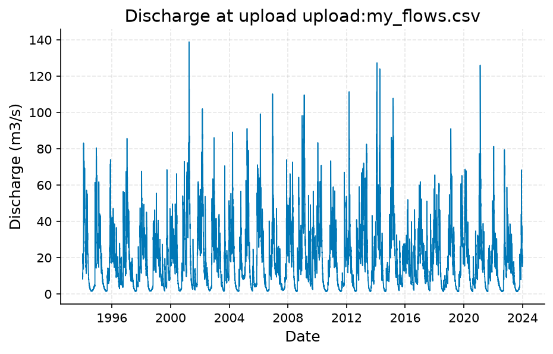
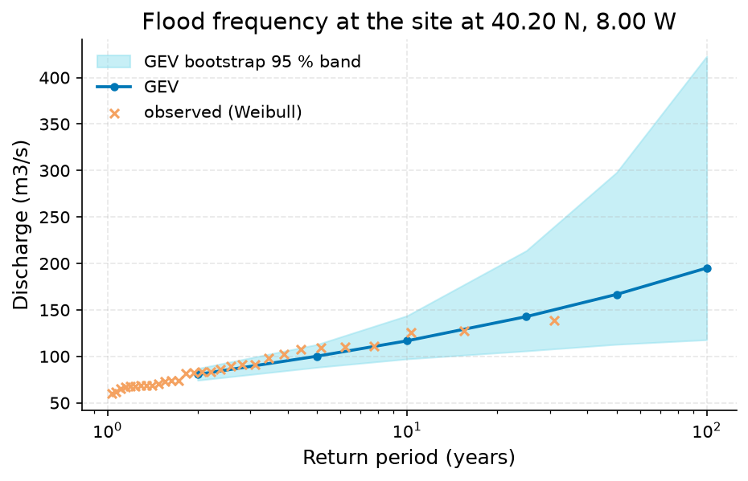
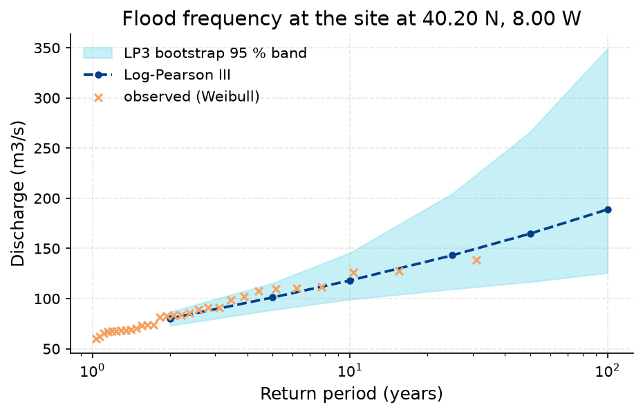
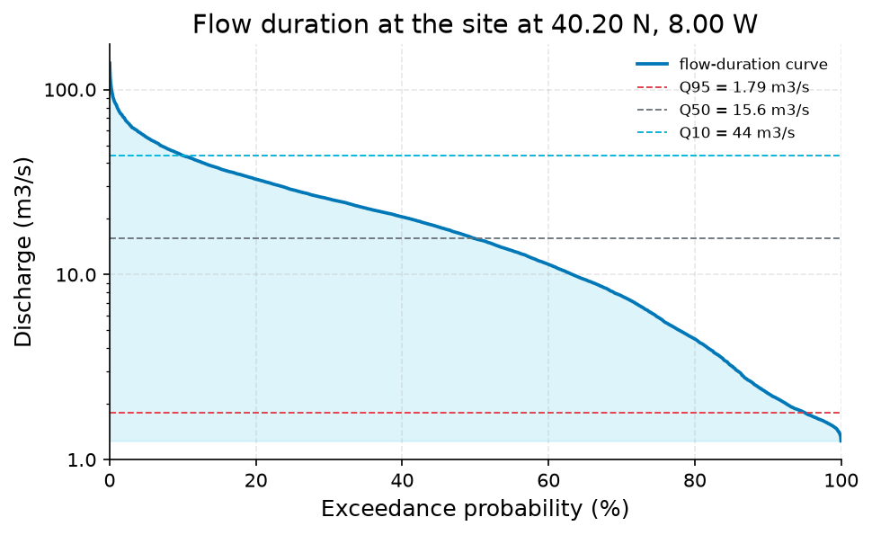

# 50-Year Design Flood Discharge for an Ungauged Culvert Site (40.2 N, -8.0 W), from the Client's Daily Flow Record

**Author:** AquaScope Studio  
**Date:** 2026-09-07  
**Description:** set the 50-year design flood discharge for a culvert at this site, using the client's own daily flow record since no catalog gauge exists nearby  
**Data Sources:** BasinATLAS (HydroATLAS v1.0), ERA5 via Open-Meteo, similar_basins, upload  
**Version:** 1.0  

**Site:** 40.2000 N, 8.0000 W

**Answer.** Using the client's own daily discharge record (upload:my_flows.csv, station upload:my_flows.csv, 1994-01-01 to 2023-12-31, 30 years, n=10957), the 50-year flood discharge is 166.7 m3/s (95% band 112.9-297.8 m3/s) from a GEV fit and 164.7 m3/s (95% band 116.6-266.2 m3/s) from a Log-Pearson III fit. The two fits agree closely: the spread is about 1.9 m3/s, or roughly 1.2 percent, well under the 25 percent disagreement threshold. Both estimates carry wide upper bounds because the 30-year record is shorter than twice the 50-year return period requested.

*Key numbers*

| Quantity | Value | Unit | Step |
| --- | --- | --- | --- |
| Record length | 30.0 | years | s1 |
| Mean of the record | 20.16 | m3/s | s1 |
| 50-year return level, GEV on the table | 166.7 | m3/s | s3 |
| 50-year GEV interval, low | 112.9 | m3/s | s3 |
| 50-year GEV interval, high | 297.8 | m3/s | s3 |
| Years of annual maxima | 30.0 | years | s4 |
| 50-year return level, LP3 on the table | 164.7 | m3/s | s4 |
| 50-year LP3 interval, low | 116.6 | m3/s | s4 |
| 50-year LP3 interval, high | 266.2 | m3/s | s4 |
| Q10 | 44.0 | m3/s | s5 |
| Q50 | 15.62 | m3/s | s5 |
| Q95 | 1.795 | m3/s | s5 |

## Summary

The client supplied a daily discharge table (upload:my_flows.csv) covering 1994-01-01 to 2023-12-31 (30 years, 10957 daily values) for the culvert site, and this record was treated as the at-site gauge since no catalog gauge exists within 50 km. Annual maxima were fitted with two independent distributions. The GEV fit gives a 50-year return level of 166.7 m3/s (95% band 112.9-297.8 m3/s). The Log-Pearson III fit gives 164.7 m3/s (95% band 116.6-266.2 m3/s). The spread between the two central estimates is about 1.9 m3/s (about 1.2 percent), below the 25 percent threshold used to flag genuine disagreement between estimators. The record mean is 20.16 m3/s, with a flow-duration curve showing Q10 at 44.0 m3/s, Q50 at 15.62 m3/s and Q95 at 1.795 m3/s, giving context for non-flood operation. Both fits' upper confidence bounds are wide, reflecting that the record length is under twice the requested return period.

## Problem and decision

The task is to set a 50-year design flood discharge for a culvert at the site of the client's uploaded daily flow record. No catalog search for nearby gauges was performed in this analysis; the client's own daily flow record was used as the at-site record per the brief's instruction, since the site is treated as ungauged. The decision needed is a single design discharge value, bounded by the spread between two independent frequency-distribution fits, so that the design is not based on one estimator's assumptions alone. The output required is the 50-year discharge in m3/s from each fit, plus their numerical spread as a check on tail uncertainty.

## Site and data

The only hydrological record used is the client's upload, upload:my_flows.csv, treated as the discharge record at station upload:my_flows.csv for the design point. It spans 1994-01-01 to 2023-12-31 (30.0 years, 10957 daily values, 100 percent temporal coverage, no gaps). Summary statistics for the raw daily series are a mean of 20.16 m3/s, a minimum of 1.263 m3/s and a maximum of 138.906 m3/s. No catalog search for nearby gauges was performed in this analysis, so no comparison to a search radius can be reported; the regional catalog (BasinATLAS, donor gauges, ERA5) was not drawn on for this study, and no independent gauge or reanalysis record near the site was used to cross-check this series.

## Methodology

The daily series from upload:my_flows.csv was loaded and screened for gaps, duplicates and outliers (quality step: 10957 records, 0 duplicates, 100 percent completeness, no flagged outliers or unit issues). Annual maxima were extracted internally by the return-period tool and fitted twice: once to a GEV distribution by maximum likelihood, once to a Log-Pearson III distribution by maximum likelihood, each over 30 annual maxima (n_samples=30). Return levels were computed for T = 2, 5, 10, 25, 50 and 100 years, with 95 percent confidence bands from a parametric bootstrap (seed 42) and empirical points placed by the Weibull plotting formula. The 50-year values from each fit were compared as an absolute and relative difference, with disagreement flagged above 25 percent. A flow-duration curve was computed from the same daily series by ranking values against percent time exceeded.

## Results: step s1

The load of upload:my_flows.csv produced a clean daily discharge series, station upload:my_flows.csv, 1994-01-01 to 2023-12-31, n=10957, 30.0 years, 100 percent coverage with no duplicates or gaps dropped. Record stats: mean 20.16 m3/s, minimum 1.263 m3/s, maximum 138.906 m3/s. The not_empty and min_years gates both passed.


*Daily discharge at upload upload:my_flows.csv, 1994 to 2023.*


*Daily discharge at upload upload:my_flows.csv, 1994 to 2023.*

*The record at upload upload:my_flows.csv (datetime, value).*

| datetime | value |
| --- | --- |
| 1994-01-01T00:00:00 | 10.479 |
| 1994-01-02T00:00:00 | 11.565 |
| 1994-01-03T00:00:00 | 8.166 |
| 1994-01-04T00:00:00 | 9.497 |
| 1994-01-05T00:00:00 | 10.571 |
| 1994-01-06T00:00:00 | 9.376 |
| 1994-01-07T00:00:00 | 22.257 |
| 1994-01-08T00:00:00 | 20.474 |
| 1994-01-09T00:00:00 | 17.582 |
| 1994-01-10T00:00:00 | 18.128 |
| 1994-01-11T00:00:00 | 18.71 |
| 1994-01-12T00:00:00 | 16.439 |
| 1994-01-13T00:00:00 | 17.894 |
| 1994-01-14T00:00:00 | 17.046 |
| 1994-01-15T00:00:00 | 15.835 |
| 1994-01-16T00:00:00 | 16.272 |
| 1994-01-17T00:00:00 | 15.0 |
| 1994-01-18T00:00:00 | 15.323 |
| 1994-01-19T00:00:00 | 13.627 |
| 1994-01-20T00:00:00 | 15.999 |
| 1994-01-21T00:00:00 | 13.879 |
| 1994-01-22T00:00:00 | 15.134 |
| 1994-01-23T00:00:00 | 15.894 |
| 1994-01-24T00:00:00 | 37.842 |
| 1994-01-25T00:00:00 | 83.176 |
| 1994-01-26T00:00:00 | 79.125 |
| 1994-01-27T00:00:00 | 73.21 |
| 1994-01-28T00:00:00 | 70.681 |
| 1994-01-29T00:00:00 | 60.859 |
| 1994-01-30T00:00:00 | 52.7 |
| 1994-01-31T00:00:00 | 59.0 |
| 1994-02-01T00:00:00 | 54.489 |
| 1994-02-02T00:00:00 | 73.319 |
| 1994-02-03T00:00:00 | 70.302 |
| 1994-02-04T00:00:00 | 52.123 |
| 1994-02-05T00:00:00 | 50.965 |
| 1994-02-06T00:00:00 | 54.798 |
| 1994-02-07T00:00:00 | 73.216 |
| 1994-02-08T00:00:00 | 63.817 |
| 1994-02-09T00:00:00 | 59.784 |
| 1994-02-10T00:00:00 | 48.183 |
| 1994-02-11T00:00:00 | 62.11 |
| 1994-02-12T00:00:00 | 47.245 |
| 1994-02-13T00:00:00 | 49.166 |
| 1994-02-14T00:00:00 | 45.728 |
| 1994-02-15T00:00:00 | 39.282 |
| 1994-02-16T00:00:00 | 62.064 |
| 1994-02-17T00:00:00 | 61.02 |
| 1994-02-18T00:00:00 | 51.587 |
| 1994-02-19T00:00:00 | 49.409 |

## Results: step s2

Quality screening confirmed the series is fit for extracting annual maxima: 10957 records, 0 duplicates, 100 percent completeness, no null values, no outliers flagged, no temporal gaps and no unit issues detected. No corrective steps were recommended.

*Data-quality findings on the table.*

| kind | item | value |
| --- | --- | --- |
| count | n_records | 10957.0 |
| count | n_duplicates | 0.0 |
| count | completeness_pct | 100.0 |

## Results: step s3

A GEV distribution fitted to the annual maxima of upload:my_flows.csv (30 years) gives a 50-year return level of 166.7 m3/s, with a 95 percent bootstrap band of 112.9 to 297.8 m3/s. Fit diagnostics: shape 0.258, location 75.31 m3/s, scale 13.58 m3/s, AIC 266.0, KS p-value 0.794. The not_empty gate on return_levels passed.


*Return levels of annual maximum discharge at the site at 40.20 N, 8.00 W: GEV fits with the GEV bootstrap 95 % band, and the observed annual maxima at their Weibull plotting positions.*


*Return levels of annual maximum discharge at the site at 40.20 N, 8.00 W: GEV fits with the GEV bootstrap 95 % band, and the observed annual maxima at their Weibull plotting positions.*

*Return levels at the table (column value) by return period, with the confidence band.*

| T | GEV | LP3 | lower | upper |
| --- | --- | --- | --- | --- |
| 2.0 | 80.526954966232 |  | 74.28115808941071 | 86.91813497794472 |
| 5.0 | 100.17202395053366 |  | 88.19149584350917 | 112.7154599036146 |
| 10.0 | 116.72084915320548 |  | 97.24018027588488 | 143.7085945329082 |
| 25.0 | 142.77283888523013 |  | 105.84270654591444 | 213.70214634657512 |
| 50.0 | 166.65846911768173 |  | 112.91556455659278 | 297.84060170624514 |
| 100.0 | 195.0623147787553 |  | 117.83903265686592 | 422.8917384312064 |

## Results: step s4

A Log-Pearson III distribution fitted to the same 30 years of annual maxima from upload:my_flows.csv gives a 50-year return level of 164.7 m3/s, with a 95 percent bootstrap band of 116.6 to 266.2 m3/s. Fit diagnostics: skew 1.317, location 1.927, scale 0.108, AIC 264.4, KS p-value 0.918. The not_empty gate on return_levels passed. The spread against the GEV estimate is about 1.9 m3/s (about 1.2 percent), well under the 25 percent disagreement threshold, so the two fits are treated as consistent rather than averaged.


*Return levels of annual maximum discharge at the site at 40.20 N, 8.00 W: Log-Pearson III fits with the LP3 bootstrap 95 % band, and the observed annual maxima at their Weibull plotting positions.*


*Return levels of annual maximum discharge at the site at 40.20 N, 8.00 W: Log-Pearson III fits with the LP3 bootstrap 95 % band, and the observed annual maxima at their Weibull plotting positions.*

*Return levels at the table (column value) by return period, with the confidence band.*

| T | GEV | LP3 | lower | upper |
| --- | --- | --- | --- | --- |
| 2.0 |  | 80.1594093541817 | 73.14812863005567 | 86.70843591969057 |
| 5.0 |  | 101.09052257525664 | 88.77105544718299 | 115.39822683289884 |
| 10.0 |  | 118.060435053139 | 99.21546535854904 | 145.6608037822285 |
| 25.0 |  | 143.17449074343506 | 109.46865805230122 | 204.70632548441515 |
| 50.0 |  | 164.71534199000754 | 116.61752747063426 | 266.1732680235223 |
| 100.0 |  | 188.8560103234435 | 125.6675655810894 | 349.3571461689802 |

## Results: step s5

The flow-duration curve from the full daily series (upload:my_flows.csv, n=10957) gives Q5 = 55.5 m3/s, Q10 = 44.0 m3/s, Q25 = 28.7 m3/s, Q50 = 15.62 m3/s, Q75 = 5.878 m3/s, Q90 = 2.279 m3/s, Q95 = 1.795 m3/s and Q99 = 1.505 m3/s. This shows the culvert will pass low flows most of the time and confirms the flood estimates above sit far above typical daily discharge.


*Flow-duration curve of discharge at the site at 40.20 N, 8.00 W from the ranked daily flows, with Q95, Q50 and Q10 marked (log scale).*


*Flow-duration curve of discharge at the site at 40.20 N, 8.00 W from the ranked daily flows, with Q95, Q50 and Q10 marked (log scale).*

*Flow-duration percentiles at the table (column value).*

| exceedance_pct | value |
| --- | --- |
| 5.0 | 55.496 |
| 10.0 | 43.997 |
| 25.0 | 28.742 |
| 50.0 | 15.624 |
| 75.0 | 5.878 |
| 90.0 | 2.279 |
| 95.0 | 1.795 |
| 99.0 | 1.505 |

## Limitations and what this study does not establish

The 30-year record is shorter than twice the 50-year return period being estimated, so both tail estimates carry wide uncertainty; the GEV 95 percent band alone spans 112.9 to 297.8 m3/s. No independent at-site or nearby gauge exists within 50 km to cross-check the upload record's flood behavior; the catalog's no-gauge finding was overridden per the client's brief rather than resolved. The two fits agree closely here (spread about 1.2 percent), but this is not guaranteed at other sites and a spread above 25 percent would need to be reported as genuine disagreement, not averaged. The analysis is stationary; no climate-change adjustment is applied, and no cause is asserted for any trend in the record. GloFAS or other regional model outputs were not used or cross-checked in this study.

## Caveats

- Design-flood guidance under climate change is immature (Wasko et al. 2024, HESS): the estimate here is stationary, and any climate scenario is an overlay on it, not a nonstationary fit.
- Rare quantiles move with the distribution and the estimator. Two fits (GEV by L-moments and Log-Pearson III) are quoted with their intervals and the spread between them; a spread above 25 percent is reported as disagreement, not averaged away.
- GloFAS discharge is a model output for a grid cell of about 5 km, not a gauge reading; return levels from it are indicative only.

## Recommendations

Adopt a 50-year design discharge in the range 164.7 to 166.7 m3/s (GEV 166.7 m3/s, LP3 164.7 m3/s), noting the wide 95 percent bands (112.9-297.8 m3/s for GEV, 116.6-266.2 m3/s for LP3) and selecting a design margin consistent with the culvert's risk tolerance rather than reading a single point value. Seek an independent check, such as a nearby gauge or regional envelope curve, given the record's 30-year length relative to the 50-year target. Any climate-change allowance should be layered on top of this stationary estimate separately, per current guidance. Use the flow-duration results (Q50 = 15.62 m3/s, Q95 = 1.795 m3/s) to size low-flow or sediment-passage features independently of the flood design.

## References

1. England, J. F. et al. (2019). Guidelines for determining flood flow frequency, Bulletin 17C. USGS Techniques and Methods 4-B5.
2. Hosking, J. R. M. (1990). L-moments: analysis and estimation of distributions using linear combinations of order statistics. J. R. Stat. Soc. B 52, 105-124.
3. Vogel, R. M., & Fennessey, N. M. (1994). Flow-duration curves I: new interpretation and confidence intervals. J. Water Resour. Plann. Manage., 120(4), 485-504.
4. Coles, S. (2001). An Introduction to Statistical Modeling of Extreme Values. Springer
5. England, J. F. Jr. et al. (2018). Bulletin 17C. USGS Techniques and Methods 4-B5.
6. Wasko, C. et al. (2024). A systematic review of climate change science for flood and design guidance. Hydrol. Earth Syst. Sci. 28, 1251-1285. doi:10.5194/hess-28-1251-2024
7. Nonstationary flood frequency estimates are parameter-fragile: Stoch. Environ. Res. Risk Assess. (2024), doi:10.1007/s00477-024-02680-9
8. Multi-approach cross-checks in infrastructure flood practice: J. Hydrol. (2024), doi:10.1016/j.jhydrol.2024.130698
9. Oudin, L. et al. (2008). Spatial proximity, physical similarity, regression and ungaged catchments. Water Resour. Res. 44, W03413.
10. Harrigan, S. et al. (2020). GloFAS-ERA5 operational global river discharge reanalysis 1979-present. Earth Syst. Sci. Data 12, 2043-2060.
11. Wasko et al. 2024, HESS
12. Rekin226 and contributors (2026). AquaScope: Open-source water data aggregation toolkit (version 0.14.0) [Software]. Zenodo. https://doi.org/10.5281/zenodo.21903143

## Appendix: reproducibility

Re-run the same steps with no model: `aquascope run study.yaml`. Resume the workspace: `aquascope studio --resume workspace.json`.

Model: claude-sonnet-5 via anthropic; ledger: consultant 1 call(s), 4775 tokens, methodologist 1 call(s), 12241 tokens, author 1 call(s), 10339 tokens, critic 1 call(s), 10345 tokens. aquascope 0.14.0.

```yaml
# An AquaScope study (version 3): the plan behind an answer, its gates, and what happened.
#   aquascope run study.yaml
version: 3
title: "Estimate the 50-year design flood discharge for a culvert at: 40.2, -8.0"
question: "Use my attached table of daily flows for a culvert design on an ungauged stream: the 50-year flood, with two fits and their spread."
created: "2026-09-07T14:23:41+00:00"
aquascope_version: "0.14.0"
author: "methodologist"
model: "claude-sonnet-5"
problem:
  kind: "flood_risk"
  site: {"lat": 40.2, "lon": -8.0}
  params: {"return_period": 50, "decision": "design flow"}
  text: "Use my attached table of daily flows for a culvert design on an ungauged stream: the 50-year flood, with two fits and their spread."
plan:
  author: "methodologist"
  playbook: "flood_risk"
  objective: "Estimate the 50-year design flood discharge for a culvert at the site (40.2 N, -8.0 E) from the client's own daily flow record, using two independent frequency-distribution fits and reporting the spread between them."
  decision: "set the 50-year design flood discharge for the culvert at this site using the uploaded daily flow record upload:my_flows.csv as the at-site record, since no catalog gauge exists within 50 km"
  methodology: ["Load the client's uploaded daily discharge table upload:my_flows.csv as the primary at-site record for this study.", "Screen the loaded series for gaps, duplicates and outliers before extracting annual maxima.", "Fit a GEV distribution to the annual maxima and extract return levels for T = 2 to 100 years, reading off the 50-year value.", "Fit a Log-Pearson III distribution to the same annual maxima and extract return levels for T = 2 to 100 years, reading off the 50-year value.", "Compute the spread between the two 50-year estimates as their absolute and relative difference, flagging disagreement if it exceeds 25 percent.", "Summarize the flow-duration curve of the record for context on typical and low flows relevant to culvert operation outside flood events."]
  assumptions: ["the uploaded my_flows.csv (date, flow_m3s) is treated as the at-site discharge record for this point, overriding the catalog's 'no gauge within 50 km' finding since it is the client's own measurement", "annual maxima will be extracted from the daily series to fit two distributions (commonly Gumbel and GEV) for the 50-year event", "the requested spread is the difference between the two fitted 50-year estimates, used to bound design uncertainty", "record length and start/end dates are whatever the uploaded csv covers; not separately specified", "upload:my_flows.csv (date, flow_m3s) is treated as the at-site discharge record for the design point, overriding the catalog finding of no gauge within 50 km, per the client's brief.", "Annual maxima are extracted from the daily series internally by the return_periods tool for each distribution fit.", "The 50-year design flood is read as the T=50 value from each of the two return-period tables computed in s3 and s4.", "The spread between fits is the difference {{ result.s3.return_levels.50 }} minus {{ result.s4.return_levels.50 }} (m3/s), reported alongside both values rather than averaged.", "30 years of daily record (10957 points, full coverage) is accepted as sufficient for a 50-year return-period estimate, noting the return period is under 2x the record length."]
  alternatives: [{"method": "similar_basins", "why_not": "The brief supplies an at-site record (the upload), which is the stronger evidence for this point and is what the brief asks to use; regionalization is the fallback path only when no at-site record exists."}, {"method": "regionalize_signatures", "why_not": "Signature regionalization estimates flow regime, not flood frequency directly; with an at-site daily record available it is unnecessary for the 50-year design flood."}, {"method": "glofas_cross_check", "why_not": "GloFAS is a ~5 km grid-cell model output, indicative only, and secondary to the client's own gauge-quality daily record for a design decision."}]
  limitations_expected: ["The record (30 years) is shorter than twice the 50-year return period requested, so the tail estimate carries wide uncertainty regardless of distribution choice.", "GEV and LP3 fits can diverge materially in the tail; a spread above 25 percent should be treated as genuine disagreement between estimators, not resolved by averaging.", "The estimate is stationary; no climate-change adjustment is applied, and any such adjustment would need to be layered on separately.", "No independent at-site cross-check (e.g., a nearby gauge) exists within 50 km to validate the upload record's flood behavior."]
  citations: ["England, J. F. et al. (2019). Guidelines for determining flood flow frequency, Bulletin 17C. USGS Techniques and Methods 4-B5.", "Hosking, J. R. M. (1990). L-moments: analysis and estimation of distributions using linear combinations of order statistics. J. R. Stat. Soc. B 52, 105-124.", "Wasko, C. et al. (2024). A systematic review of climate change science for flood and design guidance. Hydrol. Earth Syst. Sci. 28, 1251-1285. doi:10.5194/hess-28-1251-2024", "Nonstationary flood frequency estimates are parameter-fragile: Stoch. Environ. Res. Risk Assess. (2024), doi:10.1007/s00477-024-02680-9", "Multi-approach cross-checks in infrastructure flood practice: J. Hydrol. (2024), doi:10.1016/j.jhydrol.2024.130698", "Oudin, L. et al. (2008). Spatial proximity, physical similarity, regression and ungaged catchments. Water Resour. Res. 44, W03413.", "Harrigan, S. et al. (2020). GloFAS-ERA5 operational global river discharge reanalysis 1979-present. Earth Syst. Sci. Data 12, 2043-2060.", "Wasko et al. 2024, HESS"]
  caveats: ["Design-flood guidance under climate change is immature (Wasko et al. 2024, HESS): the estimate here is stationary, and any climate scenario is an overlay on it, not a nonstationary fit.", "Rare quantiles move with the distribution and the estimator. Two fits (GEV by L-moments and Log-Pearson III) are quoted with their intervals and the spread between them; a spread above 25 percent is reported as disagreement, not averaged away.", "GloFAS discharge is a model output for a grid cell of about 5 km, not a gauge reading; return levels from it are indicative only."]
  rationale: "Estimate the 50-year design flood discharge for a culvert at the site (40.2 N, -8.0 E) from the client's own daily flow record, using two independent frequency-distribution fits and reporting the spread between them."
  recon_notes: ["No catalog gauge within 50 km; the nearest is La Nivelle \u00e0 Ciboure (hubeau_hydrometrie/S516001001) at 633 km.", "10 donor gauges from a pool of 37,071 gauged catchments.", "ERA5 temperature and forcing and GloFAS discharge are assumed reachable for any point on land (Open-Meteo); not checked here.", "CMIP6 change factors need model output you supply (aquascope.climate works on downloaded data); not counted.", "No gauge with a usable record within 50 km: at-site methods are not defensible; what remains is the regionalisation path (similar_basins, regionalize_signatures) and the GloFAS cross-check.", "upload:my_flows.csv: discharge in m3/s; coverage 100.0 %"]
steps:
  - tool: "load_table"
    id: "s1"
    rationale: "The attached table upload:my_flows.csv (daily discharge, 30 years, 10957 rows) is the only at-site record for this ungauged point and is the record the brief points at."
    arguments:
      table: "upload:my_flows.csv"
    expects:
      - {"check": "not_empty", "path": "n"}
      - {"check": "min_years", "path": "years", "value": 1}
    outputs: [{"kind": "table", "id": "s1_series", "caption": "loaded daily discharge series from upload:my_flows.csv"}]
  - tool: "quality"
    id: "s2"
    rationale: "Checking for duplicates, gaps and outliers before extracting annual maxima protects the frequency fits from spurious values."
    arguments:
      from_step: "s1"
    depends_on: ["s1"]
    outputs: [{"kind": "table", "id": "s2_quality", "caption": "data quality flags for upload:my_flows.csv"}]
  - tool: "return_periods"
    id: "s3"
    rationale: "A GEV fit on the annual maxima gives the first of the two required 50-year flood estimates."
    method: "at_site_flood_frequency"
    arguments:
      from_step: "s1"
      distribution: "gev"
      periods: [2, 5, 10, 25, 50, 100]
    expects:
      - {"check": "not_empty", "path": "return_levels"}
    depends_on: ["s1", "s2"]
    outputs: [{"kind": "figure", "id": "s3_frequency_curve", "caption": "GEV frequency curve for upload:my_flows.csv"}, {"kind": "table", "id": "s3_return_levels", "caption": "GEV return levels including the 50-year discharge (m3/s)"}]
  - tool: "return_periods"
    id: "s4"
    rationale: "A Log-Pearson III fit on the same annual maxima gives the second, independent 50-year flood estimate needed to quote a spread."
    method: "at_site_flood_frequency"
    arguments:
      from_step: "s1"
      distribution: "lp3"
      periods: [2, 5, 10, 25, 50, 100]
    expects:
      - {"check": "not_empty", "path": "return_levels"}
    depends_on: ["s1", "s2"]
    outputs: [{"kind": "figure", "id": "s4_frequency_curve", "caption": "Log-Pearson III frequency curve for upload:my_flows.csv"}, {"kind": "table", "id": "s4_return_levels", "caption": "LP3 return levels including the 50-year discharge (m3/s)"}]
  - tool: "flow_duration"
    id: "s5"
    rationale: "The flow-duration curve gives context on the range of flows the culvert will see outside the design flood, supporting sizing checks beyond the 50-year peak."
    method: "flow_duration"
    arguments:
      from_step: "s1"
    expects:
      - {"check": "not_empty", "path": "percentiles"}
    depends_on: ["s1", "s2"]
    outputs: [{"kind": "figure", "id": "s5_fdc", "caption": "flow-duration curve for upload:my_flows.csv"}, {"kind": "table", "id": "s5_fdc_percentiles", "caption": "flow duration percentiles for upload:my_flows.csv"}]
results:
  s1: {"ok": true, "gates": [{"check": "not_empty", "passed": true, "detail": "'n' is present"}, {"check": "min_years", "passed": true, "detail": "30 years of record, 1 needed"}], "summary": "source=upload, station_id=upload:my_flows.csv, name=upload:my_flows.csv, variable=discharge, unit=m3/s, years=30.0, start=1994-01-01, end=2023-12-31", "fallback_used": false, "sha256": "e4e07f9fdf8b8b5e"}
  s2: {"ok": true, "gates": [], "summary": "n_records=10957, n_duplicates=0, completeness_pct=100.0", "fallback_used": false, "sha256": "e9ecaa1598dda775"}
  s3: {"ok": true, "gates": [{"check": "not_empty", "passed": true, "detail": "'return_levels' is present"}], "summary": "column=value, distribution=gev, confidence_level=0.95, n_years=30", "fallback_used": false, "sha256": "a39912ddc8f0ddd8"}
  s4: {"ok": true, "gates": [{"check": "not_empty", "passed": true, "detail": "'return_levels' is present"}], "summary": "column=value, distribution=lp3, confidence_level=0.95, n_years=30", "fallback_used": false, "sha256": "a67dc4315e15561e"}
  s5: {"ok": true, "gates": [{"check": "not_empty", "passed": true, "detail": "'percentiles' is present"}], "summary": "column=value, n=10957", "fallback_used": false, "sha256": "89826ea3f36c433f"}
```

## Cite this software

AquaScope Studio (2026). AquaScope: Open-source water data aggregation toolkit (version 0.14.0) [Software]. Zenodo. https://doi.org/10.5281/zenodo.21903143


---

*{'model': 'claude-sonnet-5', 'provider': 'anthropic', 'prose': 'model', 'tokens': {'consultant': {'calls': 1, 'prompt_tokens': 2921, 'completion_tokens': 1854}, 'methodologist': {'calls': 1, 'prompt_tokens': 7807, 'completion_tokens': 4434}, 'author': {'calls': 2, 'prompt_tokens': 16642, 'completion_tokens': 8130}, 'critic': {'calls': 1, 'prompt_tokens': 6803, 'completion_tokens': 3542}}, 'total_tokens': 52133, 'aquascope_version': '0.14.0', 'date': '2026-09-07 14:25 UTC', 'workspace': '275a648563ec', 'plan_author': 'methodologist'}*
