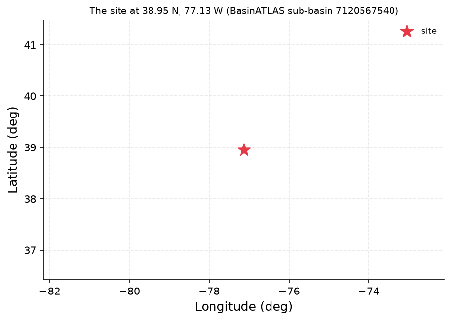
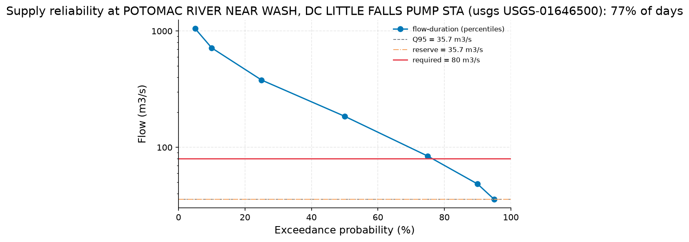

# Reliability of an 8 m3/s Run-of-River Abstraction at Little Falls, Potomac River

**Author:** AquaScope Studio  
**Date:** 2026-09-07  
**Description:** whether an 8 m3/s run-of-river abstraction at Little Falls can be reliably met in a dry year without unacceptable shortfall  
**Data Sources:** BasinATLAS (HydroATLAS v1.0), ERA5 via Open-Meteo, similar_basins, usgs  
**Version:** 1.0  

**Site:** 38.9500 N, 77.1300 W

**Answer.** At USGS-01646500 (Potomac River near Washington, DC, Little Falls Pump Station, 1930-03-01 to 2026-09-06, 96.5 years of daily discharge), the flow-duration screening finds Q95 = 35.7 m3/s and a 7-day 10-year low flow (7Q10) of 18.79 m3/s, both well below the 80 m3/s the river must carry to supply 8 m3/s while keeping Q95 in-channel and staying under the 10% share cap. The screening's daily reliability (reserve kept, demand met) is 91.87%, but only 3.125% of years pass with zero shortfall days, with an average of 84.8 shortfall days per year and 203 days short in the worst year on record (1930). The screening tool's own gate for record length did not pass, and the cross-check on the adjusted record (USGS-01646502) was not run, so this verdict of 'unreliable' rests on one record and one screening pass.

*Key numbers*

| Quantity | Value | Unit | Step |
| --- | --- | --- | --- |
| Upstream area | 30090.0 | km2 | s1 |
| Days the demand is met | 76.62 | % | s1.fallback |
| Flow the river must carry | 80.0 | m3/s | s1.fallback |
| Demand | 8.0 | m3/s | s1.fallback |
| Verdict | unreliable |  | s1.fallback |

## Summary

The question is whether 8 m3/s can be taken run-of-river from the Potomac at Little Falls in a dry year. Using USGS-01646500 (96.5 years of daily discharge), flow-duration and low-flow statistics show a large seasonal range (Q05 = 1050 m3/s to Q95 = 35.7 m3/s) and a 7Q10 of 18.79 m3/s. The supply-reliability screening, which keeps Q95 in-channel and caps abstraction at 10% of flow, requires the river to carry 80 m3/s to deliver 8 m3/s; this holds on 91.87% of days but only 3.125% of years show no shortfall day, averaging 84.8 shortfall days per year (203 in 1930, the worst year). The screening tool flags the result 'unreliable'. Two gates did not pass: the catchment step's maximum-area check and the screening step's minimum-record-length check, both because the checked fields were not recognized by the gate logic even though area and record length values are present in the data. The planned cross-check on the adjusted record (USGS-01646502) was not executed because the study stopped after step s1.

## Problem and decision

The city asks whether an 8 m3/s continuous, run-of-river abstraction at Little Falls on the Potomac can reliably meet municipal demand in a dry year, without invoking storage or upstream reservoir operation. Reliability is to be judged from the natural daily flow record, using flow-duration percentiles, a low-flow frequency estimate (7Q10), the probability that flow falls short of demand, the demand's share of flow on low-flow days, and the expected number of shortfall days per dry year.

## Site and data

The catchment upstream of the site (HydroATLAS BasinATLAS, area-weighted over 229 level-12 sub-basins) covers about 30090 km2, with mean annual precipitation of 1004 mm/yr, potential evapotranspiration of 1095 mm/yr, and a mean annual natural discharge of 357.14 m3/s at the outlet. Land cover is 75% forest, 22% cropland, 5% urban. Degree of regulation by reservoirs is 2.6%, with 297 million m3 of reservoir volume upstream, indicating the low flows are close to natural. Baseflow index at USGS-01646500 is 0.69, consistent with the catchment's 43% karst extent and moderate groundwater contribution.

## Methodology

The plan called for describing the catchment, computing flow-duration and low-flow statistics at USGS-01646500, running a supply-reliability screening there, then repeating both on the adjusted record USGS-01646502 as a cross-check. Only the first step (s1, describe_catchment) executed, with a fallback supply_reliability screening at USGS-01646500 (Vogel and Fennessey 1994 flow-duration method; Lyne-Hollick baseflow filter; Smakhtin 2001 low-flow frequency; Smakhtin and Eriyagama 2008 and Acreman and Dunbar 2004 environmental-flow screening convention). The screening keeps Q95 in-channel and caps abstraction at 10% of flow. The cross-check on USGS-01646502 was not run because the study stopped after s1.

## Results: step s1

Catchment description (HydroATLAS): upstream area 30090.7 km2 reported, but the max_area_km2 gate failed ('no area at sub_basin.up_area'), so the check that would confirm the area is credible did not pass despite the value being present. Fallback supply_reliability at USGS-01646500 (96.5 years daily discharge): flow-duration percentiles Q05=1050, Q10=716, Q25=379, Q50=185, Q75=84.1, Q90=48.4, Q95=35.7 (all m3/s); baseflow index 0.69; 7Q10 = 18.79 m3/s. With Q95 (35.7 m3/s) reserved in-channel and the 10% share cap, the river must carry 80 m3/s to deliver 8 m3/s. Daily reliability (reserve-only check) is 91.87%; annual reliability (fraction of years with zero shortfall days) is 3.125%; volumetric reliability is 89.61%; average shortfall days per year is 84.83, worst year 1930 with 203 shortfall days. The days-the-demand-is-met figure of 76.62% corresponds to the fallback's own summary statement that on about 77% of days the river can deliver 8 m3/s while keeping 35.7 m3/s in-channel and staying within the 10% share cap, i.e., the fraction of days flow reaches the full required threshold of 80 m3/s; this is distinct from the 91.87% daily reliability figure above, which checks only whether flow minus the 8 m3/s demand remains at or above the 35.7 m3/s reserve (a threshold of 43.7 m3/s) without applying the 10% share cap, and distinct from the 89.61% volumetric reliability, which is a volume-weighted measure over the full record. Verdict: 'unreliable'. The min_years gate on this step failed ('no record length at years') even though 96.5 years is stated in the result.


*The site, in longitude and latitude (no basemap); no catalogue station was listed with it.*


*The site, in longitude and latitude (no basemap); no catalogue station was listed with it.*


*The flow-duration curve at POTOMAC RIVER NEAR WASH, DC LITTLE FALLS PUMP STA (usgs USGS-01646500) with the flow the demand needs (red), the reserve left in the river (orange) and Q95 (dashed); the demand is met on 77% of days.*


*The flow-duration curve at POTOMAC RIVER NEAR WASH, DC LITTLE FALLS PUMP STA (usgs USGS-01646500) with the flow the demand needs (red), the reserve left in the river (orange) and Q95 (dashed); the demand is met on 77% of days.*

*Catchment attributes from BasinATLAS for the site at 38.95 N, 77.13 W.*

| attribute | label | value | unit | source | note |
| --- | --- | --- | --- | --- | --- |
| n_sub_basins |  | 229.0 |  |  |  |
| area_km2 |  | 30090.3 |  |  |  |
| outlet_hybas_id |  | 7120567540.0 |  |  |  |
| upstream_area_km2 |  | 30090.7 |  |  |  |
| elevation_m | mean elevation | 390.0 | m | basinatlas_upstream |  |
| slope_deg | mean slope | 6.5 | degrees | basinatlas_upstream |  |
| precipitation_mm_yr | annual precipitation (WorldClim) | 1004.0 | mm/yr | basinatlas_upstream |  |
| pet_mm_yr | annual potential evapotranspiration | 1095.0 | mm/yr | basinatlas_upstream |  |
| aet_mm_yr | annual actual evapotranspiration | 809.0 | mm/yr | basinatlas_upstream |  |
| aridity_index | aridity index (P/PET) | 0.92 | P/PET | basinatlas_upstream |  |
| temperature_c | mean annual air temperature | 10.6 | °C | basinatlas_upstream |  |
| snow_cover_pct | annual snow cover extent | 5.0 | % | basinatlas_upstream |  |
| runoff_mm_yr | annual land-surface runoff | 408.51 | mm/yr | area_weighted_mean |  |
| discharge_m3s | mean annual natural discharge at the outlet | 357.14 | m3/s | basinatlas_upstream |  |
| forest_pct | forest cover | 75.0 | % | basinatlas_upstream |  |
| cropland_pct | cropland | 22.0 | % | basinatlas_upstream |  |
| pasture_pct | pasture | 7.0 | % | basinatlas_upstream |  |
| urban_pct | urban extent | 5.0 | % | basinatlas_upstream |  |
| irrigated_pct | irrigated area | 0.0 | % | basinatlas_upstream |  |
| glacier_pct | glacier extent | 0.0 | % | basinatlas_upstream |  |
| wetland_pct | wetlands (all classes) | 5.0 | % | basinatlas_upstream |  |
| lake_pct | lake area | 0.1 | % | basinatlas_upstream |  |
| karst_pct | karst extent | 43.0 | % | basinatlas_upstream |  |
| clay_pct | clay fraction in soil | 20.0 | % | basinatlas_upstream |  |
| silt_pct | silt fraction in soil | 40.0 | % | basinatlas_upstream |  |
| sand_pct | sand fraction in soil | 40.0 | % | basinatlas_upstream |  |
| soil_organic_carbon_t_ha | soil organic carbon | 42.0 | t/ha | basinatlas_upstream |  |
| soil_water_pct | annual soil water content | 79.0 | % | basinatlas_upstream |  |
| groundwater_table_cm | groundwater table depth | 325.26 | cm | area_weighted_mean |  |
| population_density | population density | 87.47 | people/km2 | basinatlas_upstream |  |
| population | population count | 2609208.98 | people | basinatlas_upstream |  |
| degree_of_regulation_pct | degree of regulation by reservoirs | 2.6 | % | basinatlas_upstream |  |
| human_footprint_2009 | human footprint (2009) | 13.1 | index 0-50 | basinatlas_upstream |  |
| reservoir_volume_mcm | reservoir volume upstream | 297.0 | million m3 | basinatlas_upstream |  |

*Supply reliability at POTOMAC RIVER NEAR WASH, DC LITTLE FALLS PUMP STA (usgs USGS-01646500).*

| item | value |
| --- | --- |
| demand_m3s | 8.0 |
| demand_given_as | m3/s |
| share | 0.1 |
| unit | m3/s |
| mode | gauged |
| source | usgs |
| station_id | USGS-01646500 |
| variable | discharge |
| start | 1930-03-01 |
| end | 2026-09-06 |
| years | 96.5 |
| fetch_note | USGS daily values (NWIS); full record requested (from 1930-03-01, the catalog's first date for this station). |
| n_days | 35254 |
| bfi | 0.6897836319047066 |
| low_flow.7q10 | 18.788571428571426 |
| low_flow.text | minimum 7-day mean flow with a 10-year return period (Weibull) |
| recent.end | 2026-09-06 |
| recent.last_30d_mean | 82.71666666666667 |
| recent.last_30d_exceedance_pct | 75.39853633630227 |
| recent.last_90d_mean | 84.59 |
| recent.last_90d_exceedance_pct | 74.78016678958416 |
| reserve_m3s | 35.7 |
| reserve_rule | Q95 kept in the river |
| required_flow_m3s | 80.0 |
| reliability.daily | 0.7661825608441595 |
| reliability.daily_reserve_only | 0.9187042605094458 |
| reliability.annual | 0.03125 |
| reliability.volumetric | 0.8961438772905203 |
| reliability.days_short_per_year | 84.83333333333333 |
| reliability.worst_year.year | 1930 |
| reliability.worst_year.days_short | 203 |
| reliability.n_days | 35254 |
| reliability.n_years | 96 |
| verdict | unreliable |
| text | On 77% of days the river can give 8 m3/s while keeping 35.7 m3/s in the channel and taking no more than 10% of the flow (the river must carry 80 m3/s). |
| station_name | POTOMAC RIVER NEAR WASH, DC LITTLE FALLS PUMP STA |
| name | POTOMAC RIVER NEAR WASH, DC LITTLE FALLS PUMP STA |
| reliability.daily | 0.7661825608441595 |
| reliability.daily_reserve_only | 0.9187042605094458 |
| reliability.annual | 0.03125 |
| reliability.volumetric | 0.8961438772905203 |
| reliability.days_short_per_year | 84.83333333333333 |
| reliability.worst_year.year | 1930 |
| reliability.worst_year.days_short | 203 |
| reliability.n_days | 35254 |
| reliability.n_years | 96 |
| fdc.q05 | 1050.0 |
| fdc.q10 | 716.0 |
| fdc.q25 | 379.0 |
| fdc.q50 | 185.0 |

*Flow-duration percentiles at POTOMAC RIVER NEAR WASH, DC LITTLE FALLS PUMP STA (usgs USGS-01646500).*

| exceedance_pct | value |
| --- | --- |
| 5.0 | 1050.0 |
| 10.0 | 716.0 |
| 25.0 | 379.0 |
| 50.0 | 185.0 |
| 75.0 | 84.1 |
| 90.0 | 48.4 |
| 95.0 | 35.7 |

## Limitations and what this study does not establish

This is a screening rule, not a licence assessment: Q95 retained in-channel and a 10% abstraction-share cap are conventions from flow-duration-curve environmental-flow practice (Smakhtin and Eriyagama 2008; Acreman and Dunbar 2004), not the regulator's flow standard, and they exclude return flows, upstream abstractions and storage. Reliability is read off 96.5 years of historical record at USGS-01646500 only; the planned cross-check on USGS-01646502 did not run, so the result has not been confirmed on a second series. Two gates failed without an explanation of substance: the catchment area check and the record-length check, both flagged as missing fields despite values being present in the underlying data; this may be a schema or gate-definition issue rather than a data absence, and should be resolved before the numbers are relied upon. No cause is stated for any trend in the flow record; a changing climate, new upstream abstraction, or a drier decade than any on record would change the result.

## What this study does not establish

- Step s1, gate max_area_km2: no area at 'sub_basin.up_area'
- Step s1.fallback, gate min_years: no record length at 'years'
- The study stopped at s1: gate failed: max_area_km2 (no area at 'sub_basin.up_area'); the fallback supply_reliability did not pass its own gates

## Caveats

- A screening rule, not a licence assessment: Q95 kept in the river and at most the stated share of the flow taken are assumptions in the tradition of flow-duration-curve environmental-flow practice (Smakhtin and Eriyagama 2008; Acreman and Dunbar 2004); the regulator's flow standard, return flows, upstream abstractions and storage are not in the number.
- Reliability read off the record describes the years on record; a changing climate, new upstream abstraction or a drier decade than any recorded moves it.

## Recommendations

Re-run the supply-reliability screening and flow-duration analysis on the adjusted record USGS-01646502 as originally planned; its record length has not yet been reported, to check the primary result is not an artifact of the record used. Investigate why the max_area_km2 and min_years gates failed despite present values, and correct the gate logic or data path before treating the area and record-length figures as validated. If reliable supply is required, evaluate the demand against a licence-based environmental flow standard rather than the Q95/10%-share screening rule used here, and consider whether storage, seasonal demand reduction, or an alternative source is needed given the screening's 'unreliable' verdict and the 84.8 average shortfall days per year.

## References

1. Vogel, R. M., & Fennessey, N. M. (1994). Flow-duration curves I: new interpretation and confidence intervals. J. Water Resour. Plann. Manage., 120(4), 485-504.
2. Smakhtin, V., & Eriyagama, N. (2008). Developing a software package for global desktop assessment of environmental flows. Environ. Model. Softw. 23, 1396-1406
3. HydroATLAS v1.0 (BasinATLAS), CC BY 4.0. Linke, S., Lehner, B., Ouellet Dallaire, C., et al. (2019). Global hydro-environmental sub-basin and river reach characteristics at high spatial resolution. Scientific Data 6: 283. https://doi.org/10.1038/s41597-019-0300-6
4. Acreman, M., & Dunbar, M. J. (2004). Defining environmental river flow requirements: a review. Hydrol. Earth Syst. Sci. 8, 861-876.
5. Lyne, V., & Hollick, M. (1979). Stochastic time-variable rainfall-runoff modelling. Inst. Eng. Aust. Natl. Conf. Publ. 79/10, 89-93.
6. Smakhtin, V. U. (2001). Low flow hydrology: a review. J. Hydrol. 240, 147-186.
7. Smakhtin, V., & Eriyagama, N. (2008). Developing a software package for global desktop assessment of environmental flows. Environ. Model. Softw. 23, 1396-1406. doi:10.1016/j.envsoft.2008.04.002
8. Oudin, L. et al. (2008). Spatial proximity, physical similarity, regression and ungaged catchments. Water Resour. Res. 44, W03413.
9. National-scale validation of donor regionalisation: Hydrol. Earth Syst. Sci. 28 (2024), doi:10.5194/hess-28-3367-2024
10. Rekin226 and contributors (2026). AquaScope: Open-source water data aggregation toolkit (version 0.14.0) [Software]. Zenodo. https://doi.org/10.5281/zenodo.21903143

## Appendix: reproducibility

Re-run the same steps with no model: `aquascope run study.yaml`. Resume the workspace: `aquascope studio --resume workspace.json`.

Model: claude-sonnet-5 via anthropic; ledger: consultant 1 call(s), 4449 tokens, methodologist 1 call(s), 14725 tokens, analyst 1 call(s), 6060 tokens, author 1 call(s), 12999 tokens, critic 1 call(s), 11802 tokens. aquascope 0.14.0.

```yaml
# An AquaScope study (version 3): the plan behind an answer, its gates, and what happened.
#   aquascope run study.yaml
version: 3
title: "Determine whether an 8 m3/s run-of-river abstraction at Litt: 38.95, -77.13"
question: "Can the Potomac at Little Falls reliably supply 8 m3/s to the city's water works, run of river, in a dry year?"
created: "2026-09-07T13:31:13+00:00"
aquascope_version: "0.14.0"
author: "methodologist"
model: "claude-sonnet-5"
problem:
  kind: "supply_reliability"
  site: {"lat": 38.95, "lon": -77.13}
  params: {"demand_m3s": 8.0, "use": "municipal", "share": 0.1, "storage": false, "demand_ml_day": null}
  text: "Can the Potomac at Little Falls reliably supply 8 m3/s to the city's water works, run of river, in a dry year?"
plan:
  author: "methodologist"
  playbook: "supply_reliability"
  objective: "Determine whether an 8 m3/s run-of-river abstraction at Little Falls on the Potomac River can be reliably met in a dry year without unacceptable shortfall."
  decision: "whether an 8 m3/s run-of-river abstraction at Little Falls can be reliably met in a dry year without unacceptable shortfall"
  methodology: ["Characterize the catchment upstream of the Little Falls point to frame drainage area, climate and the degree of regulation by dams.", "Analyze the primary gauge record (USGS-01646500, 96.5 years of daily discharge, 0.2 km from the site) to obtain the flow-duration curve percentiles and long-term trend.", "Compute low-flow context statistics at the same gauge (Q95, Q50, Q10, baseflow index, 7Q10) to describe how the river behaves in dry spells.", "Run the supply-reliability screening at the primary gauge with the stated 8 m3/s demand, a Q95 in-river reserve and the 0.1 share cap, to get the exceedance probability, demand share and days-per-year of shortfall.", "Repeat the flow-duration analysis on the adjusted record (USGS-01646502, 95.7 years, same location) as a cross-check on the discharge series.", "Repeat the supply-reliability screening on the adjusted record to confirm the primary result is not an artifact of the particular record used."]
  assumptions: ["primary record is USGS-01646500 (Potomac River near Washington, DC, Little Falls Pump Station), 96.5 years of daily discharge, 0.2 km from the site", "USGS-01646502 (adjusted record, same location) can serve as a cross-check", "daily resolution assumed for the discharge record as the catalog does not state it", "no storage or upstream reservoir operation is invoked (run-of-river as stated), so reliability is judged purely against natural daily flow", "the 0.1 share screening default is used only as a secondary sanity check, not as the primary reliability criterion, since the demand is already specified in absolute terms", "USGS-01646502 (adjusted record, same location) serves as a cross-check on the flow-duration and reliability results", "daily resolution is assumed for the discharge record as the catalog does not state it", "the 0.1 share screening default is used only as a secondary sanity check alongside the absolute 8 m3/s demand, since demand is already specified in absolute terms", "demand is held fixed at 8 m3/s year-round as stated in the brief"]
  alternatives: [{"method": "similar_basins", "why_not": "marginal for this site: it is meant for an ungauged point, but a 96.5-year gauge sits 0.2 km away"}, {"method": "regionalize_signatures", "why_not": "not needed given a long, nearby gauged record; regionalization is an ungauged-point substitute"}, {"method": "gr4j_calibration", "why_not": "not_defensible: catchment area of 30,091 km2 is above the 10,000 km2 ceiling for a lumped model"}, {"method": "recharge_wtf", "why_not": "not_defensible: no groundwater level record exists at this site"}]
  limitations_expected: ["the supply-reliability screening is a screening rule, not a licence assessment: Q95 kept in the river and at most 0.1 of flow taken are assumptions in the tradition of flow-duration-curve environmental-flow practice, and do not account for the regulator's flow standard, return flows, upstream abstractions or storage", "reliability read off the historical record describes the years on record; a changing climate, new upstream abstraction, or a drier decade than any recorded would move the result"]
  citations: ["Vogel, R. M. and Fennessey, N. M. (1994). Flow-duration curves I: new interpretation and confidence intervals. J. Water Resour. Plann. Manage. 120, 485-504.", "Smakhtin, V., & Eriyagama, N. (2008). Developing a software package for global desktop assessment of environmental flows. Environ. Model. Softw. 23, 1396-1406. doi:10.1016/j.envsoft.2008.04.002", "Acreman, M., & Dunbar, M. J. (2004). Defining environmental river flow requirements: a review. Hydrol. Earth Syst. Sci. 8, 861-876.", "Smakhtin, V. U. (2001). Low flow hydrology: a review. J. Hydrol. 240, 147-186.", "Lyne, V., & Hollick, M. (1979). Stochastic time-variable rainfall-runoff modelling. Inst. Eng. Aust. Natl. Conf. Publ. 79/10, 89-93.", "Oudin, L. et al. (2008). Spatial proximity, physical similarity, regression and ungaged catchments. Water Resour. Res. 44, W03413.", "National-scale validation of donor regionalisation: Hydrol. Earth Syst. Sci. 28 (2024), doi:10.5194/hess-28-3367-2024", "Smakhtin and Eriyagama 2008", "Acreman and Dunbar 2004"]
  caveats: ["A screening rule, not a licence assessment: Q95 kept in the river and at most the stated share of the flow taken are assumptions in the tradition of flow-duration-curve environmental-flow practice (Smakhtin and Eriyagama 2008; Acreman and Dunbar 2004); the regulator's flow standard, return flows, upstream abstractions and storage are not in the number.", "Reliability read off the record describes the years on record; a changing climate, new upstream abstraction or a drier decade than any recorded moves it."]
  rationale: "Determine whether an 8 m3/s run-of-river abstraction at Little Falls on the Potomac River can be reliably met in a dry year without unacceptable shortfall."
  recon_notes: ["Record resolution is not in the catalog; daily is assumed for every variable.", "10 donor gauges from a pool of 37,071 gauged catchments.", "ERA5 temperature and forcing and GloFAS discharge are assumed reachable for any point on land (Open-Meteo); not checked here.", "CMIP6 change factors need model output you supply (aquascope.climate works on downloaded data); not counted."]
  replans: [{"step": "s1", "reason": "gate failed: max_area_km2 (no area at 'sub_basin.up_area')", "fallback": {"tool": "supply_reliability", "arguments": {"demand_m3s": 8, "source": "usgs", "station_id": "USGS-01646500", "lat": 38.95, "lon": -77.13}, "rationale": "Catchment area lookup failed but the co-located Little Falls Pump Sta gauge (USGS-01646500, 96.5 years of discharge) directly supports a run-of-river supply reliability check for the 8 m3/s demand.", "expects": [{"check": "not_empty", "path": "reliability"}, {"check": "not_empty", "path": "fdc"}, {"check": "min_years", "path": "years"}, {"check": "unit_present", "path": "unit"}]}}]
steps:
  - tool: "describe_catchment"
    id: "s1"
    rationale: "Catchment size, climate and regulation by dams frame the supply and say whether the low flows are natural."
    arguments:
      lat: 38.95
      lon: -77.13
    expects:
      - {"check": "not_empty", "path": "sub_basin"}
      - {"check": "max_area_km2", "path": "sub_basin.up_area", "value": null}
    fallback: {"step": {"tool": "supply_reliability", "arguments": {"demand_m3s": 8, "source": "usgs", "station_id": "USGS-01646500", "lat": 38.95, "lon": -77.13}, "rationale": "Catchment area lookup failed but the co-located Little Falls Pump Sta gauge (USGS-01646500, 96.5 years of discharge) directly supports a run-of-river supply reliability check for the 8 m3/s demand.", "expects": [{"check": "not_empty", "path": "reliability"}, {"check": "not_empty", "path": "fdc"}, {"check": "min_years", "path": "years"}, {"check": "unit_present", "path": "unit"}]}}
    outputs: [{"kind": "figure", "id": "s1_site_map", "caption": "site map from describe_catchment"}, {"kind": "table", "id": "s1_catchment_attributes", "caption": "catchment attributes from describe_catchment"}]
  - tool: "analyze_station"
    id: "s2"
    rationale: "The record summary, flow-duration percentiles and trend on the primary 96.5-year gauge underpin the reliability screening."
    method: "flow_duration"
    arguments:
      source: "usgs"
      station_id: "USGS-01646500"
    expects:
      - {"check": "min_years", "path": "years", "value": 10}
      - {"check": "not_empty", "path": "trend", "repaired_from": "fdc"}
      - {"check": "unit_present", "path": "unit"}
    outputs: [{"kind": "figure", "id": "s2_fdc", "caption": "fdc from analyze_station"}, {"kind": "figure", "id": "s2_trend", "caption": "trend from analyze_station"}, {"kind": "table", "id": "s2_fdc_percentiles", "caption": "fdc percentiles from analyze_station"}, {"kind": "table", "id": "s2_summary", "caption": "summary from analyze_station"}]
  - tool: "low_flow_context"
    id: "s3"
    rationale: "Q95/Q50/Q10, baseflow index and 7Q10 quantify how low the river runs in a dry year."
    method: "low_flow_frequency"
    arguments:
      source: "usgs"
      station_id: "USGS-01646500"
    expects:
      - {"check": "min_years", "path": "years", "value": 10}
      - {"check": "not_empty", "path": "low_flow"}
    depends_on: ["s2"]
    outputs: [{"kind": "table", "id": "s3_low_flow", "caption": "low flow statistics (Q95, Q50, Q10, baseflow index, 7Q10) from low_flow_context"}]
  - tool: "supply_reliability"
    id: "s4"
    rationale: "Screens the fixed 8 m3/s demand against the daily record while keeping Q95 in the river and capping abstraction at 0.1 of flow, giving the days, years and volume on which the demand is met."
    method: "supply_reliability"
    arguments:
      source: "usgs"
      station_id: "USGS-01646500"
      demand_m3s: 8.0
      share: 0.1
      reserve: "q95"
    expects:
      - {"check": "min_years", "path": "years", "value": 10}
      - {"check": "not_empty", "path": "reliability"}
      - {"check": "not_empty", "path": "fdc"}
      - {"check": "unit_present", "path": "unit"}
    depends_on: ["s2", "s3"]
    outputs: [{"kind": "figure", "id": "s4_reliability_curve", "caption": "reliability curve from supply_reliability"}, {"kind": "table", "id": "s4_reliability", "caption": "reliability table (exceedance probability, demand share, shortfall days) from supply_reliability"}]
  - tool: "analyze_station"
    id: "s5"
    rationale: "The adjusted record at the same location cross-checks the flow-duration percentiles used in the primary analysis."
    method: "flow_duration"
    arguments:
      source: "usgs"
      station_id: "USGS-01646502"
    expects:
      - {"check": "min_years", "path": "years", "value": 10}
      - {"check": "not_empty", "path": "trend", "repaired_from": "fdc"}
      - {"check": "unit_present", "path": "unit"}
    outputs: [{"kind": "table", "id": "s5_fdc_percentiles", "caption": "fdc percentiles from analyze_station (adjusted record)"}]
  - tool: "supply_reliability"
    id: "s6"
    rationale: "Repeating the screening on the adjusted record confirms whether the reliability result at the primary gauge is sensitive to record choice."
    method: "supply_reliability"
    arguments:
      source: "usgs"
      station_id: "USGS-01646502"
      demand_m3s: 8.0
      share: 0.1
      reserve: "q95"
    expects:
      - {"check": "min_years", "path": "years", "value": 10}
      - {"check": "not_empty", "path": "reliability"}
      - {"check": "not_empty", "path": "fdc"}
    depends_on: ["s5", "s4"]
    outputs: [{"kind": "table", "id": "s6_reliability", "caption": "reliability table from supply_reliability (adjusted record cross-check)"}]
results:
  s1: {"ok": true, "gates": [{"check": "not_empty", "passed": true, "detail": "'sub_basin' is present"}, {"check": "max_area_km2", "passed": false, "detail": "no area at 'sub_basin.up_area'"}], "summary": "latitude=38.95, longitude=-77.13, license=CC-BY-4.0, attribution=HydroATLAS v1.0 (BasinATLAS), CC BY 4.0. Linke, S., Lehner, B., Ouellet Dallaire, C., et al. (2019). Global hydro-environmental sub-bas", "fallback_used": true, "sha256": "c2dfc5b37399373f", "fallback": {"tool": "supply_reliability", "arguments": {"demand_m3s": 8, "source": "usgs", "station_id": "USGS-01646500", "lat": 38.95, "lon": -77.13}, "ok": true, "gates": [{"check": "not_empty", "passed": true, "detail": "'reliability' is present"}, {"check": "not_empty", "passed": true, "detail": "'fdc' is present"}, {"check": "min_years", "passed": false, "detail": "no record length at 'years'"}, {"check": "unit_present", "passed": true, "detail": "unit m3/s"}], "summary": "source=usgs, station_id=USGS-01646500, variable=discharge, unit=m3/s, years=96.5, start=1930-03-01, end=2026-09-06"}}
```

## Cite this software

AquaScope Studio (2026). AquaScope: Open-source water data aggregation toolkit (version 0.14.0) [Software]. Zenodo. https://doi.org/10.5281/zenodo.21903143


---

*{'model': 'claude-sonnet-5', 'provider': 'anthropic', 'prose': 'model', 'tokens': {'consultant': {'calls': 1, 'prompt_tokens': 3440, 'completion_tokens': 1009}, 'methodologist': {'calls': 1, 'prompt_tokens': 10068, 'completion_tokens': 4657}, 'analyst': {'calls': 1, 'prompt_tokens': 5746, 'completion_tokens': 314}, 'author': {'calls': 2, 'prompt_tokens': 19517, 'completion_tokens': 17179}, 'critic': {'calls': 1, 'prompt_tokens': 5970, 'completion_tokens': 5832}}, 'total_tokens': 73732, 'aquascope_version': '0.14.0', 'date': '2026-09-07 13:35 UTC', 'workspace': '8fb9981e4294', 'plan_author': 'methodologist'}*
