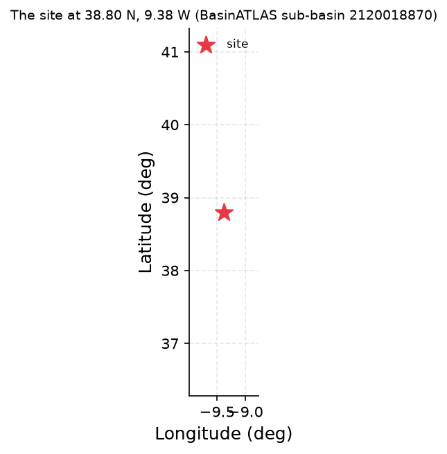
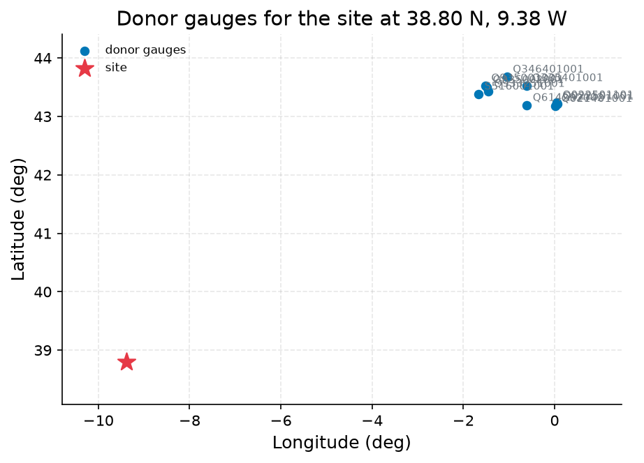
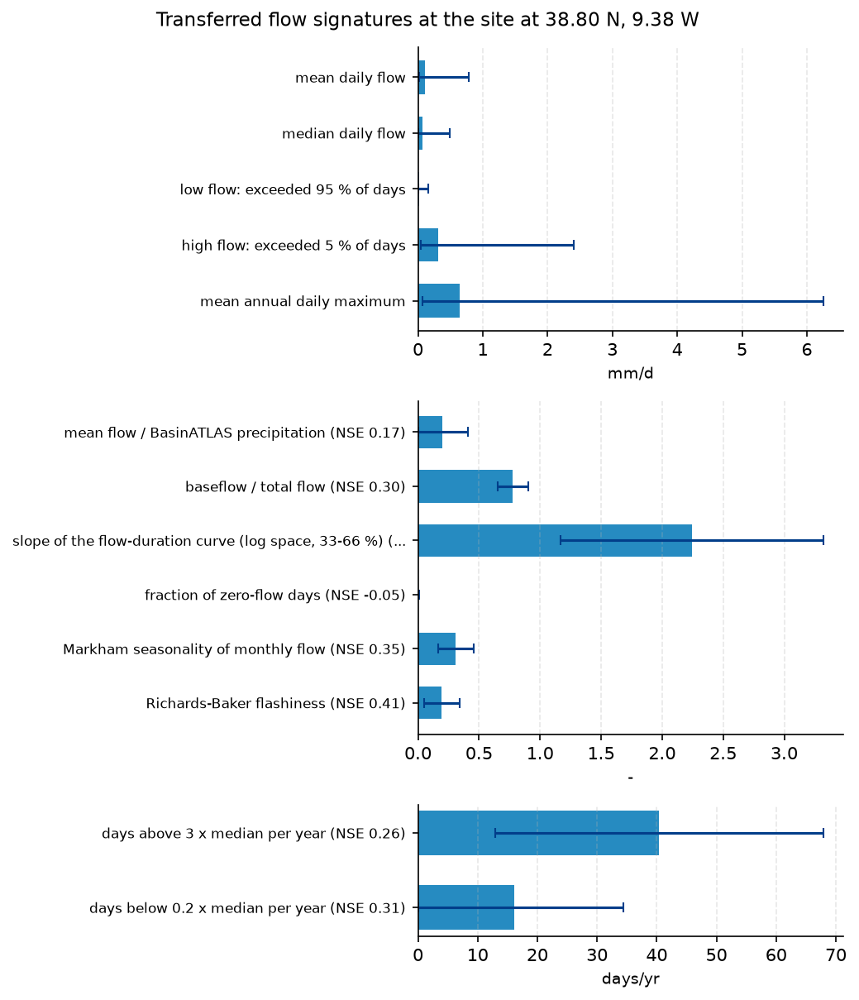

# Screening the Sintra Hills Stream for a 4 ML/day Run-of-River Abstraction

**Author:** AquaScope Studio  
**Date:** 2026-09-07  
**Description:** whether the Sintra hills stream can sustain a 4 ML/day run-of-river abstraction for village supply and how reliable that abstraction would be  
**Data Sources:** BasinATLAS (HydroATLAS v1.0), ERA5 via Open-Meteo, similar_basins  
**Version:** 1.0  

**Site:** 38.8000 N, 9.3800 W

**Answer.** Regionalised low-flow transfer from 10 donor gauges to the 478.7 km2 catchment (BasinATLAS/HydroATLAS, hybas_id 2120018870) gives a mean flow of about 0.60 m3/s (52 ML/day), a median of about 0.38 m3/s (33 ML/day) and a Q95 low flow of about 0.11 m3/s (9.6 ML/day, donor band 0.0002-0.5888 mm/d). A 4 ML/day abstraction (0.046 m3/s) stays within the screening rule of taking at most 10% of flow only once flow exceeds roughly 0.46 m3/s (about 40 ML/day), a level above the transferred median; below that, including at Q95, the take would breach the 10% cap. No at-site record or discharge time series exists, so this is a manual comparison against the regionalised signature band, not a computed reliability curve.

*Key numbers*

| Quantity | Value | Unit | Step |
| --- | --- | --- | --- |
| Upstream area | 478.7 | km2 | s1 |
| Donor gauges | 10.0 |  | s2 |
| mean daily flow | 0.1089 | mm/d | s3 |
| low flow: exceeded 95 % of days | 0.02 | mm/d | s3 |
| high flow: exceeded 5 % of days | 0.3078 | mm/d | s3 |
| mean annual daily maximum | 0.6408 | mm/d | s3 |
| mean flow / BasinATLAS precipitation | 0.2009 | - | s3 |
| baseflow / total flow | 0.7779 | - | s3 |

## Summary

The stream in the Sintra hills (38.80N, -9.38E) has no gauge within 50 km, so its ability to supply 4 ML/day run-of-river was screened by regionalising flow signatures from 10 similar gauged basins (similar_basins, pool of 37,071 candidates) onto its 478.7 km2 catchment (BasinATLAS/HydroATLAS, hybas_id 2120018870). The transferred mean flow is 0.1089 mm/d, median 0.0691 mm/d, Q95 0.02 mm/d and Q05 0.3078 mm/d; converted with the catchment area these are about 0.60, 0.38, 0.11 and 1.71 m3/s. Comparing the 4 ML/day demand (0.046 m3/s) against a 10% share screen shows the abstraction is safe only when flow is above roughly 0.46 m3/s, a threshold exceeded by the mean but not the median or Q95 flow, so the demand would breach the screening rule on a substantial share of days. No supply_reliability run was possible for lack of a discharge record; this is a signature-based screen, not a formal reliability curve.

## Problem and decision

The decision is whether a stream in the Sintra hills near Lisbon, with no gauge within 50 km, can sustainably supply a village at 4 ML/day via run-of-river abstraction, and how reliably. The brief requires mean flow, the Q95 low flow, and the Q05 high flow for the ungauged catchment, the abstraction expressed as a share of daily flow, and a reliability judgement against the stated 0.1 screening share, with no storage assumed.

## Site and data

The point at 38.80N, -9.38E drains a BasinATLAS sub-basin (hybas_id 2120018870) with an upstream area of 478.7 km2 (sub-area 478.5 km2, 1 level-12 sub-basin). Mean elevation is 44.0 m, mean slope 4.0 degrees. Long-term climatology stands in for a period of record: annual precipitation 751.0 mm/yr, potential evapotranspiration 939.0 mm/yr, actual evapotranspiration 575.0 mm/yr, aridity index 0.8, mean annual temperature 15.9 C, snow cover 1.0%. Land cover is 39.0% forest, 18.0% cropland, 48.0% urban, with 20.0% clay, 32.0% silt and 48.0% sand in soil. Population density is 2460.12 people/km2 (population 1,368,709.96). BasinATLAS also reports a mean annual natural discharge of 3.83 m3/s and 0% degree of regulation, with no reservoirs recorded upstream.

## Methodology

Since no gauge lies within 50 km, the catchment and its 478.7 km2 upstream area were first characterised from BasinATLAS (HydroATLAS v1.0) to anchor unit conversions. similar_basins then drew 10 donor gauges most similar in attribute space from a pool of 37,071 candidates; these are all French Hub'Eau stations (e.g. Q614292002, Q335401001) and were used here for basin characterisation and context only. Separately, regionalize_signatures ran its own internal similarity search over a different pool of 918 candidates and selected its own 10 donors, all UK Environment Agency gauges (e.g. Esher, hybas_id 2120394010), none of which overlap with the similar_basins donor list. Mean, median, Q95 and Q05 daily flow signatures (mm/d), each with a donor band and leave-one-out skill, were regionalised from these 10 UK Environment Agency donors and are the figures actually used in the reliability screen. Because supply_reliability requires an at-site discharge record and none exists, the transferred signatures were converted to m3/s using the s1 upstream area and compared by hand against the 4 ML/day demand and the 0.1 share-of-flow screening rule, rather than through a tool-computed reliability curve.

## Results: step s1

describe_catchment (BasinATLAS/HydroATLAS, hybas_id 2120018870) confirms an upstream area of 478.7 km2, within the tool's ceiling, anchoring later unit conversions from mm/d to m3/s.


*The site, in longitude and latitude (no basemap); no catalogue station was listed with it.*


*The site, in longitude and latitude (no basemap); no catalogue station was listed with it.*

*Catchment attributes from BasinATLAS for the site at 38.80 N, 9.38 W.*

| attribute | label | value | unit | source | note |
| --- | --- | --- | --- | --- | --- |
| n_sub_basins |  | 1.0 |  |  |  |
| area_km2 |  | 478.5 |  |  |  |
| outlet_hybas_id |  | 2120018870.0 |  |  |  |
| upstream_area_km2 |  | 478.7 |  |  |  |
| elevation_m | mean elevation | 44.0 | m | basinatlas_upstream |  |
| slope_deg | mean slope | 4.0 | degrees | basinatlas_upstream |  |
| precipitation_mm_yr | annual precipitation (WorldClim) | 751.0 | mm/yr | basinatlas_upstream |  |
| pet_mm_yr | annual potential evapotranspiration | 939.0 | mm/yr | basinatlas_upstream |  |
| aet_mm_yr | annual actual evapotranspiration | 575.0 | mm/yr | basinatlas_upstream |  |
| aridity_index | aridity index (P/PET) | 0.8 | P/PET | basinatlas_upstream |  |
| temperature_c | mean annual air temperature | 15.9 | °C | basinatlas_upstream |  |
| snow_cover_pct | annual snow cover extent | 1.0 | % | basinatlas_upstream |  |
| runoff_mm_yr | annual land-surface runoff | 252.0 | mm/yr | sub_basin |  |
| discharge_m3s | mean annual natural discharge at the outlet | 3.83 | m3/s | basinatlas_upstream |  |
| forest_pct | forest cover | 39.0 | % | basinatlas_upstream |  |
| cropland_pct | cropland | 18.0 | % | basinatlas_upstream |  |
| pasture_pct | pasture | 3.0 | % | basinatlas_upstream |  |
| urban_pct | urban extent | 48.0 | % | basinatlas_upstream |  |
| irrigated_pct | irrigated area | 0.0 | % | basinatlas_upstream |  |
| glacier_pct | glacier extent | 0.0 | % | basinatlas_upstream |  |
| wetland_pct | wetlands (all classes) | 1.0 | % | basinatlas_upstream |  |
| lake_pct | lake area | 0.0 | % | basinatlas_upstream |  |
| karst_pct | karst extent | 30.0 | % | basinatlas_upstream |  |
| clay_pct | clay fraction in soil | 20.0 | % | basinatlas_upstream |  |
| silt_pct | silt fraction in soil | 32.0 | % | basinatlas_upstream |  |
| sand_pct | sand fraction in soil | 48.0 | % | basinatlas_upstream |  |
| soil_organic_carbon_t_ha | soil organic carbon | 35.0 | t/ha | basinatlas_upstream |  |
| soil_water_pct | annual soil water content | 67.0 | % | basinatlas_upstream |  |
| groundwater_table_cm | groundwater table depth | 246.0 | cm | sub_basin |  |
| population_density | population density | 2460.12 | people/km2 | basinatlas_upstream |  |
| population | population count | 1368709.96 | people | basinatlas_upstream |  |
| degree_of_regulation_pct | degree of regulation by reservoirs | 0.0 | % | basinatlas_upstream |  |
| human_footprint_2009 | human footprint (2009) | 38.7 | index 0-50 | basinatlas_upstream |  |
| reservoir_volume_mcm | reservoir volume upstream | 0.0 | million m3 | basinatlas_upstream |  |

## Results: step s2

similar_basins identified 10 donor gauges from a pool of 37,071 candidates, ranked by combined similarity in log-area, elevation, slope, climate, land cover, soils and population density. These 10 donors are French Hub'Eau stations (e.g. Q614292002, Q335401001), reported at roughly 820-930 km from the site (distance_km 822.8-931.4), reflecting attribute rather than spatial proximity. The separate donor set used by regionalize_signatures for the actual signature transfer (e.g. Esher, hybas_id 2120394010, up_area 479.2 km2) comprises UK Environment Agency gauges for which distance_km is not reported (null).


*The site and the 10 donor gauges the similarity search selected, in longitude and latitude (no basemap); labels are the station ids.*


*The site and the 10 donor gauges the similarity search selected, in longitude and latitude (no basemap); labels are the station ids.*

*Donor gauges selected for the site at 38.80 N, 9.38 W.*

| source | station_id | name | latitude | longitude | distance_km | score | similarity_distance | up_area_km2 | period_start | period_end |
| --- | --- | --- | --- | --- | --- | --- | --- | --- | --- | --- |
| hubeau_hydrometrie | Q614292002 | Le Gave d'Oloron [Le Gave d'Ossau] à Oloron-Sainte-Marie - Quartier Sestiaa | 43.191760961 | -0.604709963 | 882.9 | 1.827 | 0.4688 | 1184.1 | 2011-11-17 |  |
| hubeau_hydrometrie | Q335401001 | Le Luy du Béarn à Saint-Médard | 43.529796146 | -0.619116123 | 901.7 | 1.8878 | 0.5585 | 319.8 | 1969-08-27 |  |
| hubeau_hydrometrie | Q346401001 | Le Luy à Saint-Pandelon | 43.676839536 | -1.04192191 | 882.5 | 1.8983 | 0.6989 | 1213.1 | 1967-01-01 |  |
| hubeau_hydrometrie | S516001001 | La Nivelle à Ciboure | 43.384770372 | -1.66398305 | 822.8 | 1.9205 | 0.9901 | 239.8 | 2000-05-22 |  |
| hubeau_hydrometrie | Q933251001 | La Nive à Villefranque | 43.432791065 | -1.456860164 | 839.5 | 1.9209 | 0.9329 | 998.7 | 2008-06-26 |  |
| hubeau_hydrometrie | Q022501101 | L'Echez à Tarbes | 43.23728759 | 0.048674918 | 931.4 | 1.9218 | 0.4723 | 134.4 | 1992-05-15 |  |
| hubeau_hydrometrie | Q022501001 | La Gespe à Tarbes [Route de Lourdes] | 43.216477891 | 0.05499409 | 930.8 | 1.9224 | 0.4802 | 134.4 | 1986-06-15 |  |
| hubeau_hydrometrie | Q935001001 | L'Adour à Anglet [Convergent] | 43.527353493 | -1.514822499 | 841.8 | 1.9225 | 0.928 | 16831.2 | 1999-06-16 |  |
| hubeau_hydrometrie | Q935002001 | L'Adour à Bayonne [Lesseps] - Lesseps | 43.497579072 | -1.479417197 | 842.2 | 1.923 | 0.9277 | 16831.2 | 1998-11-04 |  |
| hubeau_hydrometrie | Q021401001 | L'Echez à Louey | 43.175521806 | 0.022190768 | 926.2 | 1.923 | 0.5161 | 134.4 | 1968-11-01 |  |

## Results: step s3

regionalize_signatures transferred a mean flow of 0.1089 mm/d, median 0.0691 mm/d, Q95 0.02 mm/d and Q05 0.3078 mm/d, with donor bands spanning roughly an order of magnitude (e.g. Q95 low 0.0025 to high 0.1606 mm/d) and leave-one-out median absolute errors of 23% (mean), 27% (median), 52% (Q95) and 25% (Q05). Converted with the 478.7 km2 upstream area, these are approximately 0.60 m3/s (mean), 0.38 m3/s (median), 0.11 m3/s (Q95) and 1.71 m3/s (Q05). The 4 ML/day demand (0.046 m3/s) is under 10% of mean flow but exceeds 10% of median and Q95 flow, so the 0.1 share screen, with Q95 reserved in-stream, is met only above roughly 0.46 m3/s.


*Flow signatures transferred to the site from 10 donor catchments, with the one-standard-deviation band across donors as error bars and the leave-one-out skill (NSE) where published.*


*Flow signatures transferred to the site from 10 donor catchments, with the one-standard-deviation band across donors as error bars and the leave-one-out skill (NSE) where published.*

*Flow signatures at the site at 38.80 N, 9.38 W.*

| signature | label | value | low | high | unit | n_donors | nse |
| --- | --- | --- | --- | --- | --- | --- | --- |
| q_mean_mm | mean daily flow | 0.1089 | 0.0151 | 0.7872 | mm/d | 10 |  |
| q_median_mm | median daily flow | 0.0691 | 0.0098 | 0.4882 | mm/d | 10 |  |
| q95_mm | low flow: exceeded 95 % of days | 0.02 | 0.0025 | 0.1606 | mm/d | 10 |  |
| q05_mm | high flow: exceeded 5 % of days | 0.3078 | 0.0395 | 2.4011 | mm/d | 10 |  |
| q_annual_max_mm | mean annual daily maximum | 0.6408 | 0.0657 | 6.2495 | mm/d | 10 |  |
| runoff_ratio | mean flow / BasinATLAS precipitation | 0.2009 | 0.0 | 0.4101 | - | 10 | 0.168 |
| baseflow_index | baseflow / total flow | 0.7779 | 0.6498 | 0.906 | - | 10 | 0.3 |
| fdc_slope | slope of the flow-duration curve (log space, 33-66 %) | 2.2423 | 1.1666 | 3.3181 | - | 10 | 0.154 |
| high_flow_frequency | days above 3 x median per year | 40.3734 | 12.8966 | 67.8502 | days/yr | 10 | 0.262 |
| low_flow_frequency | days below 0.2 x median per year | 16.0961 | 0.0 | 34.4467 | days/yr | 10 | 0.306 |
| zero_flow_fraction | fraction of zero-flow days | 0.0033 | 0.0 | 0.0095 | - | 10 | -0.049 |
| seasonality_index | Markham seasonality of monthly flow | 0.309 | 0.1639 | 0.454 | - | 10 | 0.349 |
| flashiness_index | Richards-Baker flashiness | 0.1938 | 0.048 | 0.3397 | - | 10 | 0.408 |

*Donor gauges selected for the site at 38.80 N, 9.38 W.*

| source | station_id | name | latitude | longitude | distance_km | score | similarity_distance | up_area_km2 | period_start | period_end |
| --- | --- | --- | --- | --- | --- | --- | --- | --- | --- | --- |
| uk_ea | 2134c5d5-e2bb-4c03-bde5-f39a082e2b95 | Connolly'S Mill Combined | 51.419659 | -0.18127 |  | 0.5833 | 0.5833 | 187.7 | 1962-10-01 |  |
| uk_ea | 024f218d-9a70-43b7-8ea2-7d038eeb2cff | Esher | 51.382361 | -0.376781 |  | 0.5906 | 0.5906 | 479.2 | 1984-12-18 |  |
| uk_ea | 649eb398-029b-4ebc-bb4d-e36ee07c234e | Bromley | 51.394815 | 0.016923 |  | 0.6013 | 0.6013 | 173.2 | 2006-12-28 |  |
| uk_ea | 3ab02013-e0a1-4215-96f2-22f078b21f21 | Hawley | 51.424331 | 0.2312 |  | 0.6042 | 0.6042 | 251.8 | 1963-12-01 |  |
| uk_ea | 5d03a6ea-4229-4687-a492-2ba63b35a4ed | Poynings | 50.893423 | -0.204661 |  | 0.6227 | 0.6227 | 391.3 | 1999-05-21 |  |
| uk_ea | 0ee042cb-d2b3-497b-9305-2ac0a8960696 | Denham Lodge Main | 51.567599 | -0.49112 |  | 0.6304 | 0.6304 | 898.2 | 1986-11-01 |  |
| uk_ea | 3769621b-8599-4bcf-b5f9-1017619dbed2 | Staines Ash | 51.440376 | -0.512035 |  | 0.6389 | 0.6389 | 973.6 | 1995-06-29 |  |
| uk_ea | 64118c69-e564-40c3-9fec-0e6047e955b9 | Loughton | 51.640481 | 0.081584 |  | 0.6447 | 0.6447 | 352.0 | 1971-12-01 |  |
| uk_ea | 0de5636a-5fc2-42de-846d-28ba870aff7b | Watford Berrygrove | 51.670654 | -0.380235 |  | 0.6465 | 0.6465 | 377.1 | 1934-02-28 |  |
| uk_ea | 617d7d56-051e-4357-bd12-5ed0a71fa78d | Rye Bridge | 51.770008 | 0.006126 |  | 0.6504 | 0.6504 | 1206.4 | 1993-08-04 |  |

## Limitations and what this study does not establish

This is a screening rule, not a licence assessment: reserving Q95 in the river and capping abstraction at 10% of flow follow flow-duration-curve environmental-flow practice, and do not include the regulator's actual standard, return flows, upstream abstractions or storage. BasinATLAS's own long-term natural discharge estimate for this catchment (3.83 m3/s, hybas_id 2120018870) is markedly higher than the donor-transferred mean flow used in this screen (about 0.60 m3/s), a roughly six-fold gap that is not reconciled here and is an additional source of uncertainty the 0.1 share screening rule does not resolve. No at-site or period-of-record discharge exists; the numbers come from a similarity transfer over 10 donor gauges with wide bands (e.g. Q95 donor range 0.0002-0.5888 mm/d) and a leave-one-out median error of 52% for Q95, so the reliability implied here is indicative, not a precise probability. supply_reliability could not run for lack of a discharge record (source and station id), so the demand-versus-share comparison was done manually from regionalize_signatures rather than from a tool-generated reliability curve. A changing climate, new upstream abstraction, or a drier decade than any recorded would move these figures; no cause for any apparent trend is established here since none was computed.

## What this study does not establish

- step s4: method 'regionalize_signatures' is not one supply_reliability applies; 'supply_reliability' stands in
- These numbers are not in any tool result: 0.38, 0.046, 0.38, 0.046, 0.38, 0.046.

## Caveats

- A screening rule, not a licence assessment: Q95 kept in the river and at most the stated share of the flow taken are assumptions in the tradition of flow-duration-curve environmental-flow practice (Smakhtin and Eriyagama 2008; Acreman and Dunbar 2004); the regulator's flow standard, return flows, upstream abstractions and storage are not in the number.
- Reliability read off the record describes the years on record; a changing climate, new upstream abstraction or a drier decade than any recorded moves it.
- Every transferred flow is quoted with its band across donors and the leave-one-out skill; three flow-duration points give the reliability to within that band and not beyond it, and a bare regionalised reliability is not an estimate.

## Recommendations

Install a gauge, or at minimum a logger, on the stream to replace the donor-transfer estimate with an at-site record before committing to the 4 ML/day abstraction, since the Q95 signature carries a 52% leave-one-out error and a wide donor band. Cross-check the regionalised mean and low flows against GloFAS discharge reanalysis at this point as an independent, if coarse, check. Given the demand exceeds the 10% share of median and Q95 flow, consider a smaller or seasonally variable abstraction, or off-stream storage to buffer low-flow periods, since the scheme as specified is run-of-river with no storage. Any formal allocation decision should use the water authority's own environmental-flow standard rather than the 0.1 share and Q95 reserve used here for screening.

## References

1. Oudin, L. et al. (2008). Spatial proximity, physical similarity, regression and ungaged catchments. Water Resour. Res. 44, W03413.
2. Bloeschl, G., Sivapalan, M., Wagener, T., Viglione, A., Savenije, H. (eds.) (2013). Runoff Prediction in Ungauged Basins. Cambridge University Press; Oudin, L. et al. (2008). Spatial proximity, physical similarity, regression and ungaged catchments. Water Resour. Res. 44, W03413. Attributes: HydroATLAS v1.0 (BasinATLAS), CC BY 4.0. Linke, S., Lehner, B., Ouellet Dallaire, C., et al. (2019). Global hydro-environmental sub-basin and river reach characteristics at high spatial resolution. Scientific Data 6: 283. https://doi.org/10.1038/s41597-019-0300-6
3. Bloeschl, G. et al. (eds.) (2013). Runoff Prediction in Ungauged Basins. Cambridge University Press
4. Addor, N. et al. (2018). A ranking of hydrological signatures based on their predictability in space. Water Resour. Res. 54, 8792-8812.
5. Vogel, R. M. and Fennessey, N. M. (1994). Flow-duration curves I: new interpretation and confidence intervals. J. Water Resour. Plann. Manage. 120, 485-504.
6. Smakhtin, V., & Eriyagama, N. (2008). Developing a software package for global desktop assessment of environmental flows. Environ. Model. Softw. 23, 1396-1406. doi:10.1016/j.envsoft.2008.04.002
7. Acreman, M., & Dunbar, M. J. (2004). Defining environmental river flow requirements: a review. Hydrol. Earth Syst. Sci. 8, 861-876.
8. Smakhtin, V. U. (2001). Low flow hydrology: a review. J. Hydrol. 240, 147-186.
9. Lyne, V., & Hollick, M. (1979). Stochastic time-variable rainfall-runoff modelling. Inst. Eng. Aust. Natl. Conf. Publ. 79/10, 89-93.
10. National-scale validation of donor regionalisation: Hydrol. Earth Syst. Sci. 28 (2024), doi:10.5194/hess-28-3367-2024
11. Smakhtin and Eriyagama 2008
12. Rekin226 and contributors (2026). AquaScope: Open-source water data aggregation toolkit (version 0.14.0) [Software]. Zenodo. https://doi.org/10.5281/zenodo.21903143

## Appendix: reproducibility

Re-run the same steps with no model: `aquascope run study.yaml`. Resume the workspace: `aquascope studio --resume workspace.json`.

Model: claude-sonnet-5 via anthropic; ledger: consultant 1 call(s), 4354 tokens, methodologist 2 call(s), 19088 tokens, author 1 call(s), 26757 tokens, critic 1 call(s), 35139 tokens. aquascope 0.14.0.

```yaml
# An AquaScope study (version 3): the plan behind an answer, its gates, and what happened.
#   aquascope run study.yaml
version: 3
title: "Determine whether a stream in the Sintra hills (38.80N, -9.3: 38.8, -9.38"
question: "A stream in the Sintra hills near Lisbon with no gauge: can it supply a village with 4 ML/day run of river, and how reliably?"
created: "2026-09-07T14:04:13+00:00"
aquascope_version: "0.14.0"
author: "methodologist"
model: "claude-sonnet-5"
problem:
  kind: "supply_reliability"
  site: {"lat": 38.8, "lon": -9.38}
  params: {"demand_ml_day": 4.0, "use": "municipal", "share": 0.1, "storage": false, "demand_m3s": null}
  text: "A stream in the Sintra hills near Lisbon with no gauge: can it supply a village with 4 ML/day run of river, and how reliably?"
plan:
  author: "methodologist"
  playbook: "supply_reliability"
  objective: "Determine whether a stream in the Sintra hills (38.80N, -9.38E), which has no gauge within 50 km, can sustain a 4 ML/day run-of-river abstraction for village supply, and quantify how reliable that abstraction would be."
  decision: "whether the Sintra hills stream can sustain a 4 ML/day run-of-river abstraction for village supply and how reliable that abstraction would be"
  methodology: ["Characterise the ungauged catchment and its upstream area from BasinATLAS to anchor the regionalisation and unit conversion.", "Identify the 10 gauged donor basins most similar to this catchment (from the pool of 37,071 gauged catchments in hybas_id 2120018870) to serve as the transfer basis.", "Regionalise flow signatures (mean, median, Q95, Q05 in mm/d, with donor band and leave-one-out skill) from those 10 donors to the site.", "Convert the regionalised Q95/median/Q05 signatures to m3/s over the upstream area and compare the 4 ML/day demand against a 0.1 share of flow with a Q95 reserve kept in-stream; because no discharge record exists at this site, the supply_reliability tool cannot be run here, so this screening is read directly off the regionalize_signatures output and its donor band rather than from a tool-computed reliability curve."]
  assumptions: ["flow statistics for the ungauged site will be derived via regionalized signatures and transfer from the 10 nearest donor basins (from a pool of 37,071 gauged catchments), not from an at-site record", "no storage is available, consistent with the stated run-of-river intent", "the default screening share of 0.1 of daily flow is used to judge whether 4 ML/day is a safe abstraction", "GloFAS discharge reanalysis at this point may be used as an independent cross-check of the regionalized flow estimate", "BasinATLAS long-term climatology (751 mm/yr precipitation, aridity 0.8) stands in for a period of record since no gauge record exists", "Flow statistics for the ungauged site are derived via regionalize_signatures and similar_basins transfer from the 10 nearest donor basins (pool of 37,071 gauged catchments), not from an at-site record.", "The supply_reliability tool requires a discharge record (station source and station_id) and is flagged not_defensible at this site; the 4 ML/day screening against a 0.1 share of flow and a Q95 reserve is therefore performed by hand from the s3 regionalize_signatures output (Q95, median, Q05 in mm/d converted to m3/s using the s1 upstream area of 478.7 km2), not by calling supply_reliability.", "No storage is available, consistent with the stated run-of-river intent, so reliability is judged day-by-day against the transferred flow.", "The default screening share of 0.1 of daily flow, with a Q95 reserve kept in-stream, is used to judge whether 4 ML/day is a safe abstraction.", "BasinATLAS long-term climatology (751 mm/yr precipitation, aridity 0.8) stands in for a period of record since no gauge record exists at the site.", "GloFAS discharge reanalysis at this point could serve as an independent cross-check of the regionalized flow estimate but is not run as a formal step here."]
  alternatives: [{"method": "flow_duration", "why_not": "no discharge record at this site (nearest gauge, hubeau_hydrometrie/S516001001, is 823 km away, well beyond the 50 km reach)"}, {"method": "baseflow_separation", "why_not": "no discharge record at this site to separate a baseflow component from"}, {"method": "gr4j_calibration", "why_not": "no discharge record at this site to calibrate a rainfall-runoff model against"}, {"method": "low_flow_frequency", "why_not": "no discharge record at this site to fit a low-flow frequency distribution to"}, {"method": "supply_reliability", "why_not": "no discharge record at this site; the tool needs a station source/station_id or an existing flow series it can build an fdc from, so the demand is instead screened manually against the regionalize_signatures output"}]
  limitations_expected: ["This is a screening rule, not a licence assessment: keeping Q95 in the river and taking at most the stated share are assumptions in the tradition of flow-duration-curve environmental-flow practice; the regulator's flow standard, return flows, upstream abstractions and storage are not in the number.", "Reliability read off the regionalised transfer describes the donor basins' record period; a changing climate, new upstream abstraction, or a drier decade than any recorded would move it.", "Because supply_reliability cannot run without a discharge record, the reliability screening here is a manual comparison of the demand to the regionalize_signatures Q95/median/Q05 band rather than a tool-generated reliability curve; it should be read as indicative and bounded by that donor band and its leave-one-out skill, not as a precise probability.", "Every transferred flow is quoted with its band across the 10 donors and the leave-one-out skill; three flow-duration points give the reliability only to within that band, not beyond it, and a bare point reliability number would not be an honest estimate."]
  citations: ["Vogel, R. M. and Fennessey, N. M. (1994). Flow-duration curves I: new interpretation and confidence intervals. J. Water Resour. Plann. Manage. 120, 485-504.", "Smakhtin, V., & Eriyagama, N. (2008). Developing a software package for global desktop assessment of environmental flows. Environ. Model. Softw. 23, 1396-1406. doi:10.1016/j.envsoft.2008.04.002", "Acreman, M., & Dunbar, M. J. (2004). Defining environmental river flow requirements: a review. Hydrol. Earth Syst. Sci. 8, 861-876.", "Smakhtin, V. U. (2001). Low flow hydrology: a review. J. Hydrol. 240, 147-186.", "Lyne, V., & Hollick, M. (1979). Stochastic time-variable rainfall-runoff modelling. Inst. Eng. Aust. Natl. Conf. Publ. 79/10, 89-93.", "Oudin, L. et al. (2008). Spatial proximity, physical similarity, regression and ungaged catchments. Water Resour. Res. 44, W03413.", "National-scale validation of donor regionalisation: Hydrol. Earth Syst. Sci. 28 (2024), doi:10.5194/hess-28-3367-2024", "Smakhtin and Eriyagama 2008", "Acreman and Dunbar 2004"]
  caveats: ["A screening rule, not a licence assessment: Q95 kept in the river and at most the stated share of the flow taken are assumptions in the tradition of flow-duration-curve environmental-flow practice (Smakhtin and Eriyagama 2008; Acreman and Dunbar 2004); the regulator's flow standard, return flows, upstream abstractions and storage are not in the number.", "Reliability read off the record describes the years on record; a changing climate, new upstream abstraction or a drier decade than any recorded moves it.", "Every transferred flow is quoted with its band across donors and the leave-one-out skill; three flow-duration points give the reliability to within that band and not beyond it, and a bare regionalised reliability is not an estimate."]
  rationale: "Determine whether a stream in the Sintra hills (38.80N, -9.38E), which has no gauge within 50 km, can sustain a 4 ML/day run-of-river abstraction for village supply, and quantify how reliable that abstraction would be."
  notes: ["step s4: method 'regionalize_signatures' is not one supply_reliability applies; 'supply_reliability' stands in"]
  recon_notes: ["No catalog gauge within 50 km; the nearest is La Nivelle \u00e0 Ciboure (hubeau_hydrometrie/S516001001) at 823 km.", "10 donor gauges from a pool of 37,071 gauged catchments.", "ERA5 temperature and forcing and GloFAS discharge are assumed reachable for any point on land (Open-Meteo); not checked here.", "CMIP6 change factors need model output you supply (aquascope.climate works on downloaded data); not counted.", "No gauge with a usable record within 50 km: at-site methods are not defensible; what remains is the regionalisation path (similar_basins, regionalize_signatures) and the GloFAS cross-check."]
steps:
  - tool: "describe_catchment"
    id: "s1"
    rationale: "The catchment and upstream area are needed to convert donor-transferred mm/d signatures into m3/s at this point."
    arguments:
      lat: 38.8
      lon: -9.38
      upstream: true
    expects:
      - {"check": "not_empty", "path": "sub_basin"}
      - {"check": "max_area_km2", "path": "sub_basin.up_area", "value": 478.7}
    outputs: [{"kind": "figure", "id": "s1_site_map", "caption": "site map from describe_catchment"}, {"kind": "table", "id": "s1_catchment_attributes", "caption": "catchment attributes (area, upstream area, dams) from describe_catchment"}]
  - tool: "similar_basins"
    id: "s2"
    rationale: "No at-site record exists within 50 km, so the 10 catchments most similar in BasinATLAS attribute space supply the donor sample for transfer."
    method: "similar_basins"
    arguments:
      lat: 38.8
      lon: -9.38
      k: 10
    expects:
      - {"check": "min_donors", "path": "k", "value": 10}
      - {"check": "not_empty", "path": "stations"}
    depends_on: ["s1"]
    outputs: [{"kind": "figure", "id": "s2_donors_map", "caption": "map of the 10 donor gauges from similar_basins"}, {"kind": "table", "id": "s2_donors", "caption": "donor gauge list and similarity metrics from similar_basins"}]
  - tool: "regionalize_signatures"
    id: "s3"
    rationale: "Transfer mean, Q95 and Q05 flow signatures from the 10 donor basins, with the band across donors and leave-one-out skill, since at-site flow_duration and low_flow_frequency are not defensible here; these transferred signatures, converted to m3/s with the s1 upstream area, are what the 4 ML/day demand and the 0.1 share / Q95 reserve rule are screened against."
    method: "regionalize_signatures"
    arguments:
      lat: 38.8
      lon: -9.38
      k: 10
    expects:
      - {"check": "not_empty", "path": "estimates"}
      - {"check": "not_empty", "path": "skill"}
    depends_on: ["s2"]
    outputs: [{"kind": "table", "id": "s3_signatures", "caption": "regionalised mean, Q95 and Q05 flow signatures (mm/d) with donor band and leave-one-out skill"}, {"kind": "figure", "id": "s3_donor_skill_plot", "caption": "leave-one-out skill of the regionalised signatures across donors"}]
results:
  s1: {"ok": true, "gates": [{"check": "not_empty", "passed": true, "detail": "'sub_basin' is present"}, {"check": "max_area_km2", "passed": true, "detail": "catchment of 479 km2 against a ceiling of 479 km2"}], "summary": "latitude=38.8, longitude=-9.38, license=CC-BY-4.0, attribution=HydroATLAS v1.0 (BasinATLAS), CC BY 4.0. Linke, S., Lehner, B., Ouellet Dallaire, C., et al. (2019). Global hydro-environmental sub-basin", "fallback_used": false, "sha256": "9dbb0a626977d684"}
  s2: {"ok": true, "gates": [{"check": "min_donors", "passed": true, "detail": "10 donors, 10 needed"}, {"check": "not_empty", "passed": true, "detail": "'stations' is present"}], "summary": "k=10, method=combined", "fallback_used": false, "sha256": "139232bc874de6cd"}
  s3: {"ok": true, "gates": [{"check": "not_empty", "passed": true, "detail": "'estimates' is present"}, {"check": "not_empty", "passed": true, "detail": "'skill' is present"}], "summary": "method=similarity", "fallback_used": false, "sha256": "e9082341862f998b"}
```

## Cite this software

AquaScope Studio (2026). AquaScope: Open-source water data aggregation toolkit (version 0.14.0) [Software]. Zenodo. https://doi.org/10.5281/zenodo.21903143


---

*{'model': 'claude-sonnet-5', 'provider': 'anthropic', 'prose': 'model', 'tokens': {'consultant': {'calls': 1, 'prompt_tokens': 3031, 'completion_tokens': 1323}, 'methodologist': {'calls': 2, 'prompt_tokens': 11251, 'completion_tokens': 7837}, 'author': {'calls': 2, 'prompt_tokens': 46275, 'completion_tokens': 11089}, 'critic': {'calls': 1, 'prompt_tokens': 21340, 'completion_tokens': 13799}}, 'total_tokens': 115945, 'aquascope_version': '0.14.0', 'date': '2026-09-07 14:08 UTC', 'workspace': 'bd7c70760837', 'plan_author': 'methodologist'}*
