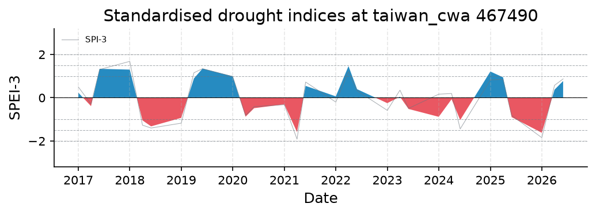
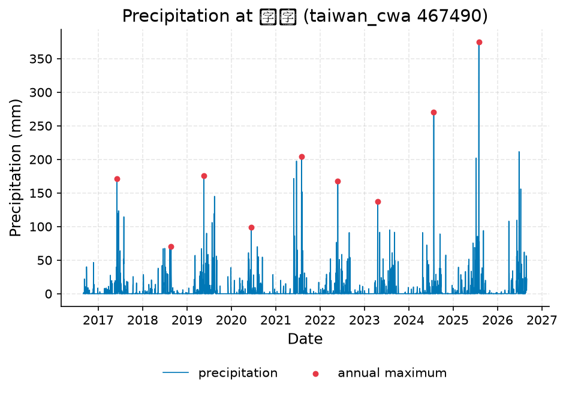
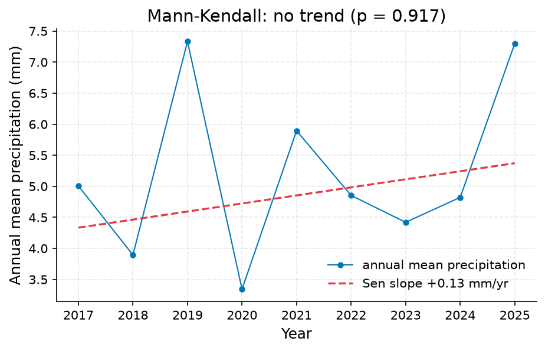

# Taichung Drought Status: Current Conditions Assessed, Historical Ranking Not Established

**Author:** AquaScope Studio  
**Date:** 2026-09-07  
**Description:** whether Taichung is currently in drought and, if so, how its severity and duration compare to the worst dry spells on record, to inform water-supply planning  
**Data Sources:** BasinATLAS (HydroATLAS v1.0), ERA5 via Open-Meteo, similar_basins, taiwan_cwa  
**Version:** 1.0  

**Site:** 24.1500 N, 120.6800 E

**Answer.** Using taiwan_cwa station 467490 (Taichung), the nearest available station in this catalog, current SPI-3 is 0.87 and SPEI-3 is 0.77 as of 2026-06-01, both classed normal; Taichung is not in drought by this reading. The station's served record spans only about 9-10 years (2016-08-31 to 2026-08-30), well short of the 30 years needed to fit the indices reliably or to rank this event against the worst drought in the nominal 130.7-year catalog, so SPI-12/SPEI-12 at the station could not be computed and no historical rank is established. A 30-year ERA5 reanalysis grid-cell cross-check (1996-2026) instead shows current SPI-12 at -0.44 and SPEI-12 at -0.98, both still classed normal, with the driest 12-month SPEI on that shorter record at -2.23 in 2021-05.

*Key numbers*

| Quantity | Value | Unit | Step |
| --- | --- | --- | --- |
| SPI at 3 months, 2026-06-01 | 0.8692 |  | s1 |
| SPEI at 3 months, 2026-06-01 | 0.7712 |  | s1 |
| ERA5 temperature trend | 0.1201 | C per decade | s1 |
| Record length | 10.0 | years | s2 |
| Mean of the record | 5.259 | mm | s2 |
| Mann-Kendall p-value (annual mean) | 0.917 |  | s2 |
| Sen's slope | 0.1298 | mm per year | s2 |
| SPI at 3 months, 2026-08-01 | 0.604 |  | s2.fallback |
| SPEI at 3 months, 2026-08-01 | 0.4416 |  | s2.fallback |
| ERA5 temperature trend | 0.3986 | C per decade | s2.fallback |

## Summary

The question was whether Taichung is currently in drought and how the dry spell compares with the worst on record, for water-supply planning. The nearest and longest station, taiwan_cwa 467490, is catalogued at 130.7 years but only served about 9-10 years of daily precipitation. Computed on that short window, current SPI-3 is 0.87 and SPEI-3 is 0.77 (2026-06-01), both class normal; no drought is indicated. The 12-month indices could not be computed at this station (insufficient months). Both the primary station analysis and its fallback failed the 30-year minimum-length gate, so the requested comparison against the worst historical drought could not be established. A secondary, 30-year ERA5 grid-cell cross-check shows SPI-12 -0.44 and SPEI-12 -0.98, also normal, with a historical worst SPEI-12 of -2.23 (2021-05) on that record.

## Problem and decision

The city needs to know whether Taichung is presently in drought and, if so, how its severity and duration compare with the worst dry spell on record, to inform water-supply planning. This requires current SPI and SPEI at 3- and 12-month timescales, the current drought class and event duration, and a rank or percentile against the historical catalogue of droughts, ideally drawn from the longest available precipitation record near the site.

## Site and data

The reference record is taiwan_cwa station 467490 (Taichung), the nearest available station, catalogued as starting 1896-01-01 (130.7 years). However, the served daily precipitation data covers only 2016-08-31 to 2026-08-30 (3,244 daily values, about 9-10 years), with mean 5.2589 mm, median 0 mm, max 375 mm. Nearby short-record stations may be available for a recent-period cross-check per the study plan, but none were run or verified with a tool result in this study, so no specific station or record length can be reported here.

## Methodology

SPI and SPEI were computed at 3- and 12-month timescales from station 467490 precipitation, with SPEI using Thornthwaite PET from ERA5 temperature. A Mann-Kendall trend test with Sen's slope was run on the station's annual precipitation to check for a longer-term drying signal. A cross-check against ERA5-reanalysis-derived SPI/SPEI (Open-Meteo, about 9 km grid cell) was attempted as a fallback when the station record proved too short. All analyses required a 30-year minimum record length gate.

## Results: step s1

Station 467490 drought indices (2016-08-31 to 2026-08-30, 108 months, 9.0 years) failed the 30-year minimum-length gate. Current SPI-3 = 0.869246 and SPEI-3 = 0.771198, both class normal, dated 2026-06-01; status is not in drought. Worst SPI-3 in this window was -1.913553 (2021-04-01) and worst SPEI-3 was -1.619423 (2026-01-01), both in the severe range, but this ranking covers only about 9 years, not the 130.7-year catalog. SPI-12/SPEI-12 could not be computed (no qualifying months), and no historical-catalog ranking is established at this station.


*SPEI (bars) with SPI (grey line) at taiwan_cwa 467490 for the 3 month accumulations, 2016 to 2026: blue above zero is wetter than normal, red below is drier; the dashed lines mark the moderate (1), severe (1.5) and extreme (2) classes.*


*SPEI (bars) with SPI (grey line) at taiwan_cwa 467490 for the 3 month accumulations, 2016 to 2026: blue above zero is wetter than normal, red below is drier; the dashed lines mark the moderate (1), severe (1.5) and extreme (2) classes.*

*Monthly SPI and SPEI at taiwan_cwa 467490 per timescale.*

| date | spi_3 | spei_3 |
| --- | --- | --- |
| 2017-01-01 | 0.498551508398566 | 0.2340392370992788 |
| 2017-04-01 | -0.2925782463041896 | -0.3872927389064572 |
| 2017-06-01 | 1.303622750862473 | 1.3357027240525905 |
| 2018-01-01 | 1.6806362288603036 | 1.2994641808146274 |
| 2018-04-01 | -1.26822646921629 | -1.0449803104901343 |
| 2018-06-01 | -1.3990434961138796 | -1.322354241038261 |
| 2019-01-01 | -1.1751179193900925 | -0.9294467162538692 |
| 2019-04-01 | 1.155184969336892 | 0.8918582250642252 |
| 2019-06-01 | 1.3415223887487695 | 1.3473307817241644 |
| 2020-01-01 | 0.977179594446586 | 0.9920558788288512 |
| 2020-04-01 | -0.8168182388081486 | -0.8760945337859835 |
| 2020-06-01 | -0.411423200609631 | -0.4817507799853179 |
| 2021-01-01 | -0.3207969838455196 | -0.3075196554363871 |
| 2021-04-01 | -1.9135526646674423 | -1.589424522727655 |
| 2021-06-01 | 0.7248785609387821 | 0.546798570584049 |
| 2022-01-01 | -0.2016669786692962 | 0.0624218339926601 |
| 2022-04-01 | 1.2027601202600453 | 1.460232061889363 |
| 2022-06-01 | 0.3224541961648917 | 0.3936542827310081 |
| 2023-01-01 | -0.5833836886404046 | -0.2499641794577134 |
| 2023-04-01 | 0.3497211796943849 | 0.0467632217573543 |
| 2023-06-01 | -0.4918843318137119 | -0.5196468150993832 |
| 2024-01-01 | 0.1634900225004868 | -0.881666591082512 |
| 2024-04-01 | 0.1956738099591957 | -0.0701438566391882 |
| 2024-06-01 | -1.4411840293265452 | -1.0305665893381726 |
| 2025-01-01 | 0.8236798020856329 | 1.2118822161569214 |
| 2025-04-01 | 0.8476268898937287 | 0.942596488204413 |
| 2025-06-01 | -0.818149711507001 | -0.896094510349776 |
| 2026-01-01 | -1.846182353341342 | -1.6194225818004797 |
| 2026-04-01 | 0.5727093030888613 | 0.371491777713747 |
| 2026-06-01 | 0.8692457515597174 | 0.7711979168675562 |

*Drought classes, worst months and event counts per timescale at taiwan_cwa 467490.*

| timescale | index | current | class | date | worst | worst_date | events | n |
| --- | --- | --- | --- | --- | --- | --- | --- | --- |
| 3 | SPI | 0.8692457515597174 | normal | 2026-06-01 | -1.9135526646674423 | 2021-04-01 | 4.0 | 30 |
| 3 | SPEI | 0.7711979168675562 | normal | 2026-06-01 | -1.6194225818004797 | 2026-01-01 | 4.0 | 30 |
| 12 | SPI |  | unknown |  |  |  |  | 0 |
| 12 | SPEI |  | unknown |  |  |  |  | 0 |

*Divergence between SPEI and SPI per timescale at taiwan_cwa 467490.*

| timescale | current | mean_last_10y | months_spei_drier_pct | correlation | n |
| --- | --- | --- | --- | --- | --- |
| 3 | -0.0980478346921611 | -0.0115935996485434 | 46.666666666666664 | 0.9579719011145126 | 30 |

## Results: step s2

The Mann-Kendall trend test on station 467490 annual mean precipitation (n = 9 years) failed the 30-year gate. Result: tau = 0.0556, p = 0.917 (no significant trend), Sen's slope = 0.1298 mm/year. The fallback substituted a 30-year ERA5 grid-cell drought_indices run (1996-2026, precipitation_source ERA5 cell, not the station), which also failed its length gate on record metadata. Current SPI-3 = 0.604044 and SPEI-3 = 0.441589, both class normal; current SPI-12 = -0.441479 and SPEI-12 = -0.98034, also class normal. The worst SPEI-12 in this record was -2.227059, dated 2021-05-01. ERA5 annual mean temperature was 22.36 C with a trend of 0.3986 C/decade (p = 7.6e-05, increasing, n = 29 years).


*Daily precipitation at 臺中 (taiwan_cwa 467490), 2016 to 2026, with the annual maxima marked.*


*Daily precipitation at 臺中 (taiwan_cwa 467490), 2016 to 2026, with the annual maxima marked.*


*Annual mean precipitation at 臺中 (taiwan_cwa 467490) with the Sen slope line; the Mann-Kendall test finds no trend (p = 0.917, 9 years).*


*Annual mean precipitation at 臺中 (taiwan_cwa 467490) with the Sen slope line; the Mann-Kendall test finds no trend (p = 0.917, 9 years).*


*SPEI (bars) with SPI (grey line) at the site at 24.15 N, 120.68 E for the 1, 3, 6, 12 month accumulations, 1996 to 2026: blue above zero is wetter than normal, red below is drier; the dashed lines mark the moderate (1), severe (1.5) and extreme (2) classes.*


*SPEI (bars) with SPI (grey line) at the site at 24.15 N, 120.68 E for the 1, 3, 6, 12 month accumulations, 1996 to 2026: blue above zero is wetter than normal, red below is drier; the dashed lines mark the moderate (1), severe (1.5) and extreme (2) classes.*

*The record at 臺中 (taiwan_cwa 467490) (datetime, value).*

| datetime | value |
| --- | --- |
| 2016-08-31 | 0.0 |
| 2016-09-01 | 0.0 |
| 2016-09-02 | 1.5 |
| 2016-09-03 | 1.4 |
| 2016-09-04 | 1.2 |
| 2016-09-05 | 1.7 |
| 2016-09-06 | 0.8 |
| 2016-09-07 | 1.5 |
| 2016-09-08 | 0.1 |
| 2016-09-09 | 22.0 |
| 2016-09-10 | 1.0 |
| 2016-09-11 | 0.0 |
| 2016-09-12 | 0.0 |
| 2016-09-13 | 0.0 |
| 2016-09-14 | 3.2 |
| 2016-09-15 | 9.0 |
| 2016-09-16 | 0.0 |
| 2016-09-17 | 10.5 |
| 2016-09-18 | 1.5 |
| 2016-09-19 | 0.0 |
| 2016-09-20 | 0.0 |
| 2016-09-21 | 0.0 |
| 2016-09-22 | 0.0 |
| 2016-09-23 | 0.0 |
| 2016-09-24 | 0.0 |
| 2016-09-25 | 0.0 |
| 2016-09-26 | 0.5 |
| 2016-09-27 | 40.0 |
| 2016-09-28 | 28.5 |
| 2016-09-29 | 0.8 |
| 2016-09-30 | 1.0 |
| 2016-10-02 | 0.0 |
| 2016-10-03 | 0.0 |
| 2016-10-04 | 0.0 |
| 2016-10-05 | 0.0 |
| 2016-10-06 | 6.0 |
| 2016-10-07 | 1.5 |
| 2016-10-08 | 9.0 |
| 2016-10-09 | 1.0 |
| 2016-10-10 | 0.0 |
| 2016-10-11 | 0.4 |
| 2016-10-12 | 0.0 |
| 2016-10-13 | 0.0 |
| 2016-10-14 | 0.0 |
| 2016-10-15 | 0.0 |
| 2016-10-16 | 0.0 |
| 2016-10-17 | 0.0 |
| 2016-10-18 | 0.0 |
| 2016-10-19 | 0.0 |
| 2016-10-20 | 0.0 |

*Summary of the record at 臺中 (taiwan_cwa 467490).*

| item | value |
| --- | --- |
| source | taiwan_cwa |
| station_id | 467490 |
| variable | precipitation |
| unit | mm |
| n | 3244 |
| start | 2016-08-31 |
| end | 2026-08-30 |
| years | 10.0 |
| stats.mean | 5.2589 |
| stats.median | 0.0 |
| stats.min | 0.0 |
| stats.max | 375.0 |

*Annual maxima at 臺中 (taiwan_cwa 467490).*

| year | value |
| --- | --- |
| 2017 | 171.5 |
| 2018 | 70.5 |
| 2019 | 175.5 |
| 2020 | 99.0 |
| 2021 | 204.5 |
| 2022 | 168.0 |
| 2023 | 137.0 |
| 2024 | 270.0 |
| 2025 | 375.0 |

*Mann-Kendall trend test and Sen slope at 臺中 (taiwan_cwa 467490).*

| item | value |
| --- | --- |
| on | annual mean |
| p_value | 0.917 |
| tau | 0.0556 |
| trend | no trend |
| sens_slope_per_year | 0.1298 |
| n_years | 9 |

*Monthly SPI and SPEI at the site at 24.15 N, 120.68 E per timescale.*

| date | spi_1 | spei_1 | spi_3 | spei_3 | spi_6 | spei_6 | spi_12 | spei_12 |
| --- | --- | --- | --- | --- | --- | --- | --- | --- |
| 1996-09-01 | -0.4094103907361339 | -0.2993718847694179 |  |  |  |  |  |  |
| 1996-10-01 | 0.3626772739187627 | 0.5319814004249878 |  |  |  |  |  |  |
| 1996-11-01 | 0.4918853868351978 | 0.4536299612508692 | -0.1507107559768911 | -0.0810564498089272 |  |  |  |  |
| 1996-12-01 | -1.3472119665065487 | -1.0687043790395885 | -0.1425850919350464 | -0.0526131641954728 |  |  |  |  |
| 1997-01-01 | 0.3944914625502327 | 0.5590837861424739 | -0.258313018607089 | -0.1524857817017946 |  |  |  |  |
| 1997-02-01 | 1.121583451625433 | 1.1849807114833673 | 0.4483945976506548 | 0.5571918797178093 | -0.0343074487054291 | -0.0903839793142569 |  |  |
| 1997-03-01 | 0.0770728912793365 | 0.1800233778188191 | 0.6648723817166279 | 0.8298209098252988 | 0.3368165686215326 | 0.3957667114568992 |  |  |
| 1997-04-01 | -0.7582410755879524 | -0.8342054840432305 | 0.0490347884330314 | -0.0247404260824202 | -0.1477680695831062 | -0.200115692853851 |  |  |
| 1997-05-01 | -0.8621412529619271 | -0.7958518937847898 | -1.0159885810513305 | -0.939979542610587 | -0.6870662654428148 | -0.6054111605035912 |  |  |
| 1997-06-01 | 1.00811364542893 | 1.163135303223506 | -0.0156833904153544 | 0.1658708008994798 | 0.2099875252457556 | 0.3653352505050488 |  |  |
| 1997-07-01 | -0.821724966090492 | -0.6787433572760231 | -0.2979864067463139 | -0.1954542433995008 | -0.2754726637965499 | -0.0881796974810513 |  |  |
| 1997-08-01 | 0.7719644016192427 | 0.8284410761604719 | 0.63906246268013 | 0.8007659521104551 | -0.0895252153370306 | 0.086501543830532 | -0.1722261796107045 | 0.0980430490267166 |
| 1997-09-01 | -0.6816064124509416 | -0.4102987004125083 | -0.2707260295468586 | -0.1133228282605746 | -0.3829622503615795 | -0.1491239900045935 | -0.2122142690542199 | -0.0431004268415009 |
| 1997-10-01 | -1.1308323281479542 | -0.804791860594747 | 0.0019291296197818 | -0.0678206268922996 | -0.4444632700459409 | -0.1382048288350219 | -0.44724491954916 | -0.3448250670833576 |
| 1997-11-01 | -0.7446327333525852 | -0.5767102935456291 | -1.302620910926119 | -0.9174795466390688 | -0.0906588944284085 | 0.0729950418959395 | -0.6151982390957973 | -0.4895011009895528 |
| 1997-12-01 | -0.4800947570779249 | -0.7697067146648565 | -1.7017843323248616 | -1.3056108738036944 | -0.8252689562075002 | -0.6242506221978473 | -0.5383100389109678 | -0.4383918394215697 |
| 1998-01-01 | 1.4051837592537992 | 1.4359934158175411 | 0.1611505136719772 | 0.2024647827912293 | -0.037003969900933 | -0.0785902947034999 | -0.3673302997410123 | -0.26964966343243 |
| 1998-02-01 | 2.0130017110285996 | 1.8402714086494325 | 1.8814299333374227 | 1.847232270239303 | 0.1492499210367575 | 0.161316682075095 | -0.0600554052006466 | 0.0553572146849994 |
| 1998-03-01 | 0.8755107224200985 | 0.9366667328549412 | 1.9737220927344483 | 1.710907236716309 | 1.0058144904741284 | 1.0899952722928474 | 0.1247678442507369 | 0.3278711467171357 |
| 1998-04-01 | 0.484261809795617 | 0.338711558396927 | 1.534586438082502 | 1.704597060685468 | 1.340127476859931 | 1.4985149725347195 | 0.410591392776858 | 0.6092606607851001 |
| 1998-05-01 | -0.555193006978035 | -0.5294282760803999 | 0.1022264054816376 | 0.1287148582877562 | 0.920984526817592 | 0.9306977651396336 | 0.4183917569830825 | 0.5351382837564966 |
| 1998-06-01 | 0.2481769890434634 | 0.2392276367161855 | -0.0599489171958537 | -0.0249872734334003 | 0.841958450774023 | 0.8930153243449178 | 0.0775937498182985 | 0.1959518128678173 |
| 1998-07-01 | -1.0110412593850024 | -0.956205236829674 | -0.916631329140238 | -0.9338145863505364 | 0.1539243284704879 | 0.1973245974642375 | 0.0362796714434791 | 0.0935400263052099 |
| 1998-08-01 | -0.5762060474564948 | -0.6709581160203064 | -1.0720686238849038 | -1.0354538316744373 | -0.8731055563915794 | -0.910231528872899 | -0.7808730875238991 | -0.705009963296983 |
| 1998-09-01 | 0.4839515753720092 | 0.6619489564922082 | -0.8448579355540066 | -0.8135378126045999 | -0.935254070557381 | -0.9230693097870878 | -0.305958778382553 | -0.3566430798299049 |
| 1998-10-01 | 1.9514005142878632 | 1.82126473872432 | 0.5200393193005176 | 0.4349250379728508 | -0.4295095769522493 | -0.3740255252308743 | 0.3994133937880538 | 0.3558966821208054 |
| 1998-11-01 | -0.5172737327367454 | -0.7479385302206168 | 1.0958330454762095 | 1.1299840635935268 | -0.1568591634211676 | -0.2180539679945442 | 0.427038363497591 | 0.3367589282628279 |
| 1998-12-01 | 0.9105081854514449 | 0.7659854862817868 | 1.6056469660696286 | 1.5344785914667758 | -0.104122873905045 | -0.1512591407516575 | 0.5822071093557935 | 0.511209020539364 |
| 1999-01-01 | -0.6391103067588846 | -0.8588469313019466 | -0.2570478901348312 | -0.5331360688519432 | 0.3874428982719463 | 0.1832868378274658 | 0.3273149082846116 | 0.1897084338614628 |
| 1999-02-01 | -1.358553063035146 | -1.0265198903846935 | -0.5890631483757592 | -0.7791730450571526 | 0.7783801992266693 | 0.7016049147157358 | -0.3708224419833239 | -0.5625918731088693 |
| 1999-03-01 | -0.570044735326606 | -0.6533335305873824 | -1.311813695202111 | -1.372122797337597 | 0.4180414964183413 | 0.2224068456579823 | -0.6614430290443395 | -0.7652062185283962 |
| 1999-04-01 | -0.9661773087190676 | -1.0646823705064064 | -1.545018960520718 | -1.4423963588163486 | -1.4224393644568178 | -1.4622694412839556 | -1.0989894241350568 | -1.12230553252097 |
| 1999-05-01 | 0.2743926184013499 | 0.553716280271385 | -0.5132850021194516 | -0.4456620344559116 | -0.7483242211461748 | -0.8092625895467662 | -0.5900776657255662 | -0.6911525145804912 |
| 1999-06-01 | -1.297436615120088 | -1.1978912773385262 | -1.00189961962523 | -0.9229235757881996 | -1.4070226645644477 | -1.3256871568985595 | -1.146367267232196 | -1.0690567916880465 |
| 1999-07-01 | 0.5993008962932471 | 0.7475572615806989 | -0.2868150475745789 | -0.213482056785554 | -0.934980000657382 | -0.8399974367328832 | -0.4535189072770255 | -0.4571071354363262 |
| 1999-08-01 | -0.4979512244969243 | -0.512192365922906 | -0.8393525144311034 | -0.7568974148047459 | -1.1114943231866623 | -0.9960963172053964 | -0.5824551153701434 | -0.4924753077198288 |
| 1999-09-01 | 0.417228832539305 | 0.6028930194800216 | 0.0582236293965123 | 0.187259334657979 | -0.8456953484799471 | -0.6834343554903357 | -0.530192387830385 | -0.5462141210907506 |
| 1999-10-01 | 0.4748180025152355 | 0.6164023425582418 | -0.1436174981262381 | -0.2828012517518928 | -0.5777136578778612 | -0.3542785944529976 | -1.116898175965325 | -1.089580918452607 |
| 1999-11-01 | -1.0625014623936606 | -0.7792575841488696 | 0.1597962070903959 | 0.2924330310446398 | -0.6646233945263841 | -0.5928058715273002 | -1.1913392761559494 | -1.1150990226851278 |
| 1999-12-01 | 0.3172674412526767 | 0.2920885255480755 | -0.1122775240289826 | 0.0111429856771317 | -0.0659851316997254 | 0.0601966163071322 | -1.2545460522451228 | -1.121178980582573 |
| 2000-01-01 | -0.0946311414954127 | -0.1305317172653459 | -0.6763219083540494 | -0.5472258201333557 | -0.4478896880864495 | -0.5141656635962474 | -1.2554698248989626 | -1.1108904286688426 |
| 2000-02-01 | 1.1234484392715918 | 1.1771058495452191 | 0.7013269185698535 | 0.7430956001503516 | 0.3946337994869927 | 0.4047007235996933 | -0.8284053866279961 | -0.7711812179471519 |
| 2000-03-01 | -0.9361159832572554 | -0.8181624842683479 | 0.0987475107164002 | 0.2796170359706741 | -0.1242823861084282 | -0.1010802851209431 | -0.859991709940378 | -0.7031328511260783 |
| 2000-04-01 | 1.0338726689412527 | 1.1562774466446584 | 0.7618897582463524 | 0.8563168122420399 | 0.3427398654767467 | 0.3799667427718838 | -0.3255242051264765 | -0.1881097529285707 |
| 2000-05-01 | -0.9268507140597728 | -0.8496067156830603 | -0.3410413681272848 | -0.2187842133060442 | -0.0363725517963113 | 0.0376701091565389 | -0.5867526942656172 | -0.54669485025861 |
| 2000-06-01 | -0.0509623324468525 | -0.0881305935309205 | -0.1261973683102992 | -0.0065427882887298 | -0.1253320008662433 | -0.0536867521202993 | -0.2197794483764413 | -0.063599182397857 |
| 2000-07-01 | 0.1832986348430717 | 0.3164150282798539 | -0.5626723695775819 | -0.5471985036995325 | -0.0895026271690818 | 0.0470308500773685 | -0.3671350551535442 | -0.2580187019507357 |
| 2000-08-01 | -0.1394423701433679 | -0.1599580610314346 | -0.2722810333935533 | -0.2351729820238226 | -0.5276604486271602 | -0.422914336496567 | -0.3237989824360253 | -0.1026816006675815 |
| 2000-09-01 | -0.8042352691010255 | -0.6309999607149549 | -0.4959661474419631 | -0.3870411993673512 | -0.6859155921471584 | -0.5393403609131909 | -0.6492248614454839 | -0.5642223471139091 |
| 2000-10-01 | 0.7645000894256996 | 0.8196317803145764 | -0.3508196925830267 | -0.5097356645598631 | -1.0395626368707005 | -0.8724969288197908 | -0.616599025732381 | -0.6136078234605389 |

*Drought classes, worst months and event counts per timescale at the site at 24.15 N, 120.68 E.*

| timescale | index | current | class | date | worst | worst_date | events | n |
| --- | --- | --- | --- | --- | --- | --- | --- | --- |
| 1 | SPI | 0.824906887419408 | normal | 2026-08-01 | -2.8884785355365596 | 2003-12-01 | 49 | 360 |
| 1 | SPEI | 0.7793936024063305 | normal | 2026-08-01 | -2.2224617332534913 | 2009-05-01 | 46 | 360 |
| 3 | SPI | 0.6040441457252673 | normal | 2026-08-01 | -2.605126733204464 | 2017-10-01 | 33 | 358 |
| 3 | SPEI | 0.4415891962430592 | normal | 2026-08-01 | -2.187724965625535 | 2002-06-01 | 29 | 358 |
| 6 | SPI | 0.4861488066022635 | normal | 2026-08-01 | -2.7305950204693934 | 2020-11-01 | 23 | 355 |
| 6 | SPEI | 0.2557610110533294 | normal | 2026-08-01 | -2.130810139926823 | 2020-11-01 | 19 | 355 |
| 12 | SPI | -0.4414793865163671 | normal | 2026-08-01 | -2.9331077753407357 | 2021-05-01 | 11 | 349 |
| 12 | SPEI | -0.9803402207562422 | normal | 2026-08-01 | -2.227058507991267 | 2021-05-01 | 14 | 349 |

*Divergence between SPEI and SPI per timescale at the site at 24.15 N, 120.68 E.*

| timescale | current | mean_last_10y | months_spei_drier_pct | correlation | n |
| --- | --- | --- | --- | --- | --- |
| 1 | -0.0455132850130775 | -0.0668367326304794 | 64.16666666666667 | 0.9787262058832438 | 360 |
| 3 | -0.1624549494822081 | -0.0796258689620782 | 70.83333333333334 | 0.9859260062753972 | 358 |
| 6 | -0.2303877955489341 | -0.1088824956867825 | 82.5 | 0.9867397350250784 | 355 |
| 12 | -0.5388608342398751 | -0.2222921757599833 | 95.83333333333334 | 0.9741809770827228 | 349 |

## Limitations and what this study does not establish

The core station record (467490) served only about 9-10 years, not the catalogued 130.7 years, so the 30-year minimum-length gate failed for both the drought-indices and trend steps; the requested rank of the current event against the worst historical drought is not established. SPI-12/SPEI-12 could not be computed at the station. The ERA5 grid-cell cross-check covers 30 years but describes a roughly 9 km cell, not the gauge, and its own length gate also failed on metadata grounds. The planned short-station recent cross-check did not run. SPEI here uses Thornthwaite PET, a temperature-only approximation; FAO-56 Penman-Monteith would be preferred if humidity, wind, and radiation data existed. The indices are monthly resolution and cannot see sub-monthly (flash) drought onset. No cause is established for any observed trend, and no discharge or groundwater record exists at this site to link the precipitation-based assessment to reservoir or aquifer status.

## What this study does not establish

- Step s1, gate min_years: 9 years of record, 30 needed: too short
- Step s2, gate min_years: 10 years of record, 30 needed: too short
- Step s2.fallback, gate min_years: no record length at 'years'
- The study stopped at s2: gate failed: min_years (10 years of record, 30 needed: too short); the fallback drought_indices did not pass its own gates
- These numbers are not in any tool result: -12.0, -12.0, -12.0, -12.0, -12.0, -12.0.

## Caveats

- Monthly resolution: the indices see droughts a month and longer; what happened this week is not in them, and a flash drought is out of their reach.
- SPI and SPEI say how unusual a deficit is against this record; they say nothing about its cause, and the SPI-to-SGI lag is a statistical association read off the two series, not a model of the aquifer.
- SPEI needs a PET series: here PET is Thornthwaite (1948) from ERA5 temperature, a temperature-only approximation and the formulation SPEI was introduced with; FAO-56 Penman-Monteith is the better PET where humidity, wind and radiation exist.

## Recommendations

Obtain the full multi-decadal archive for station 467490 (or another station covering close to the catalogued 130.7 years) before drawing conclusions on historical rank; the current normal classification (SPI-3 0.87, SPEI-3 0.77) should be treated as provisional given the short served record. Once an inventory step identifies and confirms nearby short-record stations, run a recent-period cross-check against them to corroborate current conditions without extending history. Where feasible, substitute FAO-56 Penman-Monteith PET for Thornthwaite in SPEI. Monitor the ERA5-based SPEI-12 (-0.98), which sits near the moderate-drought threshold, even though presently classed normal. Do not attribute any trend to a specific cause without further analysis, and consider adding discharge or groundwater indices if water-supply decisions require direct hydrologic linkage.

## References

1. Vicente-Serrano et al. (2010)
2. Mann, H. B. (1945). Nonparametric tests against trend. Econometrica, 13, 245-259
3. Kendall (1975)
4. Sen, P. K. (1968). J. Am. Stat. Assoc., 63, 1379-1389.
5. Hersbach, H. et al. (2020). The ERA5 global reanalysis. Q. J. R. Meteorol. Soc., 146, 1999-2049
6. McKee, T. B., Doesken, N. J., & Kleist, J. (1993). The relationship of drought frequency and duration to time scales. Proc. 8th Conf. on Applied Climatology, 179-184.
7. WMO (2012). Standardized Precipitation Index User Guide (Svoboda, Hayes, Wood). WMO-No. 1090.
8. Vicente-Serrano, S. M., Begueria, S., & Lopez-Moreno, J. I. (2010). A multiscalar drought index sensitive to global warming: the Standardized Precipitation Evapotranspiration Index. J. Climate 23, 1696-1718. doi:10.1175/2009JCLI2909.1; Begueria, S. et al. (2014). SPEI revisited: parameter fitting, evapotranspiration models, tools, datasets and drought monitoring. Int. J. Climatol. 34, 3001-3023. doi:10.1002/joc.3887
9. Thornthwaite, C. W. (1948). An approach toward a rational classification of climate. Geographical Review 38, 55-94.
10. Open-Meteo.com (CC BY 4.0).
11. Begueria, S., Vicente-Serrano, S. M., Reig, F., & Latorre, B. (2014). Standardized precipitation evapotranspiration index (SPEI) revisited. Int. J. Climatol. 34, 3001-3023. doi:10.1002/joc.3887
12. Bloomfield, J. P., & Marchant, B. P. (2013). Analysis of groundwater drought building on the standardised precipitation index approach. Hydrol. Earth Syst. Sci. 17, 4769-4787.
13. SPI against SPEI at 219 stations across Turkiye: Earth Science Informatics (2024), doi:10.1007/s12145-024-01401-8
14. SPI-SPEI correlation under warming in Umbria: Environ. Sci. Pollut. Res. (2024), doi:10.1007/s11356-024-35740-2
15. FAO-56 Penman-Monteith
16. Rekin226 and contributors (2026). AquaScope: Open-source water data aggregation toolkit (version 0.14.0) [Software]. Zenodo. https://doi.org/10.5281/zenodo.21903143

## Appendix: reproducibility

Re-run the same steps with no model: `aquascope run study.yaml`. Resume the workspace: `aquascope studio --resume workspace.json`.

Model: claude-sonnet-5 via anthropic; ledger: consultant 1 call(s), 4364 tokens, methodologist 1 call(s), 18153 tokens, analyst 1 call(s), 4965 tokens, author 1 call(s), 16470 tokens, critic 1 call(s), 16161 tokens. aquascope 0.14.0.

```yaml
# An AquaScope study (version 3): the plan behind an answer, its gates, and what happened.
#   aquascope run study.yaml
version: 3
title: "Determine whether Taichung is currently in drought, characte: 24.15, 120.68"
question: "Is Taichung in drought now, and how does this dry spell compare with the worst on record? It matters for the city's water supply."
created: "2026-09-07T13:37:54+00:00"
aquascope_version: "0.14.0"
author: "methodologist"
model: "claude-sonnet-5"
problem:
  kind: "drought"
  site: {"lat": 24.15, "lon": 120.68}
  params: {"timescales": [3, 12], "drought_concern": "water supply", "flash_drought": false}
  text: "Is Taichung in drought now, and how does this dry spell compare with the worst on record? It matters for the city's water supply."
plan:
  author: "methodologist"
  playbook: "drought_status"
  objective: "Determine whether Taichung is currently in drought, characterize its severity and duration, and rank it against the worst dry spell in the 130.7-year Taichung record to inform city water-supply planning."
  decision: "whether Taichung is currently in drought and, if so, how its severity and duration compare to the worst dry spells on record, to inform water-supply planning"
  methodology: ["Compute SPI and SPEI at 3- and 12-month timescales on the 130.7-year daily precipitation record at taiwan_cwa station 467490 (Taichung, 0.6 km from the site), the longest and nearest station available, to get the current index values, drought classification, current event duration, and the full catalogue of historical drought events.", "Test the same long station's precipitation series for a Mann-Kendall trend to see whether the current dry spell sits inside a longer-term drying signal, which affects how its severity should be read.", "Cross-check the station-based SPEI classification against an ERA5-reanalysis-derived SPEI at the same point, since the station-only Thornthwaite PET is a known source of uncertainty in the primary result.", "Cross-check the current SPI/SPEI reading against a nearby short station for the recent period only, without treating it as an extension of the historical record, per the stated constraint that short stations may support recent checks but not extend history.", "Report the current SPI-3/12 and SPEI-3/12 values, drought class, duration, its rank/percentile against the historical event catalogue, and the severity and duration of the worst historical drought, together with the trend and cross-check context."]
  assumptions: ["precipitation record resolution is daily, per catalog note", "CWA station 467490 is used as the reference record given its 0.6 km distance and 130.7-year length", "flash_drought left at its default (false) since the text does not raise sub-monthly onset as a concern", "FAO56 ET0 and SPEI/SPEI-reanalysis are computed from station and reanalysis-derived forcing per the sufficiency assessment", "Precipitation record resolution is daily at all stations, per the catalog note.", "CWA station 467490 is used as the reference record given its 0.6 km distance and 130.7-year length.", "flash_drought is left at its default (false) since the brief does not raise sub-monthly onset as a concern.", "SPEI is computed from station or reanalysis-derived Thornthwaite PET per the sufficiency assessment; FAO-56 Penman-Monteith PET is not available at this site.", "The shorter nearby stations (e.g. C0F9U0, 15.3 years) are used only for a recent cross-check, not to extend the historical drought catalogue, per the stated constraint."]
  alternatives: [{"method": "low_flow_frequency", "why_not": "sufficiency table marks it not_defensible: no discharge record at this site"}, {"method": "baseflow_separation", "why_not": "sufficiency table marks it not_defensible: no discharge record at this site"}, {"method": "sgi", "why_not": "sufficiency table marks it not_defensible: no groundwater level record at this site"}, {"method": "using a short nearby station as the primary record", "why_not": "at 12-20 years these stations cannot support ranking against the worst historical drought, which needs the full 130.7-year record"}]
  limitations_expected: ["Monthly-resolution SPI/SPEI see droughts a month and longer; sub-monthly (flash) onset is out of their reach.", "SPI and SPEI say how unusual the current deficit is against this record; they say nothing about its cause.", "SPEI here uses Thornthwaite PET, a temperature-only approximation; FAO-56 Penman-Monteith would be preferred if humidity, wind and radiation data existed at this site.", "No discharge or groundwater record exists at this site, so the drought assessment is precipitation- and evaporative-demand-based only, with no direct link to reservoir inflow or aquifer levels."]
  citations: ["McKee, T. B., Doesken, N. J., & Kleist, J. (1993). The relationship of drought frequency and duration to time scales. Proc. 8th Conf. on Applied Climatology, 179-184.", "Vicente-Serrano, S. M., Begueria, S., & Lopez-Moreno, J. I. (2010). A multiscalar drought index sensitive to global warming: the Standardized Precipitation Evapotranspiration Index. J. Climate 23, 1696-1718. doi:10.1175/2009JCLI2909.1", "Begueria, S., Vicente-Serrano, S. M., Reig, F., & Latorre, B. (2014). Standardized precipitation evapotranspiration index (SPEI) revisited. Int. J. Climatol. 34, 3001-3023. doi:10.1002/joc.3887", "Thornthwaite, C. W. (1948). An approach toward a rational classification of climate. Geographical Review 38, 55-94.", "Bloomfield, J. P., & Marchant, B. P. (2013). Analysis of groundwater drought building on the standardised precipitation index approach. Hydrol. Earth Syst. Sci. 17, 4769-4787.", "WMO (2012). Standardized Precipitation Index User Guide (Svoboda, Hayes, Wood). WMO-No. 1090.", "SPI against SPEI at 219 stations across Turkiye: Earth Science Informatics (2024), doi:10.1007/s12145-024-01401-8", "SPI-SPEI correlation under warming in Umbria: Environ. Sci. Pollut. Res. (2024), doi:10.1007/s11356-024-35740-2", "Hersbach, H. et al. (2020). The ERA5 global reanalysis. Q. J. R. Meteorol. Soc. 146, 1999-2049.", "Thornthwaite (1948)", "FAO-56 Penman-Monteith"]
  caveats: ["Monthly resolution: the indices see droughts a month and longer; what happened this week is not in them, and a flash drought is out of their reach.", "SPI and SPEI say how unusual a deficit is against this record; they say nothing about its cause, and the SPI-to-SGI lag is a statistical association read off the two series, not a model of the aquifer.", "SPEI needs a PET series: here PET is Thornthwaite (1948) from ERA5 temperature, a temperature-only approximation and the formulation SPEI was introduced with; FAO-56 Penman-Monteith is the better PET where humidity, wind and radiation exist."]
  rationale: "Determine whether Taichung is currently in drought, characterize its severity and duration, and rank it against the worst dry spell in the 130.7-year Taichung record to inform city water-supply planning."
  recon_notes: ["Record resolution is not in the catalog; daily is assumed for every variable.", "10 donor gauges from a pool of 37,071 gauged catchments.", "ERA5 temperature and forcing and GloFAS discharge are assumed reachable for any point on land (Open-Meteo); not checked here.", "CMIP6 change factors need model output you supply (aquascope.climate works on downloaded data); not counted."]
  replans: [{"step": "s2", "reason": "gate failed: min_years (10 years of record, 30 needed: too short)", "fallback": {"tool": "drought_indices", "arguments": {"lat": 24.15, "lon": 120.68, "years": 30, "timescales": [1, 3, 6, 12], "pet": true}, "rationale": "Station 467490 (Taichung, Central Weather Administration) only returned 10 years of data, too short for the 30-year trend gate, so fall back to the ERA5 reanalysis grid cell at the site coordinates to compute SPI/SPEI over a sufficient 30-year record for assessing current drought status against historical severity.", "expects": [{"check": "not_empty", "path": "indices"}, {"check": "not_empty", "path": "current.spi"}, {"check": "not_empty", "path": "current.spei"}, {"check": "min_years", "path": "years"}]}}]
steps:
  - tool: "drought_indices"
    id: "s1"
    rationale: "The 130.7-year daily record at Taichung (taiwan_cwa 467490, 0.6 km from the site) computes SPI and SPEI at 3- and 12-month timescales, giving the current index values, drought class, the ongoing event's duration, and the full catalogue of historical drought events needed to rank the present dry spell against the worst on record."
    method: "spei"
    arguments:
      lat: 24.15
      lon: 120.68
      source: "taiwan_cwa"
      station_id: "467490"
      timescales: [3, 12]
      years: 130
    expects:
      - {"check": "min_years", "path": "years", "value": 30}
      - {"check": "not_empty", "path": "indices"}
      - {"check": "not_empty", "path": "current.spi"}
      - {"check": "not_empty", "path": "current.spei"}
    fallback: {"step": {"tool": "anywhere", "arguments": {"lat": 24.15, "lon": 120.68, "years": 130}, "rationale": "If the station record fails its gates, the ERA5 cell at the same point still supports an SPEI-reanalysis first-order current status.", "expects": []}}
    outputs: [{"kind": "figure", "id": "s1_drought_strip", "caption": "SPI-3/12 and SPEI-3/12 status strip for Taichung (taiwan_cwa 467490), 1893-2024"}, {"kind": "table", "id": "s1_drought_events", "caption": "Cataloged drought events (start, end, severity, duration) from the 130.7-year Taichung record, ranking the current event against the historical worst"}, {"kind": "table", "id": "s1_indices_monthly", "caption": "Monthly SPI-3, SPI-12, SPEI-3 and SPEI-12 values, 1893-2024"}, {"kind": "table", "id": "s1_index_divergence", "caption": "SPEI-minus-SPI divergence over the last ten years, against the ERA5 temperature trend"}]
  - tool: "analyze_station"
    id: "s2"
    rationale: "A Mann-Kendall trend test on the 130.7-year precipitation series checks whether the current dry spell sits within a longer-term drying trend, context for judging its severity against the historical record."
    method: "trend_mann_kendall"
    arguments:
      source: "taiwan_cwa"
      station_id: "467490"
      years: 130
      variable: "precipitation"
    expects:
      - {"check": "min_years", "path": "years", "value": 30}
      - {"check": "not_empty", "path": "trend"}
      - {"check": "unit_present", "path": "unit"}
    fallback: {"step": {"tool": "drought_indices", "arguments": {"lat": 24.15, "lon": 120.68, "years": 30, "timescales": [1, 3, 6, 12], "pet": true}, "rationale": "Station 467490 (Taichung, Central Weather Administration) only returned 10 years of data, too short for the 30-year trend gate, so fall back to the ERA5 reanalysis grid cell at the site coordinates to compute SPI/SPEI over a sufficient 30-year record for assessing current drought status against historical severity.", "expects": [{"check": "not_empty", "path": "indices"}, {"check": "not_empty", "path": "current.spi"}, {"check": "not_empty", "path": "current.spei"}, {"check": "min_years", "path": "years"}]}}
    depends_on: ["s1"]
    outputs: [{"kind": "table", "id": "s2_trend", "caption": "Mann-Kendall trend statistic and slope for Taichung precipitation, 1893-2024"}]
  - tool: "anywhere"
    id: "s3"
    rationale: "An independent ERA5-based SPEI cross-check tests whether the station-based Thornthwaite PET is driving the drought classification, since evaporative demand is the main uncertainty in the primary SPEI result."
    method: "spei_reanalysis"
    arguments:
      lat: 24.15
      lon: 120.68
      years: 130
    expects:
      - {"check": "not_empty", "path": "climate"}
    depends_on: ["s1"]
    outputs: [{"kind": "table", "id": "s3_era5_crosscheck", "caption": "ERA5-reanalysis SPEI-3/12 cross-check against the station-based indices"}]
  - tool: "drought_indices"
    id: "s4"
    rationale: "The nearest short station, Nantun (taiwan_cwa C0F9U0, 4.5 km, 15.3 years), gives an independent recent-period check on the current SPI/SPEI reading without extending the historical record it cannot support."
    method: "spi"
    arguments:
      lat: 24.15
      lon: 120.68
      source: "taiwan_cwa"
      station_id: "C0F9U0"
      timescales: [3, 12]
      years: 15
    expects:
      - {"check": "not_empty", "path": "indices"}
      - {"check": "not_empty", "path": "current.spi"}
    depends_on: ["s1"]
    outputs: [{"kind": "table", "id": "s4_recent_crosscheck", "caption": "Recent SPI-3/12 cross-check at Nantun (taiwan_cwa C0F9U0), circa 2009-2024"}]
results:
  s1: {"ok": true, "gates": [{"check": "min_years", "passed": false, "detail": "9 years of record, 30 needed: too short"}, {"check": "not_empty", "passed": true, "detail": "'indices' is present"}, {"check": "not_empty", "passed": true, "detail": "'current.spi' is present"}, {"check": "not_empty", "passed": true, "detail": "'current.spei' is present"}], "summary": "years=9.0, start=2016-09-01, end=2026-08-01", "fallback_used": true, "sha256": "df0dfec174062ed4", "fallback": {"tool": "anywhere", "arguments": {"lat": 24.15, "lon": 120.68, "years": 130}, "ok": true, "gates": [], "summary": "years=130, start=1896-08-30, end=2026-08-31"}}
  s2: {"ok": true, "gates": [{"check": "min_years", "passed": false, "detail": "10 years of record, 30 needed: too short"}, {"check": "not_empty", "passed": true, "detail": "'trend' is present"}, {"check": "unit_present", "passed": true, "detail": "unit mm"}], "summary": "source=taiwan_cwa, station_id=467490, variable=precipitation, unit=mm, years=10.0, start=2016-08-31, end=2026-08-30", "fallback_used": true, "sha256": "2c4936f7eff174db", "fallback": {"tool": "drought_indices", "arguments": {"lat": 24.15, "lon": 120.68, "years": 30, "timescales": [1, 3, 6, 12], "pet": true}, "ok": true, "gates": [{"check": "not_empty", "passed": true, "detail": "'indices' is present"}, {"check": "not_empty", "passed": true, "detail": "'current.spi' is present"}, {"check": "not_empty", "passed": true, "detail": "'current.spei' is present"}, {"check": "min_years", "passed": false, "detail": "no record length at 'years'"}], "summary": "years=30.0, start=1996-09-01, end=2026-08-01"}}
```

## Cite this software

AquaScope Studio (2026). AquaScope: Open-source water data aggregation toolkit (version 0.14.0) [Software]. Zenodo. https://doi.org/10.5281/zenodo.21903143


---

*{'model': 'claude-sonnet-5', 'provider': 'anthropic', 'prose': 'model', 'tokens': {'consultant': {'calls': 1, 'prompt_tokens': 3317, 'completion_tokens': 1047}, 'methodologist': {'calls': 1, 'prompt_tokens': 10526, 'completion_tokens': 7627}, 'analyst': {'calls': 1, 'prompt_tokens': 3759, 'completion_tokens': 1206}, 'author': {'calls': 2, 'prompt_tokens': 23464, 'completion_tokens': 13738}, 'critic': {'calls': 1, 'prompt_tokens': 6614, 'completion_tokens': 9547}}, 'total_tokens': 80845, 'aquascope_version': '0.14.0', 'date': '2026-09-07 13:43 UTC', 'workspace': '33a84c7e4738', 'plan_author': 'methodologist'}*
