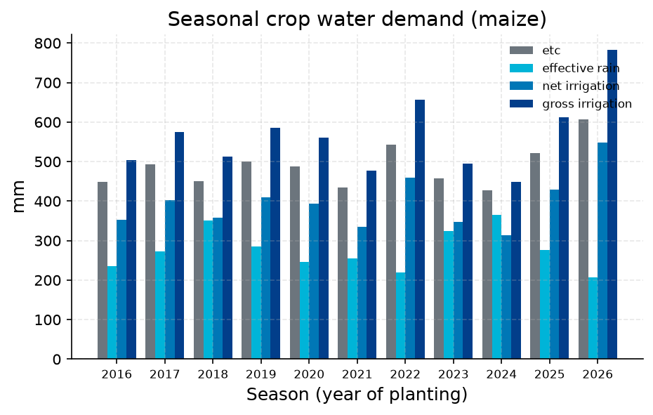
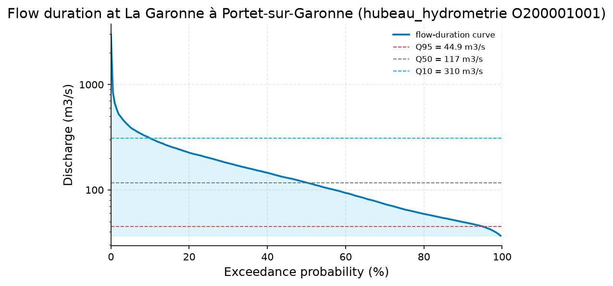
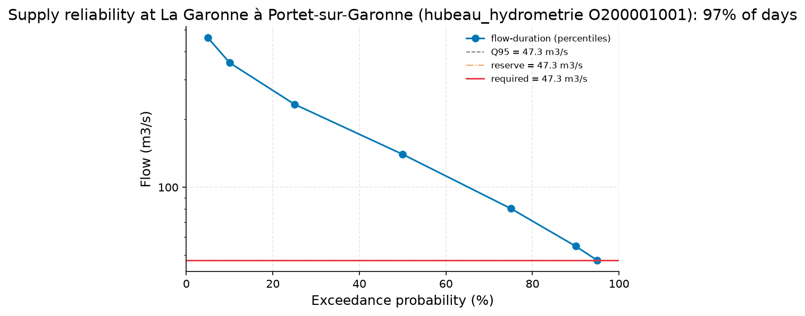
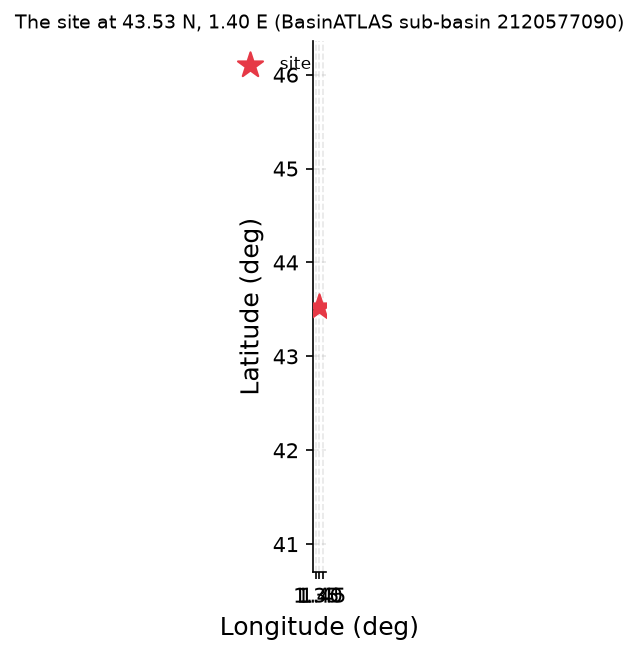
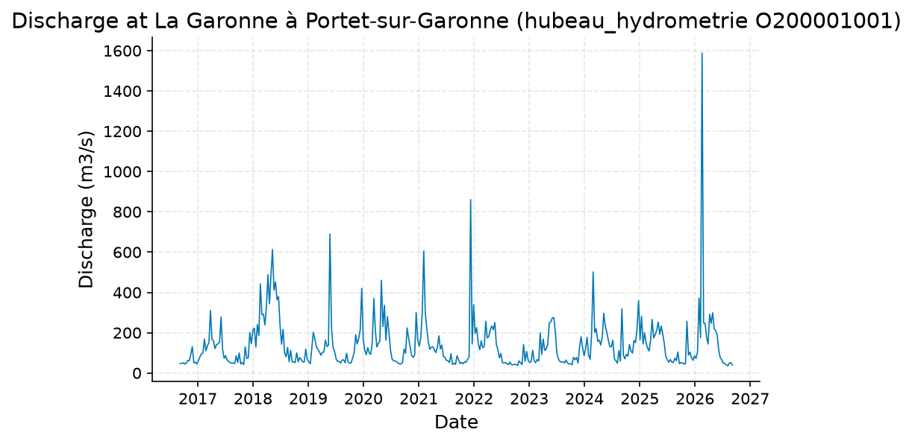

# Run-of-river irrigation feasibility for 40 ha of maize at Portet-sur-Garonne

**Author:** AquaScope Studio  
**Date:** 2026-09-07  
**Description:** assess whether the Garonne at Portet-sur-Garonne can supply, run-of-river and without storage, the seasonal irrigation demand of a 40 ha maize field planted in April  
**Data Sources:** BasinATLAS (HydroATLAS v1.0), ERA5 via Open-Meteo, hubeau_hydrometrie, similar_basins  
**Version:** 1.0  

**Site:** 43.5300 N, 1.4000 E

**Answer.** A 40 ha maize crop planted in April needs a gross seasonal irrigation depth of about 564 mm (net 395 mm), or roughly 225,778 m3 over a 125-day season, with a peak-month rate of 0.033 m3/s against a mean-season rate of 0.021 m3/s (FAO-56 crop water demand on ERA5 forcing, 11 seasons 2016-2026). The Garonne at Portet-sur-Garonne (Hub'Eau station O200001001, 116.7-year daily discharge record) can meet this peak demand on about 97% of growing-season days while keeping the Q95 flow of 47.3 m3/s in the channel and capping the take at 10% of flow, but only 56% of years show no shortfall day at all, averaging 5.4 short days per year (worst year 1989: 59 short days). Verdict: mostly reliable for run-of-river supply without storage.

*Key numbers*

| Quantity | Value | Unit | Step |
| --- | --- | --- | --- |
| Gross irrigation | 564.4 | mm | s1 |
| Net irrigation | 395.1 | mm | s1 |
| Mean demand over the season | 0.02091 | m3/s | s1 |
| Peak-month demand | 0.03307 | m3/s | s1 |
| Record length | 30.0 | years | s2 |
| Mean of the record | 157.1 | m3/s | s2 |
| 100-year return level, GEV (L-moments) | 3777.0 | m3/s | s2 |
| 100-year return level, Log-Pearson III | 3708.0 | m3/s | s2 |
| 100-year LP3 90 % interval, low | 2608.0 | m3/s | s2 |
| 100-year LP3 90 % interval, high | 5273.0 | m3/s | s2 |
| Q95 (exceeded 95 % of days) | 44.89 | m3/s | s2 |
| Q50 (median flow) | 117.2 | m3/s | s2 |
| Q10 | 309.6 | m3/s | s2 |
| Mann-Kendall p-value (annual mean) | 0.3022 |  | s2 |
| Sen's slope | -0.7411 | m3/s per year | s2 |
| Days the demand is met | 96.5 | % | s3 |
| Flow the river must carry | 47.35 | m3/s | s3 |
| Demand | 0.0331 | m3/s | s3 |
| Verdict | mostly reliable |  | s3 |
| Upstream area | 10000.0 | km2 | s4 |
| Mean of the record | 143.8 | m3/s | s5 |

## Summary

For a 40 ha maize field planted in April near Portet-sur-Garonne, FAO-56 crop water demand modelling on ERA5 forcing gives a gross seasonal irrigation requirement of 564.4 mm (net 395.1 mm), equal to 225,778 m3 over a 125-day season (April 1 to August 3), with mean demand of 0.02091 m3/s and a peak-month demand of 0.03307 m3/s. Screening this peak demand against the Garonne's 116.7-year daily discharge record at station O200001001 (La Garonne a Portet-sur-Garonne), keeping the Q95 reserve of 47.312 m3/s in the river and capping abstraction at 10% of flow, shows the demand can be met on 96.5% of growing-season days and in a volumetric sense on 96.5% of the volume, but only 56.4% of years pass with zero shortfall days, averaging 5.35 short days per year. The verdict returned is 'mostly reliable'. The upstream catchment (10,004 km2) carries a modest 5.1% degree of regulation and 177 million m3 of upstream reservoir storage, which could buffer or complicate the run-of-river assumption in ways not modelled here.

## Problem and decision

The question is whether the Garonne, drawn on a run-of-river basis without storage, can supply the seasonal irrigation demand of a 40 ha maize field planted in April near Portet-sur-Garonne, south of Toulouse. The decision requires both a credible estimate of crop water demand and a check of that demand against the river's flow record, respecting an environmental reserve and a cap on the share of flow taken.

## Site and data

The site sits at latitude 43.53, longitude 1.4. Climate forcing is ERA5 reanalysis via Open-Meteo for this grid cell (elevation 151 m). River flow is represented by the Hub'Eau gauge O200001001, La Garonne a Portet-sur-Garonne, with a discharge record spanning 1910-01-02 to 2026-09-06 (116.7 years, 42,617 daily values). The upstream contributing catchment is 10,004.2 km2 (mean elevation 895 m, mean slope 14.3 degrees, annual precipitation 941 mm/yr, annual potential evapotranspiration 840 mm/yr, aridity index 1.21), with land cover of 58% forest, 22% cropland, 18% pasture, 2% urban and 5% irrigated area, a degree of regulation by reservoirs of 5.1%, and 177 million m3 of upstream reservoir volume.

## Methodology

Crop water demand was computed with the FAO-56 single crop coefficient method, applying stage-length Kc values (initial 0.3, mid 1.2, late 0.6) to ERA5-derived reference evapotranspiration, subtracting effective rainfall and dividing by a sprinkler efficiency of 0.7, averaged over 11 growing seasons (2016-2026). The Garonne's flow regime at station O200001001 was characterised with a flow-duration curve and Mann-Kendall trend test on 30 years of daily discharge (1996-2026). A run-of-river screening rule then compared the peak-month demand to the gauge's full daily record over the growing-season months only (April-August), keeping the Q95 flow in the river and capping the take at 10% of daily flow. Upstream catchment attributes were drawn from HydroATLAS/BasinATLAS, and a recent 10-year daily discharge series was pulled for visual context.

## Results: step s1

FAO-56 crop water demand for maize on 40 ha planted April 1, averaged over 11 seasons (2016-2026), gives a mean reference evapotranspiration of 4.3 mm/day, crop evapotranspiration (ETc) of 488.1 mm, effective rainfall of 276.1 mm, net irrigation of 395.1 mm (158,047.3 m3), and gross irrigation of 564.4 mm (225,778.2 m3), with a season-to-season range of 448.0 to 782.1 mm. The mean irrigation rate over the season is 0.02091 m3/s, peaking at 0.03307 m3/s (217.4 mm) in the peak month. Source: FAO-56 Penman-Monteith ET0 from ERA5 via Open-Meteo at the site.


*Crop evapotranspiration, effective rain and net and gross irrigation per season for maize on 40.0 ha planted on the first of month 4; the mean gross depth is 564.4 mm over the season.*


*Crop evapotranspiration, effective rain and net and gross irrigation per season for maize on 40.0 ha planted on the first of month 4; the mean gross depth is 564.4 mm over the season.*

*Crop water demand per season at the site at 43.53 N, 1.40 E.*

| year | etc_mm | effective_rain_mm | net_irrigation_mm | gross_irrigation_mm | eto_mean_mm_per_day | peak_month | peak_month_mm |
| --- | --- | --- | --- | --- | --- | --- | --- |
| 2016 | 447.9 | 235.6 | 352.7 | 503.9 | 3.98 | 2016-07 | 187.7 |
| 2017 | 492.7 | 272.7 | 401.9 | 574.1 | 4.38 | 2017-06 | 224.6 |
| 2018 | 451.0 | 350.1 | 358.8 | 512.5 | 4.03 | 2018-06 | 192.3 |
| 2019 | 500.1 | 285.4 | 409.6 | 585.1 | 4.37 | 2019-06 | 225.8 |
| 2020 | 487.9 | 246.1 | 392.7 | 561.0 | 4.35 | 2020-07 | 206.2 |
| 2021 | 434.5 | 254.2 | 334.1 | 477.3 | 3.9 | 2021-06 | 183.5 |
| 2022 | 542.7 | 220.0 | 459.9 | 657.0 | 4.7 | 2022-07 | 260.2 |
| 2023 | 457.4 | 324.7 | 346.5 | 495.0 | 4.02 | 2023-07 | 200.8 |
| 2024 | 427.1 | 364.9 | 313.6 | 448.0 | 3.86 | 2024-06 | 175.9 |
| 2025 | 521.7 | 275.5 | 429.0 | 612.9 | 4.53 | 2025-06 | 245.6 |
| 2026 | 606.1 | 207.6 | 547.5 | 782.1 | 5.22 | 2026-06 | 289.1 |

## Results: step s2

Over the last 30 years (1996-09-07 to 2026-09-06, 10,957 daily values) at Hub'Eau station O200001001, mean daily discharge is 157.1 m3/s (median 117.23 m3/s, min 26.16 m3/s, max 3007.38 m3/s). The flow-duration curve gives Q95 of 44.89 m3/s, Q50 of 117.23 m3/s and Q10 of 309.63 m3/s. A Mann-Kendall test on annual means finds no trend (p = 0.302, tau = -0.138, Sen's slope -0.741 m3/s per year over 29 years). Flood-frequency fits give 100-year return levels of 3777 m3/s (GEV, L-moments) and 3708 m3/s (Log-Pearson III, 90% interval 2608 to 5273 m3/s); these describe flood risk, not irrigation supply.


*Flow-duration curve of discharge at La Garonne à Portet-sur-Garonne (hubeau_hydrometrie O200001001) from the ranked daily flows, with Q95, Q50 and Q10 marked (log scale).*


*Flow-duration curve of discharge at La Garonne à Portet-sur-Garonne (hubeau_hydrometrie O200001001) from the ranked daily flows, with Q95, Q50 and Q10 marked (log scale).*

*The record at La Garonne à Portet-sur-Garonne (hubeau_hydrometrie O200001001) (datetime, value).*

| datetime | value |
| --- | --- |
| 1996-09-07 | 62.605 |
| 1996-09-08 | 50.947 |
| 1996-09-09 | 47.166 |
| 1996-09-10 | 58.735 |
| 1996-09-11 | 54.948 |
| 1996-09-12 | 59.859 |
| 1996-09-13 | 61.571 |
| 1996-09-14 | 61.97 |
| 1996-09-15 | 48.36 |
| 1996-09-16 | 44.7 |
| 1996-09-17 | 54.986 |
| 1996-09-18 | 90.567 |
| 1996-09-19 | 110.868 |
| 1996-09-20 | 103.056 |
| 1996-09-21 | 92.603 |
| 1996-09-22 | 90.756 |
| 1996-09-23 | 102.953 |
| 1996-09-24 | 113.635 |
| 1996-09-25 | 105.428 |
| 1996-09-26 | 102.465 |
| 1996-09-27 | 104.289 |
| 1996-09-28 | 100.028 |
| 1996-09-29 | 84.55 |
| 1996-09-30 | 68.319 |
| 1996-10-01 | 80.367 |
| 1996-10-02 | 95.339 |
| 1996-10-03 | 124.534 |
| 1996-10-04 | 133.718 |
| 1996-10-05 | 114.488 |
| 1996-10-06 | 130.378 |
| 1996-10-07 | 132.597 |
| 1996-10-08 | 126.421 |
| 1996-10-09 | 120.566 |
| 1996-10-10 | 118.086 |
| 1996-10-11 | 113.152 |
| 1996-10-12 | 113.368 |
| 1996-10-13 | 96.958 |
| 1996-10-14 | 91.378 |
| 1996-10-15 | 169.253 |
| 1996-10-16 | 275.771 |
| 1996-10-17 | 193.836 |
| 1996-10-18 | 158.378 |
| 1996-10-19 | 148.283 |
| 1996-10-20 | 131.439 |
| 1996-10-21 | 114.462 |
| 1996-10-22 | 115.704 |
| 1996-10-23 | 109.379 |
| 1996-10-24 | 100.427 |
| 1996-10-25 | 101.423 |
| 1996-10-26 | 103.434 |

*Summary of the record at La Garonne à Portet-sur-Garonne (hubeau_hydrometrie O200001001).*

| item | value |
| --- | --- |
| source | hubeau_hydrometrie |
| station_id | O200001001 |
| variable | discharge |
| unit | m3/s |
| n | 10957 |
| start | 1996-09-07 |
| end | 2026-09-06 |
| years | 30.0 |
| stats.mean | 157.1491 |
| stats.median | 117.23 |
| stats.min | 26.157 |
| stats.max | 3007.381 |

*Annual maxima at La Garonne à Portet-sur-Garonne (hubeau_hydrometrie O200001001).*

| year | value |
| --- | --- |
| 1997 | 373.579 |
| 1998 | 676.494 |
| 1999 | 688.693 |
| 2000 | 3007.381 |
| 2001 | 786.164 |
| 2002 | 1187.46 |
| 2003 | 1199.352 |
| 2004 | 1657.67 |
| 2005 | 766.391 |
| 2006 | 968.325 |
| 2007 | 726.868 |
| 2008 | 619.596 |
| 2009 | 940.672 |
| 2010 | 955.241 |
| 2011 | 1148.692 |
| 2012 | 594.829 |
| 2013 | 1357.366 |
| 2014 | 2161.171 |
| 2015 | 1447.223 |
| 2016 | 865.216 |
| 2017 | 417.608 |
| 2018 | 1587.111 |
| 2019 | 1808.959 |
| 2020 | 819.058 |
| 2021 | 1342.886 |
| 2022 | 2523.858 |
| 2023 | 543.247 |
| 2024 | 527.305 |
| 2025 | 558.098 |

*Return levels at La Garonne à Portet-sur-Garonne (hubeau_hydrometrie O200001001) by return period, with the confidence band.*

| T | GEV | LP3 | lower | upper |
| --- | --- | --- | --- | --- |
| 2.0 | 937.3161 | 942.7091 | 797.8943 | 1113.8072 |
| 5.0 | 1476.3013 | 1494.9093 | 1230.6336 | 1815.9375 |
| 10.0 | 1908.0041 | 1931.7177 | 1533.7419 | 2432.9604 |
| 25.0 | 2556.7289 | 2569.2257 | 1941.2159 | 3400.4052 |
| 50.0 | 3125.6452 | 3109.3684 | 2265.1159 | 4268.2902 |
| 100.0 | 3776.9001 | 3708.0715 | 2607.7685 | 5272.6285 |

*Flow-duration percentiles at La Garonne à Portet-sur-Garonne (hubeau_hydrometrie O200001001).*

| exceedance_pct | value |
| --- | --- |
| 10.0 | 309.628 |
| 50.0 | 117.23 |
| 95.0 | 44.887 |

*Mann-Kendall trend test and Sen slope at La Garonne à Portet-sur-Garonne (hubeau_hydrometrie O200001001).*

| item | value |
| --- | --- |
| on | annual mean |
| p_value | 0.3022 |
| tau | -0.1379 |
| trend | no trend |
| sens_slope_per_year | -0.7411 |
| n_years | 29 |

## Results: step s3

Screening the peak-month demand of 0.0331 m3/s against the full 116.7-year daily record (1910-01-02 to 2026-09-06, 42,617 days) at station O200001001 over the growing-season months (April-August), with a Q95 reserve of 47.312 m3/s kept in the river and abstraction capped at 10% of flow (the river must carry at least 47.345 m3/s), the demand is met on 96.5% of season-days and 96.5% of the volume, but only 56.4% of years (117 years assessed) have zero shortfall days, averaging 5.35 short days per year; the worst year, 1989, had 59 short days. The baseflow index is 0.792 and the 10-year low flow (7Q10) is 36.94 m3/s. The overall verdict is 'mostly reliable'.


*The flow-duration curve at La Garonne à Portet-sur-Garonne (hubeau_hydrometrie O200001001) with the flow the demand needs (red), the reserve left in the river (orange) and Q95 (dashed); the demand is met on 97% of days.*


*The flow-duration curve at La Garonne à Portet-sur-Garonne (hubeau_hydrometrie O200001001) with the flow the demand needs (red), the reserve left in the river (orange) and Q95 (dashed); the demand is met on 97% of days.*

*Supply reliability at La Garonne à Portet-sur-Garonne (hubeau_hydrometrie O200001001).*

| item | value |
| --- | --- |
| demand_m3s | 0.0331 |
| demand_given_as | m3/s |
| share | 0.1 |
| months | 4; 5; 6; 7; 8 |
| unit | m3/s |
| mode | gauged |
| source | hubeau_hydrometrie |
| station_id | O200001001 |
| variable | discharge |
| start | 1910-01-02 |
| end | 2026-09-06 |
| years | 116.7 |
| fetch_note | Hub'Eau elaborated daily mean discharge (obs_elab QmnJ); full record requested (from 1910-01-01, the catalog's first date for this station). |
| n_days | 42617 |
| bfi | 0.7920243433301011 |
| low_flow.7q10 | 36.93762857142845 |
| low_flow.text | minimum 7-day mean flow with a 10-year return period (Weibull) |
| recent.end | 2026-09-06 |
| recent.last_30d_mean | 47.466833333333334 |
| recent.last_30d_exceedance_pct | 94.91282821409297 |
| recent.last_90d_mean | 55.542122222222226 |
| recent.last_90d_exceedance_pct | 89.40328976699439 |
| reserve_m3s | 47.312 |
| reserve_rule | Q95 kept in the river |
| required_flow_m3s | 47.34507 |
| reliability.daily | 0.9650298865985141 |
| reliability.daily_reserve_only | 0.9650298865985141 |
| reliability.annual | 0.5641025641025641 |
| reliability.volumetric | 0.9651329295636972 |
| reliability.days_short_per_year | 5.35042735042735 |
| reliability.worst_year.year | 1989 |
| reliability.worst_year.days_short | 59 |
| reliability.n_days | 17901 |
| reliability.n_years | 117 |
| verdict | mostly reliable |
| text | On 97% of days in months [4, 5, 6, 7, 8] the river can give 0.03307 m3/s while keeping 47.312 m3/s in the channel and taking no more than 10% of the flow (the river must carry 47.3451 m3/s). |
| station_name | La Garonne à Portet-sur-Garonne |
| name | La Garonne à Portet-sur-Garonne |
| reliability.daily | 0.9650298865985141 |
| reliability.daily_reserve_only | 0.9650298865985141 |
| reliability.annual | 0.5641025641025641 |
| reliability.volumetric | 0.9651329295636972 |
| reliability.days_short_per_year | 5.35042735042735 |
| reliability.worst_year.year | 1989 |
| reliability.worst_year.days_short | 59 |
| reliability.n_days | 17901 |
| reliability.n_years | 117 |
| fdc.q05 | 460.681 |
| fdc.q10 | 356.97 |
| fdc.q25 | 233.466 |

*Flow-duration percentiles at La Garonne à Portet-sur-Garonne (hubeau_hydrometrie O200001001).*

| exceedance_pct | value |
| --- | --- |
| 5.0 | 460.681 |
| 10.0 | 356.97 |
| 25.0 | 233.466 |
| 50.0 | 139.988 |
| 75.0 | 80.44 |
| 90.0 | 54.728 |
| 95.0 | 47.312 |

## Results: step s4

The catchment upstream of the site covers 10,004.2 km2 across 80 level-12 sub-basins, with mean elevation 895 m, mean slope 14.3 degrees, annual precipitation 941 mm/yr, potential evapotranspiration 840 mm/yr, actual evapotranspiration 655 mm/yr, and an aridity index of 1.21. Land cover is 58% forest, 22% cropland, 18% pasture, 2% urban and 5% irrigated. The degree of regulation by reservoirs is 5.1%, with 177 million m3 of upstream reservoir volume, and mean annual natural discharge at the outlet is estimated at 110.72 m3/s. Source: HydroATLAS/BasinATLAS.


*The site, in longitude and latitude (no basemap); no catalogue station was listed with it.*


*The site, in longitude and latitude (no basemap); no catalogue station was listed with it.*

*Catchment attributes from BasinATLAS for the site at 43.53 N, 1.40 E.*

| attribute | label | value | unit | source | note |
| --- | --- | --- | --- | --- | --- |
| n_sub_basins |  | 80.0 |  |  |  |
| area_km2 |  | 10003.8 |  |  |  |
| outlet_hybas_id |  | 2120577090.0 |  |  |  |
| upstream_area_km2 |  | 10004.2 |  |  |  |
| elevation_m | mean elevation | 895.0 | m | basinatlas_upstream |  |
| slope_deg | mean slope | 14.3 | degrees | basinatlas_upstream |  |
| precipitation_mm_yr | annual precipitation (WorldClim) | 941.0 | mm/yr | basinatlas_upstream |  |
| pet_mm_yr | annual potential evapotranspiration | 840.0 | mm/yr | basinatlas_upstream |  |
| aet_mm_yr | annual actual evapotranspiration | 655.0 | mm/yr | basinatlas_upstream |  |
| aridity_index | aridity index (P/PET) | 1.21 | P/PET | basinatlas_upstream |  |
| temperature_c | mean annual air temperature | 9.4 | °C | basinatlas_upstream |  |
| snow_cover_pct | annual snow cover extent | 14.0 | % | basinatlas_upstream |  |
| runoff_mm_yr | annual land-surface runoff | 350.18 | mm/yr | area_weighted_mean |  |
| discharge_m3s | mean annual natural discharge at the outlet | 110.72 | m3/s | basinatlas_upstream |  |
| forest_pct | forest cover | 58.0 | % | basinatlas_upstream |  |
| cropland_pct | cropland | 22.0 | % | basinatlas_upstream |  |
| pasture_pct | pasture | 18.0 | % | basinatlas_upstream |  |
| urban_pct | urban extent | 2.0 | % | basinatlas_upstream |  |
| irrigated_pct | irrigated area | 5.0 | % | basinatlas_upstream |  |
| glacier_pct | glacier extent | 0.0 | % | basinatlas_upstream |  |
| wetland_pct | wetlands (all classes) | 0.0 | % | basinatlas_upstream |  |
| lake_pct | lake area | 0.2 | % | basinatlas_upstream |  |
| karst_pct | karst extent | 51.0 | % | basinatlas_upstream |  |
| clay_pct | clay fraction in soil | 20.0 | % | basinatlas_upstream |  |
| silt_pct | silt fraction in soil | 37.0 | % | basinatlas_upstream |  |
| sand_pct | sand fraction in soil | 43.0 | % | basinatlas_upstream |  |
| soil_organic_carbon_t_ha | soil organic carbon | 46.0 | t/ha | basinatlas_upstream |  |
| soil_water_pct | annual soil water content | 83.0 | % | basinatlas_upstream |  |
| groundwater_table_cm | groundwater table depth | 568.52 | cm | area_weighted_mean |  |
| population_density | population density | 63.88 | people/km2 | basinatlas_upstream |  |
| population | population count | 634211.98 | people | basinatlas_upstream |  |
| degree_of_regulation_pct | degree of regulation by reservoirs | 5.1 | % | basinatlas_upstream |  |
| human_footprint_2009 | human footprint (2009) | 12.3 | index 0-50 | basinatlas_upstream |  |
| reservoir_volume_mcm | reservoir volume upstream | 177.0 | million m3 | basinatlas_upstream |  |

## Results: step s5

A recent 10-year daily discharge series (2016-09-07 to 2026-09-06, 366 thinned points from 3652 daily values) at station O200001001 shows a mean flow of 143.8 m3/s, ranging from 34.94 m3/s to 2523.86 m3/s, giving visual context for the variability behind the flow-duration and reliability statistics above; no additional statistics were computed from this series.


*Discharge at La Garonne à Portet-sur-Garonne (hubeau_hydrometrie O200001001), 2016 to 2026.*


*Discharge at La Garonne à Portet-sur-Garonne (hubeau_hydrometrie O200001001), 2016 to 2026.*

*The record at La Garonne à Portet-sur-Garonne (hubeau_hydrometrie O200001001) (datetime, value).*

| datetime | value |
| --- | --- |
| 2016-09-07 | 46.529 |
| 2016-09-17 | 48.101 |
| 2016-09-27 | 50.605 |
| 2016-10-07 | 44.554 |
| 2016-10-17 | 48.877 |
| 2016-10-27 | 62.726 |
| 2016-11-06 | 61.211 |
| 2016-11-16 | 92.354 |
| 2016-11-26 | 130.952 |
| 2016-12-06 | 50.465 |
| 2016-12-16 | 54.084 |
| 2016-12-26 | 45.208 |
| 2017-01-05 | 60.151 |
| 2017-01-15 | 80.314 |
| 2017-01-25 | 94.853 |
| 2017-02-04 | 99.164 |
| 2017-02-14 | 168.449 |
| 2017-02-24 | 109.66 |
| 2017-03-06 | 136.279 |
| 2017-03-16 | 151.037 |
| 2017-03-26 | 310.147 |
| 2017-04-05 | 166.346 |
| 2017-04-15 | 160.027 |
| 2017-04-25 | 121.033 |
| 2017-05-05 | 140.536 |
| 2017-05-15 | 144.781 |
| 2017-05-25 | 153.22 |
| 2017-06-04 | 277.466 |
| 2017-06-14 | 119.983 |
| 2017-06-24 | 72.839 |
| 2017-07-04 | 86.032 |
| 2017-07-14 | 64.148 |
| 2017-07-24 | 56.497 |
| 2017-08-03 | 52.181 |
| 2017-08-13 | 48.62 |
| 2017-08-23 | 50.082 |
| 2017-09-02 | 46.92 |
| 2017-09-12 | 85.249 |
| 2017-09-22 | 52.061 |
| 2017-10-02 | 99.621 |
| 2017-10-12 | 44.367 |
| 2017-10-22 | 52.894 |
| 2017-11-01 | 41.645 |
| 2017-11-11 | 129.944 |
| 2017-11-21 | 72.599 |
| 2017-12-01 | 76.104 |
| 2017-12-11 | 201.668 |
| 2017-12-21 | 145.716 |
| 2017-12-31 | 212.644 |
| 2018-01-10 | 223.009 |

## Limitations and what this study does not establish

Kc values and stage lengths follow the FAO-56 (1998) Table 12 defaults, pending comparison against the 2025 revised FAO edition; a changed coefficient would move the demand estimate. Reference ET0 is FAO-56 Penman-Monteith forced by ERA5 reanalysis, which carries known bias against station-based ET0, so the demand is a planning estimate rather than a measurement. The Q95 reserve differs between the 30-year flow-duration analysis (44.89 m3/s) and the full 116.7-year record used for screening (47.312 m3/s), reflecting different record lengths, not a data error. The supply check uses a screening rule only: conveyance losses to the field, abstraction licences, return flows, and any effect of the 5.1% upstream regulation and 177 million m3 of reservoir storage are not modelled. No cause is established for the (statistically insignificant) downward trend in the 30-year annual mean flow.

## Caveats

- Crop coefficients and stage lengths are the FAO-56 (1998) Table 12 values pending verification against the 2025 revised edition (FAO, doi:10.4060/cd6621en; issue #310); a coefficient that moved moves the demand with it.
- Reference ET0 here is FAO-56 Penman-Monteith forced by ERA5 reanalysis (Open-Meteo), which carries bias against station-based ET0 (Agric. Water Manage. 2024, doi:10.1016/j.agwat.2024.108732); the demand is a planning estimate, not a measurement.
- The supply comes from the gauged river named in the plan, at the gauge's distance from the point, under a screening rule (Q95 kept in the river, at most the stated share taken); conveyance to the field, licences, return flows and storage are not in it.

## Recommendations

Before committing to unsupplemented run-of-river abstraction, verify the FAO-56 Kc values against the 2025 revised FAO tables and consider station-based ET0 to bound the reanalysis bias. Given that only 56% of years pass without any shortfall day (averaging 5.35 short days per year, up to 59 in 1989), plan a contingency for dry years, such as a small buffer storage, a supplemental well, or accepting deficit irrigation on short days. Confirm abstraction licensing and any conveyance losses between the gauge and the field, and check whether the 5.1% upstream regulation and 177 million m3 of reservoir storage measurably alter low flows during the irrigation season. Monitor the gauge in real time during the growing season given the sensitivity of the reliability verdict to the choice of reserve flow.

## References

1. Allen, R. G., Pereira, L. S., Raes, D., & Smith, M. (1998). Crop evapotranspiration. FAO Irrigation and Drainage Paper 56; FAO (2025). Crop evapotranspiration, revised edition, doi:10.4060/cd6621en; reanalysis-forced ET0 bias: Agric. Water Manage. (2024), doi:10.1016/j.agwat.2024.108732.
2. Vogel, R. M., & Fennessey, N. M. (1994). Flow-duration curves I: new interpretation and confidence intervals. J. Water Resour. Plann. Manage., 120(4), 485-504.
3. Smakhtin, V., & Eriyagama, N. (2008). Developing a software package for global desktop assessment of environmental flows. Environ. Model. Softw. 23, 1396-1406.
4. Hersbach, H. et al. (2020). The ERA5 global reanalysis. Q. J. R. Meteorol. Soc., 146, 1999-2049
5. Open-Meteo.com (CC BY 4.0).
6. Hosking, J. R. M. (1990). L-moments: analysis and estimation of distributions using linear combinations of order statistics. J. R. Stat. Soc. B, 52(1), 105-124.
7. England, J. F. Jr. et al. (2018). Guidelines for determining flood flow frequency, Bulletin 17C. USGS Techniques and Methods 4-B5.
8. Mann, H. B. (1945). Nonparametric tests against trend. Econometrica, 13, 245-259
9. Sen, P. K. (1968). J. Am. Stat. Assoc., 63, 1379-1389.
10. Acreman, M., & Dunbar, M. J. (2004). Defining environmental river flow requirements: a review. Hydrol. Earth Syst. Sci. 8, 861-876.
11. Lyne, V., & Hollick, M. (1979). Stochastic time-variable rainfall-runoff modelling. Inst. Eng. Aust. Natl. Conf. Publ. 79/10, 89-93.
12. Smakhtin, V. U. (2001). Low flow hydrology: a review. J. Hydrol. 240, 147-186.
13. HydroATLAS v1.0 (BasinATLAS), CC BY 4.0. Linke, S., Lehner, B., Ouellet Dallaire, C., et al. (2019). Global hydro-environmental sub-basin and river reach characteristics at high spatial resolution. Scientific Data 6: 283. https://doi.org/10.1038/s41597-019-0300-6
14. Allen, R. G., Pereira, L. S., Raes, D., & Smith, M. (1998). Crop evapotranspiration: guidelines for computing crop water requirements. FAO Irrigation and Drainage Paper 56.
15. Updated single and basal crop coefficients for temperate fruit trees, vines and shrubs: Irrigation Science (2024), doi:10.1007/s00271-024-00964-0
16. Sensitivity of ERA5-Land-forced FAO-56 ET0 to reanalysis bias: Agricultural Water Management (2024), doi:10.1016/j.agwat.2024.108732
17. Rekin226 and contributors (2026). AquaScope: Open-source water data aggregation toolkit (version 0.14.0) [Software]. Zenodo. https://doi.org/10.5281/zenodo.21903143

## Appendix: reproducibility

Re-run the same steps with no model: `aquascope run study.yaml`. Resume the workspace: `aquascope studio --resume workspace.json`.

Model: claude-sonnet-5 via anthropic; ledger: consultant 1 call(s), 5067 tokens, methodologist 1 call(s), 17970 tokens. aquascope 0.14.0.

```yaml
# An AquaScope study (version 3): the plan behind an answer, its gates, and what happened.
#   aquascope run study.yaml
version: 3
title: "Determine the seasonal irrigation water requirement of a 40 : 43.53, 1.4"
question: "Irrigating 40 ha of maize from the Garonne at Portet-sur-Garonne, south of Toulouse, planted in April: what is the seasonal water demand and can the river meet it run of river?"
created: "2026-09-07T19:16:08+00:00"
aquascope_version: "0.14.0"
author: "methodologist"
model: "claude-sonnet-5"
problem:
  kind: "irrigation"
  site: {"lat": 43.53, "lon": 1.4}
  params: {"crop": "maize", "area_ha": 40.0, "planting_month": 4, "efficiency": 0.7, "share": 0.1, "decision": "seasonal demand"}
  text: "Irrigating 40 ha of maize from the Garonne at Portet-sur-Garonne, south of Toulouse, planted in April: what is the seasonal water demand and can the river meet it run of river?"
plan:
  author: "methodologist"
  playbook: "irrigation_feasibility"
  objective: "Determine the seasonal irrigation water requirement of a 40 ha maize crop planted in April near Portet-sur-Garonne and test whether the Garonne, drawn on a run-of-river basis without storage, can supply that demand while keeping a Q95 reserve in the river."
  decision: "assess whether the Garonne at Portet-sur-Garonne can supply, run-of-river and without storage, the seasonal irrigation demand of a 40 ha maize field planted in April"
  methodology: ["Compute FAO-56 single-crop-coefficient reference evapotranspiration and net/gross crop water requirement for maize on 40 ha planted in month 4, using ERA5 climate forcing at the site and a sprinkler efficiency of 0.7, to obtain seasonal demand in mm and m3 and the peak-month demand in m3/s.", "Characterise the Garonne's flow regime at the Portet-sur-Garonne gauge (O200001001) with a flow-duration analysis over its 116.7-year daily discharge record, extracting mean flow, Q95 and low-flow statistics for the growing season.", "Screen the peak-month irrigation demand against the gauge's daily flow record over the growing-season months only, keeping Q95 in the river and capping abstraction at 10 percent of daily flow, to get the fraction of days and years the river could have met the demand.", "Characterise the contributing catchment at the site (upstream area, dam count) to flag any regulation that could affect the run-of-river assumption.", "Pull the observed discharge series at the gauge over the growing-season window for visual context alongside the demand curve."]
  assumptions: ["Sprinkler irrigation efficiency of 0.7 is used as the playbook default since no method was specified", "Screening share of 10 percent of daily river flow is used as the default allowable abstraction fraction", "The Hub'Eau discharge record at station O200001001 (La Garonne a Portet-sur-Garonne, 116.7 years of daily data) stands in for river flow at the offtake, given its 1.3 km proximity", "FAO-56 ET0 and crop coefficient methods are applicable using reachable climate forcing (ERA5 via Open-Meteo) for this point", "Maize growing season length is taken as typical (about 120 to 150 days) from an April planting", "Sprinkler irrigation efficiency of 0.7 is used as the playbook default since no method was specified.", "Screening share of 10 percent of daily river flow is used as the default allowable abstraction fraction, with Q95 kept in the river as the ecological reserve.", "The Hub'Eau discharge record at station O200001001 (La Garonne a Portet-sur-Garonne, 116.7 years of daily data) stands in for river flow at the offtake, given its 1.3 km proximity.", "FAO-56 ET0 and single crop coefficient methods are applicable using ERA5 climate forcing via Open-Meteo for this point.", "Maize growing season length is taken as typical (about 120 to 150 days) from an April planting, spanning April to September.", "A 10-year ERA5 window is representative enough of the crop-demand seasonal pattern; a 30-year window is used for the flow-duration statistics to capture inter-annual low-flow variability."]
  alternatives: [{"method": "dual crop coefficient (Kc basal + soil evaporation)", "why_not": "the sufficiency table only certifies the single Kc FAO-56 method as defensible here; no soil or irrigation-scheduling data were supplied to support the dual approach"}, {"method": "reservoir/storage-based supply modelling", "why_not": "the decision explicitly restricts the assessment to run-of-river abstraction without storage"}, {"method": "donor-basin regionalisation for flow statistics", "why_not": "the gauge at Portet-sur-Garonne itself has 116.7 years of record 1.3 km from the site, making transfer from the 10 donor gauges unnecessary"}]
  limitations_expected: ["Crop coefficients and stage lengths are the FAO-56 (1998) Table 12 values pending verification against the 2025 revised edition (FAO, doi:10.4060/cd6621en); a coefficient that moved moves the demand with it.", "Reference ET0 here is FAO-56 Penman-Monteith forced by ERA5 reanalysis (Open-Meteo), which carries bias against station-based ET0 (Agric. Water Manage. 2024, doi:10.1016/j.agwat.2024.108732); the demand is a planning estimate, not a measurement.", "The supply comes from the gauged river named in the plan, at the gauge's distance from the point, under a screening rule (Q95 kept in the river, at most 10 percent taken); conveyance to the field, abstraction licences, return flows and any upstream storage or regulation (5.1 dams recorded in the catchment) are not modelled."]
  citations: ["Allen, R. G., Pereira, L. S., Raes, D., & Smith, M. (1998). Crop evapotranspiration: guidelines for computing crop water requirements. FAO Irrigation and Drainage Paper 56.", "FAO (2025). Crop evapotranspiration: guidelines for computing crop water requirements, revised edition (Pereira, Allen, Paredes, Lopez-Urrea, Raes et al.). doi:10.4060/cd6621en", "Updated single and basal crop coefficients for temperate fruit trees, vines and shrubs: Irrigation Science (2024), doi:10.1007/s00271-024-00964-0", "Sensitivity of ERA5-Land-forced FAO-56 ET0 to reanalysis bias: Agricultural Water Management (2024), doi:10.1016/j.agwat.2024.108732", "Vogel, R. M. and Fennessey, N. M. (1994). Flow-duration curves I: new interpretation and confidence intervals. J. Water Resour. Plann. Manage. 120, 485-504.", "Smakhtin, V., & Eriyagama, N. (2008). Developing a software package for global desktop assessment of environmental flows. Environ. Model. Softw. 23, 1396-1406.", "Hersbach, H. et al. (2020). The ERA5 global reanalysis. Q. J. R. Meteorol. Soc. 146, 1999-2049.", "FAO, doi:10.4060/cd6621en", "Agric. Water Manage. 2024, doi:10.1016/j.agwat.2024.108732"]
  caveats: ["Crop coefficients and stage lengths are the FAO-56 (1998) Table 12 values pending verification against the 2025 revised edition (FAO, doi:10.4060/cd6621en; issue #310); a coefficient that moved moves the demand with it.", "Reference ET0 here is FAO-56 Penman-Monteith forced by ERA5 reanalysis (Open-Meteo), which carries bias against station-based ET0 (Agric. Water Manage. 2024, doi:10.1016/j.agwat.2024.108732); the demand is a planning estimate, not a measurement.", "The supply comes from the gauged river named in the plan, at the gauge's distance from the point, under a screening rule (Q95 kept in the river, at most the stated share taken); conveyance to the field, licences, return flows and storage are not in it."]
  rationale: "Determine the seasonal irrigation water requirement of a 40 ha maize crop planted in April near Portet-sur-Garonne and test whether the Garonne, drawn on a run-of-river basis without storage, can supply that demand while keeping a Q95 reserve in the river."
  recon_notes: ["Record resolution is not in the catalog; daily is assumed for every variable.", "10 donor gauges from a pool of 37,071 gauged catchments.", "ERA5 temperature and forcing and GloFAS discharge are assumed reachable for any point on land (Open-Meteo); not checked here.", "CMIP6 change factors need model output you supply (aquascope.climate works on downloaded data); not counted."]
steps:
  - tool: "crop_water_demand"
    id: "s1"
    rationale: "FAO-56 single Kc crop evapotranspiration on ERA5 ET0, net demand minus effective rainfall, divided by 0.7 efficiency, gives the gross seasonal demand and the peak-month rate in m3/s for the 40 ha maize field."
    method: "crop_water_requirement"
    arguments:
      lat: 43.53
      lon: 1.4
      crop: "maize"
      area_ha: 40.0
      planting_month: 4
      efficiency: 0.7
      years: 10
    expects:
      - {"check": "not_empty", "path": "demand.gross_irrigation_mm"}
      - {"check": "not_empty", "path": "demand.peak_month_m3s"}
      - {"check": "not_empty", "path": "season.months"}
    outputs: [{"kind": "table", "id": "s1_demand_monthly", "caption": "monthly gross and net irrigation demand for maize, 40 ha, April planting"}, {"kind": "table", "id": "s1_et0_monthly", "caption": "monthly FAO-56 reference evapotranspiration at the site"}, {"kind": "figure", "id": "s1_demand_curve", "caption": "seasonal demand curve, mm and m3, April to September"}]
  - tool: "analyze_station"
    id: "s2"
    rationale: "A flow-duration analysis of the Garonne at Portet-sur-Garonne's long daily discharge record gives the mean flow, Q95 and low-flow statistics needed to judge run-of-river supply over the growing season."
    method: "flow_duration"
    arguments:
      source: "hubeau_hydrometrie"
      station_id: "O200001001"
      variable: "discharge"
      years: 30
    expects:
      - {"check": "min_years", "path": "years", "value": 30}
      - {"check": "not_empty", "path": "trend", "repaired_from": "fdc"}
      - {"check": "unit_present", "path": "unit"}
    outputs: [{"kind": "table", "id": "s2_fdc_percentiles", "caption": "flow-duration percentiles for the Garonne at Portet-sur-Garonne"}, {"kind": "figure", "id": "s2_fdc_curve", "caption": "flow-duration curve, Garonne at Portet-sur-Garonne"}]
  - tool: "supply_reliability"
    id: "s3"
    rationale: "Screening the peak-month demand against the gauge's daily record over only the growing-season months, keeping Q95 in the river and capping the take at 10 percent of flow, yields the reliability verdict for run-of-river supply."
    method: "supply_reliability"
    arguments:
      source: "hubeau_hydrometrie"
      station_id: "O200001001"
      demand_m3s: "{{ result.s1.demand.peak_month_m3s }}"
      months: "{{ result.s1.season.months }}"
      share: 0.1
      reserve: "q95"
    expects:
      - {"check": "min_years", "path": "years", "value": 5}
      - {"check": "not_empty", "path": "reliability"}
      - {"check": "unit_present", "path": "unit"}
    depends_on: ["s1"]
    outputs: [{"kind": "table", "id": "s3_reliability", "caption": "fraction of growing-season days and years the river could supply the peak demand"}, {"kind": "figure", "id": "s3_reliability_curve", "caption": "reliability curve against Q95 reserve and 10 percent share cap"}]
  - tool: "describe_catchment"
    id: "s4"
    rationale: "The upstream catchment area and dam count contextualise how much of the flow regime is naturalised versus regulated, bearing on the run-of-river assumption."
    arguments:
      lat: 43.53
      lon: 1.4
      upstream: true
    expects:
      - {"check": "not_empty", "path": "sub_basin"}
      - {"check": "max_area_km2", "path": "sub_basin.up_area", "value": 15000}
    outputs: [{"kind": "table", "id": "s4_catchment_summary", "caption": "upstream area and area-weighted attributes of the Garonne catchment at the offtake"}]
  - tool: "get_timeseries"
    id: "s5"
    rationale: "The recent daily discharge series over the growing season gives a visual check of variability behind the flow-duration and reliability statistics."
    arguments:
      source: "hubeau_hydrometrie"
      station_id: "O200001001"
      variable: "discharge"
      years: 10
      resample: "D"
    expects:
      - {"check": "not_empty", "path": "points"}
      - {"check": "unit_present", "path": "unit"}
    outputs: [{"kind": "figure", "id": "s5_discharge_series", "caption": "daily discharge, Garonne at Portet-sur-Garonne, recent growing seasons"}]
results:
  s1: {"ok": true, "gates": [{"check": "not_empty", "passed": true, "detail": "'demand.gross_irrigation_mm' is present"}, {"check": "not_empty", "passed": true, "detail": "'demand.peak_month_m3s' is present"}, {"check": "not_empty", "passed": true, "detail": "'season.months' is present"}], "summary": "method=single", "fallback_used": false, "sha256": "6e7e925d5aef6a5b"}
  s2: {"ok": true, "gates": [{"check": "min_years", "passed": true, "detail": "30 years of record, 30 needed"}, {"check": "not_empty", "passed": true, "detail": "'trend' is present"}, {"check": "unit_present", "passed": true, "detail": "unit m3/s"}], "summary": "source=hubeau_hydrometrie, station_id=O200001001, variable=discharge, unit=m3/s, years=30.0, start=1996-09-07, end=2026-09-06", "fallback_used": false, "sha256": "60f711d20f37991b"}
  s3: {"ok": true, "gates": [{"check": "min_years", "passed": true, "detail": "116.7 years of record, 5 needed"}, {"check": "not_empty", "passed": true, "detail": "'reliability' is present"}, {"check": "unit_present", "passed": true, "detail": "unit m3/s"}], "summary": "source=hubeau_hydrometrie, station_id=O200001001, variable=discharge, unit=m3/s, years=116.7, start=1910-01-02, end=2026-09-06", "fallback_used": false, "sha256": "f4c7c2dd1724daaf"}
  s4: {"ok": true, "gates": [{"check": "not_empty", "passed": true, "detail": "'sub_basin' is present"}, {"check": "max_area_km2", "passed": true, "detail": "catchment of 10,004 km2 against a ceiling of 15,000 km2"}], "summary": "latitude=43.53, longitude=1.4, license=CC-BY-4.0, attribution=HydroATLAS v1.0 (BasinATLAS), CC BY 4.0. Linke, S., Lehner, B., Ouellet Dallaire, C., et al. (2019). Global hydro-environmental sub-basin ", "fallback_used": false, "sha256": "9019e0013f7ff5c8"}
  s5: {"ok": true, "gates": [{"check": "not_empty", "passed": true, "detail": "'points' is present"}, {"check": "unit_present", "passed": true, "detail": "unit m3/s"}], "summary": "source=hubeau_hydrometrie, station_id=O200001001, variable=discharge, unit=m3/s, start=2016-09-07, end=2026-09-06", "fallback_used": false, "sha256": "2412eab87b434d66"}
```

## Cite this software

AquaScope Studio (2026). AquaScope: Open-source water data aggregation toolkit (version 0.14.0) [Software]. Zenodo. https://doi.org/10.5281/zenodo.21903143


---

*{'model': 'claude-sonnet-5', 'provider': 'anthropic', 'prose': 'model', 'tokens': {'consultant': {'calls': 1, 'prompt_tokens': 3428, 'completion_tokens': 1639}, 'methodologist': {'calls': 1, 'prompt_tokens': 12017, 'completion_tokens': 5953}, 'author': {'calls': 1, 'prompt_tokens': 15805, 'completion_tokens': 5677}}, 'total_tokens': 44519, 'aquascope_version': '0.14.0', 'date': '2026-09-07 19:18 UTC', 'workspace': 'fb6f2e702015', 'plan_author': 'methodologist'}*
