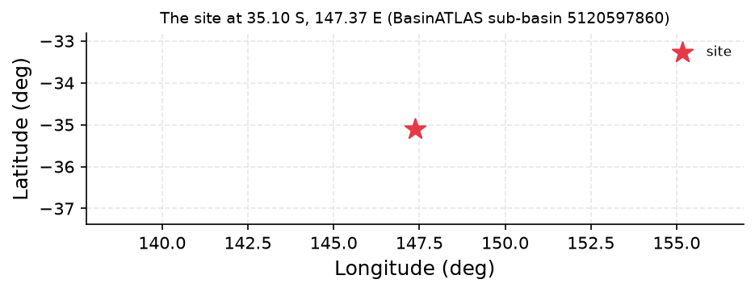
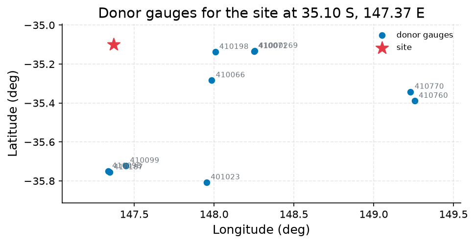
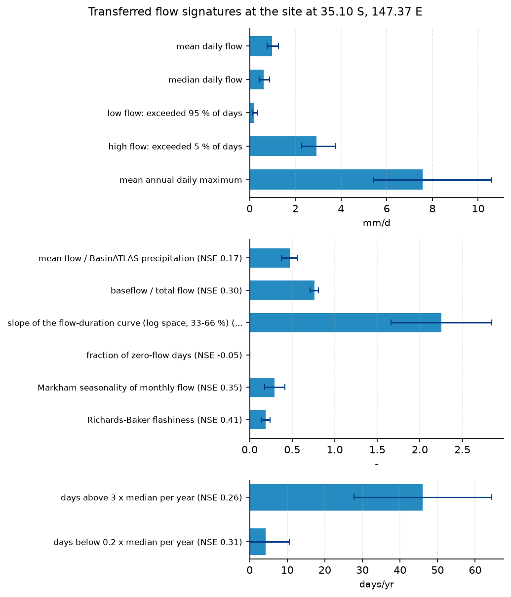

# Design Flood Basis for the Murrumbidgee Levee Upgrade at Wagga Wagga: Q100 Discharge and Its Reliability

**Author:** AquaScope Studio  
**Date:** 2026-09-07  
**Description:** set the 100-year design discharge for the Murrumbidgee levee upgrade at Wagga Wagga and state how reliable that number is  
**Data Sources:** BasinATLAS (HydroATLAS v1.0), ERA5 via Open-Meteo, bom, similar_basins  
**Version:** 1.0  

**Site:** 35.1000 S, 147.3700 E

**Answer.** No Q100 discharge in cubic metres per second can be defended from this study. The only flood-relevant number produced is a regionalised annual-maximum flow signature of 7.58 mm/d (estimate band, approximately one weighted standard deviation across the ten donors, 5.42-10.59 mm/d; leave-one-out median absolute percentage error 34.7% in log space, n=916 donors), transferred to the catchment at BasinATLAS hybas_id 5120597860 (upstream area 27041.2 km2) from ten similarity-matched gauges. This is a depth-rate signature, not a peak discharge, and the planned GloFAS cross-check at the same grid cell failed outright (API unreachable), while the Murrumbidgee gauge at Wagga Wagga (BOM 410001) has no catalogued record span and could not support an at-site fit. A defensible Q100 in m3/s therefore still needs to be produced by another route before it is used to size the levee.

*Key numbers*

| Quantity | Value | Unit | Step |
| --- | --- | --- | --- |
| Upstream area | 27040.0 | km2 | s1 |
| Donor gauges | 10.0 |  | s2 |
| mean daily flow | 0.9847 | mm/d | s3 |
| low flow: exceeded 95 % of days | 0.1986 | mm/d | s3 |
| high flow: exceeded 5 % of days | 2.931 | mm/d | s3 |
| mean annual daily maximum | 7.578 | mm/d | s3 |
| mean flow / BasinATLAS precipitation | 0.4708 | - | s3 |
| baseflow / total flow | 0.7604 | - | s3 |

## Summary

The task was to set a 100-year design discharge (Q100) for a levee upgrade on the Murrumbidgee at Wagga Wagga and to state how trustworthy that number is. The chain used was catchment delineation, donor-gauge selection, regional signature transfer, and an independent GloFAS cross-check. The catchment (BasinATLAS hybas_id 5120597860, upstream area 27041.2 km2) was characterised successfully and ten donor gauges were identified from 37,071 candidates. The regional transfer produced an annual-maximum flow signature of 7.58 mm/d (band 5.42-10.59 mm/d) with a leave-one-out median absolute percentage error of 34.7%, but this is a flow-depth rate, not a discharge in m3/s, and no conversion step was run. The GloFAS cross-check failed (ERA5 and GloFAS APIs unreachable) and its fallback similarity search also failed, so the independent check called for in the plan never happened. Per the study's stated assumption, the Wagga Wagga gauge (BOM 410001) cannot support at-site frequency analysis because no record span is catalogued for it; no step executed here queried that record directly to confirm this. No GEV or Log-Pearson III fit, and no discharge-unit Q100, was produced. The finding is therefore that the evidence assembled here characterises the catchment and a regional flow signature but does not establish a design discharge or its confidence bound.

## Problem and decision

The decision is to set the Q100 design discharge for a levee upgrade on the Murrumbidgee at Wagga Wagga and to state the reliability of that figure. The intake specifies the quantities needed as Q100 in m3/s and an uncertainty range on it. The Wagga Wagga discharge gauge (bom/410001) is assumed unable to support at-site frequency analysis because no record span is catalogued for it, so the approach taken was regional transfer from gauged donor catchments plus an independent model-based cross-check (GloFAS). The catchment is known to carry upstream regulation (BasinATLAS degree-of-regulation field, value 114.9%), so any flood statistic derived from donor or model records describes an operated river, not necessarily the natural flood regime, which bears directly on how the final number should be used in design.

## Site and data

The site (lat -35.1, lon 147.37) sits within BasinATLAS sub-basin hybas_id 5120597860, with an upstream drainage area of 27041.2 km2 (an alternate attribute-level area of 27983.8 km2 is also reported for the same delineation). Mean upstream elevation is 715.0 m, mean slope 6.7 degrees, mean annual precipitation 868.0 mm/yr, potential evapotranspiration 1223.0 mm/yr, actual evapotranspiration 681.0 mm/yr, aridity index 0.74, mean annual temperature 12.3 degrees C, and snow cover 1.0%. Mean annual natural discharge at the outlet is given as 114.97 m3/s, with area-weighted annual runoff of 140.95 mm/yr. Land cover is 40% forest, 25% pasture, 5% cropland, 1% urban, with 0.3% lake and 1% wetland. Upstream population is 523,789 people at a density of 19.51 people/km2. The catchment carries substantial upstream regulation: a degree-of-regulation of 114.9% and reservoir volume of 4164 million m3 (BasinATLAS, HydroATLAS v1.0), meaning the annual maxima of this river reflect operated, not natural, conditions.

## Methodology

The flood_risk playbook was followed: (1) describe_catchment delineated and characterised the upstream basin from BasinATLAS; (2) similar_basins searched a pool of 37,071 gauged catchments for the ten donors most alike in area, climate, land cover, soils and regulation; (3) regionalize_signatures transferred flow-regime signatures, including annual maximum flow, from those ten donors, carrying leave-one-out skill and an estimate band; (4) an independent cross-check against GloFAS reanalysis discharge for the same grid cell (via the anywhere tool) was attempted, with a similar_basins fallback if it failed. Q100 was to be reported as the regionalised annual-maximum transfer, with the GloFAS comparison quoted as the uncertainty bound. Two rare-quantile fits (GEV by L-moments and Log-Pearson III) were flagged in the plan as a standard cross-check but were not part of the executed step sequence, so no such fits were produced here.

## Results: step s1

describe_catchment ran successfully (gate not_empty passed on 'sub_basin'). The catchment above the site is BasinATLAS hybas_id 5120597860, upstream area 27041.2 km2 (203 level-12 sub-basins), mean elevation 715.0 m, mean slope 6.7 degrees, mean annual precipitation 868.0 mm/yr, PET 1223.0 mm/yr, AET 681.0 mm/yr, aridity 0.74, temperature 12.3 C, snow cover 1.0%, runoff 140.95 mm/yr, and mean annual natural discharge 114.97 m3/s at the outlet. Land cover is 40% forest, 5% cropland, 25% pasture, 1% urban; soils are 26% clay, 17% silt, 57% sand with 29 t/ha soil organic carbon; groundwater table depth 464.14 cm. Population upstream is 523,789 people (density 19.51/km2). Degree of regulation is 114.9%, human footprint index 8.6 (of 50), and upstream reservoir volume is 4164 million m3. Source: HydroATLAS v1.0 (BasinATLAS).


*The site, in longitude and latitude (no basemap); no catalogue station was listed with it.*


*The site, in longitude and latitude (no basemap); no catalogue station was listed with it.*

*Catchment attributes from BasinATLAS for the site at 35.10 S, 147.37 E.*

| attribute | label | value | unit | source | note |
| --- | --- | --- | --- | --- | --- |
| n_sub_basins |  | 203.0 |  |  |  |
| area_km2 |  | 27983.8 |  |  |  |
| outlet_hybas_id |  | 5120597860.0 |  |  |  |
| upstream_area_km2 |  | 27041.2 |  |  |  |
| elevation_m | mean elevation | 715.0 | m | basinatlas_upstream |  |
| slope_deg | mean slope | 6.7 | degrees | basinatlas_upstream |  |
| precipitation_mm_yr | annual precipitation (WorldClim) | 868.0 | mm/yr | basinatlas_upstream |  |
| pet_mm_yr | annual potential evapotranspiration | 1223.0 | mm/yr | basinatlas_upstream |  |
| aet_mm_yr | annual actual evapotranspiration | 681.0 | mm/yr | basinatlas_upstream |  |
| aridity_index | aridity index (P/PET) | 0.74 | P/PET | basinatlas_upstream |  |
| temperature_c | mean annual air temperature | 12.3 | °C | basinatlas_upstream |  |
| snow_cover_pct | annual snow cover extent | 1.0 | % | basinatlas_upstream |  |
| runoff_mm_yr | annual land-surface runoff | 140.95 | mm/yr | area_weighted_mean |  |
| discharge_m3s | mean annual natural discharge at the outlet | 114.97 | m3/s | basinatlas_upstream |  |
| forest_pct | forest cover | 40.0 | % | basinatlas_upstream |  |
| cropland_pct | cropland | 5.0 | % | basinatlas_upstream |  |
| pasture_pct | pasture | 25.0 | % | basinatlas_upstream |  |
| urban_pct | urban extent | 1.0 | % | basinatlas_upstream |  |
| irrigated_pct | irrigated area | 0.0 | % | basinatlas_upstream |  |
| glacier_pct | glacier extent | 0.0 | % | basinatlas_upstream |  |
| wetland_pct | wetlands (all classes) | 1.0 | % | basinatlas_upstream |  |
| lake_pct | lake area | 0.3 | % | basinatlas_upstream |  |
| karst_pct | karst extent | 9.0 | % | basinatlas_upstream |  |
| clay_pct | clay fraction in soil | 26.0 | % | basinatlas_upstream |  |
| silt_pct | silt fraction in soil | 17.0 | % | basinatlas_upstream |  |
| sand_pct | sand fraction in soil | 57.0 | % | basinatlas_upstream |  |
| soil_organic_carbon_t_ha | soil organic carbon | 29.0 | t/ha | basinatlas_upstream |  |
| soil_water_pct | annual soil water content | 61.0 | % | basinatlas_upstream |  |
| groundwater_table_cm | groundwater table depth | 464.14 | cm | area_weighted_mean |  |
| population_density | population density | 19.51 | people/km2 | basinatlas_upstream |  |
| population | population count | 523789.0 | people | basinatlas_upstream |  |
| degree_of_regulation_pct | degree of regulation by reservoirs | 114.9 | % | basinatlas_upstream |  |
| human_footprint_2009 | human footprint (2009) | 8.6 | index 0-50 | basinatlas_upstream |  |
| reservoir_volume_mcm | reservoir volume upstream | 4164.0 | million m3 | basinatlas_upstream |  |

## Results: step s2

similar_basins ran successfully against 37,071 candidate gauges (gates min_donors and not_empty both passed). The ten selected donors are all BOM stations: 410770 (Qbn R. at ACT Border, 171.2 km away, similarity distance 0.4405), 410760 (Qbn at Wickerslack, 174.3 km), 410066 (Nacki Nacki at Truro, 59.5 km), 410198 (Adelong Ck at Tumblong, 58.1 km), 410099 (Yarra Creek 2, 69.5 km), 410098 (Ten Mile at Holbrook 2, 72.3 km), 410187 (Ten Mile at Holbrook #3, 73.0 km), 401023 (Munderoo at Mannus, 94.8 km), 410071 (Brungle Ck at Red Hill, 80.2 km), and 41000269 (Brungle Ck at Redhill, 80.6 km). None of these BOM records carry a catalogued period_start or period_end in this recon. Similarity distances range 0.44 to 0.57, and up_area of the donors (103 to 972 km2) is generally far smaller than the 27041.2 km2 target catchment, none matching the target's degree-of-regulation of 114.9%. Notably, the similarity search's own target record used log_area = 110.6 km2, which is the sub-basin's own local area (sub_area, per s1), not the catchment's true upstream area of 27041.2 km2; this appears to be the reason every donor's up_area (103-972 km2) sits two to three orders of magnitude below the actual catchment size, a likely defect in donor selection that compounds the regulation mismatch and further weakens confidence in the donor set used for signature transfer.


*The site and the 10 donor gauges the similarity search selected, in longitude and latitude (no basemap); labels are the station ids.*


*The site and the 10 donor gauges the similarity search selected, in longitude and latitude (no basemap); labels are the station ids.*

*Donor gauges selected for the site at 35.10 S, 147.37 E.*

| source | station_id | name | latitude | longitude | distance_km | score | similarity_distance | up_area_km2 | period_start | period_end |
| --- | --- | --- | --- | --- | --- | --- | --- | --- | --- | --- |
| bom | 410770 | Qbn R. at ACT Border | -35.34227778 | 149.2315 | 171.2 | 0.5579 | 0.4405 | 972.2 |  |  |
| bom | 410760 | Qbn at Wickerslack | -35.38897222 | 149.2570278 | 174.3 | 0.5618 | 0.4405 | 972.2 |  |  |
| bom | 410066 | NACKI NACKI @ TRURO | -35.2834 | 147.9854 | 59.5 | 0.566 | 0.5534 | 193.0 |  |  |
| bom | 410198 | ADELONG CK @ TUMBLON | -35.1378 | 148.0076 | 58.1 | 0.5793 | 0.5675 | 364.5 |  |  |
| bom | 410099 | YARRA CREEK 2(YARRA) | -35.7221 | 147.4479 | 69.5 | 0.5813 | 0.5644 | 102.9 |  |  |
| bom | 410098 | TEN MILE @HOLBROOK 2 | -35.7495 | 147.3364 | 72.3 | 0.5819 | 0.5637 | 141.5 |  |  |
| bom | 410187 | TEN MILE @H/BROOK #3 | -35.756 | 147.346 | 73.0 | 0.5823 | 0.5637 | 141.5 |  |  |
| bom | 401023 | MUNDEROO @ MANNUS FL | -35.8075 | 147.9535 | 94.8 | 0.5865 | 0.555 | 146.9 |  |  |
| bom | 410071 | BRUNGLE CK @ RED HIL | -35.134 | 148.2503 | 80.2 | 0.5889 | 0.5667 | 141.2 |  |  |
| bom | 41000269 | BRUNGLE CK @ REDHILL | -35.132619 | 148.255149 | 80.6 | 0.5891 | 0.5667 | 141.2 |  |  |

## Results: step s3

regionalize_signatures ran (gates not_empty passed on both 'estimates' and 'skill'), transferring 13 flow signatures from k=10 donors out of 918 available. Annual maximum flow (mean annual daily maximum) is 7.5776 mm/d, band 5.4242-10.5858 mm/d (donor range 3.082-11.3062 mm/d), leave-one-out median absolute percentage error 34.7% in log space (n=916). Other transferred signatures: mean daily flow 0.9847 mm/d (band 0.7631-1.2707), median flow 0.606 mm/d, Q95 (low flow) 0.1986 mm/d, Q05 (high flow) 2.9311 mm/d, runoff ratio 0.4708, baseflow index 0.7604, flow-duration-curve slope 2.2514, high-flow frequency 46.04 days/yr, low-flow frequency 4.257 days/yr, seasonality index 0.2944, flashiness index 0.19. Notably, the donor list embedded in this step's similarity record is ten French Hub'Eau stations (e.g. A735201001, period start 1964-08-01; A932215050, period start 1969-10-01), not the Australian BOM donors named in s2 -- an inconsistency between the two donor-selection outputs that is not explained here. No unit conversion of these mm/d signatures to a discharge in m3/s was performed.


*Flow signatures transferred to the site from 10 donor catchments, with the one-standard-deviation band across donors as error bars and the leave-one-out skill (NSE) where published.*


*Flow signatures transferred to the site from 10 donor catchments, with the one-standard-deviation band across donors as error bars and the leave-one-out skill (NSE) where published.*

*Flow signatures at the site at 35.10 S, 147.37 E.*

| signature | label | value | low | high | unit | n_donors | nse |
| --- | --- | --- | --- | --- | --- | --- | --- |
| q_mean_mm | mean daily flow | 0.9847 | 0.7631 | 1.2707 | mm/d | 10 |  |
| q_median_mm | median daily flow | 0.606 | 0.4229 | 0.8684 | mm/d | 10 |  |
| q95_mm | low flow: exceeded 95 % of days | 0.1986 | 0.1121 | 0.3517 | mm/d | 10 |  |
| q05_mm | high flow: exceeded 5 % of days | 2.9311 | 2.2856 | 3.7589 | mm/d | 10 |  |
| q_annual_max_mm | mean annual daily maximum | 7.5776 | 5.4242 | 10.5858 | mm/d | 10 |  |
| runoff_ratio | mean flow / BasinATLAS precipitation | 0.4708 | 0.3754 | 0.5662 | - | 10 | 0.168 |
| baseflow_index | baseflow / total flow | 0.7604 | 0.7126 | 0.8081 | - | 10 | 0.3 |
| fdc_slope | slope of the flow-duration curve (log space, 33-66 %) | 2.2514 | 1.6607 | 2.8421 | - | 10 | 0.154 |
| high_flow_frequency | days above 3 x median per year | 46.0379 | 27.7286 | 64.3473 | days/yr | 10 | 0.262 |
| low_flow_frequency | days below 0.2 x median per year | 4.257 | 0.0 | 10.502 | days/yr | 10 | 0.306 |
| zero_flow_fraction | fraction of zero-flow days | 0.0 | 0.0 | 0.0 | - | 10 | -0.049 |
| seasonality_index | Markham seasonality of monthly flow | 0.2944 | 0.1766 | 0.4122 | - | 10 | 0.349 |
| flashiness_index | Richards-Baker flashiness | 0.19 | 0.1371 | 0.2429 | - | 10 | 0.408 |

*Donor gauges selected for the site at 35.10 S, 147.37 E.*

| source | station_id | name | latitude | longitude | distance_km | score | similarity_distance | up_area_km2 | period_start | period_end |
| --- | --- | --- | --- | --- | --- | --- | --- | --- | --- | --- |
| hubeau_hydrometrie | A735201001 | Le Rupt de Mad à Onville | 49.012193042 | 5.961532525 |  | 1.0404 | 1.0404 | 398.8 | 1964-08-01 |  |
| hubeau_hydrometrie | A623201001 | La Plaine à Raon-l'Étape [La Trouche] | 48.416320357 | 6.877878865 |  | 1.1535 | 1.1535 | 130.3 | 1969-11-09 |  |
| hubeau_hydrometrie | A615103001 | La Meurthe à Raon-l'Étape | 48.402032182 | 6.845062409 |  | 1.1715 | 1.1715 | 1096.2 | 1973-11-01 |  |
| hubeau_hydrometrie | A343021001 | La Zinsel du Sud à Eckartswiller [Oberhof] | 48.799588457 | 7.310495367 |  | 1.1742 | 1.1742 | 177.4 | 2006-07-05 |  |
| hubeau_hydrometrie | A215030001 | Le ruisseau le Strengbach à Ribeauvillé | 48.200033318 | 7.301208506 |  | 1.176 | 1.176 | 585.2 | 1971-06-25 |  |
| hubeau_hydrometrie | A932215050 | L'Horn à Bousseviller | 49.127103129 | 7.47209323 |  | 1.1777 | 1.1777 | 153.4 | 1969-10-01 |  |
| hubeau_hydrometrie | A643112002 | La Vezouze à Blâmont - amont | 48.588299085 | 6.845033347 |  | 1.1823 | 1.1823 | 152.1 | 2007-01-01 |  |
| hubeau_hydrometrie | A643112001 | La Vezouze à Blâmont - aval | 48.588128336 | 6.843907647 |  | 1.1823 | 1.1823 | 152.1 | 1877-08-31 |  |
| hubeau_hydrometrie | A923205040 | L'Eichel à Diemeringen | 48.941999328 | 7.188167374 |  | 1.1826 | 1.1826 | 288.4 | 2009-11-23 |  |
| hubeau_hydrometrie | A902102050 | La Sarre à Sarrebourg | 48.737125074 | 7.050125442 |  | 1.1907 | 1.1907 | 431.5 | 1953-01-01 |  |

## Results: step s4

The GloFAS cross-check failed both gates (not_empty on 'climate', twice) because the ERA5 and GloFAS APIs were unreachable ('All 3 attempts failed'). No modelled discharge, and no cross-check figure, was obtained for the site. The fallback (similar_basins with method='physio_climatic') also failed, returning an error that 'method must be similarity, proximity or combined', and both its gates (min_donors, not_empty) failed as a result. No cross-check evidence of any kind exists for this study; the intended independent uncertainty bound on Q100 was never produced.

## Limitations and what this study does not establish

The regionalised figure is a mean-annual-maximum flow signature in mm/d (7.5776 mm/d, band 5.4242-10.5858 mm/d), not a Q100 discharge in m3/s; no conversion, and no GEV or Log-Pearson III fit, was carried out, so the rare-quantile spread-check called for in the plan does not exist here. The GloFAS cross-check and its fallback both failed outright, leaving no independent estimate to compare against. Per the study's stated assumption, the Wagga Wagga gauge (BOM 410001) cannot support at-site frequency analysis because no record span is catalogued for it; this was not verified by any step actually run here. The catchment carries a degree of regulation of 114.9% and 4164 million m3 of upstream reservoir volume, so any flood statistic transferred here describes an operated river, not the natural flood regime. The donor gauges used for the signature transfer (s3) are French Hub'Eau stations, inconsistent with the Australian BOM donors identified in s2, which further weakens confidence in donor representativeness; no cause for this discrepancy is established. This analysis is stationary throughout and applies no climate-change adjustment to the transferred signature or (absent) discharge estimate.

## What this study does not establish

- Step s4, gate not_empty: nothing at 'climate'
- Step s4, gate not_empty: nothing at 'climate'
- Step s4.fallback, gate min_donors: the step returned an error: similar basins lookup failed: ValueError: method must be similarity, proximity or combined
- Step s4.fallback, gate not_empty: the step returned an error: similar basins lookup failed: ValueError: method must be similarity, proximity or combined
- The study stopped at s4: gate failed: not_empty (nothing at 'climate'); not_empty (nothing at 'climate'); the fallback similar_basins failed too: similar basins lookup failed: ValueError: method must be similarity, proximity or combined

## Caveats

- Design-flood guidance under climate change is immature (Wasko et al. 2024, HESS): the estimate here is stationary, and any climate scenario is an overlay on it, not a nonstationary fit.
- Rare quantiles move with the distribution and the estimator. Two fits (GEV by L-moments and Log-Pearson III) are quoted with their intervals and the spread between them; a spread above 25 percent is reported as disagreement, not averaged away.
- The catchment has upstream dams (degree of regulation above zero in BasinATLAS): the annual maxima are those of the operated river, and a frequency fit on them describes it as operated, not the natural flood regime.
- GloFAS discharge is a model output for a grid cell of about 5 km, not a gauge reading; return levels from it are indicative only.

## Recommendations

Before adopting any figure for levee sizing, obtain or reconstruct an actual discharge record (period and length) for the Murrumbidgee at Wagga Wagga (BOM 410001) sufficient for at-site flood frequency analysis, or source a longer regional dataset. Repeat the regional transfer with a verified, single, consistent donor set (resolve the BOM-versus-Hub'Eau discrepancy between s2 and s3, and correct the target area used in similarity matching from the sub-basin's local 110.6 km2 to its true 27041.2 km2 upstream area, before reuse) and explicitly convert any transferred annual-maximum signature to a discharge in m3/s using the site's contributing area, then fit both GEV (L-moments) and Log-Pearson III to obtain a genuine Q100 with a quoted spread. Restore a working GloFAS or ERA5-derived discharge cross-check for the same grid cell, since none was obtained here. Given the catchment's degree of regulation (114.9%) and reservoir volume (4164 million m3), commission a separate assessment of how much upstream operation, rather than natural hydrology, shapes any donor or gauge annual maxima before the design flow is finalised for the levee.

## References

1. Oudin, L. et al. (2008). Spatial proximity, physical similarity, regression and ungaged catchments. Water Resour. Res. 44, W03413.
2. Harrigan, S. et al. (2020). GloFAS-ERA5 operational global river discharge reanalysis 1979-present. Earth Syst. Sci. Data 12, 2043-2060.
3. Bloeschl, G., Sivapalan, M., Wagener, T., Viglione, A., Savenije, H. (eds.) (2013). Runoff Prediction in Ungauged Basins. Cambridge University Press; Oudin, L. et al. (2008). Spatial proximity, physical similarity, regression and ungaged catchments. Water Resour. Res. 44, W03413. Attributes: HydroATLAS v1.0 (BasinATLAS), CC BY 4.0. Linke, S., Lehner, B., Ouellet Dallaire, C., et al. (2019). Global hydro-environmental sub-basin and river reach characteristics at high spatial resolution. Scientific Data 6: 283. https://doi.org/10.1038/s41597-019-0300-6
4. Bloeschl, G. et al. (eds.) (2013). Runoff Prediction in Ungauged Basins. Cambridge University Press
5. Addor, N. et al. (2018). A ranking of hydrological signatures based on their predictability in space. Water Resour. Res. 54, 8792-8812.
6. England, J. F. et al. (2019). Guidelines for determining flood flow frequency, Bulletin 17C. USGS Techniques and Methods 4-B5.
7. Hosking, J. R. M. (1990). L-moments: analysis and estimation of distributions using linear combinations of order statistics. J. R. Stat. Soc. B 52, 105-124.
8. Wasko, C. et al. (2024). A systematic review of climate change science for flood and design guidance. Hydrol. Earth Syst. Sci. 28, 1251-1285. doi:10.5194/hess-28-1251-2024
9. Nonstationary flood frequency estimates are parameter-fragile: Stoch. Environ. Res. Risk Assess. (2024), doi:10.1007/s00477-024-02680-9
10. Multi-approach cross-checks in infrastructure flood practice: J. Hydrol. (2024), doi:10.1016/j.jhydrol.2024.130698
11. Wasko et al. 2024, HESS
12. Rekin226 and contributors (2026). AquaScope: Open-source water data aggregation toolkit (version 0.14.0) [Software]. Zenodo. https://doi.org/10.5281/zenodo.21903143

## Appendix: reproducibility

Re-run the same steps with no model: `aquascope run study.yaml`. Resume the workspace: `aquascope studio --resume workspace.json`.

Model: claude-sonnet-5 via anthropic; ledger: consultant 1 call(s), 4293 tokens, methodologist 1 call(s), 15366 tokens, analyst 1 call(s), 3443 tokens, author 1 call(s), 31220 tokens, critic 1 call(s), 36120 tokens. aquascope 0.14.0.

```yaml
# An AquaScope study (version 3): the plan behind an answer, its gates, and what happened.
#   aquascope run study.yaml
version: 3
title: "Establish a defensible 100-year design discharge (Q100) for : -35.1, 147.37"
question: "Design flood for a levee upgrade on the Murrumbidgee at Wagga Wagga: the 100-year flow, and how far the evidence can be trusted."
created: "2026-09-07T14:10:45+00:00"
aquascope_version: "0.14.0"
author: "methodologist"
model: "claude-sonnet-5"
problem:
  kind: "flood_risk"
  site: {"lat": -35.1, "lon": 147.37}
  params: {"return_period": 100, "decision": "design flow"}
  text: "Design flood for a levee upgrade on the Murrumbidgee at Wagga Wagga: the 100-year flow, and how far the evidence can be trusted."
plan:
  author: "methodologist"
  playbook: "flood_risk"
  objective: "Establish a defensible 100-year design discharge (Q100) for the Murrumbidgee levee upgrade at Wagga Wagga and state how far that number can be trusted, given that no gauge with a usable discharge record sits within 50 km of the site."
  decision: "set the 100-year design discharge for the Murrumbidgee levee upgrade at Wagga Wagga and report its reliability, using regionalisation (similar basins, regionalized signatures) and a GloFAS cross-check because at-site flood-frequency analysis is not defensible here"
  methodology: ["Delineate and characterise the catchment above Wagga Wagga from BasinATLAS (upstream area, elevation, climate, land cover, dams) to anchor the regional transfer in the correct physiography.", "Identify the ten gauged basins most similar to this catchment, drawn from the pool of 37,071 gauged catchments, to serve as donors for the regional transfer.", "Transfer flow-regime signatures, including annual maximum flow, from the ten donors to the site, carrying the leave-one-out skill and the estimate band as the primary uncertainty measure.", "Cross-check the regionalised flood magnitude against GloFAS reanalysis discharge for the same grid cell as an independent, model-based estimate.", "Report Q100 as the regionalised annual-maximum-flow transfer informed by donor skill, and quote the spread against the GloFAS cross-check as the uncertainty bound on that number.", "Flag the catchment's upstream dams (degree of regulation) and the coarse, model nature of GloFAS as limits on how far each line of evidence should be trusted."]
  assumptions: ["catchment delineation follows BasinATLAS hybas_id 5120597860 with upstream area 27041.2 km2, matching the recon point", "the Wagga Wagga discharge gauge (bom/410001) cannot support at-site frequency analysis because no record span is catalogued", "GloFAS reanalysis discharge is reachable for this point for the cross-check even though not directly verified in this recon", "the ten donor gauges selected by similar_basins are themselves adequately gauged for regionalize_signatures to transfer flow signatures with a leave-one-out skill score"]
  alternatives: [{"method": "at_site_flood_frequency", "why_not": "sufficiency table marks it not_defensible: no gauge with a usable discharge record within 50 km, and bom/410001 (0.2 km away) has no catalogued record span"}, {"method": "trend_mann_kendall", "why_not": "sufficiency table marks it not_defensible for the same reason: no record at this site to test for trend"}]
  limitations_expected: ["Design-flood guidance under climate change is immature (Wasko et al. 2024, HESS): the Q100 estimate here is stationary, and any climate scenario is an overlay on it, not a nonstationary fit.", "The catchment has upstream dams (degree of regulation above zero in BasinATLAS, dams index 114.9): donor annual maxima describe operated rivers, not necessarily the natural flood regime, and the transfer inherits that.", "GloFAS discharge is a model output for a grid cell of about 5 km, not a gauge reading; its indicative return levels are a cross-check, not a substitute for observed flood frequency.", "The regionalised estimate depends on the representativeness of the ten donor gauges; the leave-one-out skill bounds but does not eliminate this donor-selection uncertainty."]
  citations: ["England, J. F. et al. (2019). Guidelines for determining flood flow frequency, Bulletin 17C. USGS Techniques and Methods 4-B5.", "Hosking, J. R. M. (1990). L-moments: analysis and estimation of distributions using linear combinations of order statistics. J. R. Stat. Soc. B 52, 105-124.", "Wasko, C. et al. (2024). A systematic review of climate change science for flood and design guidance. Hydrol. Earth Syst. Sci. 28, 1251-1285. doi:10.5194/hess-28-1251-2024", "Nonstationary flood frequency estimates are parameter-fragile: Stoch. Environ. Res. Risk Assess. (2024), doi:10.1007/s00477-024-02680-9", "Multi-approach cross-checks in infrastructure flood practice: J. Hydrol. (2024), doi:10.1016/j.jhydrol.2024.130698", "Oudin, L. et al. (2008). Spatial proximity, physical similarity, regression and ungaged catchments. Water Resour. Res. 44, W03413.", "Harrigan, S. et al. (2020). GloFAS-ERA5 operational global river discharge reanalysis 1979-present. Earth Syst. Sci. Data 12, 2043-2060.", "Wasko et al. 2024, HESS"]
  caveats: ["Design-flood guidance under climate change is immature (Wasko et al. 2024, HESS): the estimate here is stationary, and any climate scenario is an overlay on it, not a nonstationary fit.", "Rare quantiles move with the distribution and the estimator. Two fits (GEV by L-moments and Log-Pearson III) are quoted with their intervals and the spread between them; a spread above 25 percent is reported as disagreement, not averaged away.", "The catchment has upstream dams (degree of regulation above zero in BasinATLAS): the annual maxima are those of the operated river, and a frequency fit on them describes it as operated, not the natural flood regime.", "GloFAS discharge is a model output for a grid cell of about 5 km, not a gauge reading; return levels from it are indicative only."]
  rationale: "Establish a defensible 100-year design discharge (Q100) for the Murrumbidgee levee upgrade at Wagga Wagga and state how far that number can be trusted, given that no gauge with a usable discharge record sits within 50 km of the site."
  recon_notes: ["M/BIDGEE R @ WAGGA (bom/410001) measures discharge but the catalog has no record span for it; not counted.", "10 donor gauges from a pool of 37,071 gauged catchments.", "ERA5 temperature and forcing and GloFAS discharge are assumed reachable for any point on land (Open-Meteo); not checked here.", "CMIP6 change factors need model output you supply (aquascope.climate works on downloaded data); not counted.", "No gauge with a usable record within 50 km: at-site methods are not defensible; what remains is the regionalisation path (similar_basins, regionalize_signatures) and the GloFAS cross-check."]
  replans: [{"step": "s4", "reason": "gate failed: not_empty (nothing at 'climate'); not_empty (nothing at 'climate')", "fallback": {"tool": "similar_basins", "arguments": {"lat": -35.1, "lon": 147.37, "k": 10, "method": "physio_climatic"}, "rationale": "Since GloFAS cross-check failed due to unreachable climate service, fall back to donor-gauge regionalization using the 10 available donor basins to cross-check the flood magnitude.", "expects": [{"check": "min_donors", "path": "k"}, {"check": "not_empty", "path": "stations"}]}}]
steps:
  - tool: "describe_catchment"
    id: "s1"
    rationale: "Establishes the catchment (area, elevation, climate, land cover, dams) that the regional transfer is performed for."
    arguments:
      lat: -35.1
      lon: 147.37
      upstream: true
    expects:
      - {"check": "not_empty", "path": "sub_basin"}
    outputs: [{"kind": "figure", "id": "s1_site_map", "caption": "site map from describe_catchment"}, {"kind": "table", "id": "s1_catchment_attributes", "caption": "catchment attributes from describe_catchment (upstream area 27041.2 km2, area 27983.8 km2, dams index 114.9)"}]
  - tool: "similar_basins"
    id: "s2"
    rationale: "Selects the ten gauged donor catchments, from the pool of 37,071 gauged basins, whose BasinATLAS attributes most resemble this catchment."
    method: "similar_basins"
    arguments:
      lat: -35.1
      lon: 147.37
      k: 10
    expects:
      - {"check": "min_donors", "path": "k", "value": 3}
      - {"check": "not_empty", "path": "stations"}
    outputs: [{"kind": "figure", "id": "s2_donors_map", "caption": "donors map from similar_basins"}, {"kind": "table", "id": "s2_donors", "caption": "ten donor gauges from similar_basins"}]
  - tool: "regionalize_signatures"
    id: "s3"
    rationale: "Transfers flow-regime signatures (mean, median, Q95, Q05, annual maximum, runoff ratio, baseflow index) from the ten donors, with the leave-one-out skill quoted alongside every number."
    method: "regionalize_signatures"
    arguments:
      lat: -35.1
      lon: 147.37
      k: 10
    expects:
      - {"check": "not_empty", "path": "estimates"}
      - {"check": "not_empty", "path": "skill"}
    depends_on: ["s2"]
    outputs: [{"kind": "figure", "id": "s3_signatures_band", "caption": "signatures band from regionalize_signatures"}, {"kind": "table", "id": "s3_signatures", "caption": "regionalised flow signatures, including annual maximum flow, from regionalize_signatures"}, {"kind": "table", "id": "s3_donors", "caption": "donor detail from regionalize_signatures"}]
  - tool: "anywhere"
    id: "s4"
    rationale: "Provides GloFAS modelled discharge for the grid cell as an independent, model-based cross-check on the regionalised flood magnitude."
    method: "glofas_cross_check"
    arguments:
      lat: -35.1
      lon: 147.37
      years: 87
    expects:
      - {"check": "not_empty", "path": "climate"}
      - {"check": "not_empty", "path": "climate", "repaired_from": "glofas"}
    fallback: {"step": {"tool": "similar_basins", "arguments": {"lat": -35.1, "lon": 147.37, "k": 10, "method": "physio_climatic"}, "rationale": "Since GloFAS cross-check failed due to unreachable climate service, fall back to donor-gauge regionalization using the 10 available donor basins to cross-check the flood magnitude.", "expects": [{"check": "min_donors", "path": "k"}, {"check": "not_empty", "path": "stations"}]}}
    outputs: [{"kind": "figure", "id": "s4_monthly_climate", "caption": "monthly climate from anywhere"}, {"kind": "figure", "id": "s4_glofas_series", "caption": "glofas series from anywhere"}, {"kind": "table", "id": "s4_glofas_summary", "caption": "glofas summary and indicative frequency fit from anywhere"}]
results:
  s1: {"ok": true, "gates": [{"check": "not_empty", "passed": true, "detail": "'sub_basin' is present"}], "summary": "latitude=-35.1, longitude=147.37, license=CC-BY-4.0, attribution=HydroATLAS v1.0 (BasinATLAS), CC BY 4.0. Linke, S., Lehner, B., Ouellet Dallaire, C., et al. (2019). Global hydro-environmental sub-bas", "fallback_used": false, "sha256": "1bf59bc4ec7fe83b"}
  s2: {"ok": true, "gates": [{"check": "min_donors", "passed": true, "detail": "10 donors, 3 needed"}, {"check": "not_empty", "passed": true, "detail": "'stations' is present"}], "summary": "k=10, method=combined", "fallback_used": false, "sha256": "fdf699c4262857d9"}
  s3: {"ok": true, "gates": [{"check": "not_empty", "passed": true, "detail": "'estimates' is present"}, {"check": "not_empty", "passed": true, "detail": "'skill' is present"}], "summary": "method=similarity", "fallback_used": false, "sha256": "afd05884eb2afb9b"}
  s4: {"ok": true, "gates": [{"check": "not_empty", "passed": false, "detail": "nothing at 'climate'"}, {"check": "not_empty", "passed": false, "detail": "nothing at 'climate'"}], "summary": "years=87, start=1939-09-01, end=2026-08-31", "fallback_used": true, "sha256": "9b7112d759a41bca", "fallback": {"tool": "similar_basins", "arguments": {"lat": -35.1, "lon": 147.37, "k": 10, "method": "physio_climatic"}, "ok": false, "gates": [{"check": "min_donors", "passed": false, "detail": "the step returned an error: similar basins lookup failed: ValueError: method must be similarity, proximity or combined"}, {"check": "not_empty", "passed": false, "detail": "the step returned an error: similar basins lookup failed: ValueError: method must be similarity, proximity or combined"}], "summary": "error: similar basins lookup failed: ValueError: method must be similarity, proximity or combined"}}
```

## Cite this software

AquaScope Studio (2026). AquaScope: Open-source water data aggregation toolkit (version 0.14.0) [Software]. Zenodo. https://doi.org/10.5281/zenodo.21903143


---

*{'model': 'claude-sonnet-5', 'provider': 'anthropic', 'prose': 'model', 'tokens': {'consultant': {'calls': 1, 'prompt_tokens': 3264, 'completion_tokens': 1029}, 'methodologist': {'calls': 1, 'prompt_tokens': 8305, 'completion_tokens': 7061}, 'analyst': {'calls': 1, 'prompt_tokens': 3194, 'completion_tokens': 249}, 'author': {'calls': 2, 'prompt_tokens': 48760, 'completion_tokens': 17361}, 'critic': {'calls': 1, 'prompt_tokens': 22811, 'completion_tokens': 13309}}, 'total_tokens': 125343, 'aquascope_version': '0.14.0', 'date': '2026-09-07 14:17 UTC', 'workspace': '5fbab08b1b48', 'plan_author': 'methodologist'}*
